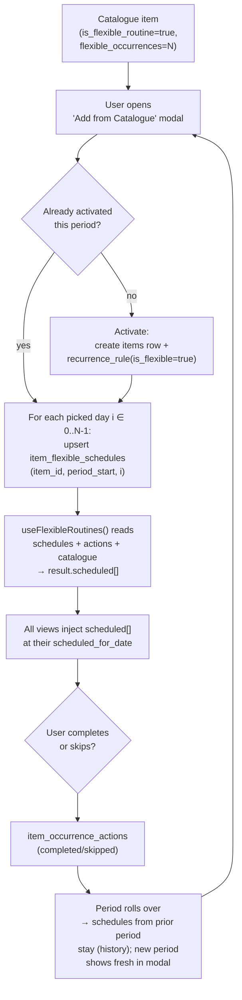

# Schedule Feature — Items & Reminders

> **Audience:** First-time readers. By the end of this doc you should know exactly how an item ends up on a date in the calendar (and every other view), why it sometimes shows up "everywhere" and sometimes only in one place, and what the difference is between a fixed reminder, a recurring task, and a flexible routine.

---

## TL;DR

Every item has **one** of three placement strategies — they don't mix:

| Strategy      | Where the date comes from                                                | Source of truth               | Used for                                      |
| ------------- | ------------------------------------------------------------------------ | ----------------------------- | --------------------------------------------- |
| **Fixed**     | `reminder_details.due_at` / `event_details.start_at` (one row, one date) | the row itself                | "Pay rent on the 5th" (one-shot)              |
| **Recurring** | RRULE expanded against `recurrence_rule.start_anchor`                    | `item_recurrence_rules.rrule` | "Take vitamins every morning" (fixed cadence) |
| **Flexible**  | One row per period in `item_flexible_schedules` (the user picks the day) | `item_flexible_schedules`     | "Workout 3× per week" (cadence, flexible day) |

A flexible item also has an `RRULE`, but **all views ignore it** when `recurrence_rule.is_flexible = true`. The RRULE is kept only for compatibility with code that filters "is this a recurring item at all?" — it never determines a calendar slot for a flexible item.

---

## The Three Schedule Types in Detail

### 1. Fixed (single-shot)

Plain `due_at` / `start_at`. No `recurrence_rule`. Shown on exactly one date.

### 2. Recurring (RRULE)

`recurrence_rule.rrule` is expanded against `start_anchor` to produce occurrences. The **time** comes from the anchor; the **dates** come from the rule. Wall-clock adjustment (`adjustOccurrenceToWallClock`) keeps the local hour stable across DST.

`item_occurrence_actions` records per-occurrence completions, postpones, skips. The view consults this to decide which occurrence is checked, hidden, or moved.

### 3. Flexible (N-times-per-period)

The catalogue template carries:

- `is_flexible_routine = true`
- `recurrence_pattern = "weekly" | "biweekly" | "monthly"`
- `flexible_occurrences: 1..31` — **how many times per period** (default 1)

When activated, an `items` row is created with:

- `recurrence_rule.is_flexible = true`
- `recurrence_rule.flexible_period = "weekly" | "biweekly" | "monthly"`
- `recurrence_rule.rrule` — kept but never consulted by views

Each period the user picks a day (or N days) via the **"Add from Catalogue"** modal. Each pick writes one row to `item_flexible_schedules`:

```text
item_flexible_schedules
├── item_id
├── period_start_date         ← bucketed by weekly/biweekly/monthly
├── scheduled_for_date        ← the picked day
├── scheduled_for_time?       ← optional HH:MM
└── occurrence_index 0..N-1   ← which slot this is (UNIQUE per item+period+slot)
```

A user with `flexible_occurrences = 3` for "workout, weekly" picks three days each week; views show the routine on those three days, nowhere else.

---

## Universal Placement Rule (Hard Rule)

> **When `recurrence_rule.is_flexible === true`, every view ignores the rrule and uses `item_flexible_schedules` rows as the sole source of placement.**

Every calendar/today/week/dashboard component does this:

1. Skip the item in the normal RRULE expansion loop:

   ```ts
   if (item.recurrence_rule?.is_flexible) continue;
   ```

2. Inject `flexibleRoutines.scheduled` entries from `useFlexibleRoutines()` — one entry per scheduled slot — synthesizing the occurrence date from `scheduled_for_date + scheduled_for_time`.

This rule is enforced in:

- `src/components/web/WebCalendar.tsx` (month grid)
- `src/components/web/WebWeekView.tsx` (week grid)
- `src/components/web/WebTodayView.tsx` (today + overdue list)
- `src/components/web/WebTabletMissionControl.tsx` (tablet mission control)
- `src/components/web/WebEventsDashboard.tsx` (counters/streaks/upcoming — synthesizes a virtual item per scheduled slot)
- `src/components/items/CalendarView.tsx` (mobile month)

If you add a new view that surfaces items by date, you **must** apply the same skip + inject pattern, or flexible items will appear on the wrong day (typically the activation day).

---

## Lifecycle: From Catalogue Template to Calendar Slot



---

## The Four Tables Involved

| Table                     | Role                                                                              |
| ------------------------- | --------------------------------------------------------------------------------- |
| `catalogue_items`         | Templates. `is_flexible_routine`, `recurrence_pattern`, `flexible_occurrences`    |
| `items`                   | Activated user rows. `source_catalogue_item_id` links back to the template        |
| `item_recurrence_rules`   | Flags the item as flexible (`is_flexible`, `flexible_period`)                     |
| `item_flexible_schedules` | One row per scheduled slot per period. `UNIQUE(item_id, period_start, occ_index)` |
| `item_occurrence_actions` | Completed / skipped / postponed events. Used for completion + overdue detection   |

---

## Two Flavors of "Skip"

There are two distinct skip operations and they differ on purpose:

| Where            | What it does                                                                          | Persistence                                          |
| ---------------- | ------------------------------------------------------------------------------------- | ---------------------------------------------------- |
| Existing item    | Inserts an `item_occurrence_actions` row with `action_type='skipped'`                 | Persists in DB; counts toward "fully accounted for"  |
| Dormant template | Sets a session-only `Set<string>` keyed by `${tpl.id}:${periodStart}` to hide the row | In-memory only — modal stops showing it this session |

The dormant version is intentionally session-only: nothing has been activated yet, so there's nothing to skip in the DB. We just stop nagging the user to activate this template _this period_.

---

## What "Overdue" Means for Flexible Items

`useFlexibleRoutines.fetchFlexibleRoutines` looks back up to 3 prior periods. For each, it checks whether **any** `item_occurrence_actions` row with `completed` or `skipped` exists in that period's date range. If a period had no completion and no skip, the item is **overdue** and `overduePeriodsCount` is incremented (capped at 3).

The badge in the modal reads:

- `Overdue` for 1 missed period
- `Nx overdue` for N (e.g. `2x overdue`)

Once the user schedules / completes / skips, the count resets the next time the hook runs.

---

## How `useFlexibleRoutines` Buckets Items

Given the `items[]`, `actions[]`, and a `referenceDate` (the week/period being viewed), the hook returns:

```ts
{
  unscheduled: FlexibleRoutineItem[];   // remaining slots > 0 for this period
  scheduled:   FlexibleRoutineItem[];   // one entry per scheduled slot
  completed:   FlexibleRoutineItem[];   // all slots done OR (N=1) one completion
  periodLabel, periodStart, periodEnd
}
```

Each entry carries:

- `targetOccurrences` — the N from the catalogue
- `scheduledOccurrences[]` — every schedule row for this period
- `scheduledCount`, `completedCount`, `skippedCount`
- `flexibleSchedule` — the **specific slot** for that entry (when injected one-per-slot)

Views can iterate `scheduled[]` and treat each entry as one calendar item.

---

## FAQ — directly answering common confusions

**Q: I added "water plant" as a flexible weekly routine and picked Tuesday. Why does it only show on the Web Week view?**
A: Because previously only the week view consumed `useFlexibleRoutines`. The other views were still falling back to the rrule, which expanded against the activation day. This is now fixed: the universal placement rule ensures all views inject from `item_flexible_schedules`.

**Q: I want a routine "3 times per week" but I don't want to commit to specific days.**
A: Set `flexible_occurrences = 3` on the catalogue item. The modal will show 3 picker rows — pick a day for each as the week unfolds. The rest of the views will show the routine only on the days you picked.

**Q: What happens if I scheduled 2 of 3 slots and the week ends?**
A: Live missed-policy: the unscheduled slot is treated as "missed" (no completion, no skip). It contributes to `overduePeriodsCount` next period. Past `item_flexible_schedules` rows stay as history.

**Q: Why does the modal sometimes show an item I already scheduled?**
A: Because `targetOccurrences > scheduledCount + completedCount + skippedCount`. There are still empty slots. Once all slots are filled (scheduled, completed, or skipped), the item leaves the unscheduled list.

**Q: I see two "workout" entries on Tuesday and Friday. Is that right?**
A: Yes — flexible items emit one entry per scheduled slot. Tuesday and Friday are two of three planned slots. Marking either complete will record only that occurrence date in `item_occurrence_actions`.

**Q: What invalidates the cache after scheduling?**
A: `useScheduleRoutine` and `useUnscheduleRoutine` invalidate `flexibleRoutinesKeys.schedules()` + `flexibleRoutinesKeys.all`. Skipping invalidates `itemsKeys.allActions()` + `flexibleRoutinesKeys.all`. The hook's query key includes `referenceDate` (formatted yyyy-MM-dd) so navigating between weeks recomputes naturally.

---

## Quick Map: where to look in the code

| Concern                               | File                                                                       |
| ------------------------------------- | -------------------------------------------------------------------------- |
| Period boundaries (week/biweek/month) | `src/features/items/useFlexibleRoutines.ts` `getPeriodBoundaries`          |
| Bucketing (unscheduled/scheduled/…)   | `src/features/items/useFlexibleRoutines.ts` `fetchFlexibleRoutines`        |
| Scheduling mutation                   | `useScheduleRoutine` (upserts on `(item, period_start, occ_index)`)        |
| Unscheduling                          | `useUnscheduleRoutine` (optional `occurrenceIndex`)                        |
| Skip                                  | `useSkipFlexibleRoutine` → `item_occurrence_actions`                       |
| Modal                                 | `src/components/web/AddFlexibleFromCatalogueDialog.tsx`                    |
| Catalogue editor (N input)            | `src/components/web/CatalogueTaskItemDialog.tsx`                           |
| Schema (live & doc)                   | `migrations/schema.sql` + `migrations/2026-05-04_flexible_occurrences.sql` |

---

## Adding a New View — Checklist

1. Read `items` + `occurrenceActions`.
2. Call `useFlexibleRoutines(items, occurrenceActions, referenceDate)`.
3. In any RRULE-expansion loop, **first** line: `if (item.recurrence_rule?.is_flexible) continue;`
4. After the loop, **inject** `flexibleRoutines.scheduled` entries — synthesize date from `flexibleSchedule.scheduled_for_date + scheduled_for_time ?? "09:00"`.
5. Verify on mobile viewport (Hard Rule #5).
6. Update this doc's "enforced in" list above.
