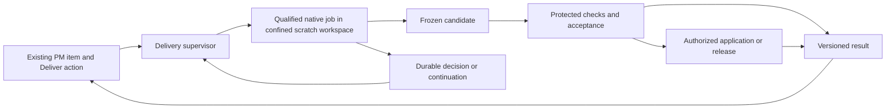

# PM Delivery — V2 Architecture

> **Canonical target, revision 2.1.** The owner accepted the ownership reassessment and commissioned this integrated plan. It replaces the earlier V2 execution-core blueprint. Implementation, paid pilots, operational cutover and permission changes are outside this documentation task. V1 still runs under its existing rules. Start building later from [Execution Portfolio](<PM Delivery — Execution Portfolio.md>).

## 1. Decision and scope

**Select Item X → Deliver → minimal owner supervision → trustworthy verified result.** V2 owns the delivery commitment and result boundary. A qualified native coding environment owns engineering: exploration, ordinary planning, tools, editing, test/fix iterations, context management and native continuation.

Build one small local supervisor around native jobs, an isolated candidate and protected verification. Reuse existing PM surfaces and established execution/application mechanisms. An external managed executor can replace the local job backend without replacing the work contract. No custom raw-model runtime, universal inner-effect broker, workflow designer or new PM application is required.

[Diagnosis](<PM Delivery — Current System Diagnosis.md>) preserves V1 evidence; [Migration](<PM Delivery — Migration Strategy.md>) compares native-only, managed and owned alternatives. The selected target must outperform native delivery on owner effort, including maintenance. If it does not, keep contracts/evidence and reduce the supervisor rather than expand infrastructure.

This document owns the normative record names, lifecycle, authority and invariants. [Context & Agent Model](<PM Delivery — Context & Agent Model.md>) owns executor qualification and Checkpoint. [Evidence & Autonomy](<PM Delivery — Evidence & Autonomy.md>) owns criteria, eligible observations and result evaluation. Other documents reference these contracts rather than define competing versions.

## 2. Three authority boundaries

1. **Supervisor:** identifies work, admits resources/effects, persists jobs and decisions, reconciles interruptions and projects one result.
2. **Native job:** performs engineering in disposable scratch space. It cannot write authoritative state, grant itself access, certify a check or publish a candidate.
3. **Verification and disposition:** trusted adapters run approved observations on the frozen candidate; authorized application/release is separate. A verified candidate does not imply deployed behavior.

The supervisor is one service, not a distributed scheduler. Its local store and native worker may share a machine but cannot share write authority. The provider owns its internal tool history; ERA stores boundary receipts and links native records. Tests/package scripts are untrusted execution too.

Current no-Git-write/no-worktree and no-production-DB-write rules remain. Initial candidate creation uses a plain source snapshot with no Git metadata or secrets. Application is owner controlled until a later qualified and separately authorized mechanism exists. A requested release remains outstanding in the result. A sleeping local runner queues work honestly; managed hosting is a conditional extension.

## 3. Invariants

| ID | Required invariant | Fixture family |
|---|---|---|
| V2-I01 | Selection binds stable work identity and the intended source revision; ordinals and guessed aliases never launch work. | F-ID |
| V2-I02 | Every dispatch/resume and disposition action has a current unrevoked grant for exact effects, contract and resources. | F-AUTH |
| V2-I03 | Native jobs and descendants are confined; they cannot change host work, read undeclared secrets or publish/modify authoritative records. | F-ISOLATION |
| V2-I04 | Job identity and reservation precede dispatch; unknown dispatch/stop is reconciled, never blindly retried. | F-JOB |
| V2-I05 | All known consumption plus outstanding reservations is conserved in its declared unit; strict bounds require actual whole-job enforcement. | F-COST |
| V2-I06 | Candidate bytes and environment are identified and frozen before trusted observation; the writer cannot mint receipts or weaken the oracle. | F-EVIDENCE |
| V2-I07 | Each criterion is satisfied only by eligible, fresh evidence for its proposition; missing, malformed, stale or waived evidence is never a pass. | F-EVIDENCE |
| V2-I08 | One versioned result distinguishes job outcome, evidence, requested disposition, observed disposition and work completion. | F-RESULT, F-PUBLISH |
| V2-I09 | Native continuation preserves binding decisions and useful evidence, revalidates authority/inputs, and never revives cancelled rights. | F-RESUME |
| V2-I10 | Commands and projections bind authenticated actor/installation/target; same-ID retries reconcile; stale/wrong-owner clients cannot invent truth. | F-COMMAND |

The fixture definitions and stages live in Evidence and Execution Portfolio. They are implementation requirements, not tests already passed.

## 4. Minimal records and ownership

| Record | Required fields / meaning |
|---|---|
| **WorkRef** | `work_id`, exact origin locator, human alias, source fingerprint and mapping revision. Stable across an unambiguous move; ambiguity requires resolution. |
| **Contract** | `contract_id`, `work_id`, revision, source fingerprint, outcome, exclusions, `scratchScope`, `publicationScope` (allowed output paths and change constraints), criteria refs, `requestedDisposition` and relevant policy refs. Immutable once authorized; destination/effect permission belongs to the Grant. |
| **Grant** | `grant_id`, contract revision, policy revision, permitted effects/executors, resource policy, expiry, revocation version, actor/decision refs. The model cannot create or widen it. |
| **Run** | `run_id`, contract revision, lifecycle, current grant, effort preference, active job ref, waiting obligations, closed outcome and current result ref. One engagement may use several native jobs. |
| **Job** | `job_id`, run/contract/grant refs, purpose, request manifest, reservation, executor profile/version, persisted `executionRef` correlation, dispatch-start receipt, status, outcome, usage observations and artifact refs. Each paid native start/resume/repair/review dispatch gets a new job ID. |
| **Decision** | `decision_id`, exact subject revision, kind, requested choice, actor, answer, evidence seen and supersession. Owner authority is distinct from an engineer's implementation choice. |
| **Candidate** | `candidate_id`, kind `code\|research`, source/base manifest, complete output manifest, diff/report, relevant environment fingerprint and artifact hashes. Identity assigned by trusted snapshotting, not worker assertion. |
| **Evidence** | Criterion/revision, candidate, approved observer/config/fixture/environment, actual outcome and raw artifact refs. Detailed schema in Evidence. |
| **Result** | Versioned contract/candidate refs, job outcomes, evidence statuses, requested/observed disposition, remaining obligations, resource basis, safe next action and work-completion evaluation. |
| **Boundary receipt** | Command/job/check/disposition/projection identity, actor and payload digest where applicable, state before/after, known/unknown observation and timestamps. Local ordered audit/outbox rows may share the store; no general Effect object per native tool. |

Logical records do not prescribe one table per row. Implement relationships and uniqueness in a small SQLite store under proposed `.delivery/v2/`, with immutable artifacts outside it. Proposed modules are under `scripts/delivery-v2/` and fixtures under `tests/delivery-v2/`; they do not exist merely because this document names them.

**Markdown remains intent authority.** Initial WorkRef mapping covers only selected uniquely identifiable items. A stable alias plus exact source locator/fingerprint can resolve a known item; duplicate/reused aliases cannot. Moving an item may preserve its mapping only when identity is unambiguous. Do not adopt the entire backlog into a new lifecycle database. Edits after launch create a supersession/revision obligation; they cannot silently change the active Contract or mark its result verified.

Source bytes remain authoritative for candidates. Supervisor records own execution facts. The protected evaluator owns verification status. Authorized external observations own application/release facts. PM checkboxes are projections and cannot certify any of them.

## 5. Lifecycle and completion

Run lifecycle is `DRAFT | ACTIVE | WAITING | CLOSED`.

| Transition | Admission / effect |
|---|---|
| DRAFT → ACTIVE | Resolved current Contract, eligible Grant/profile and reserved job; no missing material intent. |
| ACTIVE → WAITING | Durable obligation: owner decision, resources, runner availability, required observation, pause, or unknown job/effect. |
| WAITING → ACTIVE | Relevant obligation resolved; recheck contract, grant, source, executor and allowance before dispatch. |
| DRAFT/ACTIVE/WAITING → CLOSED | Persist verified candidate, useful partial, failure or cancellation result. Outstanding unknown jobs/costs remain recorded. |
| CLOSED → successor Run | Further engineering is linked to the prior result; never rewrite a closed execution history. |

Closed outcome is `verified_candidate | useful_partial | failed | cancelled`. A Candidate can be a source tree or a research report, so `verified_candidate` includes a checked research artifact. Late application/release receipts append result versions; they do not reopen engineering.

Job status is `reserved | active | paused | finished | unknown`; terminal outcome is `succeeded | failed | cancelled`. A persisted `dispatch_started_at` distinguishes known-undispatched reservation from a potentially dispatched request. Native status is retained separately; translate only observed facts. `inspect`/reattach is read-only reconciliation, not another paid engineering dispatch.

Job status describes an admitted dispatch, not the lifetime of its native conversation. If a native pause ends that dispatch, record the finished dispatch and the separately paused native session; a paid continuation gets a new Job. If the dispatch remains outstanding, retain its paused/unknown status and reservation. The adapter must establish that boundary before paid continuation; a shared session reference cannot hide overlapping work or erase continued charges.

`requestedDisposition` is one of `research | verified_candidate | applied_change | verified_deployment`. `observedDisposition` is `none` or an actually established disposition from that same set. They are not a simple numeric ladder: deployment requires build/environment/behavior evidence, not just an application record. `workComplete` requires every required claim and the requested disposition under the applicable policy, with no hidden waiver or unknown consequential effect. See Evidence for exact predicates.

A run may close with a verified candidate while the item remains **Awaiting release**. A required device observation may leave the run WAITING or close as useful partial. The owner's original request must never be downgraded automatically to fit available checks or permissions.

## 6. Native executor seam and job admission

The adapter surface is deliberately small:

| Method | Contract |
|---|---|
| `describeProfile()` | Actual runtime/OS/version, tool/environment constraints, resource enforcement and lifecycle capabilities. Unsupported means ineligible for a promise, not an ignored field. |
| `start(JobRequest)` | Begin a native job under its pre-reserved ID/limits; return native reference and observations. |
| `inspect(executionRef)` | Reconcile native state, outcome, usage and artifact availability without initiating engineering. Lookup by dispatch key before a native reference exists is available only if the qualified backend supports it. |
| `resume(executionRef, JobRequest)` | A newly admitted dispatch may continue the native session. It cannot inherit expired authority or reset the aggregate allowance. |
| `stop(executionRef)` | Request interruption; distinguish requested, acknowledged and actually stopped/contained descendants. |
| `exportCandidate(executionRef)` | Expose output for trusted import/snapshot. Returned paths, manifests and success claims remain untrusted inputs. |

`executionRef = {backend_id, dispatch_key: job_id, native_ref?}` is persisted before dispatch. The native reference is filled in when observed. If an acknowledgment is lost before that happens, a backend with dispatch-key lookup may reconcile it; otherwise status and reservation stay unknown. Missing `native_ref` never proves that launch did not happen.

`JobRequest` carries job/run/contract/grant revisions, the execution correlation, input manifest, private workspace or native environment ref, Checkpoint ref, approved profile, reserved allowance and native limits. It never contains production credentials. Paid setup, if unavoidable, needs its own admitted boundary; routine auth/version checks should be non-generative.

Every start/resume/reviewer/paid repair is admitted against settled consumption + unresolved reservations + the complete next-job allowance. Native inner calls are accounted through the qualified job's totals and controls. ERA does not reconstruct their scheduling or context. Strict versus threshold semantics and whole-job coverage are defined in Context. A check uses the same authority/resource admission principle with its own check receipt, not a pretend model job.

## 7. Dispatch, stop and recovery

For any consequential command:

1. Authenticate actor/installation; verify command target, payload digest, expected revision and expiry.
2. In one transaction, deduplicate `command_id` bound to actor/payload, validate authority/resources, reserve job/check/disposition identity and record dispatch intent. Same ID with different payload or actor conflicts.
3. Commit `dispatch_started_at` immediately before calling the external adapter, then dispatch outside the transaction. Fill in the native reference as soon as received; retain raw observed usage before parsing the answer. A crash after the marker is potentially dispatched even if the request might never have left the process.
4. Commit observed outcome, candidate/evidence references, result changes and pending projection rows. Malformed output does not erase usage or turn an unknown outcome into failure.
5. Repeated commands query the same receipt. Projection delivery retries do not replay jobs.

An uncertain launch is an outstanding job, not permission to launch again. Use provider reconciliation when available; otherwise preserve unknown status/reservation and escalate precisely. Known-undispatched work may retry under the same recorded intent. A fresh paid dispatch after a known failure gets a new job ID and admission.

Cancellation revokes publication and further dispatch immediately. Show **Stop requested** until native evidence establishes stop/containment. Existing paid requests may finish and remain chargeable. Late output cannot publish. A replacement writer may not overlap the prior writer's mutable scratch state or unknown consequential effects; verify stop or quarantine it in a demonstrably independent environment within the resource grant.

One managed product writer is the initial limit. Heartbeat, elapsed time and useful progress are different facts. Use native time/progress information and coarse deadlines; do not infer a hung reasoning task solely from silence or reconstruct every inner operation. After controller restart, reconcile stored jobs before new dispatch.

## 8. Candidate and protected checks

Build a plain snapshot from explicitly included source/docs/fixtures. Exclude `.git`, secrets, live runtime state, host credentials, unapproved connectors and traversal/reparse links. A trusted loader resolves actual paths and rejects case/Unicode collisions or escaping links; never follow a worker-provided path into the host. Record relevant dirty/untracked source inputs rather than attributing the entire owner working tree to the job.

Scratch permission can be broader than permitted publication. Temporary exploration inside authorized scratch is allowed; the entire candidate diff must meet `publicationScope` before acceptance/application. A restriction on even temporary writes remains enforced in the execution profile, not only at diff review.

At handoff stop/quiesce the writer, copy output through the trusted loader into an immutable candidate generation and verify hashes. Do not validate a tree the engineer can keep changing. Execute checks in a separate restricted environment from the frozen generation with protected observer selection/configuration. The writer cannot access the supervisor store, receipt sink or authoritative verifier. New tests remain useful but their semantic adequacy may need independent review.

Relevant source/config/lockfile/fixture/toolchain changes invalidate checks conservatively. No fine-grained dependency cache is required initially. Broader scenario coverage is added through concrete product work, not by building a general observer framework first.

## 9. Storage, commands and existing UI

Use one local service and one local-disk transactional store, not network-shared SQLite. Pin a supported binding in S0/S1 and test transactions, durable writes and restore. Publish immutable artifacts via temporary write/flush/rename/hash verification before committing references. Crash-created orphan blobs are tolerable; a missing referenced blob blocks dependent evidence. Preserve native records with explicit redaction/truncation metadata; never copy credentials into evidence exports.

A consistent store backup plus referenced artifact manifest is required before unattended cutover. Restore into a separate directory, verify references and reconcile native jobs before allowing dispatch. A copied database file alone is not assumed a valid backup.

Expose a versioned local API consumed by the existing PM surface. Minimal commands: `Deliver`, `AnswerDecision`, `PauseRun`, `ResumeRun`, `CancelRun` and `RecordDisposition`; queries: selected WorkRef, Run/Result, Decision and Command receipt. `RecordDisposition` records an attributed observation; it cannot create fake deployment verification. A future application adapter is a separately granted boundary, not a generic shell command.

Local HTTP must authenticate requests and reject cross-origin/CSRF attempts; binding to loopback alone is insufficient. Remote/mobile grants require authenticated end-to-end actor/installation provenance, revision/expiry checks and same-ID reconciliation. Reuse an adequate supported transport; do not mandate a custom signing/key-management system before a real requirement. Until qualified, mobile can show dated results and runner availability but cannot issue V2 grants.

Grant-creating commands require current target revisions. Revoke commands bind the named run/grant and remain valid across ordinary progress, without revoking a successor grant. Complete projections replace prior snapshots for the same owner/schema/generation. Deltas need sequence-gap recovery; client cache never owns execution truth. Offline grants do not queue silently.

## 10. Application and operating compatibility

Initial Grants permit candidate handoff only; `publicationScope` independently restricts which output changes are eligible. The owner applies exact output through the permitted workflow; record what was observed and recheck destination/environment as required. If applied identity cannot be established, show missing evidence. No autonomous multi-file host writer is included in the initial scope.

A later standard branch/PR/CI path is preferred over building an integrator for a concurrently edited dirty workspace, but requires an explicit amendment of current Git/worktree policy and qualification of candidate-to-merge/build identity. Production DB writes remain owner-only. If policy remains unchanged, keep the prepared owner handoff; do not claim complete deployment automation.

For the pilot, drain active V1 writers and use a single installation-wide dispatch choice, `v1 | v2`. Enforce it server-side for all write-capable launch/resume/fork entry points; a stale UI cannot start the other engine. This avoids building a shared per-item adoption registry. Historical V1 inspection remains available, and no active legacy session is converted. Unrelated owner source edits are not blocked by fiction; they trigger freshness checks.

## 11. Construction and deletion boundary

The first implementation is one selected item through one qualified backend to one independently checked result, using existing PM entry/result UI. S0 establishes the contract and native baseline; S1 proves that vertical path; S2 tests recovery and comparative owner benefit; S3 adds only justified access/publication and retires replaced V1 machinery. [Execution Portfolio](<PM Delivery — Execution Portfolio.md>) assigns bounded slices and rollback.

Retain useful scanner, UI, history, decision and fault-fixture assets. Remove phase-as-authority, compulsory model-written intermediate artifacts, fictitious agent roles, custom native-context management, generic inner-effect dispatch and first-release requirements for full backlog migration, provider parity or a new dashboard.

The target is execution-ready as a plan. No backend, autonomy profile, process boundary, mobile transport or deployment path is represented as qualified by this documentation.
