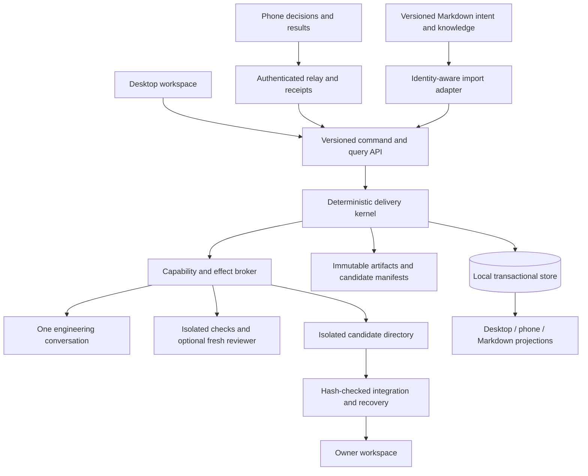
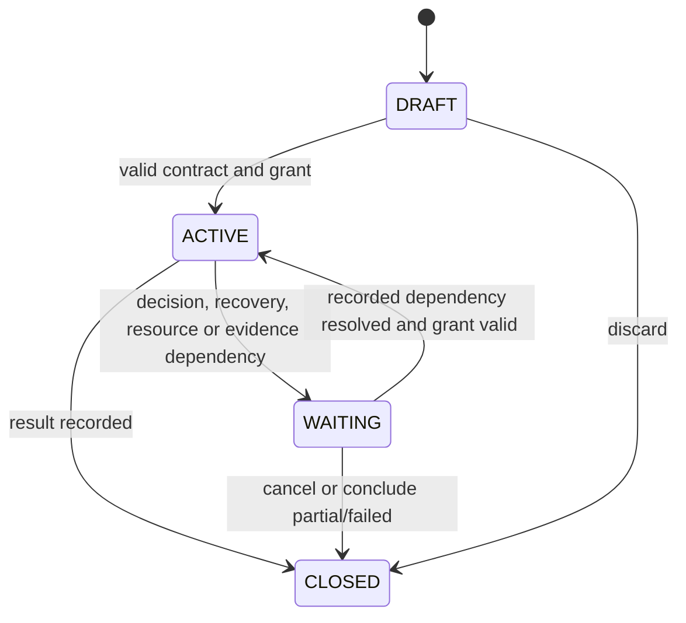

# PM Delivery — V2 Architecture

> **Recommendation: build a V2 execution core and migrate selected work into it.** Retain useful V1 assets behind explicit adapters. This is a research proposal, not implemented behavior or permission to run a migration. Research contract: [ASTRA V2 brief](<../../../docs/ASTRA-PM-COMMAND-CENTER-V2=STUDY.md>). Source baseline: `d6e0260`, inspected 2026-09-06.

## 1. The architectural decision

The product delivers a bounded, authorized change with evidence the owner can inspect and another engineer can resume. Its central object is a **delivery contract**, binding an immutable work revision to allowed effects, a candidate repository snapshot, and obligations that must be satisfied before completion.

V1 makes phases the organizing authority. V2 makes contracts and recorded effects authoritative. Investigation, editing and review are activities that can repeat or be omitted when unnecessary. They are not prerequisites merely because a phase exists.

This changes storage, authorization, orchestration, context and completion together. It is more than splitting `run-session.mjs` into smaller files. It also does not require rewriting the PM board, search, every driver, or the documentation corpus. The [diagnosis](<PM Delivery — Current System Diagnosis.md>) and [migration comparison](<PM Delivery — Migration Strategy.md>) explain why this boundary is justified.

## 2. One local control plane, replaceable workers

This is a modular application with one local service, not a microservice platform. It has five code boundaries: contracts/kernel, storage, effect broker/adapters, context assembly, and presentation. A worker cannot update authoritative status, issue grants, write receipts, or mark its own proof valid. The service stays useful with no model connected: it can show work, inspect receipts, reconcile effects and prepare resumption.

A sleeping laptop does not execute work. The phone can retain dated results and submit supported commands, but shows execution availability separately. An always-on runner is a later deployment choice using the same single-authority protocol; it is not a prerequisite or an assumed capability.

## 3. Authority is assigned per kind of fact

| Fact | Authority | Other representations |
|---|---|---|
| Long-lived architecture, rationale, campaign intent | Versioned Markdown | Search index and context references |
| Existing V1 backlog rows before adoption | Their Markdown documents, identified by adapter | V2 read-only discovery view |
| Adopted work identity, structured lifecycle and contract revisions | Local runtime store | Generated work block / Markdown export |
| Actual source bytes | Owner workspace or identified candidate manifest | Git HEAD is provenance, insufficient identity for a dirty tree |
| Authorization and revocation | Authenticated command accepted by kernel | UI controls and model prompts never grant authority |
| Attempt/effect occurrence and usage | Broker receipts, preserving provider observations | Summaries and gauges |
| Criterion satisfaction | Versioned evaluator over eligible evidence | Agent claims and owner observations remain attributed inputs |
| Repository publication / deployment | Explicit owner action and supplied observation | Local verification never implies deployment |
| Phone data | Versioned projection of local authority | Cache cannot create runtime truth |

For an adopted item, freehand Markdown edits become **proposed intent revisions**. They do not silently change a running contract. Runtime-owned status blocks are generated; modifying one cannot ship an item. Unadopted work remains editable through V1. There is never concurrent V1 and V2 write ownership of the same item. Human-readable IDs such as `DLV-90` become aliases, not primary keys; ambiguous historical aliases require an explicit mapping.

## 4. Minimal data model

The following are proposed logical records, not a request to add these tables to production Supabase.

| Record | Required identity and fields | Invariant |
|---|---|---|
| Work | `work_id`, aliases, origin locator, lifecycle revision | ID survives move, title edit, archive and import |
| Contract revision | `contract_id`, `work_id`, version, parent, intent, exclusions, criteria, risk, source refs | Immutable after authorization; amendments create successors |
| Grant | `grant_id`, contract revision, capabilities, scope, resource bounds, expiry/revocation revision, actor | A model cannot enlarge it; a newer revocation wins |
| Run | `run_id`, contract revision, lifecycle, mode, active grant, outcome | Retry continues a run only while its contract remains valid |
| Attempt | `attempt_id`, run, purpose, input manifest, worker epoch, provider identity, start/result/usage status | ID reserved durably before dispatch; never reused after crash |
| Effect | `effect_id`, attempt/command, requested action, preconditions, idempotency key, observed result | Unknown completion cannot be automatically recast as failure |
| Candidate | `candidate_id`, base manifest, full input tree digest, output manifest, diff, environment fingerprint | Every source change produces a new candidate identity |
| Evidence | `evidence_id`, candidate, criterion, observer, method/version, fixture/environment, result, artifact hashes | No arbitrary path or agent prose can certify unrelated behavior |
| Decision | `decision_id`, target revision, proposition, actor, answer, evidence seen | A decision on an old revision cannot approve new work |
| Knowledge | typed facts, hypotheses, decisions, probes and obligations with provenance | Derived context cannot outrank its sources |
| Event / outbox | ordered event ID, aggregate revision, payload version; pending projection/effect delivery | Commit state and corresponding event/outbox intent together |

Use one local SQLite database for runtime records, with foreign keys, unique keys and transactional compare-and-swap revisions. Keep larger artifacts outside it under content hashes. The store is not editable by model tools. Events are an audit trail of deterministic state transitions; do not add a general event-sourcing framework or require replay of model calls to rebuild current state.

Keep the database on a local disk. WAL enables concurrent readers with one writer; it is unsuitable for a database shared over a network filesystem. Configure and verify durability deliberately, including `synchronous=FULL` if WAL is selected. These are SQLite constraints, not proof that our future application is crash-safe. [SQLite WAL](https://www.sqlite.org/wal.html), [synchronous settings](https://sqlite.org/pragma.html#pragma_synchronous).

Artifact publication order: write temporary blob, flush, rename to content hash, verify readable digest, then commit its database reference and event. A crash may leave an unreferenced blob, which is harmless until explicit retention cleanup. A missing referenced blob is an integrity failure that blocks dependent proof. Do not assume filesystem and SQLite commit atomically together.

Back up the database through a supported consistent snapshot mechanism together with the referenced blob manifest; copying only the main database file while it is open is not a recovery design. Restore into a separate directory, verify every referenced object, and exercise resumption before calling backup complete. Disk-full and interrupted-backup cases belong in acceptance.

## 5. State without phase ceremony

Run lifecycle has four states: `DRAFT`, `ACTIVE`, `WAITING`, `CLOSED`.

These states do not carry all meaning:

- **Activity:** investigating, editing, checking, reconciling, or idle; tied to a current attempt, never a second lifecycle.
- **Waiting reason:** owner intent, grant exception, unavailable dependency, resource limit, uncertain effect, or required observation. Every wait has a resumable obligation and eligible resolver.
- **Evidence:** satisfied, failed, missing, stale, inconclusive or waived, per criterion.
- **Closed outcome:** verified candidate, useful partial, failed, or cancelled. Closed runs are immutable; further work uses a linked successor.
- **Integration/publication:** separate receipts for candidate integrated, owner accepted, owner marked shipped, and deployment observed. None is inferred from another.

A candidate may be fully checked and awaiting owner observation: `WAITING`, with machine obligations satisfied. A cancelled run can still contain useful verified evidence. A shipped record is not a reason to retain an execution lock. After a run closes, later owner acceptance, integration and release receipts attach to its immutable candidate/work; they do not reopen or rewrite its execution outcome. Integration is its own governed operation with attempts and effects. Further engineering uses a linked successor run.

The kernel chooses the next obligation using deterministic eligibility rules. A model can propose the next useful activity and explain its expected information gain; it cannot bypass a missing grant or proof. No generic DAG editor, workflow designer or phase plug-in system is needed.

## 6. Execution transaction and uncertain effects

For each command:

1. Authenticate actor; check target identity, expected revision and capability.
2. In one transaction, deduplicate `command_id` bound to authenticated actor and canonical request digest, reserve its effect/attempt and resource allowance, and record dispatch intent. Reusing an ID with different actor/payload conflicts; it cannot receive a misleading previous success. Allocate a new fencing epoch only when acquiring/replacing worker or resource ownership; ordinary capture/answer commands do not invalidate a worker. Grant revocation revision is separate from ownership epoch.
3. Dispatch outside the transaction. Stream observations into receipts independent of structured answer parsing.
4. Persist observed effect and usage, then interpret the answer. Validate output shape and meaning before updating obligations.
5. Commit new state and projection outbox rows. A replay of the same command returns its existing receipt.

Every internally scheduled paid attempt, probe and retry repeats authorization/resource admission and durable reservation before dispatch. A launch command's receipt does not account for its later model calls.

A crash between steps 3 and 4 leaves an uncertain effect. The recovery handler reconciles actual external state where possible. A durable engine cannot make arbitrary external activity exactly once; even dedicated workflow systems separate execution history from activity retries. This design adopts that distinction without adding Temporal infrastructure. [Temporal activity execution](https://docs.temporal.io/activity-execution).

Lease expiry removes the old worker's authority, not proof that its process stopped. The broker rejects old epochs and quarantines late outputs. Before dispatching a replacement with overlapping effects, stop the old process tree or prove its capabilities revoked. An outstanding provider request may still incur cost; retain its reservation until reconciled or classified unknown. [Evidence & Autonomy](<PM Delivery — Evidence & Autonomy.md>) specifies failure handling.

## 7. Candidate isolation and integration

Keep the no-git-write and no-worktree policies. A candidate is a plain isolated directory derived from a recorded source manifest, not a Git worktree. Read-only Git metadata may aid provenance. Copy only approved source inputs; exclude secrets, `.git`, live runtime state and arbitrary host links. Resolve Windows reparse points, symlinks and traversal before allowing access.

The trusted broker gives the engineer candidate write capability within its contract. Host repository integration, model credentials, local runtime database, production credentials and unrelated files are inaccessible. Tests and package scripts are untrusted executable code too: run them in the same isolation boundary, with synthetic fixtures and declared network needs. A text denylist for dangerous shell strings cannot guarantee this.

Windows isolation is a real implementation gate. Microsoft documents networking and mapped-folder controls, but that does not prove the owner's machine has an adequate headless runner or that SDK tools obey it. Stage 1 must demonstrate the chosen OS/process boundary, provider access and descendant-process containment on this machine. If it cannot, V2 remains a supervised patch-producing tool. [Windows Sandbox configuration](https://learn.microsoft.com/en-us/windows/security/application-security/application-isolation/windows-sandbox/windows-sandbox-configure-using-wsb-file).

Validation runs against an immutable candidate generation and records relevant source, configuration, lockfile, fixtures and toolchain identity. A sandbox without Git metadata, native dependencies or production credentials is not automatically environment-equivalent; unsupported tests remain missing evidence.

Integration is a separate deterministic, grant-controlled operation:

1. Acquire the repository integration lease, establish exclusion from external writers, and compare the complete relevant base manifest with current workspace inputs, including dependencies of the checks.
2. Prepare before/after images and an integration journal. Refuse drift before changing any file.
3. Recheck each file's immediate precondition, apply only recorded candidate bytes under that exclusion, journal individual effects and verify destination hashes.
4. Record integrated candidate identity; re-run affected checks if the integration environment changes their meaning.

A lease excludes only cooperating integrators. Checking a hash then renaming a file is not a filesystem compare-and-swap against VS Code or another agent; an external write can race between them. Automatic host integration requires demonstrated OS-enforced exclusion covering all affected paths and creates/deletes. Cooperative owner-workspace quiescence supports a supervised integration procedure, not a claim of unconditional race prevention. Without proven exclusion, deliver a candidate for owner-controlled application and keep automatic host integration disabled.

A multi-file filesystem update is not a database transaction. While integration is partial, report `reconciling`, prohibit another integrator, and retain every preimage. Recovery completes the exact approved transformation or restores only files still matching our postimages under the same exclusion. If an external editor changed a file, stop and preserve both versions. Never roll back somebody else's later work. Automatic integration is withheld until this protocol is proven; candidate delivery already provides useful value before that gate.

## 8. Shared API and relay

Publish typed schemas from one package consumable by Preact, React and the kernel. Example commands are `CreateWork`, `AuthorizeRun`, `AnswerDecision`, `PauseRun`, `CancelRun`, `IntegrateCandidate`; each carries command ID, owner, target and creation/expiry metadata. Grants and decisions require exact reviewed revisions. Monotonic revoke commands target the exact run/grant/ownership epoch but remain valid across ordinary progress revisions, so a stale phone can still stop the same authority. They must never silently revoke a successor run or newly issued grant. A `QueryCommand` operation reconciles a timed-out submission using the same ID.

Use the existing outbound relay pattern initially, with a versioned V2 namespace. Transport stores carry commands and projections; the local kernel rechecks every grant when executing. No hosted row authorizes a write merely by existing. Pair the owner device with the local installation and sign the complete command envelope using a standard supported signing implementation, binding owner/device, installation, target revisions, payload digest, expiry and command ID. The kernel verifies the paired key, revocation state and replay receipt. An explicitly authenticated end-to-end transport can satisfy the same contract; a client-supplied `owner` field cannot. Key rotation/revocation and stolen-device recovery need fixtures before grant commands are enabled. Existing production relay schema/policies are unverified; any necessary migration is an owner-run deliverable under Hard Rules 24/26.

Complete snapshots replace previous snapshots for the same authenticated owner and generation. Deltas include sequence numbers; gaps trigger a full refresh. Cache is keyed by owner and schema/build compatibility. On logout clear prior-owner state. Offline grant controls do not queue silently: capture may queue with an explicit pending receipt, but approvals require current revision validation and expiry. Revoke requests can be queued, with an honest `Stop requested` state until acknowledged.

## 9. Complexity budget

Do not build distributed scheduling, a general agent marketplace, a vector database, a new product PM taxonomy, or a custom workflow DSL. Use one writer, one local authority, ordinary relational records, existing test tooling and two user-facing modes. Keep raw evidence inspectable and generate summaries deterministically where possible.

The irreducible complexity is effect recovery, authorization and proof validity. Put it in a small trusted kernel. Remove phase-shaped duplication around it. [Execution Portfolio](<PM Delivery — Execution Portfolio.md>) limits investment to working vertical slices with retirement gates.
