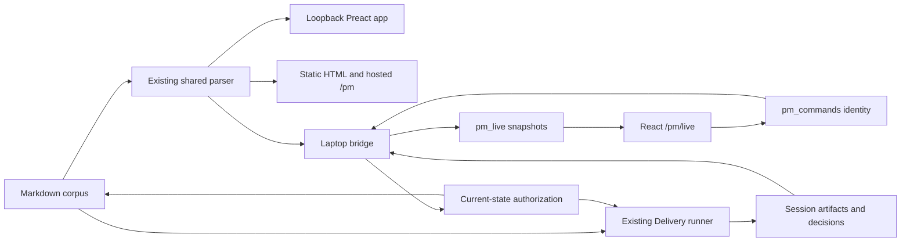

# Command Center — ASTRA Architecture

> Subordinate to [ERA Top Layer — Master Plan (2026-09-02)](<../ERA Top Layer — Master Plan (2026-09-02).md>), not a replacement roadmap. Source cutoff: `3106164`; local session artifacts inspected read-only on 2026-09-06. Deltas [Delivery Master Book](<../Delivery/Delivery — Master Book.md>) at `updated: 2026-08-01` and [PM Tooling Master Book](<../PM Tooling/PM Tooling — Master Book.md>) at `updated: 2026-08-03`. The Delivery stamp predates changes inside that book.
>
> Read with [Experience](<Command Center — ASTRA Experience.md>), [Orchestration](<Command Center — ASTRA Orchestration.md>) and [Packets](<Command Center — ASTRA Packets.md>). Campaign detail and executable runner/parser work live in the [Delivery ASTRA pair](<../Delivery/ASTRA/Delivery — ASTRA Book.md>) and [PM Tooling ASTRA pair](<../PM Tooling/ASTRA/PM Tooling — ASTRA Book.md>). This phase writes only these eight study documents.

## 1 · Verdict: preserve the machinery, tighten what its evidence means

The system has valuable existing boundaries: one Markdown parser, journaled local actions, a pure Delivery state machine, registered agents, scoped lane policy, and session artifacts that can reconstruct a failed run. Its weakest boundary is **whether a record proves the thing the interface says it proves**.

Three read-only observations establish this problem beyond documentation drift:

- The same checkbox ordinal can identify a different open item after an insertion. The existing toggle accepts it and marks the inserted item done [CC01].
- INSTANT's generated acceptance matrix can mark “one offline transaction” and “briefing on both phones” as met from a synthetic changed filename. No transaction or phone was involved [CC04].
- A real product session is ACCEPTED in state, while its finish manifest still says BLOCKED with zero of six criteria met [CC09].

**EXTENDS → R7 / DLV-90 / DLV-93:** reject stale targets, bind evidence to the actual criterion, and expose inconsistent completion instead of silently choosing the greener artifact. These changes unblock the Top Layer's HUB-37/E-01 and HUB-47/E-11 work. They outrank a new agent role, dashboard or forecasting system under Design Doctrine §5.

The study does not reopen the Delivery freeze. The queue's August 6 “no product session” premise is stale; its requirement for two real product completions is not established. One later product session reached ACCEPTED, not owner-marked SHIPPED. Keep the freeze and its explicit limited-fix experiment until the owner records the required evidence.

## 2 · Four surfaces, three authorities

The brief's “four surfaces, one Preact bundle” is incorrect. Three surfaces reuse Preact; the live phone app is React/Next over relayed JSON (`scripts/pm/ui.mjs:18`, `scripts/build-pm-dashboard.mjs:51`, `src/components/pm-live/PmLiveApp.tsx`). Shared semantics do not require merging these frameworks.

| Surface | Data authority | Can change work? | Failure boundary |
|---|---|---|---|
| `pnpm pm` at loopback | Current Markdown and local Delivery artifacts | Local PM actions and governed Delivery operations | Stale browser target versus changed file; runner state versus finish artifacts |
| `_dashboard.html` | Embedded snapshot | No; read-only | Generation age and shell/data compatibility |
| Hosted `/pm` | Build-time embedded snapshot, possibly served from app cache | No; read-only | Build age, offline cache, and current authentication are different facts |
| `/pm/live` | Derived `pm_live` rows from the laptop bridge | Limited commands via `pm_commands`; bridge revalidates authority | Owner-bound cache, missing realtime event, claimed command without completion, heartbeat without fresh task data |

The authorities are intentionally distinct:

1. **Markdown owns product work identity and PM completion.** Neither a command receipt nor a session status may silently tick an unrelated checklist row.
2. **Delivery session artifacts own execution history and governance.** `state.json`, decisions, paid attempts, validation and finish artifacts must identify the same revision of the same session.
3. **The authenticated command handler owns authorization at execution time.** A cached phone button is never authority to approve a stale gate.

`pm_live`, HTML snapshots and browser caches are projections. They must not become another PM database or another assistant store.



This is an implementation map, not a proposal for new services. Sources: the two Master Books' source routing, `scripts/pm-server.mjs`, `scripts/pm/bridge.mjs`, `scripts/delivery/server-routes.mjs`.

## 3 · Evidence register

“Proven” below means source dataflow or an explicitly synthetic local reproduction. It does not claim deployment or physical-device verification. No DB calls, provider calls, servers or Delivery runs were started during the study.

| ID | Evidence | Finding and practical consequence |
|---|---|---|
| CC01 | `scripts/pm/src/app/store.js:103`; `scripts/pm/mutations.mjs:24`; `scripts/pm/archive.mjs:237` | Toggle/Ship/Discard target an ordinal with insufficient identity. A prepended open row passes the same-state guard and receives the mutation. Move already sends expected-line evidence at `store.js:124`; reuse that boundary. |
| CC02 | `src/features/pm-live/usePmLive.ts:147–161`; `scripts/pm/bridge.mjs:1123–1157` | The client registers its waiter after insert response and has no status-query recovery. The bridge drains pending rows, claims before execution, and does not inspect final-update errors. A timeout can mean completed work, while a stranded claimed row is no longer drained. |
| CC03 | `src/features/pm-live/cache.ts:13–29`; `usePmLive.ts:35–50`; `store.ts:73–107` | Global cache is hydrated before authenticated identity; full reads merge instead of replacing. A previous user's snapshot or a missed deletion can survive. This is a client state defect; live RLS is not inferred. |
| CC04 | `scripts/delivery/instant.mjs:256,259,324–328`; `acceptance.mjs:165–166` | Containment accepts undeclared same-file changes; every INSTANT criterion is promoted from generic diff evidence. Exact edit matching and criterion-bound proof are both needed. |
| CC05 | `scripts/delivery/drivers/claude.mjs:575–595,1319`; `run-session.mjs:1833–1863,1060–1065` | Reused streaming segments report cumulative dollars but per-turn token usage. Repeatedly adding cumulative dollar readings overcounts prior turns. Local metadata arithmetic is reproduced in Orchestration. |
| CC06 | `scripts/delivery/usage.mjs:137`; `run-session.mjs:1752,629`; `context-policy.mjs:65–76` | Aggregated processed input is used as resident context. Local Aug22 events show rotations from 108.9%/175.4% apparent occupancy. This can throw away the warm session DLV-85 was intended to preserve. |
| CC07 | `scripts/delivery/recommendation.mjs:78–128,190–194,620–639`; `server-routes.mjs:401–428` | Active forecast uses phase priors, not the brief's legacy aggregate constant. Once three histories qualify, whole-phase totals are treated as one traversal and multiplied again. Today no tier has three eligible histories: active priors remain static. |
| CC08 | `scripts/delivery/run-session.mjs:4115,4172,4214,4620,4716` | Only BLOCK stops review; a missing/invalid verdict can fall through. REVIEW and UAT incur two calls inside one tick, with no persisted budget boundary between them. DLV-95 repaired an earlier parse-loss path, not these gaps. |
| CC09 | `.delivery/sessions/s-20260822-093143-t7tm/state.json`; `artifacts/finish/manifest.json` | Current state ACCEPTED versus finish BLOCKED/runner-crash, 0/6 met. The packet is HUB-1 and seven source paths are recorded. This is a real product attempt and an inconsistent finish record, not two proven completions. |
| CC10 | `run-session.mjs:2012,4722–4754,4857–4870`; local Aug22 `transcript/turns.ndjson` | Heartbeat/PID probing already exists. Seventeen sealed rows contain eleven unique turn IDs; crashes can reuse IDs before the counter is persisted. A process heartbeat is neither progress nor a durable attempt identity. |
| CC11 | `scripts/pm/assets/sw.js:8,39,53`; `scripts/pm/src/app/store.js:77,99,132`; `public/sw.js:307–340` | Local offline indication and mutation blocking already exist. Fixed SW version and independently cached shell/data lack a build/schema compatibility contract; hosted `/pm` is a separate snapshot path. |
| CC12 | `scripts/pm/bridge.mjs:79,535,1046`; `src/features/pm-live/cache.ts:13,16,44` | Relay terminal rows already expire after seven days and snapshots are size-bounded. Local history retention remains incomplete; “no retention anywhere” is false. |
| CC13 | PM Book Shipped Log R49/R7 versus current PM checklist Now/Next | R49 denotes archive automation and CI; R7 denotes consolidation and SSE verification. Lint's per-file ID map does not establish lifetime uniqueness. Do not introduce further IDs before Phase-5 reconciliation. |
| CC14 | `src/components/pm-live/session/SegmentedPanes.tsx:38–52` | Selected state can advance before visible scroll is confirmed. Real-phone failure is UNVERIFIED; R42's existing device test is required before changing navigation. |

Local state census, read-only JSON metadata: 16 sessions = 14 CANCELLED, one SHIPPED (DLV-28), one ACCEPTED (HUB-1). The committed source cutoff and the ignored/local artifact evidence are distinct; do not represent this census as a deployed fleet query.

## 4 · Proposed contracts at existing seams

### Item identity — EXTENDS → R7

Use the existing scanner. Require the expected row content/identity for every toggle, Ship and Discard; reject a changed target with 409 before any write. An ordinal locates a candidate, not an identity. Undo must compare expected post-mutation file content before restoring and validate every affected file before restoring any of them. Existing bridge Undo's hash check supplies a precedent (`bridge.mjs:619`); desktop restore currently writes snapshots unconditionally (`archive.mjs:384–391`).

Postpone must not transfer to another row after a sweep. Replace ordinal-only view keys at the existing `taskKey` seam, following the PM packet's explicit treatment of legacy keys and duplicate identities. No parser rewrite or new task database. Product unlocked: selecting and preserving the correct HUB-37/E-01 work.

### Command identity — EXTENDS → DLV-72

**ASTRA-CC-1:** create one command identity, register observation before submission, and reconcile that same ID through realtime plus an authenticated status query. A client timeout is uncertain completion, not proof of failure. Never auto-submit a new grant or capture because its acknowledgment was missed.

The bridge's claimed-command crash gap remains separate. **Held refinement under DLV-93:** use a durable receipt keyed by the existing command ID beside the existing journal before any replay of a claimed capture/launch. Without such proof, preserve uncertainty and require current-state reconciliation; blindly changing claimed back to pending would duplicate side effects. No new command queue or transport.

Product unlocked: answering and controlling the bounded HUB-47/E-11 product session from the phone without repeating successful actions.

### Snapshot identity — EXTENDS → DLV-72 / R37

**ASTRA-CC-2:** cache belongs to the verified owner. Hydrate only a matching owner/schema envelope; replace a complete authoritative snapshot after a successful full read; apply deltas only as deltas. Failed reads preserve explicitly stale same-owner data, never fabricate an empty authoritative result.

**PM ASTRA-R-2:** preserve existing offline status while adding source/build compatibility to desktop/static snapshots. Bridge heartbeat, task generation, runner progress and command completion keep separate freshness evidence. One green indicator must not certify all four. Use existing payloads and stores, not a new synchronizer.

Product unlocked: the owner sees the actual session and actual build being reviewed for HUB-37/HUB-47.

### Execution evidence — EXTENDS → DLV-87 / DLV-90 / DLV-93

Existing artifacts need stronger interpretations, not a new evidence service:

- A diff proves an exact declared transformation only if extra edits are rejected.
- A test result needs a nonzero executed selection and the assertions relevant to the criterion.
- A review needs a valid verdict and readable findings; an unparsable result cannot authorize progression.
- Dollars, processed tokens, request context and phase traversal counts have different units.
- A paid attempt is checkpointed before another paid attempt starts.
- **ASTRA-CC-3:** finish artifacts carry and are checked against the state/decision revision they summarize.

These corrections precede interpreting the existing forecast or making the pipeline parallel. Details and bounded scopes are in the Delivery ASTRA pair and Orchestration.

## 5 · Lane confidence and governance

| Lane | Actual distinguishing contract | What remains unproved |
|---|---|---|
| INSTANT | One known target, merged spec/plan, two model turns on the happy path; three decisions can come from two owner interactions under the recorded exception | Exact absence of extra changes, nonempty tests, criterion-bound proof; failures must escalate |
| FAST | Merged discovery/plan when eligible; lower budget/effort; model review | A lower envelope does not repair missing verdicts or cap checks between paid calls |
| STANDARD | Separate planning and normal review pipeline | More turns do not guarantee correct acceptance interpretation |
| DEEP | More reasoning/internal-turn allowance; default dollar envelope is $4 in current config, not the brief's $5 | Depth cannot compensate for cumulative-cost or context-unit errors |

Source: `scripts/delivery/config.mjs:229`, lane policy and the Delivery Book's recorded INSTANT amendments. Preserve no git writes, no permission bypass, three decision records, typed risk approval and owner-marked SHIPPED. DLV-89's experiment must not silently waive them. The proposed reduction of interactions is held pending a precise owner amendment; accepting this study is not a gate-policy implementation.

No automatic cross-provider fallback, widened write authority, lane collapse or multi-writer execution is proposed. The existing registry remains the source of truth. Independent read-only roles are planned registry entries, not evidence that an orchestrated reviewer currently ran.

## 6 · Contradictions for the Phase-5 register

| ID | Claim / source | Evidence and consequence | Resolution / mapping |
|---|---|---|---|
| CC-C01 | Four surfaces share Preact — brief §6.2 / PM Identity | Separate React phone app (§2) | Correct the description; share contracts, not framework code. DOCKS → existing Command Center scope. |
| CC-C02 | Desktop still needs phone-style filters — brief §6.4 | `BoardToolbar.jsx:12`, `boardState.js:96` already implement them | No duplicate toolbar project. EXTENDS → R42 verification only for a reproduced gap. |
| CC-C03 | No real product run — Delivery freeze context | CC09 and local census | Record HUB-1 ACCEPTED with contradictory finish; keep two-completion threshold. EXTENDS → DLV-92/93. |
| CC-C04 | Two interactions can replace general three-gate oversight — DLV-89 | Book exceptions apply only to qualifying INSTANT merged artifacts | CONFLICTS → owner non-negotiable; owner amendment required, no silent waiver. Also DLV-89 points to DLV-91 instead of experiment DLV-92. |
| CC-C05 | DEEP default $5 — brief/book table | Current config $4 | Correct source-derived envelope; do not retune it by intuition. EXTENDS → DLV-86. |
| CC-C06 | DLV-85 reuse incurs no cache rewrite and accounting is globally truthful | CC05/CC08; reused local turns still have creation tokens | Normalize cumulative costs and retain failed-attempt spend before calibration. EXTENDS → DLV-87/88. |
| CC-C07 | Aggregate turn input equals last-request context | CC06 | Separate throughput and context; unknown stays unknown. EXTENDS → DLV-69. |
| CC-C08 | Old aggregate constant drives today's forecast | CC07 | Active forecast is phase-based/static today; fix latent history units before measuring new priors. EXTENDS → DLV-86. |
| CC-C09 | Heartbeat/watchdog absent | CC10 | Existing heartbeat stays; target progress/attempt/lease gaps, not another timer. EXTENDS → DLV-68/91. |
| CC-C10 | Accepted state and finish package form a truthful finish | CC09 | Correlate current state, decisions and artifact revision; inconsistent is not complete. EXTENDS → DLV-93; ASTRA-CC-3. |
| CC-C11 | Canonical scanner makes checkbox targeting safe | CC01 | Same-snapshot parity is narrower than fresh identity. EXTENDS → R7. |
| CC-C12 | R49/R7 can identify their current task unambiguously across history | CC13 | Phase-5 ID reconciliation; use HUB-37/E-01 as the CI product anchor meanwhile. No ID reuse. |
| CC-C13 | Missing migration proves live command CHECK rejects approvals; schema proves RLS pain | Missing DLV-77 SQL and stale DB snapshot do not establish live state | UNVERIFIED until owner supplies current constraints/policies. Never reconstruct guessed SQL from a linter error. |
| CC-C14 | No retention and no offline honesty | CC11/CC12 | Preserve existing bounds/indicators; fix owner/revision/full-read semantics. EXTENDS → R37/R38/DLV-72. |
| CC-C15 | File existence or any changed file is acceptance proof | CC04 | Criterion-bound evidence; no inferred device observation. EXTENDS → DLV-90/93. |
| CC-C16 | PM tooling typing/enforcement already covers the JS core | `tsconfig.json` has allowJs but no checkJs; R36 remains open | Isolated checked JSDoc on the shared core; no global language migration. EXTENDS → R36. |
| CC-C17 | A clean lint run prevents new any debt in grandfathered files | `eslint.config.mjs:226,256` downgrades whole files to warnings | Ratchet new diagnostic occurrences using existing lint output; do not mistake warnings for enforcement. EXTENDS → DLV-52. |

## 7 · Scope and proof limitations

No application/source/migration/script changes, live DB calls or provider runs occurred. Pure functions were exercised with synthetic strings/objects; metadata-only local artifact reads corroborated economic and state findings. This does not prove deployed PM visibility, phone installation, current relay CHECKs/RLS, billing method, external SDK service behavior or device scroll reliability.

**UNVERIFIED:** relay authorization and command constraints. Owner supplies fresh `migrations/db-state.sql` output plus untruncated policies/CHECKs for `pm_live` and `pm_commands`; no agent queries the DB. **UNVERIFIED:** billing basis. Owner identifies API billing versus subscription from account settings without sharing credentials. **UNVERIFIED:** real phone behavior. R42/DLV-72 owner screenshots and action receipts settle it.

The existing `pnpm pm:lint` failure remains the missing `migrations/2026-08-01_pm-commands-instant-gates.sql` link in Delivery, plus the Native empty-Next warning. Phase 5 owns corpus repairs, checklist injections and the final Contradiction Register. Phase 3 does not paper over the error or revise the accepted Top Layer files.

## 8 · Phase 3 verification receipt

Read-only validation on 2026-09-06: all eight Phase 3 files exist; relative Markdown links resolve; all sixteen execution sheets carry the required fields and S1–S12; no L-sized sheet. These are document checks, not implementation-test results. Git HEAD remains `3106164`; tracked diff is empty. The new Phase 3 files sit beside the four accepted Phase 2 documents and the session brief; no application, script, migration, checklist or existing Master Book changed.

`pnpm pm:lint` was run against the unchanged corpus. Output, exit **1**, matches the pre-existing baseline:

```text
✓ Budget/4 - Checklist.md (BUD)
✓ Schedule/4 - Checklist.md (SCH)
✓ Kitchen/4 - Checklist.md (KIT)
✓ Trips/4 - Checklist.md (TRIP)
✓ Hub & ERA/4 - Checklist.md (HUB)
✓ Notifications & Alerts/4 - Checklist.md (NOTIF)
✓ PM Tooling/4 - Checklist.md (R)
✗ Delivery/4 - Checklist.md (DLV) — 1 error(s), 0 warning(s)
    Delivery/4 - Checklist.md:49 [E5] missing code path: `migrations/2026-08-01_pm-commands-instant-gates.sql`
✓ Outfits/4 - Checklist.md (OUT)
✓ Healthcare/4 - Checklist.md (HLTH)
! Native App/4 - Checklist.md (NAT) — 0 error(s), 1 warning(s)
    Native App/4 - Checklist.md:0 [W2] "## Next" lane has no open items

1 error(s), 1 warning(s).
ELIFECYCLE Command failed with exit code 1.
```

A green corpus check remains outstanding. Repair belongs to Phase 5's evidence-based reconciliation; neither a missing SQL file nor a broken link proves an unapplied migration. No code tests/builds were run, no server/bridge/provider was started, and no DB call was made.

## ASTRA 10× Findings

- **Leverage 1 — EXTENDS → R7/DLV-90/DLV-93:** bind action and evidence to the exact thing the owner intended. Existing row guards, diffs, test results and decisions already contain most of the required structure [CC01/CC04/CC09].
- **Leverage 2 — EXTENDS → DLV-87/88/69:** separate cumulative cost, per-attempt spend and resident context at the existing driver boundary. This repairs caps, rotation and future forecasting together [CC05–CC08].
- **Leverage 3 — EXTENDS → DLV-72/R37:** owner- and revision-aware snapshots plus command-ID reconciliation make the phone dependable without merging the two UI frameworks [CC02/CC03/CC11].
- **Simplification — EXTENDS → R6:** remove the 4,534-line legacy client and its associated escape hatches after the already-required UAT; stop maintaining two desktop implementations while keeping the static twin.
- **Frontier — NEW, parked:** after two real product completions, derive a read-only resumption check from existing target identity, attempt receipts, gate decisions and artifact hashes. Reopen only if it measurably reduces repeated owner actions or uncertain resumptions on DLV-92/93-class work; no new state machine or agent loop.
- **Uncomfortable — EXTENDS → DLV-93:** the tooling can perform the approved ceremony while proving the wrong proposition. More planning, more turns or more agents cannot repair an acceptance matrix that confuses a changed filename with a delivered household outcome [CC04/CC09].
