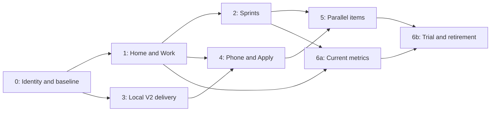

# Command Center — Product Direction and Implementation Plan

**Adopted by the owner on 2026-09-11.** This is the accepted multi-campaign specification for `pnpm pm`, Delivery v2 and the phone experience for that product; the household application's other modules are delivery targets, not redesign targets. The PM Tooling and Delivery checklists alone own priority and completion, and every phase maps to canonical IDs in §7. [Delivery V2](<Delivery V2.md>) keeps the execution-boundary specification and records the changes adopted here. Adopted decisions live in the [PM Tooling](<../PM Tooling/PM Tooling — Master Book.md#vision--decisions>) and [Delivery](<../Delivery/Delivery — Master Book.md#vision--decisions>) books; open amounts in DEC-14.

§2 and the verification notes are dated assessment evidence. The original proposal is preserved unchanged in the [archive](<../_Archive/Studies/Command Center/Command Center Product Plan (2026-09-11).md>); Phase 0's status below records what has changed since.

## 1. Recommendation

**Keep the current React application and complete it as a small project-management product with a dependable remote delivery workflow.** Its visual foundation is worth retaining. The missing coherence lies mainly in work identity, planning views, execution wiring and the connection between the desktop and phone.

The product promise should be: **choose an outcome, organize when it matters, approve its approach, follow its delivery, and return to an accurately recorded result—from the phone or the desk.** CLI and chat remain first-class ways to do the engineering.

Build around three everyday places:

| Place | What the owner does there |
|---|---|
| **Home** | See all module/campaign cards, current sprint or Now work, decisions needing attention, active deliveries and recent outcomes. |
| **Work** | Search/filter the global backlog, open a module, switch Board/List/Sprints, inspect readiness, open source, organize or deliver an item. |
| **Delivery** | Find sessions, see their actual state, read plans, answer questions, inspect work/checks, review results and apply an approved candidate. |

Keep the existing three-destination navigation. Rename the visible Today/Explore labels to Home/Work if adopted, preserving existing deep-link aliases. Put **Dashboard** behind a clear Home link and **Source** on work details. There is no need for a fourth permanent mobile tab, a permanent inspector, a document-tree landing page or a new design system.

### Why it is worth maintaining

Your premise is sound when the application joins things that a conversation leaves scattered: the selected work, its source, its place in a sprint, the approved scope, the current decision, the checked candidate and the eventual outcome. Those connections can save attention even when a native agent performs all the engineering.

The strongest differentiators are consistent item identity across CLI/remote work, understandable planning, decisions tied to the exact plan being approved, independent check evidence, and recovery after a disconnect. Agent counts and elaborate stage diagrams are weak differentiators.

Claude Remote Control already supports local sessions from a phone, conversation/progress continuity and mobile prompts. It still relies on a running local process. Therefore “remote chat,” agent visibility and notifications alone do not justify maintaining a custom delivery engine. This is a comparison of documented capabilities, not a benchmark run in this assessment. [Claude Remote Control documentation](https://code.claude.com/docs/en/remote-control).

**Keep ERA responsible for work, authorization, durable state and evidence. Let the native executor handle ordinary investigation, tools, context, implementation and repair.** If a task benefits more from live conversation, provide a prepared handoff and reconnect its result to the same item. Do not make Delivery mandatory.

The limits should be explicit: this cannot guarantee good engineering merely through roles or prompts; an available phone does not make a sleeping laptop available; estimates cannot guarantee a bill; different modules can share files and invariants; a checked candidate is not yet an applied product change. Each limit has a practical response in the phases below.

## 2. What is actually present

The assessment includes the uncommitted React reboot and theme/connectivity corrections. HEAD alone would miss much of the current product. The July Graphify graph was too old; a fresh bounded structural map of 170 relevant code files was used, with source inspection as the authority. References below use repository-relative paths and line anchors from this working tree.

| Requested capability | Current evidence | Recommendation |
|---|---|---|
| Module/card home | Primary React Home has module shelves, Now work, waiting decisions, live runs, lane distribution and 14-day shipment bars. `scripts/pm/app/Home.tsx:15`; `components.tsx`. | Keep composition, colors, sheets and responsive approach. Make cards and calls to action more informative, shorten ornamental copy. |
| Global/module work | Explore searches across the canonical corpus; module pages show priority collections and history. `scripts/pm/app/Explore.tsx:25`. | Complete this as Work. The primary app currently has collections/lists; the actual Board/List control is in the classic interface. |
| Sprints and qualification | Current Work type has priority, severity, effort and dependencies, but no sprint/capacity/deliverable contract. `scripts/pm/app/types.ts:36`. | Add a small planning layer over the same work. Do not create a second task database. |
| Item context/source | Acceptance, dependencies, downstream items, planning actions and launch exist. The Full brief link prefers the Master Book, not the checklist containing the selected row. `scripts/pm/app/Work.tsx:78`, `:252`. | Add separate Checklist and Brief links, highlighting the exact ID. Repair anchors and historical source access. |
| Stable identity | V2 has an ordinal-independent WorkRef and row fingerprint; primary UI navigation uses campaign/ID. Other keys and mutation APIs still use file/ordinal, with optional witnesses. `scripts/delivery-v2/contracts.mjs:238`; `work-ref.mjs:62`; `scripts/pm/app/model.ts:45`; `Work.tsx:81`. | Reuse and finish the existing identity contract from selection through mutation, launch, history and sprint membership. |
| Session home/status path | Delivery lists current/history sessions. Run shows stages, plan steps, artifacts, checks, usage, gates and guidance. `scripts/pm/app/Delivery.tsx:36`; `Run.tsx:49`, `:217`. | Keep these surfaces. They currently project V1 packets/events, not a running V2 job. |
| Agents, models, effort | V1 setup exposes Claude/Codex, models and phase effort. V2 has explicit executor adapters; selection is installation-wide, and Claude v2 does not forward effort. `Delivery.tsx:134`; `scripts/delivery-v2/entry.mjs:769`; `adapters/claude.mjs:203`. | Make selection explicit per run, persist requested/effective settings, and show only supported controls. Show real native subagents only when observed. |
| V2 engineering boundary | Contracts, SQLite store, job admission/reconciliation, candidate/evidence helpers and Results exist. `policy.mjs:598` returns `dispatched: false`; HTTP lifecycle commands are incomplete. | Finish the existing boundary, not a third engine. An admitted record is not an executed job. |
| Dependable enforcement | Existing qualification refuses the recorded profiles. Production wiring does not yet load trusted qualification observations; checker default execution is a host subprocess. `policy.mjs:533`; `adapters/registry.mjs:219`; `checks.mjs:309`. | Qualify actual worker **and checker** isolation before unattended execution. Keep the refusal battery intact. |
| Phone delivery | `/pm/live` is a separate React application/relay. Its launch is Claude-specific, approvals are restricted to INSTANT, and bridge dispatch uses V1 routes. `src/components/pm-live/LaunchSheet.tsx:110`; `scripts/pm/bridge.mjs:785`. | Bring the same product journey to the phone through shared views/contracts and a repaired relay. A mobile viewport of localhost is not remote support. |
| Cost | V1 has forecasts/limits/usage; v2 has resource policies/reservations. Existing unknown-cost handling and provenance remain incomplete. `scripts/delivery/budgets.mjs:138`; `scripts/delivery-v2/jobs.mjs:97`. | Preserve provenance and reservations; add proportionate controls. Do not label a between-turn estimate as a hard monetary cap. |
| Parallel work | V1's global build lock deliberately serializes shared-checkout work. V2 is not yet an end-to-end dispatcher. `scripts/delivery/server-routes.mjs:90`, `:470`. | Isolate candidates, then permit bounded concurrency. Do not remove the lock and call it parallel delivery. |
| Dashboard/history | Actual dated history and simple charts exist. The primary history parser and bridge use different rules. | Share metric definitions and history parsing before adding charts. Do not treat sessions, bugs, cancellations and completed items as interchangeable categories. |

### Findings that should precede new planning features

1. **Some existing IDs lose their acceptance context.** The portfolio ID regex and heading lookup disagree on suffix/case. In this corpus, `SCH-4.3B`, `SCH-1B.4`, `SCH-1C.1` and `SCH-1C.2` project empty contracts; references can collapse to nonexistent `SCH-4`. The pure scan reports two unresolved references to that collapsed ID. Repair the grammar and normalize lookup while retaining display spelling. `scripts/pm/src/lib/portfolio.js:38`; `product.js:14`.
2. **Some links miss the target.** Work creates lowercase anchors, whereas Markdown headings use `slugify`; `SCH-4.2` becomes two different anchors. Cancellation links target `shipped-log`, while the cancellation source is excluded from ordinary scanned files. `Work.tsx:256`; `components.tsx:239`, `:493`; `Auxiliary.tsx:93`.
3. **V2 selection does not yet prove the user's initial click.** The HTTP path accepts file/ordinal and freezes the row currently occupying that position. A pure probe selecting A and then prepending B demonstrates that the same ordinal can successfully freeze B. Existing post-capture WorkRef tests do not close this initial boundary. `scripts/delivery-v2/policy.mjs:522`; `entry.mjs:474`.
4. **The current dollar guard accepts unknown values.** Pure calls to the V1 session-budget check with `costUsd: null` or `NaN` and a finite limit return OK. This corroborates DLV-87; it is not evidence that a live paid launch occurred. `scripts/delivery/budgets.mjs:138`.
5. **Remote acknowledgement is not durable recovery.** A command is inserted before the client registers its waiter; timeouts lose that waiter. The bridge claims a command, performs its side effect, then writes its receipt. A crash in between needs reconciliation, not another launch. The cache is not scoped to an owner and snapshots merge rather than replace. These are source-level findings, not a claim of observed production leakage. `src/features/pm-live/usePmLive.ts:149`; `cache.ts:13`; `store.ts:80`; `scripts/pm/bridge.mjs:1123`.
6. **V2 resource accounting needs enforcement, not just UI wiring.** Unknown-resource observations are collected but not passed into the admission predicate; a null next reservation can become zero. Non-USD units are accepted while settlement currently reads dollar cost. Add explicit unknown/finite-value/unit checks and unit-specific settlement before promising token or fleet limits. `scripts/delivery-v2/jobs.mjs:113`, `:261`; `contracts.mjs:952`.
7. **Actor labels are not authentication.** V2 accepts a supplied actor name/header after request-origin checks; this identifies a claimed actor, not a verified owner. General local PM routing checks the Host header. Define a consistent trusted-local command authentication/CSRF boundary before enabling new dispatch/application effects. This source finding does not establish an observed exploit. `scripts/delivery-v2/entry.mjs:374`; `scripts/pm-server.mjs:461`.

*Phase 0 disposition (2026-09-11):* findings 1–3 repaired (PM Tooling R59; V2 selection witness under DLV-97); finding 4 re-probed and still open (DLV-87); finding 5 owned by DLV-104; findings 6–7 owned by DLV-97.

The pure corpus scan found **234 open items, no checked rows, eleven campaigns, 28 Now / 85 Next / 121 Later**. It also projected 78 as waiting, but that count should not become an authoritative readiness metric before the ID defects above are corrected. Historical parsing found **257 shipped records and one cancellation**; only 165 of those 258 records had exact canonical item IDs. These are records with uneven granularity, not 258 uniquely completed work items or a project completion denominator.

### Verification performed

- `pnpm exec vitest run tests/pm-ui`: **103 tests passed in 19 files**, including the React and classic/static builds. The first sandboxed attempt failed three builds with `Cannot read directory "../..": Access is denied`; the permitted rerun outside that sandbox passed without source changes.
- `pnpm pm:lint`: zero errors/warnings. `pnpm pm:check-docs`: eleven campaign pairs, 234 unique tasks, criteria and links passed before this document was added.
- `pnpm exec vitest run tests/delivery-v2 --exclude tests/delivery-v2/isolation.test.ts`: **284 passed, three failed**. Failures are in `executor-selection.test.ts:470` and `pilot-entry.test.ts:479`, `:495`: a stub store lacks `transaction`, and fixtures expect policy/HTTP outcomes without satisfying the installed-executor boundary. Investigate intended behavior before updating expectations.
- The isolation suite was not run: it invokes a real sandbox CLI/network canary. No provider session, normal PM startup/monthly sweep, bridge, production DB, installed PWA or real phone was exercised. Browser discovery returned no available browser. Previous R57/R58 browser receipts remain historical evidence, not fresh verification here.
- After writing the plan and its research/book references, PM lint and documentation checks passed again: 34 active Markdown files and the same 234 canonical tasks. Independent planning, delivery and source-path reviews were incorporated. Application typecheck/lint and live UI acceptance were not rerun for this documentation-only deliverable; the local static dashboard was regenerated without publishing.

## 3. The product and data decisions

### One work item, several views

Keep canonical checkbox rows in the eleven campaign checklists, detailed intent/acceptance in their Master Books, and completed/cancelled receipts in their existing locations. A campaign is an owning group, sometimes covering several ERA modules; topic search is a useful cross-cutting lens, not another owner.

Use the existing WorkRef derivation without importing the whole backlog into the execution store. Preserve its identity across archival and explicit renames through receipt/alias mappings. Bind readiness and approval to **both** the row fingerprint and the relevant acceptance/dependency revision; a changed Master Book can change the contract without changing the checkbox row.

Keep these dimensions separate:

| Dimension | Meaning/source |
|---|---|
| Priority | Now / Next / Later, owned by checklist position. |
| Work outcome | Open, completed, cancelled; canonical checkbox/history. A failed or cancelled attempt leaves work open unless separately cancelled. |
| Activity | Not started / active / review, derived from linked execution or an optional explicit CLI work-start/handoff receipt. Unknown external activity remains unknown. |
| Blockers | Typed prerequisites, missing decisions/evidence or an explicit hold. A severity of blocker is not itself a dependency edge. |
| Kind | Feature / bug / maintenance / investigation / verification / unclassified, declared in the matching Master Book ID section. “Bug” and “defect” share one category. |
| Planning membership | Optional sprint and deliverable references. Membership does not authorize execution or change priority automatically. |

Add **one small versioned `_Planning.json` at the PM root** for sprint definitions, deliverable groups, WorkRef membership and capacity/commitment snapshots. This is new proposed storage. It contains references and planning facts, not copied item titles, acceptance, checkbox state or lanes. Keep task kind, explicit `Depends on`, and optional shared-resource/path declarations beside the existing acceptance in each Master Book.

An illustrative contract for the new planning file:

```json
{
  "schema": "pm-planning@1",
  "revision": 1,
  "sprints": [{
    "id": "sprint-2026-09-a",
    "name": "September A",
    "goal": "Finish the selected mobile workflow",
    "startDate": "2026-09-14",
    "endExclusive": "2026-09-21",
    "timezone": "Asia/Beirut",
    "state": "draft",
    "capacity": { "unit": "points", "available": 6, "reviewMinutes": 90 },
    "members": [{ "workId": "<existing WorkRef ID>", "origin": { "file": "PM Tooling/4 - Checklist.md", "alias": "R55" }, "deliverableId": "mobile-workflow", "points": 2 }],
    "commitment": null,
    "scopeChanges": []
  }],
  "deliverables": [{ "id": "mobile-workflow", "title": "Complete the mobile workflow", "targetDate": "2026-09-20" }]
}
```

The example's dates and numbers are examples, not commitments. Date bounds are local calendar dates: start inclusive, endExclusive exclusive; display the last included date to the owner. Default sprint length: one week, editable. Use S=1/M=2 only as an initial relative planning aid; L means split before commitment, not a precise forecast. Allow explicit overrides with a visible estimate. Unestimated work is visibly unestimated, never zero cost/capacity. Owner review minutes and execution slots are different capacity limits. Retain member origins or a referenced-WorkRef mapping so opaque IDs remain resolvable after archival; record rename/merge aliases explicitly without changing the original identity.

`Start sprint` freezes member IDs, estimates, relevant criteria revisions and the planned goal. Commitment revisions and later additions/removals are durable records in `_Planning.json`, not only in the rebuildable observation journal. Permit one active portfolio sprint and any number of drafts initially; one item may be committed to only one active sprint. Closing a sprint records achieved outcomes, cancellations and carryover; unfinished work stays open and is not silently pushed into another sprint. Targets are planning dates, not scheduled dispatch.

### Useful qualification without ceremony

Call the UI **Readiness**, with three independent questions:

| Question | Checks | Result |
|---|---|---|
| Can we plan it? | Clear outcome/acceptance, bounded size, explicit dependency/decision state, known evidence needs. | Ready / Needs input / Blocked, each with specific reasons. |
| Does it fit this sprint? | Goal/deliverable fit, estimate, remaining capacity and prerequisite order. | Fits / Over capacity / Conditional. A dependent can join a sprint if its prerequisite is also planned; it cannot dispatch first. |
| Can it run now? | Current source, allowed and qualified executor, current approval/resources, no conflicting run/resource claims. | Eligible / Waiting / Unavailable. Rechecked at dispatch, never inferred from a green sprint badge. |

Start with deterministic checks. Optional AI help drafts missing acceptance or suggests a split/model; the owner reviews those edits. Avoid a paid readiness agent on every page load or an opaque numerical score.

Detect dependency cycles before proposing sprint order. Cancelled or unresolved prerequisites do not count as satisfied; require an explicit replacement/removal of the dependency. Incomplete declared scope remains unknown, not conflict-free. A cycle or missing reference cannot become Ready merely because all affected items were selected together.

### CLI and chat remain part of the same project

External Markdown edits continue to refresh through the scanner/watcher. Completing an item through the existing CLI/archive path updates the same cards, board, sprint and dashboard. Deduplicate receipts by stable work/event identity and keep explicit reversal events for Undo, reopen and cancellation reversal; project current outcome from canonical sources. A missing checkbox without a matching completion/cancellation/merge receipt is unresolved, not completed. Repeated historical stamps never create another completed item; leave session history as separate attempts.

Add an optional `Open in CLI`/copy handoff with ID, source, acceptance, desired result and suggested checks. An optional small `pm:work start/finish` helper can record external activity and evidence, but ordinary CLI/chat work must not require it. Do not infer “running” by scraping arbitrary chat histories.

Use a derived `.pm/planning-events.ndjson` observation journal for forward-looking charts and reconciliation. Write it from explicit commands or a watcher reconciliation worker, never a GET/read-model builder. A direct app/helper action has a known action time; an arbitrary external edit has `observedAt` and may have `occurredAt: null`. Preserve the existing receipt's date where present; do not invent historical start/completion timestamps. Include this journal in runtime backup, and mark history coverage after loss/import. `_Planning.json` commitment records remain durable planning facts even if the derived journal is rebuilt.

## 4. Delivery design to build toward

### Responsibilities and interaction

Use **one writer per candidate**, operating through Claude or Codex in a native session. Ordinary read/edit/test/repair belongs inside that session. The supervisor controls selection, plan decisions, permission/resource checks, job identity, stop/recovery, and result projection. A protected checker observes the frozen candidate. A semantic reviewer is an optional additional job for a named risk, not a mandatory agent at every stage.

A short native investigation produces a readable plan. Starting that investigation authorizes its bounded resource use; it does not authorize implementation. The phone review presents outcome, scope, a short sequence, risks/unknowns, checks, executor/model/effort and budget. **Approve / Revise** binds the exact revision. Approval then covers the ordinary implementation/check/limited-repair loop. Ask again only for a consequential scope/resource/effect change, a genuinely blocking question or the final application decision. Keep V1's existing gates unchanged while it remains operational.

Enforce this distinction: the investigation job has read-only source/candidate access, with only explicitly scoped native session/temp writes. Approval creates current write authority and fresh Job admission before implementation; native conversation continuity may remain. A failed preapproval candidate-write attempt must be denied by the environment, not merely corrected by a prompt.

Session header: **Plan → Build → Check → Review → Applied**. Treat this as a projection, not a new engine state machine. Research/candidate-only work ends with its corresponding Result; cancellation/failure/unknown stopping is an explicit branch. Repairs can return to Build. Never imply a percentage-complete based on which stage is highlighted.

Put blocking questions and pending approvals above the activity stream. Show nonblocking questions alongside the plan. Guidance needs a receipt saying queued, delivered to executor, or awaiting next turn; “queued” is not “read.” Plan changes invalidate old approvals. A second answer to a superseded question must be rejected or reconciled, not applied to today's question.

Each visible agent row shows its actual role, executor/model, current observed action and last event time. Use recorded native child identities when exposed; if only the main executor is observable, show that one and state that detailed activity is unavailable. Never manufacture a team from phase names. Native subagents are optional and must fit resource/isolation policy; independent parallel items are a different feature.

### Executor and cost choices

Change v2 from installation-wide active-executor selection to **per-run selection from an installation's allowed, qualified profiles**. Persist the selected backend, runtime/profile revision, model and effort with the Job. Also retain effective settings reported by the executor. Unsupported or mismatched settings produce an actionable refusal; another provider is never silently substituted. Changing executor after a pause creates an explicit handoff with reconciled predecessor and fresh admission.

Keep two visible work profiles: **Focused** and **Investigate**, corresponding to the existing FAST/DEEP intent. Map retained V1 lane names only for legacy runs. Offer a suggested supported model/effort with a short reason and an override; avoid model choices on each internal phase. Small precise work gets a proportionate capable model, while uncertainty/shared invariants justify greater effort or a reviewer. Store recommendations as versioned mappings to supported provider identifiers; do not hard-code today's model names into the product direction.

The installed Codex TypeScript SDK is `0.144.1`; its local effort type is `minimal | low | medium | high | xhigh` (`node_modules/@openai/codex-sdk/dist/index.d.ts:237`). The adapter must not offer a newer effort merely because a web page or this planning agent supports it. OpenAI documents the SDK for programmatic tasks and the app server for custom clients needing approvals/history/events. Use the current adapter for the first slice; if its conversation contract cannot support the required interaction, adapt the official app server **behind that same executor boundary**, rather than building a second chat engine. [Official Codex SDK documentation](https://learn.chatgpt.com/docs/codex-sdk).

For cost, show one compact summary with expandable provenance: **estimated spend, measured token use, available provider quota when actually exposed, and remaining admitted allowance**. Preserve unknown values. Subscription allowance, billed dollars, SDK estimates and tokens are distinct units. Claude's current documentation explicitly describes `total_cost_usd` as an estimate; it also warns that main-loop usage can omit subagent tokens and cumulative streams can be double-counted. Verify the installed version's actual receipts before mapping them. [Claude SDK usage documentation](https://code.claude.com/docs/en/agent-sdk/cost-tracking).

Default recommendation: a visible estimated-spend threshold plus enforceable dispatch/repair limits and a qualified wall-time/stop limit. Let the owner set actual amounts during setup; this plan invents neither a dollar allowance nor a subscription balance. A strict monetary option is available only when its complete-job bound is supported and verified. Unknown cost cannot become zero or bypass a chosen strict policy. Retain unresolved reservations until reconciliation, including child/reviewer activity and failed starts. Readiness/recommendation must be free unless it explicitly starts a bounded paid investigation.

### Practical enforcement

Do not translate every paragraph of AGENTS.md into a bespoke policy engine. Classify it:

- **Preventable effects:** worker cannot reach host files/secrets/Git metadata/supervisor/checker or production; enforce outside the model.
- **Machine-checkable requirements:** source identity, scope, approved model/effort, test selection/counts, protected-file changes, evidence freshness and resource admission; check deterministically.
- **Judgment requirements:** UX quality, appropriate scope and maintainability; supply the relevant playbooks/context, use targeted review and owner acceptance. A prompt cannot certify these.

Recommended environment: a disposable Linux worker in a container backed by a VM/isolated host, provisioned by established tooling. Supply an explicit source snapshot and dependencies; do not mount the owner's home/profile, host checkout, supervisor store, release credentials or container-control socket. Provider authentication must use a narrowly supplied credential/path compatible with the actual plan, not copied host profiles. Limit network access to the admitted needs. A WSL distro with unrestricted host mounts is not the proposed boundary.

Run checks in a separate confined instance using a frozen candidate and a supervisor-owned check plan. Candidate tests execute code, so a sanitized environment alone is insufficient. Requalify material runtime/configuration changes. DLV-96's existing battery must establish forbidden reads/writes/link escapes and descendant stopping. If the proposed platform cannot meet it, return that concrete failed boundary and choose another existing runtime; do not weaken fixtures or create endless new framework work.

Keep all production DB work manual under Hard Rule 26. Agent-generated SQL remains a reviewed owner-run deliverable. Local SQLite planning/execution state is not the production Supabase database.

### Completing work remotely includes disposition

Initially preserve verified-candidate output with owner application. To fulfil the target phone journey, add an **owner-triggered Apply action** in a protected supervisor/integrator, after local v2 reliability. This is a proposed change to DEC-16's current manual-application boundary and must be recorded on adoption before that phase is enabled.

The worker never writes the host checkout. The integrator applies only the approved frozen diff after checking all affected before-images, current base and scope, rejecting link/reparse escapes and protected paths. It holds an exclusive application claim and performs validated byte writes only. It preserves unrelated CLI edits; conflicts block application and offer a new candidate against the current source. Maintain an application journal/backup for partial-failure recovery. Copy the integrated source into the isolated checker for required checks; **never run candidate-controlled tests or package scripts inside the privileged host integrator**. Bind the resulting evidence to that integrated snapshot. No reset, automatic merge, commit, push, production migration or deploy is implied. Git/release automation can wait. A request that explicitly requires deployment remains incomplete until its separately authorized deployment observation exists.

If application succeeds and PM projection fails, retry the writeback only. If acceptance means a verified research/candidate deliverable, completion can be recorded at that contracted outcome. Product fixes requiring application remain open while only a candidate exists. This distinction prevents attractive but false completion statistics.

## 5. Phased implementation

These are implementation slices, not sprint promises. Claude Code should break a phase into reviewable vertical changes while keeping the stated outcome intact. Existing IDs below are ownership links, not claims that those items are completed or that their full scope exactly matches a phase.

### Phase 0 — Establish a trustworthy baseline and adopt the direction

**Outcome:** selected items retain their meaning, and subsequent work begins from known passing boundaries.

**Work:** preserve/record the current dirty-tree baseline; fix the three v2 fixture failures according to intended selection policy; unify canonical ID parsing/heading lookup/slug generation; require exact selection witnesses at v2 entry; make existing planning mutations fail safely on stale/ambiguous identity. Include Master Book revisions in the contract fingerprint. Reproduce the four missing Schedule contracts, reordered-row launch and broken source/history links with meaningful regression fixtures.

In parallel, run one bounded **feasibility slice** for the recommended external worker/checker boundary using disposable synthetic assets and the existing isolation battery. This is an early technical risk check; it must not wait for the entire planning UI. It is not permission for a paid pilot or production access.

Record adopted product decisions in the existing books/plan/register: keep the React experience, per-run executor choice, mobile as a core milestone, two meaningful v2 review moments, and eventual protected owner-triggered application. Specify default resource policy and actual owner-supplied allowances before any paid run. Map new stories once into the two owning campaigns. Add PM routing to the Feature Map; currently its index has no PM Command Center entry.

**Files:** `scripts/pm/shared/tasks.mjs`, `src/lib/product.js`, `src/lib/portfolio.js`, `app/model.ts`, `app/Work.tsx`, `app/components.tsx`, `app/Auxiliary.tsx` (all PM paths under `scripts/pm/`); `scripts/pm/write-guards.mjs`; `scripts/delivery-v2/work-ref.mjs`, `contracts.mjs`, `entry.mjs`, `policy.mjs`; corresponding PM UI/v2 tests; existing campaign books and accepted plan.

**Dependencies/decisions:** no new UI architecture. The phase's policy adoption is separate from choosing a concrete paid task. Preserve V1 operation/freeze; V1's two-completion experiment does not become a prerequisite to separately authorized v2 work.

**Complete when:** all existing PM/v2 deterministic suites pass; all four Schedule contracts resolve; A cannot turn into B after reordering; duplicate/unknown IDs refuse mutation; dotted/case IDs reach exact source; the isolation feasibility receipt identifies a passing environment or the exact unresolved boundary. Failure of that runtime gate blocks paid v2 dispatch, while Work/Sprints can proceed.

**Status: complete 2026-09-11.** Evidence: [PM Tooling R59](<../PM Tooling/PM Tooling — Master Book.md#r59>) and [R51 progress](<../PM Tooling/PM Tooling — Master Book.md#r51>); [DLV-97 selection half](<../Delivery/Delivery — Master Book.md#dlv-97>); [DLV-96 feasibility receipt](<../Delivery/Delivery — Master Book.md#dlv-96>). PM UI 113 and delivery-v2 334 tests (304 deterministic) pass; the four Schedule contracts resolve in the live corpus; a reordered V2 selection re-resolves the witnessed row or refuses; witness-less, changed, mismatched and duplicate-ID checkbox writes refuse; dotted/case IDs open their exact heading. The container runtime met the battery's required worker and checker controls on synthetic assets, but no executor is qualified and egress is unverified: paid v2 dispatch stays blocked, while Phases 1–2 can proceed.

### Phase 1 — Complete the Home, Work and module experience

**Outcome:** the owner can understand the project and manage global/module work without using reference tools.

**Work:** retain module shelves and theme; add succinct per-card Now/blocked/active indicators and one next action. Promote Work to a global **Board/List** with Now/Next/Later lanes, campaign/kind/status filters and shareable URLs. Blocked/active/review are badges or filters, not hidden relocation of priority. Offer drag where useful and a tap/keyboard Move action everywhere. Keep phone columns individually navigable with a compact lane selector; do not shrink a desktop board across 390 px.

Use the same board/list component on a module page. Show acceptance, dependency reasons, linked sessions and **Deliver / Open session / Open in CLI** on the item. Add **Checklist** and **Brief** links; open the full document, scroll/highlight the exact ID and preserve the return location. Resolve historical sources through an explicit read-only source reader, not by adding archives to the backlog scan. Completed and cancelled records stay accessible.

Introduce the shared domain read model/SourceRef and machine-readable kind/dependency parsing. Preserve source formatting, compare-and-swap writes and guarded Undo. Move shared pure logic out of the classic presentation namespace only where needed, with imports/tests updated together; do not delete that namespace wholesale.

**Files:** `scripts/pm/app/App.tsx`, `Home.tsx`, `Explore.tsx`, `Work.tsx`, `Auxiliary.tsx`, `components.tsx`, `model.ts`, `types.ts`, `state.tsx`; `scripts/pm/src/features/tasks/` for reference behavior; `scripts/pm/shared/`; `scripts/pm-server.mjs`; `scripts/pm/mutations.mjs`. **Proposed new files:** `scripts/pm/app/Board.tsx`, `scripts/pm/shared/work-model.mjs`, `scripts/pm/shared/source-ref.mjs`.

**Dependencies/decisions:** Phase 0 identity fixes. Keep canonical priority headings; do not make “Waiting” a fourth persisted checklist lane. Minor copy/label changes implement Hard Rule 28: labels and verbs, minimal explanatory text.

**Complete when:** all eleven campaigns and the complete open backlog are reachable; board and list represent the same IDs; a move/reload/Undo works at desktop and 390/320 px; a CLI edit refreshes both global and module views; every tested active/completed/cancelled record opens the right source; core navigation never sends the owner to classic tools.

**Status: complete 2026-09-11.** Evidence: [PM Tooling R60](<../PM Tooling/PM Tooling — Master Book.md#r60>). 120 `pm-ui` tests pass (7 new); all 11 campaigns and the full 241-item backlog are reachable from Work; Board and List render identical filtered IDs; blocked/active/review are badges, never a relocated lane; a keyboard/tap Move plus guarded Undo, a reload of a filtered URL, and the compact Now/Next/Later lane switcher at true 390/320 px (verified via a same-origin iframe probe — this sandbox's window resize had no effect) all hold; a Checklist row and its Brief heading open and highlight distinctly with the return path kept. Limits: CLI-edit refresh is verified by construction (every check here is itself a filesystem write through the unchanged R57 watch/SSE pipeline), not an isolated external-editor probe; Checklist/Brief and highlight behavior was swept on one representative item, not all 241; no real phone/PWA device.

### Phase 2 — Add practical sprints, deliverables and readiness

**Outcome:** the owner can toggle from continuous priority planning to a dated sprint without maintaining different work items.

**Work:** add `_Planning.json` with a validated revisioned schema and guarded writes; support draft/start/close sprint, goal, editable dates, relative capacity and owner-review capacity. Add deliverable groups and a simple dated timeline. Reuse global/module filters and WorkRef details. Provide candidate selection with Ready/Needs input/Blocked and sprint-fit reasons; show dependency order and unresolved decisions. Items can be conditionally planned but are prevented from dispatching before prerequisites.

Inside a sprint, offer an outcome overview and a compact execution board: To do / Active / Review / Done, with blocked reasons as overlays. These are projections of the same work and execution facts. Cancelled/removed items have a separate scope-change disclosure. An optional explicit Start action records external work activity; a drag must never pretend to start an agent, approve a candidate or satisfy acceptance.

Freeze commitment at sprint start and append scope-change history. Display original commitment, added/removed scope, completed/cancelled and remaining work separately. Carryover is an explicit selection at close. Make sprint progress observe CLI completions without creating synthetic Delivery sessions. Persist date-only sprint dates with an IANA timezone; actual events use UTC instants.

**Files:** existing shared work/source models, PM scanner/server and query keys; **proposed** `scripts/pm/planning.mjs`, `scripts/pm/app/Sprints.tsx`, `scripts/pm/shared/readiness.mjs`, `ERA Notes/10 - Project Management/_Planning.json`, `tests/pm-ui/planning.test.ts` and `readiness.test.ts`. Extend the existing watcher for the derived observation journal; do not journal in `buildWorld`/GET.

**Dependencies/decisions:** Phase 1 source/model contract. Sprint readiness is independent of executor qualification. Do not require AI generation, point estimation on the entire backlog, auto-scheduling, velocities or Scrum ceremonies.

**Complete when:** the same item can move in Kanban, join a sprint, complete through CLI and update all views once; a cancelled item reduces remaining work without adding delivered work; a criteria edit invalidates its readiness witness; overcapacity/unestimated work is visible; a conditional dependency can be planned but cannot launch early; concurrent stale edits to `_Planning.json` receive a conflict rather than overwrite.

### Phase 3 — Make one native v2 delivery dependable locally

**Outcome:** a selected item can actually pass from plan through implementation/checks to a truthful Result, with Claude or Codex chosen explicitly.

Execute this phase as three linked slices:

1. **Environment and admission:** finish worker/checker provisioning from Phase 0; load immutable qualification receipts bound to exact executor/runtime/config; expose qualified capabilities and per-run selection; enforce source/contract/grant/resource checks immediately before dispatch and resume, not only during initial admission. Atomically reserve Job identity/resources, acquire an exclusive dispatch claim and record dispatch intent before provider invocation. An idempotent marker alone is not an exclusive claim. Authenticate local mutations with a paired local credential/session and CSRF/origin checks (or an equivalently proven trusted-local transport); a caller-supplied actor string is not proof. Derive remote actors from authenticated identity through the trusted bridge.
2. **Native interaction:** wire admission to `dispatchJob`, scratch provisioning and the real adapter; implement versioned plan/questions/answers, approved implementation continuation, message receipts, pause/stop/reconcile and limited repair. Preserve native session continuity. Forward and verify supported model/effort. Normalize native telemetry without inventing child agents. Repeated commands use one identity, not duplicate paid calls.
3. **Checks and result:** quiesce/export/freeze candidate, run protected checks, reject zero-test/failed/stale/waived substitutes, record Result and remaining obligations. Connect canonical v2 list/detail/events/decision/control/result projections to existing Delivery/Run views. Complete cost provenance, reservation recovery and v2 handoff. Keep the V1 reader available with explicit engine identity.

Start with a selected isolated, nonproduction, non-DB product change and a bounded owner-approved policy. Establish one real end-to-end run before multiplying roles. Qualify both backends separately and demonstrate the same core interaction for each before calling executor choice complete; progress on one does not permit silent substitution for the other.

**Files:** `scripts/delivery-v2/{service,entry,policy,contracts,store,jobs,checks,results}.mjs`, `adapters/{registry,claude,codex}.mjs`, existing qualification fixtures and PM server integration; `scripts/pm/app/{Delivery,Run,state,api,types}`. **Proposed:** a small worker-boundary module and v2 presentation adapter, only if no existing helper owns the responsibility. Reuse the established record types; do not add a general orchestration engine.

**Dependencies/decisions:** Phase 0 identity/boundary, DLV-96/97 and DEC-14. Phase 1 provides the polished UI, but dispatch reliability can develop in parallel with Phases 1–2. No hard monetary promise without a proven bound. No worker access to production.

**Complete when:** real approved runs produce checked candidates; owner questions and plan revision work; effective executor/model/effort match selection; a crash after dispatch records unknown/reconciles without relaunch; cancel remains stop-requested until observed; source/grant changes refuse stale continuation; failed or zero-test checks cannot mark work complete; a deliberately failed PM writeback retries only projection. Record a modest comparable native baseline under DLV-98; it informs overhead, not a lengthy research programme.

**Status: implementation landed 2026-09-12; live acceptance outstanding — Phase 3 is not complete.** Evidence: [Delivery DLV-97](<../Delivery/Delivery — Master Book.md#dlv-97>), [DLV-96](<../Delivery/Delivery — Master Book.md#dlv-96>), [PM Tooling R55](<../PM Tooling/PM Tooling — Master Book.md#r55>). `scripts/delivery-v2/journey.mjs` takes a witnessed item through read-only investigation, revision-bound plan/questions/answers, approval, native-session continuation, a frozen candidate, protected checks and a Result, with pause, stop-until-observed, reconcile-from-retained-output, one repair, explicit handoff and writeback-only retry. Each provider call follows an exclusive claim and a recheck of source, acceptance, grant, policy revision, qualification and resources; commands need a paired session and CSRF token; executor, model and effort are per run and compared with what the executor reports. Every completion clause above is exercised with scripted SDKs through the real adapters (`tests/delivery-v2/journey.test.ts`); delivery-v2, pm-ui and relay suites 643 passed with 4 opt-in container tests skipped; the container smoke 4/4; typecheck and ESLint clean; Delivery, both run states and V2 launch have no horizontal overflow at 390/320 px (same-origin iframe probe; pairing exercised in a real browser against a synthetic fixture server).
**By backend.** *Claude:* model and effort forwarded; effective model from `init` and effort from the tool-use hook; session resumed. The battery inside the pinned worker image met every required control except `network.egress` (receipt `qr-59ca5c357cb0`), so the profile is unqualified; no real turn. *Codex:* read-only sandbox for investigation, thread resumed; its 0.144.1 events report neither model nor effort, so effective settings show `unreported`; battery as Claude (`qr-c7126b8bf9b9`); no real turn. **Not met for either:** a real approved run, a checked candidate from real work, a real question/revision cycle or crash, a native baseline (DLV-98). Executor choice is not complete while neither backend has run. Dispatch stays blocked on an egress the battery can observe, a policy `runtime` section, credential volumes and DEC-14 amounts.

### Phase 4 — Deliver the same workflow from the phone

**Outcome:** away from the desk, the owner can select work, approve/read plans, answer, pause/cancel, review evidence and apply an approved candidate through one coherent Command Center.

**Work:** keep the primary React views as the product source. Introduce a transport interface for snapshots/source reads, capability discovery, session reads and versioned commands. Local uses the Node server; `/pm/live` mounts the shared presentation with an authenticated relay transport. Remove local-only URL/permission assumptions from shared components. Avoid a third UI implementation; static export remains read-only and may keep its separate presentation.

Repair owner/installation/schema-bound cache identity and replacement semantics before enabling new remote actions. Clear prior-owner state on logout/switch; successful full snapshots replace absent entities, failed reads preserve explicitly stale same-owner data. Generate command IDs before send, persist/retry the same intent, register receipt observation before dispatch, query receipts after reconnect/timeouts, and reconcile claimed commands after crashes. Bind approvals to owner, installation, run, plan/contract revision and payload. No timeout or heartbeat alone proves execution stopped or a command failed.

Extend the existing `pm_live`/`pm_commands` relay schema only where necessary. The current command type constraint is finite (`migrations/schema.sql:1793`), so new v2 commands need a migration/runbook and updated schema snapshot. Provide owner-run SQL, inspection and rollback; the implementing agent never applies it to production. Use current owner-supplied RLS evidence for access acceptance.

Add attention delivery for waiting decisions/results, deduplicated by decision/result revision. Reuse existing notification transport where suitable; show bridge heartbeat, last command acknowledgement and worker availability separately. A desktop background/startup service and a clear paused/offline state are sufficient initially; buying managed hosting is not prerequisite.

Implement the protected **Apply** path described above after DEC-16 adoption, with local tests before exposing it remotely. Scope the permission to the exact candidate and destination. Store the observed application/check result and reconcile PM completion; publish/deploy/DB actions remain separate.

**Files:** `scripts/pm/app/{App,state,api,Delivery,Run,Work}`, `scripts/pm/bridge.mjs`; `src/app/pm/live/page.tsx`; existing `src/components/pm-live/` and `src/features/pm-live/{usePmLive,store,cache}` as reference/migration surfaces; `scripts/delivery-v2/` disposition/command modules; `migrations/YYYY-MM-DD_pm-v2-relay.sql` before `migrations/schema.sql`. Add/update the PM Atlas entry and local runbook.

**Dependencies/decisions:** Phase 3 local evidence; shared Phase 1/2 views. Recommend replacing DEC-15's optional-mobile framing because this request makes phone use central. DEC-16's owner-triggered integrator is an explicit effect change, not implied by approving a plan. Real relay/phone acceptance awaits the owner's manual setup and observations.

**Complete when:** a real 390 px phone/PWA can launch a chosen executor, revise/approve a plan, answer, receive attention, survive reconnect and inspect/apply the result; double taps/replayed commands do not duplicate work; an account switch shows no prior-owner cache; killing the bridge between effect/receipt recovers the same command; a sleeping/offline worker is clearly unavailable; CLI edits during a run cause a safe application conflict with no lost edits. Verify no host/provider/release secrets appear in phone payloads.

**Status: implementation landed 2026-09-12; owner migration and phone acceptance outstanding — Phase 4 is not complete.** Evidence: [Delivery DLV-104](<../Delivery/Delivery — Master Book.md#dlv-104>), [DLV-105](<../Delivery/Delivery — Master Book.md#dlv-105>), [PM Tooling R63](<../PM Tooling/PM Tooling — Master Book.md#r63>). `/pm/live` mounts the shared views through a transport seam (`scripts/pm/app/transport.ts`; local `localTransport.ts`, relay `src/features/pm-live/relay/transport.ts`); the earlier phone app is the `?ui=legacy` rollback. The relay contract lives in `scripts/pm/relay-shared.mjs`; the bridge journals claim → started → effected → reported and reconciles claimed commands without re-running them; phone intents keep one id from first send through retries and reloads; caches are owner/installation/schema-bound and replaced by complete reads; approvals bind actor, installation, run, plan and contract revision and payload; attention pushes are keyed by revision and remembered across restarts; laptop reachability, receipts and worker availability are shown apart. Apply (`scripts/delivery-v2/apply.mjs`, journey `apply`) writes only the approved candidate's bytes after before-image, scope, protected-path, link and case checks, journals backups, serializes on a store claim, resumes or rolls back an interrupted application, runs integrated checks only through the checker runtime, and implies no Git, deploy or DB action. Relay SQL with inspection and rollback: `migrations/2026-09-12_pm-v2-relay.sql` (unapplied); schema snapshot updated. Finish gate: 1961 tests passed (4 opt-in container tests skipped) across delivery-v2, pm-ui, delivery and relay suites, including every §6 scenario this phase owns in fixture form (lost or doubled approval, bridge killed between effect and receipt, account switch and lost connection, application conflict); typecheck, ESLint, PM lint/docs checks and `next build` clean; synthetic render at true 390/320 px (same-origin iframes) with no overflow. **Not met:** a real phone/PWA journey, any live relay command, a real killed bridge or account switch, a real applied candidate — the migration is the owner's, no executor is qualified (DLV-96), so no real run or candidate can exist (DLV-97/99). Owner steps: [PM Relay Setup](<../../06 - Setup & Onboarding/PM Relay Setup.md>).

### Phase 5 — Enable dependable parallel items

**Outcome:** independent items from different or the same modules can progress together, with understandable coordination limits.

**Work:** give each candidate isolated writable scratch and an immutable base manifest. Start with **two concurrent writers maximum**, configurable after evidence. Admission checks explicit dependency ordering, active item identity, declared/observed path overlap, shared APIs/types/schema, lockfiles, generated outputs, check ports/databases and fleet resources. Display **Can run together / Must follow / Needs scope check**, including the reason. Absence of a dependency declaration is not proof of independence.

Parallelize investigation/checking where safe; serialize conflicting writes and all application to the destination. Before applying a second candidate, compare against the destination after the first, invalidate affected checks and rerun integration evidence. If a writer discovers new shared scope, pause that candidate and re-evaluate reservations/conflicts. Include all pending/unknown jobs in fleet resource limits. Do not run a successor in a predecessor's possibly still-active scratch.

Expose a small queue with running slots, waiting reason, owner decisions and each item's chosen executor. Keep coordination rule-based; no paid scheduling manager or mandatory cross-agent debate.

**Files:** `scripts/delivery-v2/jobs.mjs`, `store.mjs`, `policy.mjs`, boundary/disposition modules; shared readiness/dependency model; `scripts/pm/app/{Delivery,Run,Sprints}`; new conflict/lease fixtures. Preserve the V1 global lock for V1 while its shared-checkout execution exists.

**Dependencies/decisions:** Phase 3 reliability, Phase 4 interaction/application, Phase 2 planning metadata. These are concurrency protections, not a claim that a whole module is independent. Native subagent concurrency is separately accounted for.

**Complete when:** two genuinely disjoint items execute together; a shared contract/lockfile pair waits with a reason; same-module independent items are not automatically excluded; newly discovered overlap pauses safely; fleet caps and unknown reservations hold; stale leases recover without duplicate writers; applying A invalidates B where appropriate; CLI changes cannot be overwritten. Start with product fixtures, then a small owner-approved real pair.

**Status: implementation landed 2026-09-12; real pair and sprint integration outstanding — Phase 5 is not complete.** Evidence: [Delivery DLV-106](<../Delivery/Delivery — Master Book.md#dlv-106>).

- **Prerequisites as verified:** Phase 2 (PM Tooling R61) has no implementation — no `_Planning.json`, readiness module or Sprints view. Verdicts therefore appear on Delivery, Launch and Run only, and dependency order reads the canonical checklist and Master Book directly. Phases 3–4 exist as code with synthetic evidence only: no executor is qualified and the relay migration is unapplied.
- **Built:** rule-based coordination (`scripts/delivery-v2/coordination.mjs`), evaluated inside each admission transaction and again under the dispatch claim, over:
  - item identity;
  - HELD markers and `Depends on` prerequisites, where open, cancelled or unresolved ones are unsatisfied;
  - declared `**Touches:**` and observed paths — approved plan scope and frozen candidates;
  - shared code against its static importers;
  - `migrations/`, dependency manifests and lockfiles, and generated outputs;
  - policy-declared check resources;
  - writer slots, possibly running jobs and an optional owner fleet allowance.
- **Queue and pause:** runs refused only by coordination wait and are admitted when their reasons clear. A writer that grows into another reservation pauses with its candidate kept.
- **Application:** serialized under the existing claim. After a change to its base, the checker rechecks the candidate on a preview of the resulting source before any write. V1's lock is untouched.
- **Demonstrated in fixtures, through the real journey:** every completion clause above except the real pair.
- **Enforced limits:** two writers (a code ceiling), three possibly running jobs by default, and the fleet allowance only when the owner sets one.
- **Not met:** an owner-approved real pair (blocked on DLV-96 qualification), live concurrency and container isolation under two workers, and sprint integration.

### Phase 6 — Finish the dashboard, calibrate value and retire duplication

**Outcome:** the owner can read progress and quality without misleading totals, and the product has a manageable maintenance footprint.

Use the following metric contract before designing charts:

| View | Definition | Guard against |
|---|---|---|
| Open work by campaign/priority | Distinct active WorkRefs at the current snapshot. | Mixing blocked with priority or counting one item twice because it has sessions. |
| Completed / cancelled over time | Distinct work outcomes with exact IDs and dated provenance, shown separately. Legacy unidentifiable entries remain “historical records.” | Counting a cancelled run as cancelled work, a candidate as applied, or every legacy stamp as a unique completion. |
| Bugs | Open work with explicit kind=bug; severity is a separate grouping. | Guessing type from blocker/friction, or counting bug and defect as different exclusive statuses. |
| Sprint progress | Original committed scope, added/removed scope, delivered, cancelled and remaining. Initial chart can use item counts; weighted view only for estimates with coverage. | Fake historical burndown, changing denominators without showing scope change, equating removed/cancelled work with delivery. |
| Delivery outcomes | Attempt outcome: verified candidate / useful partial / failed / cancelled. Separate observed disposition: none / research / verified candidate / applied change / verified deployment. | Treating applied and successful candidate as mutually exclusive slices of one denominator, or calling process exit/owner acknowledgement product completion. |
| Resources | Known usage/estimates by executor/run with coverage and provenance. | Summing dollars with tokens, estimates with bills or repeated cumulative receipts. |

Add accessible chart tables and filters/drilldowns into the actual work/receipts. Prefer an open-work stacked bar, completion/cancellation trend, sprint scope chart and bug severity bars. No “overall project percentage,” velocity prediction or model leaderboard from a handful of runs. Use the same history parser locally and in relay projections.

Run a short operating trial using the existing DLV-98–102 criteria: one comparable native baseline, three FAST attempts counting failures, and the interrupted DEEP continuation witness. Include phone use and at least two useful product outcomes before declaring the remote experience dependable; use the Phase 5 parallel pair within that evidence where eligible instead of creating a second benchmark programme. Record owner attention/interruptions, useful unattended work, rework, evidence confidence, known usage/unknowns and whether the owner chose Delivery voluntarily. Report what happened; do not claim statistically proven superiority from a tiny sample. The product passes when ordinary remote delivery needs decisions rather than terminal rescue and the project stays coherent with CLI completion.

After those receipts, remove duplicated presentation/control paths that are no longer needed. First extract the shared parser/model dependencies still used by the primary app and v2. Keep V1 history readable and a documented rollback for unsettled acceptance; retire its dispatcher when replacement journeys pass. Static output can stay a modest read-only export. Do not keep implementing each feature in React, classic Preact and legacy HTML.

**Files:** `scripts/pm/app/{Home,Auxiliary,model,components}`; **proposed** `Dashboard.tsx`, shared history/metrics module and `tests/pm-ui/metrics.test.ts`; `scripts/pm/src/lib/product.js`; `scripts/pm/bridge.mjs`; static build/legacy routes only during scoped retirement.

**Dependencies/decisions:** basic truthful current metrics can land after Phase 1; sprint charts require Phase 2/journal coverage; delivery/resource comparisons require actual Phase 3–5 receipts. DLV-102 owns the value decision. If orchestration overhead dominates, reduce custom repair/reviewer/stage machinery and keep PM plus prepared native handoff; this does not invalidate the useful planning product or trigger another full redesign.

**Complete when:** chart totals reconcile to their drilldowns, CLI/remote outcomes deduplicate, incomplete historical coverage is visible, no fabricated prior dates appear, real trial evidence exists, and unused duplicate paths are removed without breaking shared imports or history.

**Status: 6a current-state metrics implemented 2026-09-12; 6b operating trial and retirement not started — Phase 6 is not complete.** Evidence: [PM Tooling R62](<../PM Tooling/PM Tooling — Master Book.md#r62>) and [R6](<../PM Tooling/PM Tooling — Master Book.md#r6>); [Delivery DLV-102](<../Delivery/Delivery — Master Book.md#dlv-102>) and [DLV-103](<../Delivery/Delivery — Master Book.md#dlv-103>).

- **Built:** one history parser (`scripts/pm/shared/history.mjs`) used by the React app locally and on `/pm/live`, the classic build and the bridge's legacy row; the metric contract above as `scripts/pm/shared/metrics.mjs`; `#/dashboard` from Home with filters and selection in the URL, a table for every chart and drilldowns into the counted records. Product and portfolio read models moved into `scripts/pm/shared/`.
- **Verified:** chart totals reconcile to their drilldowns and to the Board in fixtures and on the live corpus; the relay-assembled corpus yields identical metrics; no record is placed outside its stated week; attempts never change work outcomes; units stay separate. Rendered at 1280/390/320 px with no overflow. Live corpus: 240 open, 167 completed exact IDs, 1 cancelled, 93 records without an exact ID, 1 reopened ID, 0 declared kinds.
- **Pending:** sprint charts (R61); delivery/resource comparisons, the DLV-98–102 trial, phone use and useful outcomes (no V2 run, no qualified executor, no owner-approved task or amounts, relay migration unapplied); any retirement (after the trial and R6's UAT). Recorded V1 evidence — 16 attempts, 1 accepted — is not a trial result.

### Sequence and useful parallel implementation



Claude Code can develop planning UI and execution boundary work concurrently after the shared identity/command contracts are settled. Allocate file ownership for shared parsers, server routes and campaign docs; these are conflict points even when the feature names differ. Do not wait for every sprint feature to prove local dispatch, and do not delay useful current-state charts until concurrency is finished.

## 6. Acceptance scenarios and implementation handoff

Each phase needs a fixture-backed vertical walkthrough, not just a compiled screen. Keep meaningful existing regression suites, and add tests for new invariants rather than mirroring component markup.

| Scenario | Expected end state |
|---|---|
| Item is reordered/edited from CLI after phone selection | Same item is re-resolved with a current witness or launch is refused; another item never starts. |
| Owner changes acceptance after sprint commitment/plan approval | Readiness/approval becomes stale; original commitment remains recorded. |
| Owner completes an item via chat/CLI | One completed work outcome updates module, global, sprint and dashboard; no fake agent run. |
| Approval response is lost or sent twice | Same command/decision is reconciled; no second implementation or payment. |
| Executor start acknowledgement is lost | Job remains unknown/reserved until reconciliation; no blind retry. |
| Agent exceeds scope, stops late or changes check inputs | Authority/scope/check protections refuse progress; UI describes the remaining obligation. |
| Check command succeeds with zero selected tests | NOT_TESTED/inconclusive, never a satisfied behavioral criterion. |
| Result is checked but application conflicts | Candidate stays available; work requiring application stays open. |
| Two module tasks change a shared utility | Queue/conflict reason appears; integration is serialized and checked on the combined source. |
| Phone switches account or loses connection | No previous-owner content; clearly stale same-owner reading and receipt recovery. |
| Bug/cancellation/legacy record appears in chart | Exact classification and coverage; no false completion count. |

Common finish gates: relevant `pnpm exec vitest run tests/pm-ui` and `tests/delivery-v2` fixtures; affected relay suites (`tests/pm-bridge.test.ts`, `pm-live-query.test.ts`, `pm-live-derive.test.ts`); typecheck/lint for changed code; both builds after shared parser changes; PM lint/docs checks; desktop plus 390/320 px behavior, theme, focus and reconnect checks for changed UI. Use synthetic copied documents and fake adapters for routine tests. Run provider/device/isolation acceptance deliberately, with its own setup and resource policy. Synthetic passing tests do not replace those receipts.

Before each implementation slice Claude Code should read the relevant current books and exact source files again, inspect the dirty tree, and report any changed prerequisite. Then implement the stated vertical outcome, verify, and update its owning checklist/book. No blank replacement architecture, automatic migration application or blanket backlog execution is part of this handoff.

## 7. Reconcile existing plans once

| Recommendation/finding | Canonical owner (mapped on adoption, 2026-09-11) |
|---|---|
| Keep the React reboot; Home, Work and module experience (Phase 1) | PM Tooling **R60**, on the R57/R58 foundation; refines R6/R42 where applicable. |
| ID/source/witness and guarded mutation repairs (Phase 0) | PM Tooling **R59** (shipped) and **R51** (remaining acceptance); initial V2 selection witness under Delivery **DLV-97**. |
| Sprints, deliverables and readiness (Phase 2) | PM Tooling **R61**. |
| V2 isolation, qualification loading, checker boundary | Delivery **DLV-96**; the refusal battery is retained (2026-09-11 correction only adds detection). |
| Dispatch, approvals, per-run executor/model/effort, resources, local authentication (Phase 3) | Delivery **DLV-97**; amounts **DEC-14**; presentation PM Tooling **R55**; pilot, failure matrix and DEEP continuation stay **DLV-99/100/101**. |
| Unknown cost and provenance | Delivery **DLV-87/88**; DLV-86 only where still needed. |
| Phone command/cache recovery (Phase 4) | Delivery **DLV-104**; DLV-77 and R42 remain separate obligations; R37 where provenance overlaps. |
| Phone shared presentation (Phase 4) | PM Tooling **R63**. |
| Phone as a required product milestone | DEC-15 resolved in the Delivery book. |
| Owner-triggered protected Apply (Phase 4) | Delivery **DLV-105**; DEC-16 resolved in the Delivery book. |
| V2 streamlined approvals | Adopted under DLV-97; DEC-21 governs V1 only. |
| Bounded parallel items (Phase 5) | Delivery **DLV-106**. |
| Metric definitions and current charts (Phase 6) | PM Tooling **R62**. |
| Native baseline / useful remote trial (Phase 6) | Delivery **DLV-98 / DLV-102**. |
| V1 and duplicate presentation retirement (Phase 6) | Delivery **DLV-103**; PM Tooling **R6**. |

The substantive changes from the previous plan are deliberate: mobile is central, executor choice belongs to the run, planning includes sprints, and remote completion eventually includes a narrowly controlled Apply operation. Preserve the good v2 contracts and refusal rules. Simplify the number of active UI/engine paths and mandatory paid roles. The older documents remain history until their surviving content is reconciled into the active specification.

**Defer:** general workflow builders, agent marketplaces, autonomous prioritization, automatic model switching, learned cost forecasts before clean samples, multi-sprint programme management, elaborate Gantt editing, automatic Git/deployment, production DB automation, and managed always-on hosting before local availability proves insufficient. These are not prerequisites for the product described here.

**Retirement:** the proposal was archived with its evidence cutoff on adoption. Archive this accepted plan once R60–R63 and DLV-104–106 are shipped or cancelled and their surviving constraints live in the books.
