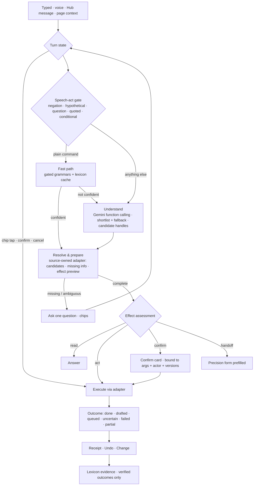

# ERA Top Layer

The accepted cross-campaign specification for ERA as the app's top layer. The [campaign checklists](<../_index.md>) own status and completion. This revision (2026-09-27, owner-commissioned) adds the **Understanding track**. Its job is to make ERA understand a sentence, pick the right feature anywhere in the app, ask only for what that feature is still missing, and learn the household's conventions.

The proactive, platform and native tracks, decisions D1–D18 and the full packet map carry forward unchanged in [§10](#10-carried-forward-constraints-d1d18) and [§11](#11-packet-map-carried-forward). The previous version is archived at [ERA Top Layer (2026-09-10)](<../_Archive/Plans/ERA Top Layer (2026-09-10).md>). The two studies behind this revision and their counter-review are archived under [ERA Understanding](<../_Archive/Studies/ERA Understanding/ERA Understanding Engine.md>).

## 1. Outcome

**ERA makes the app faster to use without replacing it.** ERA covers capture, quick edits, questions, cross-module chores and "remember this for me". The app remains the place for review, browsing and configuration: analytics, calendar grids, statement-import review, recipe editing, the outfit builder and settings.

Every request ends in exactly one of these outcomes:

| Outcome | What the person sees |
|---|---|
| **Answered** | The fact they asked for, from an authoritative read |
| **Done** | A receipt with Undo and Change |
| **Confirm** | One card, one tap |
| **Asked** | One question, as chips |
| **Handed off** | The precision form, already filled |
| **Honest limit** | A door to the right page |

A wrong action, a silent dead end, or "I didn't catch that" with no next step are defects.

**Success is measured, not asserted.** It is judged on the held-out household corpus ([§7](#7-measurement--the-era-gym)) by:

- correct final state
- questions per task
- zero wrong money effects
- latency
- the share of captures that move from forms to ERA (`capture_source`, D15)

## 2. Final challenge: rulings on the four sources

Sources ruled on:

- The capability study, "ERA Capability Understanding and Learning" (2026-09-27).
- Its challenger, "ERA Understanding Engine" (2026-09-27).
- The Understanding Engine's §15 counter-review.
- The Hub & ERA Master Book together with the 2026-09-10 plan.

All claims below were re-checked in source on 2026-09-27.

### 2.1 Capability study: upheld on safety, overruled on delivery shape

**Upheld and binding here:**

- The model proposes and the app authorizes and executes.
- Schema-valid output does not prove correct meaning.
- Application meaning, household facts and personal interpretation are three separate kinds of knowledge.
- Household identity roles (actor, owner, subject, assignee, audience, authority) are distinct.
- Corrections are first-class.
- The system learns only from verified outcomes.
- An explicit **uncertain** outcome exists.
- Evaluation runs over whole *sequences* and scores final state.
- No graph database, model training or agent per module.

**Overruled:**

- "One vertical slice, then a few frequent operations." Without reusable machinery from the start, that path is linear per-capability effort.
- Keeping the active-face early return.
- Relying on patching phrase templates (HUB-30/31/34) as the learning path.

### 2.2 Understanding Engine study: direction upheld, ten claims corrected

Upheld:

- One pipeline replacing five routing engines.
- Missing input asked as chips.
- Risk that follows effects.
- Prefilled handoff.
- A semantic household lexicon in place of phrase templates.
- The ERA Gym.
- Phased delivery with IDs.

Corrected (the author concedes each):

1. **"Gemini already understands" was never measured.** No model call was made. It is now a hypothesis, and HUB-77 tests it before the engine is built out.
2. **Probe arithmetic double-counted.** The correct partition of the 47 synthetic, router-only sentences is:
   - 22 have an ERA capability: **14 routed right, 7 missed, 1 wrong**.
   - 25 have none: **18 unknown/clarify, 7 routed to an unrelated intent**.
   - That gives 8 confident wrong routes in total. This is an upper bound on today's no-template path, not a final-state rate.
3. **`/expense` already accepts a transfer handoff.** `/expense?transfer=refill-wallet&from=…&to=…&amount=…` works through `TabContainer.tsx:63-70`. Spend prefill is still missing.
4. **Ambiguous example.** "took 300 for groceries → spend" does not hold. The cash may be for a purchase that hasn't happened yet.
5. **The census contradicted the policy.** Static tiers put committed-transaction edits in Act while the policy said money needs Confirm. Tiers are now dynamic ([§5](#5-effect-policy)).
6. **The exact-match cache replayed resolved calls.** "move it to Friday" means something different next week. The cache now stores the interpretation and re-binds it every turn.
7. **"30–60 lines per capability" ignored adapter work.** It left out effects, invalidation, Undo and verification. For example, the transfer route inserts the record and then adjusts two balances separately (`transfers/route.ts` ~302/337/342). `mark-covered` requires an existing `transaction_id`, and its Undo lives in `useRecurringPayments.ts:386-418`.
8. **Cost was model-dependent.** 3.3M input + 0.165M output tokens a month cost about **$0.40–$6.44** depending on model: 2.5 Flash-Lite at the low end, 3.5 Flash at the high end, per the Google pricing page read on 2026-09-27. This excludes thinking and retries. The figure does not decide anything; the caps and latency do.
9. **"HUB-54/55 become mostly UI" overstated the benefit.** They still need signal provenance, suppression and delivery policy.
10. **The "uncertain" outcome was missing.** A timeout after a possible commit must never invite a duplicate retry.

### 2.3 Counter-review: upheld on eight points, overruled on four

**Upheld:**

- Speech-act guards: `Don't transfer $300 from Drawer to Wallet` and `What if I transfer…?` both parse as a real transfer.
- Domain-aware missing-information rules.
- Source-owned action adapters.
- Dynamic effect assessment.
- A semantic cache that re-binds its arguments.
- HUB-64's acceptance survives template retirement.
- Candidate handles are an acceptable alternative to the "no model IDs" rule.
- The four separate reach levels.

**Overruled:**

1. **"ERA must not execute a transfer until the route is atomic."** ERA calls the same `/api/transfers` route that the transfer form uses (`src/features/transfers/hooks.ts`). ERA's bar is *equal to the form's guarantees, behind a confirm card, with an honest uncertain outcome*. BUD-24/BUD-63 make the route atomic for both callers. Blocking ERA on them would leave today's unconfirmed regex write path in place longer, which is the more dangerous state.
2. **"Pilot first, re-estimate later" had no stop rule.** Here the pilot is time-boxed at six sessions and must measure the marginal cost of one extra capability. It carries a pre-agreed branch: if a new capability family costs more than two sessions, fall back to handoff-first.
3. **The counter-review's pilot never tested its own central doubt.** It doubted the model but proposed no model measurement. HUB-77 runs the three-way routing comparison *before* the engine is built out.
4. **"Every recommendation remains unadopted research."** Three documents and roughly 1,000 lines produced zero shipped fixes, while a one-line regex bug (HUB-75) stayed open. That is the Design Doctrine's own §6 failure mode ("the machine knows more than it does"). This plan adopts, sizes and sequences the work.

### 2.4 Master Book and the 2026-09-10 plan: reactive understanding was never planned

- **The owner's core ask had no ID.** The 2026-09-10 plan's program is almost entirely proactive delivery, platform and native. Reactive understanding appears only as hardening items (HUB-46/47/64) and scattered single capabilities (HUB-22/69/70/71). Nothing covered breadth, clarification or handoff.
- **Gate G0 passed silently.** Its target date was 2026-09-14. HUB-62/37/38 are still open in Now, and no miss is recorded in the book. Calendar gates were counting documents, not evidence. This revision replaces calendar promises with **evidence gates and session budgets** ([§8](#8-sequencing-gates-and-capacity)).
- **An unnumbered 🔴 finding sat in the Pain Inventory** (transfer negation). It is now **HUB-76**.
- **The book's rule was not enforced for native writes.** The book says proposals need confirmation before money or schedule mutation, yet the native regex path writes transfers, debts and reminder deletes directly, with no confirm and no inline Undo. HUB-76 closes the money part.

### 2.5 Blind spots shared by all four sources

- **Nobody measured the model or real usage.** The household's actual phrase distribution should decide Phase 2 order, not a census. HUB-77 requires the owner export.
- **Nobody tested mixed-language Lebanese input** (Arabic/Franco words, `500k`, `300$`). That is where regex can never keep up and the model path should help most. It is a mandatory Gym slice.
- **Nobody budgeted voice end-to-end latency** (speech-to-text + model + text-to-speech). Voice turns depend on the fast path most, so voice p50 gets its own gate.

## 3. Evidence and constraints

| Fact (verified 2026-09-27) | Consequence |
|---|---|
| Five places decide what a sentence means:<br>• ERA face routers<br>• the voice `intentClassifier`<br>• Hub `messageTransactionParser`<br>• `/api/era/ask`<br>• legacy `/api/ai-chat`<br>`era_templates` is a sixth routing layer on top. | They disagree today. Voice can add to the shopping list, typed ERA can't. Hub reads `12$`, ERA doesn't. Phase 5 unifies them. |
| 13 AI capabilities and 20 native intents across 4 faces, against ~45 API route groups and ~250 mutation handlers | Reach is the gap, not language. Handler counts are not user-operation counts; the operation census is in HUB-79/81. |
| AI is consulted only after regex misses. Auto-escalation is capped at 15 per user per day, with a 1M-token monthly cap per user (`rateLimit.ts`) and 5 per user / 10 global requests per minute. | Confident wrong routes never reach the model. Caps must change after HUB-44 attribution. |
| Native transfer, debt, reminder create/complete/delete write immediately. The AI path requires a confirm card. | Risk currently follows the interpreter, not the effect. HUB-76 fixes the money part. |
| `MARKED_AMOUNT_RE` rejects `12$`, and neither parser reads `500k` | HUB-75 |
| The transfer grammar has no speech-act guard (negation, hypothetical) | HUB-76 |
| Transfer route: insert, then two separate `adjustAccountBalance` calls. The transfer form uses the same route. | ERA inherits the form's guarantees and adds a confirm card plus the uncertain state. BUD-24/63 own atomicity. |
| `mark-covered` needs an existing `transaction_id`, and its Undo lives in the client hook | "Mark rent as paid" needs a source-owned adapter that separates *link existing* from *create then link* |
| `/expense` reads transfer shortcut params. `/reminders` reads `date`/`plan`/`tab`. | Handoff builds on existing params. Spend prefill is new. |

**Unknown until measured:**

- Gemini's accuracy on household phrasing.
- Model-path latency.
- What `gemini-flash-latest` resolves to.
- Real phrase frequency.
- Voice end-to-end latency.

None of these may be stated as fact before HUB-77/HUB-44 evidence exists.

## 4. Architecture — one pipeline



| # | Component | Contract |
|---|---|---|
| 1 | **Turn state** | Classifies each input against open state as answer, correction, cancel, confirm or new request. A new request *suspends* an open proposal and never consumes it. Chip taps are structured and never re-parsed. It replaces the reminder-only `pendingTurn`. |
| 2 | **Speech-act gate** | Negation, hypothetical, question form, conditional, quoted and reported speech ("Rita said…") are never eligible for a fast-path write. They go to the model path, which may answer, clarify or propose. |
| 3 | **Fast path** | Only grammars that pass the Gym's admission set: speech-act cases, corrections, conflicting context. A weak regex guess (`clarify`, `switchFace`) becomes a *hint* to the model, never a final decision. |
| 4 | **Understand** | One Gemini call using function calling. The shortlist comes from face, keywords, recent capabilities and page context, plus always-on meta tools (`answer`, `clarify`, `navigate`, `undo`, `correct`). If the shortlist misses, one fallback call is made with the full catalog. Small domains (accounts, people, categories) go in as **candidate handles** such as `a1`, `a2` that the server maps to real IDs. The model never invents an ID. |
| 5 | **Intermediate representation** | Capability plus typed *expressions*, never computed values. Each expression carries its source span, provenance (spoken, selected, default, context), clock and timezone. Deterministic code evaluates the supported expressions: shared money extractor, `smartTextParser` for dates and recurrence, LBP-in-thousands. Anything unsupported ("half what's left") becomes a question. |
| 6 | **Source-owned adapters** | Each module owns `prepare` (candidate filters, required fields given other args, effect preview, recurrence scope) plus `execute`, `verify`, `invalidate` and `inverse`. They are extracted from the existing hooks and routes and never re-implemented. Examples: `features/transfers/hooks.ts`, `useRecurringPayments`, `useEraBudgetSubmit`, the items routes. |
| 7 | **Effect assessment** | A minimum tier per capability, raised (never lowered) by the escalators in [§5](#5-effect-policy). Confirmation is bound to the args hash, the actor and the relevant record versions, and is revalidated on tap. |
| 8 | **Outcome** | Exactly one of: `answered`, `done`, `drafted`, `needs_input`, `awaiting_confirm`, `queued`, `uncertain`, `failed`, `partial`, `handed_off`. It carries entity IDs and an inverse where one exists. Learning, activity and briefings read only this outcome. |
| 9 | **Handoff** | Each proposal is persisted as an `era_messages` row, which is owner-bound under the existing store (D4). The form opens `?era=<messageId>`, loads that row, revalidates its references, respects expiry and consumption, and never overwrites unsaved edits. No sensitive free text goes in a URL. |
| 10 | **Household lexicon** | Aliases, conditional defaults and corrected examples, personal by default. The cache stores *interpretations* and re-binds actor, focus, clock, permissions and defaults every turn. A correction is an *example*, not permission for a default. |

**Page context** raises the ranking of capabilities for the current page (for example, packing on a trip page). It never decides the intent on its own.

## 5. Effect policy

| Effect class | Minimum | Escalate to Confirm when |
|---|---|---|
| Read | Answer | — (partial or unavailable reads say so) |
| Spend or income capture **as a draft** | Act + Undo | amount or account came from a default or low-confidence binding · currency inferred · partner-owned account |
| Shopping, packing, pantry note, memory save | Act + Undo | the target list or record belongs to the partner alone |
| One-time own reminder or event: create, reschedule, complete | Act + Undo when from a **gated fast-path grammar**; **Confirm when model-interpreted** (Doctrine Q10) until DEC-24 | recurring series scope · assignee is the partner · a notification for it already went out |
| Money movement: transfer, exchange, split, debt settle, recurring covered, amount/account edit on a committed transaction, delete | **Confirm always** | — |
| Dose log | Confirm | until HLTH-19 defines dose-schedule effects |
| Outward (message the partner), lifecycle (trip activate/complete) | Confirm / Handoff | — |
| Many-field or review-centred work | Handoff | — |

- No inverse means Confirm, and the receipt shows no Undo. The Undo control only appears where an inverse is demonstrated.
- The Design Doctrine is unchanged. The only planned relaxation, model-interpreted one-time reminders as Act + Undo, is **DEC-24**, which is the owner's explicit choice.

**UI rule (Hard Rule #28): minimum words.** Chips are 1–2 words and receipts are one line. Nothing explains itself on screen.

```
I took 300$ from Drawer      → Transfer · $300 · Drawer → [Wallet] [Savings] [Other]
⟨Wallet⟩                     → Drawer → Wallet · $300   [Confirm] [Change]   ☐ Always
spent 12$ on coffee          → Draft · $12 · Coffee · Wallet   [Undo] [Change]
move the dentist to Friday   → Dentist · Fri 4:00pm   [Undo] [Change]
Don't transfer 300 to Wallet → (no action)
we're going to Paris Oct 10–15 → Paris · Oct 10–15   [Open trip]
what should I wear           → Outfits   [Open]
```

## 6. Non-goals

- A wake word or geofencing (D2 and owner exclusions).
- Model training, fine-tuning, a vector or graph database, or an agent per module.
- A new offline queue (D11) or a new assistant store beyond `era_*` (D4).
- Any direct model write to money or schedule without the tier above.
- Any new recurrence engine; skip, pause and complete use Schedule's occurrence contracts.
- Any redesign of the ERA layout or navigation. New chips, cards and handoffs are additive (layout freeze).
- Replacing precision tools. ERA never becomes the only way to do something.

## 7. Measurement — the ERA Gym

**Fixtures** live in `tests/era-gym/*.jsonl`, one sequence per case. Each case records:

- utterance(s), active face, page, open turn state, focus
- lexicon rules, clock and timezone, actor
- expected **final state** and expected tier

**Seed:** the 47 synthetic sentences plus the owner's export (HUB-77). The export must include each assistant reply and its action outcome, not only user text, so that sequences can be rebuilt. Mandatory slices:

- `300$`, `500k`, mixed Arabic/Franco
- negation, hypothetical and question forms; quoted and reported speech
- corrections in mid-proposal, topic switches, repeated confirmations
- response loss (uncertain), both partners, partner-owned targets
- unknown entities, unavailable reads
- voice misrecognitions

**Three-way routing comparison (HUB-77)** on the same held-out set:

- **A:** today's path (router, templates, then Ask AI on misses)
- **B:** gated fast path alone
- **C:** gated fast path plus model

Development runs call the model live once, record the responses, and replay them in CI.

**Decision rule** (recorded in the book before HUB-78 extends past the pilot):

- **Adopt C** if it beats A on final-state correctness by **≥ 20 points**, produces **zero wrong money effects**, and has **model-path p50 ≤ 2.5 s**.
- **Otherwise** keep "model on miss or conflict only" and put Phase 2 effort into adapters and handoff instead.

**Reach is reported per module at four levels:**

| Level | Meaning |
|---|---|
| **Navigation** | ERA opens the right page |
| **Useful prefill** | The form opens with the resolved fields |
| **Inline completion** | ERA finishes the request itself |
| **Verified final state** | The resulting records are correct |

Opening Outfits counts as navigation, not as an answer.

**Release gates:**

- Zero wrong-account, unauthorized or duplicate money effects.
- Zero partner-default misuse.
- Zero repeated questions after "Always".
- Voice p50 measured separately.

## 8. Sequencing, gates and capacity

Capacity is about 2 bounded sessions a week (D7). **Evidence gates U0–U5** replace calendar promises, and each phase has a session budget with a stop rule. Target windows are indicative only, and a missed window gets recorded in the book, not stretched silently.

| Phase | IDs | Budget | Delivers | Exit gate |
|---|---|---:|---|---|
| **U0 · Stop the bleeding + measure** | HUB-75, HUB-76, HUB-77 | 3 | Shared amount extractor (`12$`, `500k`). Speech-act gate. Native transfer (and every native money write) moves to a confirm card with Undo. Gym v0, owner export and the three-way routing comparison. | Probe sentences pass. No interpreter moves money without a tap. Decision rule recorded. |
| **U1 · Engine pilot** | HUB-78 | 5 (stop at 6) | Components 1–9 built through three unlike flows:<br>• Drawer → Wallet (clarify destination, confirm, uncertain state)<br>• reminder correction by name ("move the dentist to Friday", "make it 5 instead")<br>• spend prefill handoff, plus reuse of the transfer shortcut<br>Then add **shopping-add** afterwards and record its hours. | Pilot Gym sequences pass. The marginal-capability hours are recorded, and Phases 2–5 are re-estimated from them in the book. **If a new capability family costs more than 2 sessions, Phase 2 switches to handoff-first.** |
| **U2 · Core coverage** | HUB-79 | 4–6, re-estimated at U1 | The highest-frequency Budget, Schedule and Kitchen families. Order comes from the owner export, not the census. The production cap change needs HUB-44 first. | Every Budget/Schedule/Kitchen family reaches at least useful prefill, and the top 10 by frequency complete inline. Held-out correctness at least 75% (only if the U0 rule adopted route C). |
| **U3 · Household lexicon** | HUB-80 | 3 | `era_lexicon` (owner-run migration with RLS), aliases, conditional defaults, examples, re-binding cache, Always/Forget and the revocation list. Templates are frozen, then converted only where their meaning can be recovered. | Sequence cases pass: first try → correction → Always → paraphrase → override → forget. The HUB-64 criteria still pass. |
| **U4 · Estate reach** | HUB-81 | 3–5 | Reads plus handoff for every remaining Feature Index module, and inline completion where an adapter exists. Two named workflows: meal + shopping, and trip departure preparation. Page-context ranking. | Every module reaches at least navigation, and at least useful prefill where a form exists. Held-out correctness at least 90%. |
| **U5 · One brain** | HUB-82 (+HUB-16, HUB-48) | 2–3 | Voice and Hub message conversion both route through the engine. The floating `/api/ai-chat` retires after HUB-48 parity, and `vocab.ts`/`missTracking.ts` give way to outcome telemetry. | Grep-verified single interpretation path. |

Total: **20–26 sessions**. The U1 checkpoint re-prices everything after it. Indicative windows are U0 by 2026-10-04, U1 by 2026-10-25, and U2–U5 set at the U1 checkpoint.

**Order against the other tracks:**

- **Now:** HUB-75 and HUB-76 alongside the existing HUB-62/37/38. CI (HUB-37) also gates the Gym.
- **Next:**
  1. HUB-77, then HUB-78.
  2. Engine dependencies: HUB-44 (usage attribution and caps), HUB-46 (durable capture plus pending utterances), HUB-47 (learning from verified outcomes), HUB-64 (target safety).
  3. Then the briefing chain HUB-39 → HUB-43, which is orthogonal and resumes after U1.
- **After U2:**
  - HUB-54/55 reuse the adapters, but still carry their own signal-provenance and policy work.
  - HUB-22, HUB-6, HUB-69 and HUB-70 are delivered *as* U2/U4 families. Their acceptance stays with their IDs.
- **Native (NAT-*)** is unchanged and owner-driven (D8).

**Sacrifice order** if capacity slips:

1. Proactive track: E-18 picker, M-08 Outfits, M-07 medications, E-23 ranker, N-05 native wave 1 (as stated in the 2026-09-10 version).
2. Understanding track: U4 workflows before U4 reads, and U5 retirement before U3 lexicon.

DEC-22 remains open only for the conflicting native-slide wording.

## 9. Decisions

**Resolved by this revision (owner-commissioned 2026-09-27):**

| # | Decision |
|---|---|
| U-1 | One pipeline, with the speech-act gate before a narrow fast path and the model for everything else, **conditional on the U0 decision rule** |
| U-2 | Effect policy as in §5: minimum tier plus escalators. Money movement always confirms. |
| U-3 | Source-owned adapters: ERA reuses module contracts and never re-implements them |
| U-4 | Semantic lexicon replaces phrase-template learning in stages. HUB-64's criteria survive. |
| U-5 | Handoff persists in `era_messages` with an owner-bound lifecycle and no sensitive URL text |
| U-6 | Offline utterances that need the model are kept as pending input through HUB-46's boundary. On reconnect they are interpreted, with their original time context, into *proposals* and never auto-executed. |
| U-7 | Evidence gates and session budgets replace calendar gates for the Understanding track |

**Still the owner's:**

- **DEC-24:** Let model-interpreted, one-time, own reminder/event creation and reschedule run as Act + Undo instead of Confirm. This amends Doctrine Q10 for that one class; the default until answered is Confirm.
- **Production AI caps:** move from count caps to a cost ceiling plus rate and concurrency bounds. This is decided inside HUB-44 once attribution is truthful. Until then the current caps stay, and the Gym runs at development time.

## 10. Carried-forward constraints (D1–D18)

Unchanged from the 2026-09-10 version and still binding.

| Original decision | Current contract |
|---|---|
| D1 — Scheduler | Owner configures the selected Supabase pg_cron/pg_net scheduler to call the web deployment with the cron secret. Agents author reviewed runbooks only. |
| D2 — Wake word | Leave the wake topic untouched; old spike/park deadlines are superseded. |
| D3 — Composer | Deterministic templates over typed signals. Optional model phrasing waits for truthful E-07 attribution and its explicit allowance. |
| D4 — Stores | `era_*` is the assistant store; `ai_sessions/ai_messages` retain telemetry and analysis-report history. No fourth store. |
| D5/D6 — Recipients | Quiet 21:00–08:00 Beirut, three pushes/day/person, urgent/info/digest classes, overflow to digest. Partner becomes eligible after five owner mornings, with her own hour/toggle. DEC-01 must settle the 07:15 conflict and policy sequencing before activation. |
| D7 — Capacity | Approximately two bounded sessions/week, 2–4 hours per dispatched sheet. Large parents split without inventing extra calendar slots. |
| D8 — Native | Owner account groundwork from September 15; Android first, then iOS/push/store acceptance. Native reliability is measured on both phones; no automatic offline/login guarantee. |
| D9 — Focus insights | Retire the unused competing engine through reviewed code/SQL when the replacement briefing is ready; never infer deployment from a repo file. |
| D10/D16 — Hub voice | HubPage extraction rides HUB-16/E-13; retain greeting variants while retiring the legacy classifier after the shared adapter works. |
| D11 — Offline | Use existing domain queue types through one durable boundary. Draft creation and confirmation have different replay permissions. No new ERA queue or optimistic false acknowledgment. |
| D12 — Applied evidence | Owner-stamped SQL application and device acceptance stay distinct from implementation history. Outstanding witnesses have canonical open IDs. |
| D13 — Models | Retain existing alias strategy with environment pin/kill switches; current provider/model/usage evidence must precede a quota claim. |
| D14 — Household members | Owner resolves retain/drop from current schema and lifecycle evidence; part of E-00/HUB-62. No guessed migration. |
| D15 — Capture source | Preserve capture-source measurement across all writers; a queued flag is not proof of durable persistence or eventual success. |
| D17 — Memories | Fold the unused stub unless required by the accepted signals design; HUB-40 records the outcome. Do not create a new memory engine. |
| D18 — Dormant types | Produce `budget_exceeded`, `bill_due`, `bill_overdue` through accepted signal work, or explicitly retire them. |

Person colors follow stable person identity; DEC-02 resolves frost/calm ambiguity. Existing `/era` layout stays additive. Opaque floating panels and minimum UI wording still apply. No new standalone modules in this program, two-way calendar sync, open banking, direct AI writes, new recurrence engine or independent offline queue.

## 11. Packet map (carried forward)

Unchanged ownership from the 2026-09-10 version. Read a task's Master Book acceptance before its historical packet. The historical calendar gates G0–G4 (G0 2026-09-14 → G4 2026-12-31) remain baselines for the proactive/native track only. Record an observed pass or miss with evidence in the owning book. G0's target date has passed with HUB-62/37/38 still open.

| Packet | Canonical owner | Remaining outcome / prerequisite |
|---|---|---|
| E-00 | HUB-62; domain witnesses BUD-32/39/36/67, TRIP-18, HLTH-7, OUT-19, DLV-77 | Current owner DB/application evidence first; apply only reviewed missing SQL. |
| E-01 / E-01a | HUB-37 | CI includes typecheck/test/lint and rejected capture preserves input. HUB-21 separately proves served revision/device flows. |
| E-02 / E-02a | HUB-38 | Authenticated six-job ledger/wrappers and cadence-aware health; NOTIF-5.4 log-policy decision stays held. |
| E-03 / E-03a | HUB-39 | Poll and select eligible IANA local date/time; DST/retry fixtures, owner scheduler evidence. |
| M-00 / M-00a | HUB-40 | Assistant treaty and source-proven dead-code removal. |
| M-01 | BUD-32 | Verify implemented deleted-hash recognition/restore. |
| E-04 / E-04a | HUB-41 | Complete/partial/unavailable signals with provenance; depends on BUD-66 and SCH-8. |
| E-05 / E-05a/b | HUB-42 | Deterministic stored briefing, atomic per-recipient/local-date claim; activation held on DEC-01. |
| E-06 | HUB-43 | Feedback and vital signs distinguish delivery, attention and accepted action. |
| E-07 / E-07a | HUB-44 | Provider/model/feature attribution before quota gauge, degradation matrix and pinning; also decides the Understanding track's production caps (§9). |
| E-08 / E-08a | HUB-45 | Scoped balance and meal reads plus bounded Chef/Brain context. |
| E-09 / E-09a–f | HUB-46 | Durable enqueue; idempotent draft/item endpoints; income/event capture; pending model-path utterances (U-6). |
| E-11 / E-11a/b | HUB-47 | Only verified outcomes teach or appear successful; consumes HUB-78's outcome contract. HUB-64 protects target meaning. |
| M-02 | TRIP-1/2/3, then TRIP-4 | Lifecycle and recurring-payment invariants, then transparent impact. DEC-04. |
| M-03 | KIT-1 | One atomic low-stock shopping identity; DEC-03 gates automatic additions. |
| E-10 / E-10a/b | HUB-48 | Stored-briefing card/status; retire floating assistant only after report/history parity. |
| E-13 / E-13a/b | HUB-16 | Shared voice adapter (U5), host-policy proof, then legacy retirement. |
| E-14 | HUB-49 | One household-scoped top-view bundle. |
| E-15 | HUB-50 | Mobile vitals render while conversation sleeps. |
| E-16 | HUB-51 | Stable person colors, partner's flow/hour/toggle. |
| E-17 | HUB-2 | One speech seam with deterministic fallbacks. |
| M-04 | HUB-60 | Household export and owner-run isolated restore proof. |
| M-05 | KIT-2 | Reversible stock deduction with explicit mapping (DEC-17). |
| Phase 2 estate/security | HUB-66; HUB-61/SCH-10/R43 | Keep/maintain/park census; current scoped security evidence. |
| E-18 | HUB-52 | Session picker, reopen/archive, deterministic titles. |
| E-19 | NOTIF-19 | Shared quiet hours, per-type mute, per-recipient budget, digest overflow. |
| E-20 | HUB-54 | Signal cards → confirmed actions via Understanding adapters; real doors. |
| E-21 | HUB-55 | Anomaly → exactly one policy-gated proposal with provenance. |
| E-22 | HUB-56 | Kitchen/Trips/Healthcare contributions after producer contracts. |
| M-06 | NOTIF-2.1/3.1/3.2/5.6 | Bell device acceptance, compact drawer, controls and real Undo. |
| M-07a/b | HLTH-8/9/10/11/12 | HLTH-19 precedes dose math; schema/routes and UI/device separate. |
| E-23 | HUB-23 | Deterministic feedback ranking. |
| M-08 | OUT-7/8 | Auto-tag only after OUT-19 acceptance. |
| N-00 – N-05 | NAT-1 – NAT-6 | Accounts; Android shell; iPhone qualification; native push; store distribution; links/NFC/haptics only. |
| M-09a/b | SCH-6.1 | Task-type retirement across schema/types/surfaces/docs. |
| H-01 | HUB-61, SCH-10 | Guest-drinks and item-prerequisites access contracts. |
| H-02 | R44/R47; R48 | Client request/logging ratchets. |
| H-03 | HUB-59 | Message-to-transaction date defaults to source message time. |
| Understanding U0–U5 | HUB-75 – HUB-82 | §8 of this plan. |

## 12. Retirement

Archive this plan when U5 and the proactive G4 outcomes are recorded, or when the owner replaces it. Before archiving:

1. Map any open packet or U-phase to its canonical ID.
2. Keep the U-decisions in the Hub & ERA Master Book.

Routine progress updates the books and checklists, never this file.
