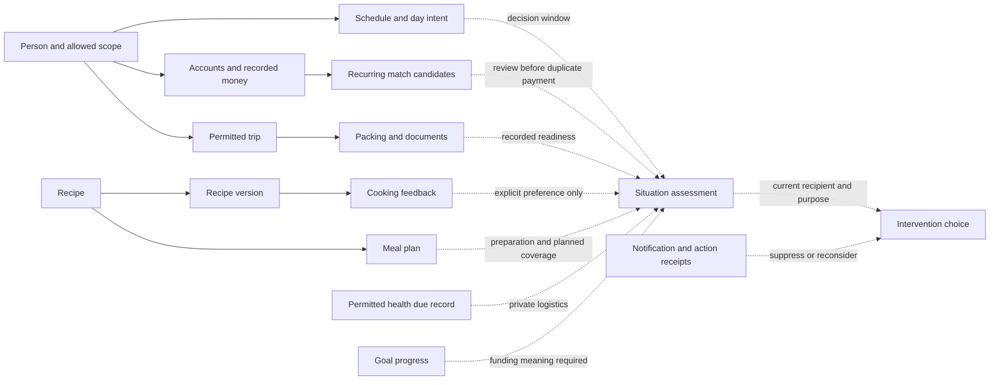

# Proactive ERA — Signal & Knowledge Graph

ERA has a useful graph of **recorded plans, assertions and application actions**. It has a much thinner graph of verified physical state. The distinction determines which cross-module conclusions are legitimate.

Read with the [Intelligence Model](<Proactive ERA — Intelligence Model.md>) and [Architectural Leverage](<Proactive ERA — Architectural Leverage.md>). Research at `83e44be`, 2026-09-06; no source delta from prior ASTRA `3106164`. The [Master Plan](<../ERA Top Layer — Master Plan (2026-09-02).md>) remains the execution contract. Table/column references establish repository structure only; live population, RLS/functions and deployment are unverified.

## Evidence inventory

**E** = exists in source/schema; **D** = derivable under qualifications; **M** = missing or structurally insufficient. An E row is not a claim that current household data is populated.

| Domain | E: recorded knowledge and source anchor | D: usable derivation | M: limit that matters |
|---|---|---|---|
| Accounts and balances | Account type, currency, visibility and FX (`schema.sql:4–24`); balance/checkpoint fields (`:158–165`) | Account-specific amounts, last explicit reconciliation age | Fetch time is not balance observation time. Current balance writes remain non-atomic (`balance.ts:47–92`). Balance endpoint already subtracts drafts; do not subtract the same draft twice. |
| Transactions and imports | Event/capture dates, draft/private/debt-return/parent/import identities (`schema.sql:48–75`); frozen conversion helper `balance-utils.ts:67–74` | Canonical spending, comparison periods, capture lag, recorded patterns | Cash spending outside the app is unseen. Transfers, returns, drafts and currencies must retain meaning. Import records are capture evidence, not independent proof of all spending. |
| Recurring payments | Account/amount/recurrence/manual mode (`schema.sql:182–199`); status/match reasons in `commitments.ts:3–52,162–342` | Covered, uncovered, candidate match and review window | No persisted selected-transaction-to-covered-period relation in `mark-covered/route.ts:97–103`; independent matches can compete for one transaction. |
| Future purchases | Target, saved progress, target date, urgency, allocation JSON (`schema.sql:299–318`) | Target shortfall; competing optional claims after funding identified | No explicit currency/funding-account/reservation relation in this schema. Allocate route records progress, not a transfer. |
| Debts | Original/returned amounts, creditor owner, debtor text, status, optional transaction (`schema.sql:1157–1172`) | Outstanding receivable and recorded age | No contractual due date; age is not overdue. Archived is not repaid. GET currently archives old open debts (`debts/route.ts:21–34`). |
| Schedule and chores | Person/responsibility, privacy, item/catalogue identity; event start/end; task estimates/actuals (`schema.sql:521–568`) | Recorded overlap by person; conditional task fit | Full agenda requires occurrence exceptions/pauses/placements. No universal work hours or travel duration; chores use Schedule, not Kitchen ownership. |
| Occurrence actions and flexible routines | Complete/skip/postpone/cancel with original occurrence, actor/reason; placement/index (`schema.sql:678–690,1304–1315`) | Remaining routine quota, repeated rescheduling, moved occurrence identity | Completion time, recorded time and accounted-for occurrence differ. Sparse histories do not measure general motivation or capacity. |
| Plan My Day / Focus | Explicit rest/balanced/productive intent, scope, notes/checklist (`day-plan/types.ts:1–25`) | Rank feasible alternatives in line with today's expressed intention | A rest day is neither zero availability nor consent to cancel obligations. Historical patterns must not override it. |
| Recipes | Ingredient/step JSON, nominal time, servings, active version (`schema.sql:1089–1122,1174–1197`); step dependencies/parallel hints (`types/recipe.ts:18–25`) | Candidate preparation sequence, finite recipe options | Names/free-text units do not identify pantry stock. Step hints are not yet a verified duration/dependency graph. |
| Cooking history | Version, substitutions, taste, rating, would-make-again, nominally actual times (`schema.sql:1199–1218`) | Retrieve explicit feedback; demote a recipe after explicit negative preference | Times/difficulty prefill defaults (`RecipeCookingMode.tsx:524–551`). They are not independent measurements. Saved servings do not prove leftovers remain. |
| Meal plans | Date/slot/status/person/servings/leftover interval and backlinks (`schema.sql:1124–1146`) | Planned coverage per person and meal slot; overlap with expected absence | Origin-date-only queries miss carried-in leftovers. Planned coverage is neither eating nor edible availability. Date does not give a mealtime. |
| Inventory | Counts, unit hints, runout estimate, restock history (`schema.sql:1030–1061`; `types/inventory.ts:19–23`) | Recorded likely shortage or need for a physical check | Low-stock and item projections use different criteria; owner scope is not complete household stock. No lot expiry, consumption or continuous observation. |
| Shopping / Catalogue | Existing shopping messages/groups/backlinks; inventory/catalogue references on packing | Recognize already-recorded shopping intent; reuse known item identity where present | Adding a shopping message and backlink is separate writes (`inventory/add-to-shopping/route.ts:60–95`). Fuzzy ingredient names cannot support automatic subtraction or duplicate-free additions. |
| Trips | Dates/phase; place schedule, booked flag, cost/currency; packing quantity/assignee; document expiry (`schema.sql:1534–1596,1804–1815`) | Recorded preparation gaps, expiry-before-return, likely absence interval | Booked=false does not mean reservation required. No document-person identity or entry-rule model. Trip dates are not actual presence/location. |
| Healthcare | Profiles/dependents; allergies/conditions/visits; vaccine `next_due_on` and provider link (`schema.sql:1654–1718`) | Logistics around an explicitly recorded due date; purpose-limited allergy matches | No shipped medication/dose history found. Missing/failed allergy feed is not a safety clearance. Private health scope differs from the household allergen feed. |
| Outfits | Personal garments, tags, fit/season/formality, compositions (`schema.sql:1730–1778`) | Candidate garments for a recorded occasion | No implemented wear/planner history path found; no clean/laundry/location observation. Personal wardrobe does not become shared trip context automatically. |
| Brain / explicit memory | Household label/value/tags + author/timestamps; label `ilike` retrieval (`memories/route.ts:15–52`) | Retrieve an explicit detail relevant to a plan | Source references `household_memories`, absent from inspected schema/migration SQL search; installation unverified. No typed validity, private scope, or constraint semantics. |
| ERA language/focus/activity | Capabilities; learned templates; 30-minute reminder focus; message payloads and action records | Identify supported actions and referents; evaluate capture failures | Template counts are language telemetry; Activity is incomplete. Neither measures benefit from unsolicited help. |
| Household and preferences | Active pair linking, owner/responsible/subject fields; billing/FX preferences | Correct recipient projections and domain interpretation | `household_id` is not uniform access. Dependents can have no login; private health, solo trips and personal wardrobe have distinct rules. |
| Notifications and sync | Notification receipt fields (`schema.sql:707–762`), push logs, occurrence suppressions, offline queue | Recent presentation/snooze; transport attempts; committed resolution | Read may mean returned by GET. Pending offline completion is invisible to server. Configured cron/quiet fields do not prove execution. |

Primary navigation: [schema](../../../migrations/schema.sql), [Feature Map](<../../01 - Architecture/Feature Map/_index.md>), [Budget ASTRA](<../Budget/ASTRA/Budget — ASTRA Book.md>), [Schedule ASTRA](<../Schedule/ASTRA/Schedule — ASTRA Book.md>), [Kitchen ASTRA](<../Kitchen/ASTRA/Kitchen — ASTRA Book.md>), [Trips ASTRA](<../Trips/ASTRA/Trips — ASTRA Book.md>), [Healthcare ASTRA](<../Healthcare/ASTRA/Healthcare — ASTRA Book.md>), [Outfits ASTRA](<../Outfits/ASTRA/Outfits — ASTRA Book.md>), [Notifications ASTRA](<../Notifications & Alerts/ASTRA/Notifications & Alerts — ASTRA Book.md>).

## Important graph, with epistemic boundaries

Solid edges below are recorded links or implemented inputs (E). Dotted edges are proposed qualified derivations (D/P). The assessment node and dotted joins are not shipped services. Each broad node abbreviates the source rows above.

Do not implement this diagram as a graph database. A few typed relational projections and explicit joins are enough to test it. The important graph is the **dependency of a conclusion on its evidence**, including what would retract it.

## Edges that exist, nearly exist, or must not be inferred

| Relationship | Status / exact evidence | Implication |
|---|---|---|
| Recipe version → cooking feedback; recipe → meal plan | E: `cooking-log/route.ts:79–92`; `schema.sql:1128,1145` links meals to recipe ID, not recipe version | Retrieve feedback for the version/recipe and cook that supplied it. Prepared meal advice must also invalidate on recipe content/active-version change even if the meal row did not change. |
| Cooking negative preference → quiet recommendation demotion | D: `would_make_again` starts null and is set explicitly, `RecipeCookingMode.tsx:536,1657–1675`; display in `RecipeDetailView.tsx:427–428` | A useful low-cost rule with stronger provenance than inferred taste from recipe counts. Not a shipped ranker. |
| Recipe step → prerequisite/parallel step | E representation: `types/recipe.ts:18–25`; D valid preparation schedule | Validate references, cycles and active/passive duration before computing latest start. |
| Payment → candidate transaction | E heuristic: `commitments.ts:280–342` | Candidate score is evidence for a review, not proof of settlement; check exclusive attribution and units. |
| Trip → packing item → inventory/catalogue | E optional IDs: `schema.sql:1581–1596` | Reuse genuine IDs; an absent link needs explicit mapping, not a fuzzy stock write. |
| Healthcare profile → minimal household allergen feed | E: `healthcare/allergens/route.ts:20–26` | Purpose-limited projections are a better precedent than copying full profiles into every context bundle. |
| Shared trip → private wardrobe / private medical reason | Prohibited absent explicit allowed projection | A harmless-sounding suggestion can still disclose a private cause. Filter before deriving. |
| Saved-goal allocation → bank reservation | M: allocation route changes progress only | Never subtract it again or count it as separate money without funding semantics. |
| Pantry runout estimate → food no longer present | Unsupported | Last physical count and model assumptions matter; no automatic consumption from time passage. |
| NFC state → person is physically home | Unsupported as an unconditional fact | State log proves a recorded transition by an actor (`schema.sql:1359–1369`), not continued presence or location sensing. |
| Notification dismissal → task resolved | Unsupported | Use the authorized domain outcome/occurrence, not UI flags or a toast. |

Source links: [recipe feedback](../../../src/components/web/RecipeCookingMode.tsx), [cooking-log route](../../../src/app/api/recipes/[id]/cooking-log/route.ts), [recipe detail](../../../src/components/web/RecipeDetailView.tsx), [recipe types](../../../src/types/recipe.ts), [commitments](../../../src/features/recurring/commitments.ts), [allergen feed](../../../src/app/api/healthcare/allergens/route.ts), [goal allocation](../../../src/app/api/future-purchases/[id]/allocate/route.ts).

## High-value multi-domain joins

**Departure preparation:** permitted trip dates + planned meals by person + known Schedule windows + existing shopping intent + packing assignments. One decision about cooking before departure can alter food preparation and shopping together. Date-only inputs support a day-level review; an exact latest shopping/prep time requires explicit clock/duration information. This does not require triggering Trips' unverified activation cascades.

**Evening preparation:** recorded event + accepted mealtime + recipe step durations/dependencies + explicit prior substitutions/preference. A prepared alternative can preserve the evening's options. An unavailable allergy feed blocks any allergy-dependent suitability claim; it does not erase the existence of a time conflict.

**Competing optional commitments:** canonical account/currency + distinct unpaid commitments + several optional purchase plans + target dates. Joint feasibility can differ from every option's separate score. Goals need a shared funding interpretation; their `current_saved` values are not enough. See the synthetic accounting witness in Architectural Leverage.

**Private pre-trip logistics:** an owner-visible trip + a recorded health next-due date/provider + permitted schedule windows. Retrieve a due record or prepare an appointment question privately. Do not infer a clinical recommendation, medication supply, destination requirement or household disclosure.

## Repeated calculations and lost context

1. **Money:** `ai/context.ts:24–129` uses calendar periods and reduced transaction fields, while the ERA Budget resolver and recurring commitment helper use other period/semantic paths. Future-purchase analysis (`analysis/route.ts:57–81`) sums raw amounts without FX or draft/deleted/debt-return filtering; `:225–254` gives zero variance maximum stability and initializes confidence at 100. That heuristic score is unsuitable for proactive affordability, not merely a differently formatted total. E-04 must consume one canonical owner projection rather than average conflicting totals.
2. **Schedule:** AI context caps parent records at 50 and takes 20 upcoming entries (`context.ts:454–497`); the ERA resolver supplies empty flexible placements; WebTodayView expands occurrences itself. An AI prompt is not the canonical agenda.
3. **Meals:** Chef gaps use day membership (`intents/resolvers/chef.ts:192–200`), while the planner has person/status/leftover semantics and a bounded lookback (`meal-planning/hooks.ts:21–33`). Unify planned coverage before saying a meal is missing.
4. **Attention:** item suppressions, chat receipts, notification read/dismissal and delivery attempts each answer different questions. Preserve those meanings at one intervention boundary instead of using any one boolean as “handled.”

Sources: [AI context](../../../src/lib/ai/context.ts), [Budget resolver](../../../src/features/era/intents/resolvers/budget.ts), [Schedule resolver](../../../src/features/era/intents/resolvers/schedule.ts), [WebTodayView](../../../src/components/web/WebTodayView.tsx), [Chef resolver](../../../src/features/era/intents/resolvers/chef.ts), [meal hooks](../../../src/features/meal-planning/hooks.ts), [future analysis](../../../src/app/api/future-purchases/[id]/analysis/route.ts).

## Coverage beyond the named domains

Categories and statement merchant mappings contribute entity identity and accounting semantics, not a new proactive domain. Drafts distinguish intended captures from committed effects. Analytics and Dashboard are consumers of the same facts. Guest Portal content retains its isolated audience. NFC/Prerequisites supplies explicit trigger intent; weather/time/schedule/formula evaluators include stubs, so configuration is not a working general automation engine. Recycle Bin/deletion matters because it invalidates evidence and must not resurrect an old proposal. Watch/native provides a surface and delivery capability, not new household understanding.

Error Logs, AI Usage and job health are service-health evidence. Their absence or failure should degrade confidence/capability internally and support diagnostics; they should not routinely compete with household needs in the briefing. Delivery/PM Tooling's ASTRA findings inform proof and recovery practices, not household context. They remain outside the proposed intelligence graph, with their existing freeze intact.

This is deep coverage of the decision-relevant contracts, not an exhaustive review of every route, integration or user record. The existing [Coverage & Orphans](<../ASTRA — Coverage & Orphans.md>) retains the full module ownership map. Source symptoms do not establish current production incidents, and schema omissions do not prove a live object is absent.
