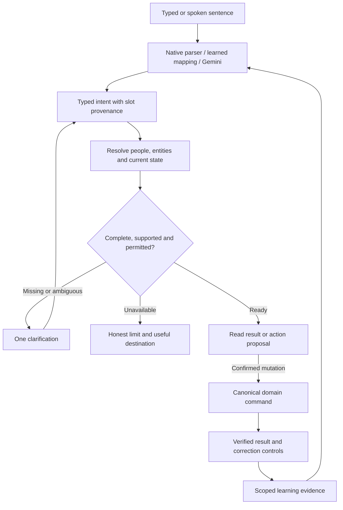

# ERA capability understanding and learning

> **Incorporated 2026-09-27** into [ERA Top Layer](<../../../Plans/ERA Top Layer.md>) (§2 rulings, Understanding track HUB-75–82). Archived as dated evidence; the plan's §2 records which claims were upheld, corrected or overruled, and it wins over this text.

## Contract and ownership

Owner-commissioned study: can “I took 300$ from Drawer” become the correct action, and how can ERA understand application capabilities, household relationships and corrections across modules?

This is research, not an adopted replacement roadmap or implementation. [ERA Top Layer](<../../../Plans/ERA Top Layer.md>) remains the accepted specification. Existing campaign checklists own delivery. Recommendations extend the existing router, registry, assistant persistence and domain operations. Preserve the current ERA layout and precision tools.

The recommended product contract is: **ERA can discover supported actions, resolve their meaning in this household, ask for missing information, execute a confirmed operation, and retain an explicitly accepted interpretation for next time.** Perfect first-turn understanding is unnecessary. Correct final state, cheap recovery and less repeated clarification are necessary.

## 1. What the Drawer sentence does today

With a reset client store, no pending question and no taught phrases:

| Input / condition | Verified result |
|---|---|
| `I took 300$ from Drawer`, Budget active | `clarify`, reason `weak` |
| Same sentence, Schedule/Chef/Brain active | `unknown` |
| Miss classification, no learned vocabulary | `capability-gap`, no matched entity |
| `Transfer $300 from Drawer to Wallet` | Native `transfer` intent, amount 300, source Drawer, destination Wallet |
| AI/taught-phrase registry | 13 capabilities; no transfer capability |

The transfer parser requires `transfer`, `move` or `send` and both source/destination phrases. “Took” and the missing destination fail that grammar. The miss vocabulary does not recognize the original sentence, so the automatic language-gap AI branch is not entered. Existing personal templates/vocabulary or a pending reminder could change routing; no production personal data was inspected.

Evidence: [budget parser](../../../../../src/features/era/intents/budget.ts), lines 101–132 and 199–213; [miss vocabulary](../../../../../src/features/era/capabilities/vocab.ts); [AI escalation](../../../../../src/features/era/useEraTurn.ts), line 204; [registry](../../../../../src/features/era/capabilities/registry.ts), line 219.

Even a manually invoked model cannot currently return a supported transfer proposal: proposals must select a registered capability. A model might explain a transfer in prose, but that is not an executable transfer. The native transfer resolver separately posts directly to `/api/transfers`, uses own accounts and does not offer an inline Undo. Registering it verbatim would inherit that behavior; first define its proposal/confirmation/result contract. See [transfer resolver](../../../../../src/features/era/intents/resolvers/budget.ts), line 353.

There are two separate missing facts in the original sentence: the likely operation and the unstated destination. A good assistant can suggest an internal transfer. It cannot know Wallet is the destination without a household convention, a personal default, relevant conversation context, or clarification. The statement describes a physical movement that already happened; ERA is recording it, not moving funds at a bank.

## 2. What exists, and what remains incomplete

| Foundation | Current evidence | Consequence |
|---|---|---|
| Shared typed/voice turn entry | `useEraTurn.ts` | Reuse this boundary; do not add a second assistant brain. |
| Native routing, learned templates, AI escalation | `intents/index.ts`, `templates/`, `useEraAskAI.ts` | All three mechanisms exist, but their capability coverage differs. |
| Typed capability registry | `capabilities/types.ts:47`, `registry.ts:219` | Schemas and executors exist; business meaning, permissions, effects and delivery support are not a complete common contract. |
| Registry-generated AI catalog | `eraAskProposal.ts:137` | Good single-source seam; enrich it instead of maintaining a separate prompt encyclopedia. |
| Confirmation for AI proposals | `useEraAskAI.ts:177` | Keep confirmation, but make the result and current-state revalidation explicit. |
| Narrow conversational focus | `focusMemory.ts:26`, `:39` | Reminder-only, ten recent entities, 30-minute expiry; not a general household entity resolver. |
| Narrow pending question | `useEraTurn.ts:134`, `types.ts` | The entire next turn answers a missing reminder time. There is no general transfer-destination conversation or interruption model. |
| Personal taught phrases | `templates/matcher.ts`, `/api/era/templates` | Useful exact-pattern accelerator; not a complete personal semantic memory. POST assigns the authenticated user. Actual GET isolation depends on DB policy and was not verified here. |

Two important learning limitations were verified:

1. **Meaning can disappear while learning a phrase.** `learn.ts:65` substitutes only string values occurring verbatim in the utterance. A resolved date such as `2026-10-02` is absent from “let me see Friday,” so the learned pattern has no date slot. `schedule.forDay` accepts an omitted date as today. The isolated probe reproduced that loss through learner → matcher → schema validation, without executing a schedule read. A native parser may intercept some natural date phrases first; this is a demonstrated contract gap, not a claim of live user incidence.
2. **Success is not mandatory evidence.** `shouldLearnFrom` accepts anything except explicit `ok: false`. The template dispatch branch increments usage after a normally returned execution and drops `ok`/`pending` from its returned result (`resolveIntent.ts:131`). This makes a complete result contract more useful than another confidence score. The probe demonstrates the permissive gate, not that every current pending resolver misreports success; reminder creation already returns `ok: false` when asking for a time.

These reinforce existing HUB-47 and HUB-64. They do not establish new production incidents. The existing Graphify graph was consulted for resolver relationships, but its July 11 timestamp and missing newer turn/template nodes make it a navigation aid only. Current source and tests are the evidence.

## 3. Give ERA three distinct kinds of knowledge

**Application meaning:** what a capability does, when to choose it, what it requires, what it changes, what it cannot do, and which module owns its correctness. Developers maintain this alongside working code.

**Current household facts:** accessible accounts, stable person IDs, ownership, currency, membership, record state, dates and permissions. Fetch these from authoritative domain reads. A partial or failed read must remain partial/unavailable; it must not become “you have no accounts” or “your partner has nothing scheduled.”

**Personal interpretation:** aliases, accepted defaults, preferred workflows and corrected phrasing. Learn these within a person/context scope. A personal convention cannot create a capability, change a permission, or replace live balances.

The Feature Map and Atlas help inventory the application. Import graphs help identify implementation dependencies. Neither automatically supplies business semantics. Reading every route or embedding the entire vault does not tell a model whether “paid rent” should create spending, reconcile an existing transaction, or mark a recurring commitment covered. That distinction must be authored and tested.

## 4. Evolve the existing registry into the functional contract

Define capabilities in user-level operations: transfer cash, log a spend, settle a debt, mark an existing payment covered, reschedule one occurrence, assign a meal. A CRUD endpoint is an implementation detail; several endpoints can implement one capability, and one endpoint may serve several meanings.

For each operation, declare:

| Field | Example for a cash transfer |
|---|---|
| Stable ID/version and owner | Proposed `budget.transfer`, owned by Budget |
| Meaning and exclusions | Move recorded funds between accounts; does not count as spending or income |
| Positive and negative examples | “Refill my wallet”; distinguish spending, borrowing and balance correction |
| Inputs | Amount, currency, source/destination references, occurrence date where supported |
| Resolution rules | Resolve IDs from authorized accounts; distinguish each person's Wallet |
| Actor and scope | Requester, account owners and permitted transfer relationship |
| Preconditions | Accounts still exist, access is current, accounts differ, currency/fees supported |
| Effects | Transfer record, both balance legs, required history, affected read views |
| Proposal and confirmation | Render the resolved movement before confirmed execution |
| Result | Persisted transfer ID, actual resolved accounts/effects, execution status |
| Retry/offline/inverse | Operation identity, reconciliation, supported queue policy, valid reversal |
| Support status | Executable, read-only, navigation-only, unavailable or intentionally excluded |
| Tests | Examples, counterexamples, wrong person, retry, stale state and inverse |

Some fields are descriptive; others must be executable validation or policy. Generate the model-facing catalog from these declarations. Keep schemas and handlers linked mechanically. Do not let a model's `authorized: true` or `confidence: 0.98` substitute for application checks.

Maintain a coverage view with separate columns: application feature exists, ERA knows its meaning, ERA can retrieve its required facts, ERA can propose it, ERA can execute it, ERA can recover/undo it. Transfer currently exposes why one “supported” checkbox is misleading.

For every future feature change, require an explicit capability entry or an intentional exclusion and a real navigation destination. Coverage checks can identify unclassified features and missing handlers; humans still author the meaning and counterexamples. Start with high-frequency operations, then expand this census across every standalone and junction.

## 5. One interpretation and execution path

All interpreters should emit the same intermediate representation. Include whether each slot came from explicit wording, a selected entity, recent conversation, an accepted preference or an unresolved inference. Preserve relative-time meaning; a learned “Friday” must not become a frozen date or silently default to today.

The model can suggest an operation and structured arguments. Server code must resolve and authorize real entities and recheck them at confirmation. Bind confirmation to the proposal's exact arguments/version and authenticated actor. If another person changes or deletes the target meanwhile, refresh or ask; do not silently execute a different interpretation.

Use relevant capability subsets and scoped data for AI calls. The active face is a routing hint, not permission or truth. The current active-face early return can prevent other interpretations from being considered. Explicit corrections and known conflicts must be able to challenge a native hit; escalating only `unknown` misses will never repair confident wrong hits.

Extend gap diagnosis beyond language/capability: missing slot, ambiguous entity, conflicting interpretation, inaccessible data, unsupported operation, stale proposal and execution failure need different next steps. Unknown phrasing is not proof that the application lacks the feature. Allow a bounded semantic fallback when cheap retrieval is inconclusive; use existing model limits and HUB-44 attribution rather than unbounded agent loops.

Google's [function-calling documentation](https://ai.google.dev/gemini-api/docs/function-calling) separates model-selected calls from application execution. Its [structured-output documentation](https://ai.google.dev/gemini-api/docs/structured-output) warns that schema-valid output can still have incorrect meaning. These support retaining Gemini and strengthening the application contract; changing providers is not a prerequisite.

## 6. The learning UX

First encounter:

> You: I took 300$ from Drawer.
>
> ERA: $300 · Drawer → ?
>
> Wallet · Choose
>
> You: Wallet.
>
> ERA: $300 · Drawer → Wallet
>
> Confirm · Change

An optional **Remember** affordance can establish the narrow omitted-destination convention. A one-time choice repairs this action. An explicit “remember” establishes a persistent default. Repeated choices may justify offering that default; repetition alone must not silently broaden permissions or generalize to a partner.

The remembered meaning should be approximately: “For this person, cash taken from this Drawer account, without a stated destination, recipient or conflicting purpose, suggests this person's Wallet.” The amount remains variable. Explicit “to Savings” overrides the default. “I took $300 from Drawer for groceries” requires determining whether this reports moving cash or actual spending; planned spending must not become an expense automatically.

On later encounters, show the completed transfer proposal immediately. Learning removes the repeated destination question while retaining the existing money-confirmation policy.

Keep several logical memory roles within the existing architecture, not separate competing assistant databases:

| Role | What it retains |
|---|---|
| Conversation state | Current proposal, unresolved slot, focus entities, cancellation/suspension |
| Entity aliases | “My wallet” for the authenticated person; source IDs validated each use |
| Accepted defaults | Omitted destination under specific conditions; person/household scope |
| Language mappings | Phrasing → capability plus typed slots and constraints |
| Correction evidence | Original interpretation, corrected fields/operation, result, scope and rule version |

Use the existing `era_*` direction; D17 still governs the Brain saved-note backend. Saved facts such as a Wi-Fi password and behavioral preferences such as a default wallet are different kinds of information even if they share infrastructure. Storage design/migrations require a later bounded implementation and current owner evidence.

Each learned rule needs an owner, conditions, provenance, enabled/revoked status, capability version and invalidation conditions. Explicit user instruction can establish a rule immediately; incidental examples should remain candidates. Account deletion, access revocation or household unlink invalidates dependent bindings. A rename should preserve ID identity. Personal defaults should remain personal unless sharing is explicitly selected.

Corrections must be first-class: “No, a transfer,” “the other Wallet,” “make it $200,” “only this time,” “forget that rule.” Before execution, edit the same proposal. After execution, use the source module's correction/inverse and record negative evidence for the wrong mapping; never create a second action silently. If an Undo has no stated reason, avoid assuming whether the user changed their mind or the mapping was wrong.

Generalize pending turns to distinguish answer, correction, cancellation, and a new command. A new command can suspend the previous proposal; it must not be consumed as a failed answer. Persist recoverable state using existing assistant/queue boundaries, bound to the authenticated person and conversation.

Microsoft's [Human–AI Interaction guidelines](https://www.microsoft.com/en-us/research/wp-content/uploads/2019/01/Guidelines-for-Human-AI-Interaction-camera-ready.pdf) separately recommend correction, disambiguation, recent context, cautious adaptation and user controls. This supports measuring learning as improved interactions over time, rather than simply storing more chat history.

## 7. Household semantics and junction operations

Represent these independently: authenticated actor, account/record owner, person the action concerns, task assignee, beneficiary, visibility audience and mutation authority. “I,” “my partner” and “we” resolve to identities and scopes, not just face keywords. A visible partner record is not automatically writable.

For the same phrase, each person may have a different Wallet default. “My partner took $300” is not permission to use the speaker's wallet or their personal convention. A shared Drawer does not make every receiving account shared. Resolve allowed choices before sending data to the model, and authorize the selected action again at execution. Live RLS/access behavior was not examined in this study; code/docs alone do not certify it.

Junctions require explicit dependencies and effects. For “Plan pasta Friday and add what we need,” a bounded workflow could resolve the recipe and date, assign the meal, compute missing ingredients from qualified inventory data, then add deduplicated shopping entries. Unknown stock must remain unknown. The request does not inherently authorize logging an expense or creating a reminder.

Source modules retain their facts and invariants. Kitchen owns recipe/ingredient semantics; Schedule owns occurrence/time semantics; Budget owns money; ERA coordinates their commands. Optional related actions remain optional. Trip activation must call the canonical trip lifecycle, not independently reproduce its effects across modules.

Use a small set of named workflows before attempting unrestricted composition. Each step has an operation ID, prerequisites, authoritative result and recovery policy. Persist workflow progress in existing assistant infrastructure. If meal assignment succeeds but shopping fails, report that state and retry shopping only. Do not promise whole-workflow Undo unless every required effect has a valid inverse. An atomic balance primitive alone does not prove a transfer's two legs and record commit together.

This follows the useful distinction in [Building effective agents](https://www.anthropic.com/engineering/building-effective-agents): predictable work can use explicit workflows; dynamic agent control adds complexity and should earn its place through measured benefit. [Writing effective tools](https://www.anthropic.com/engineering/writing-tools-for-agents) likewise emphasizes clear operation boundaries and domain context rather than exposing overlapping raw API wrappers.

## 8. Delivery sequence and measurable acceptance

**First, establish the coverage baseline and common outcome contract.** Inventory native intents versus the registry and precise-form capabilities. Retain success, clarification, awaiting confirmation, durable queued, failed, uncertain and partial states explicitly. A successful read with no matches differs from an unavailable read; a proposal differs from a committed action. Learning and activity use this same outcome.

**Then complete Drawer → Wallet as one vertical slice.** Add the transfer capability meaning, authorized account resolution, destination clarification, proposal, domain execution/result, correction and scoped preference. Validate the underlying transfer/undo boundary before exposing broader automatic access. Merely adding a synonym is not this slice.

For two illustrative USD accounts with no fee: Drawer $1,000 and Wallet $100 become Drawer $700 and Wallet $400 after one confirmed $300 transfer. Combined money remains $1,100; spending/income totals do not change. Retry remains $700/$400. A supported reversal returns $1,000/$100 once. These are proposed acceptance values, not observed production balances.

**Next, reuse the contract for a few frequent operations.** Spend capture, a one-time reminder, a reminder correction and a shopping addition exercise different required fields without covering every module immediately. Keep recurrence-aware actions behind their existing domain contracts.

**Then prove household learning and add one junction workflow.** Use both people, conflicting wallet names/defaults, changed permissions and partial failure. Expand module coverage only when each capability has a tested meaning and a real executor or honest fallback destination.

Suggested first evaluation corpus: 30–50 actual household phrases plus targeted counterexamples, separated into development examples and held-out paraphrases. Include suffix currency (`300$`), explicit destinations, past/future/negated statements, corrections, topic changes, repeated confirmations, response loss, currency differences, both partners, unknown entities and unavailable reads. Add the household's actual mixed-language/voice errors when observed.

Measure final domain state, wrong/duplicate effects, recovery after one correction, clarification turns, repeated questions after explicit learning, wrong-user preference reuse, latency and model cost. Test a sequence: first encounter → correction → accepted rule → unseen paraphrase → explicit override → revoked rule. A one-turn parser accuracy score cannot establish a learning curve.

Zero wrong-account, unauthorized or duplicate money effects in the acceptance suite is a release gate, not a universal safety guarantee. Do not adopt arbitrary confidence percentages. Assess ranking thresholds on the household corpus. Anthropic's [evaluation guidance](https://www.anthropic.com/engineering/demystifying-evals-for-ai-agents) distinguishes actual environment outcomes from what the transcript claims; that distinction is especially useful here.

## 9. Verification and disposition

Verification on 2026-09-27: seven temporary pure probes plus the existing router, learner and registry suites passed: **4 files, 144 tests**. Probes covered all four faces for the original sentence, explicit transfer parsing and registry absence, date-binding loss, and the permissive success gate. No resolver mutation, model request, live DB query, UI/device verification or production transfer was performed. Temporary probes were removed after recording this evidence. No application code was changed.

| Finding / recommendation | Disposition and owner |
|---|---|
| Verified outcome required before learning/activity | Evidence for existing [HUB-47](<../../../Hub & ERA/Hub & ERA — Master Book.md#hub-47>) |
| Preserve target and normalized slot meaning | Target safety already [HUB-64](<../../../Hub & ERA/Hub & ERA — Master Book.md#hub-64>); broader typed date/default binding is an unadopted refinement |
| Durable capture and replay identity | Existing [HUB-46](<../../../Hub & ERA/Hub & ERA — Master Book.md#hub-46>); no independent ERA queue |
| Canonical, scoped context and availability | Existing [HUB-45](<../../../Hub & ERA/Hub & ERA — Master Book.md#hub-45>) and HUB-41; keep producer gates |
| Transfer correctness/inverse prerequisite | Coordinate with [BUD-24](<../../../Budget/Budget — Master Book.md#bud-24>) and [BUD-63](<../../../Budget/Budget — Master Book.md#bud-63>); neither alone certifies the full transfer operation |
| Rich capability contract, coverage census and Drawer learning slice | Unadopted implementation recommendation owned jointly by Hub & ERA and Budget; requires bounded acceptance before implementation |
| General clarification, scoped defaults and named workflows | Unadopted extensions; preserve existing Top Layer decisions, D17 and household lifecycle gates |

No campaign item is marked implemented by this study. Suggested order is technical sequencing, not a change to existing priority lanes or the owner's capacity plan. Kill or simplify any proposed abstraction that fails to reduce correction/clarification cost on real phrases; do not start with a graph database, model training, or an agent per module.

Retire this study into the archive after adopted mechanisms are incorporated into canonical acceptance/architecture and remaining options are resolved. Preserve the test evidence and decision links.
