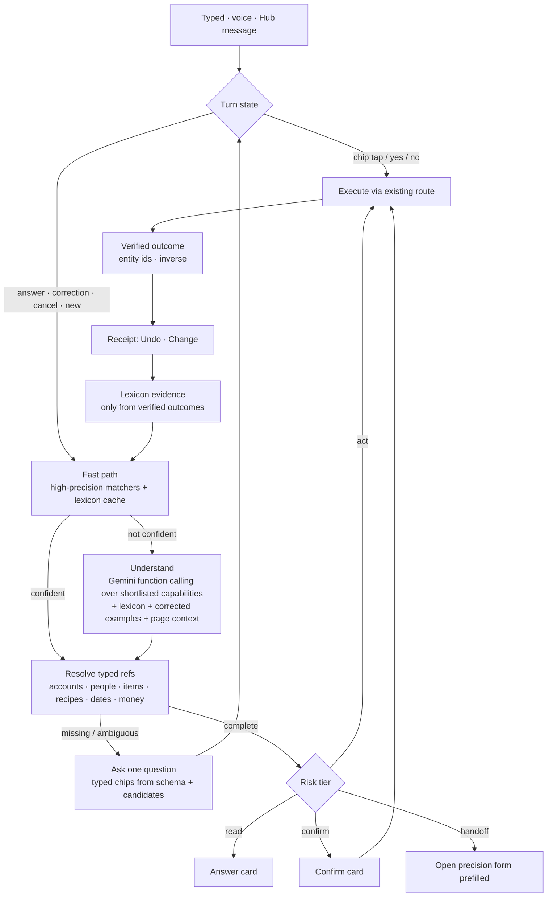

# ERA Understanding Engine

> **Incorporated 2026-09-27** into [ERA Top Layer](<../../../Plans/ERA Top Layer.md>) (§2 rulings, Understanding track HUB-75–82). Archived as dated evidence; the plan's §2 records which claims were upheld, corrected or overruled, and it wins over this text. Known errors in §0–§14 (probe double count, `/expense` handoff, static tiers, cache replay, cost) are corrected in plan §2.2.

Owner-commissioned full-scope study, 2026-09-27: turn the ERA Top Layer into an assistant that understands a sentence, picks the right feature anywhere in the app, asks for whatever that feature still needs, and gets faster as it learns the household. ERA should make the app more efficient to use. It does not replace the app.

This study **challenges** [ERA Capability Understanding and Learning](<ERA Capability Understanding and Learning.md>) and its chat summary (`ERALayer.MD`, repo root). It keeps that study's safety findings and replaces its delivery shape. Like any study, it admits nothing on its own; see [§12](#12-owner-decisions-and-admission) for the decisions that would turn it into campaign work. [ERA Top Layer](<../../../Plans/ERA Top Layer.md>) remains the accepted specification until the owner amends it.

---

## 0. Verdict

1. **Today ERA gets the right result for 14 of 47 realistic household sentences (30%).** 25 of the 47 need a feature ERA has no capability for, 7 miss a capability ERA does have, and 8 get a confident wrong answer. A wrong answer never reaches the AI, because escalation only fires on `unknown`/`clarify`.
2. **Understanding the language is not the bottleneck.** Gemini already reads "I took 300$ from Drawer" correctly. What fails is everything around the model. ERA knows 13 AI capabilities out of roughly 250 mutation handlers. Five separate engines each decide what a sentence means. The model is only consulted after regex fails, and it is capped at 15 automatic calls a day.
3. **The previous study was right about safety and too small in scope.** Its first milestone is one hand-built vertical slice (Drawer → Wallet), with every capability getting a 13-field contract. At about two sessions a week, ERA would cover a handful of features by year end. A 10x result needs **generic engines** (slot filling, entity resolution, a risk policy, handoff to forms), so that each new capability costs about 30–60 lines.
4. **Proposed architecture:** model first, with a deterministic fast path. The model chooses the meaning and deterministic code computes the values. The model never supplies an ID. Missing inputs become typed chips generated from the capability's schema. Risk is set by what an action does, not by which interpreter produced it. Learning moves from phrase templates to a **household lexicon** (aliases, defaults, corrected examples).
5. **The fastest route to full coverage is handoff:** anything ERA can't finish inline opens the precision form already filled in. With that, ERA can reach every module in a few weeks, and inline execution grows behind it.
6. **Cost is not the constraint.** The estimate is on the order of $1–2 a month for two people. The binding limits are self-imposed caps and latency, both of which the owner decides ([§9](#9-economics-latency-and-offline)).

---

## 1. Measured baseline (2026-09-27)

### 1.1 The corpus probe

47 realistic sentences spanning every module were run through the live `rootIntentRouter` with no templates and no focus memory, once with Budget active and once with Schedule active. No network or AI was involved. I wrote the corpus, so the household's real phrasing must replace it ([§10](#10-evaluation-the-era-gym)).

| Outcome (Budget face active) | Count | Examples |
|---|---:|---|
| ✅ Right intent and slots | 14 | `paid 45 for gas`, `move 100 from wallet to savings`, `what do I have Saturday`, `find me a lasagna recipe` |
| ❓ Missed although ERA has the capability | 7 | `I took 300$ from Drawer`, `spent 12$ on coffee`, `coffee 4$`, `500k lbp groceries`, `move the dentist to Friday`, `done with laundry`, `show my expenses` |
| ⚠️ Confident wrong answer | 8 | `make it 20$ instead` → **reminder reschedule**; `do we have rice` → memory recall; `what should I wear today` → today's schedule; `what can I cook with chicken and rice` → list all recipes; `dentist appointment on the 3rd at 4pm` → face switch only |
| ⛔ No ERA capability anywhere | 18 | salary, `Karim paid me back`, `mark rent as paid`, `split 60$ dinner with Rita`, `undo that`, shopping list, pantry, chores, trips, healthcare, outfits, catalogue, `open trips` |

The Schedule face gives the same totals, with one sentence shifting: `split 60$ dinner with Rita` becomes a Chef face switch. **Which face is active changes the meaning of the sentence**, a behavior the previous study flagged in passing.

Only 11 of the 25 misses classify as a "language gap" and so auto-escalate to the AI. Of those 11, the AI registry could complete at most two or three, because the AI registry has no spend capture, no shopping list, no debt settlement and no recurring-payment actions. **The escalation gate is vocabulary-based and the rescue path is capability-starved, so fixing either alone does not help.**

### 1.2 Amount format: two parsers disagree on the household's own notation

| Sentence | ERA budget router | Hub chat parser (`messageTransactionParser`) |
|---|---|---|
| `spent 12$ on coffee` | clarify (miss) | 12 |
| `paid 300$` | clarify (miss) | 300 |
| `coffee 4$` | clarify | 4 |
| `spent $12 on coffee` / `12 usd` / `12` | 12 | 12 |
| `500k lbp groceries` | clarify | null |

Cause: in `MARKED_AMOUNT_RE` (`src/features/era/intents/budget.ts`), a trailing `\b` requires a word character after `$`/`€`/`£`, so the suffix form `12$`, which is how this household writes amounts, never matches. The positional fallback then fails because `$` follows the digits. Neither parser understands the Lebanese `k` thousands shorthand. This bug is filed as **HUB-75**. It is a live example of the "one engine per concept" violation below.

### 1.3 Coverage census

| Surface | Count | Notes |
|---|---:|---|
| Product API route groups / mutation handlers | ~45 / ~250 | Count of `POST/PATCH/PUT/DELETE` exports under `src/app/api/` |
| ERA native domain intents (regex) | 20 | 4 faces: Budget, Schedule, Chef, Brain |
| AI/template registry capabilities | 13 | `capabilities/registry.ts`. No spend capture, transfer, debt, shopping or income |
| Modules with **zero** ERA reach | 15+ | Trips, Healthcare, Outfits, Catalogue, Inventory, typed Shopping, Chores, Plan My Day, Recurring, Future Purchases, Allocations, Activity, Recycle Bin, Notifications, and navigation beyond the 4 faces |

### 1.4 Five brains, not one

The Design Doctrine forbids "a second assistant brain" (§4, *one engine per concept*). The repo has five places that decide what a sentence means:

| # | Engine | Knows what the others don't |
|---|---|---|
| 1 | ERA face routers (`src/features/era/intents/`) | transfer, debt, drafts, meals, memory |
| 2 | Voice classifier (`src/features/voice-conversation/intentClassifier.ts`) | **add to shopping**, **balance query** (typed ERA has neither) |
| 3 | Hub message → transaction (`src/lib/nlp/messageTransactionParser.ts`) | **suffix `12$`**, message date |
| 4 | Ask AI (`/api/era/ask`, Gemini, 13 capabilities) | NFC-trigger reminders |
| 5 | Legacy floating assistant (`/api/ai-chat`) | spending analysis reports, full budget context |

The taught-template matcher (`era_templates`) sits on top of all five as a sixth routing layer. The slot parsers `speechExpense.ts` and `smartTextParser.ts` (1,424 lines, dates and recurrence) are good assets. They should become shared **value extractors**, not routers.

### 1.5 Risk policy is keyed to the interpreter, not the effect

- A regex-parsed transfer POSTs to `/api/transfers` immediately, with no confirmation and no inline Undo (`resolvers/budget.ts`, `resolveTransfer`). A regex debt record, reminder create/complete and reminder delete all write immediately too.
- An AI-proposed reminder *create* requires a confirm card.

So money moves from a fuzzy regex account match with no confirmation, while a reversible reminder from the model needs one. That inverts the Design Doctrine's own priority order (correctness of money first, then trust, then capture speed).

---

## 2. Challenge: what the previous study got right and wrong

### Kept, because it is right

- **Three kinds of knowledge.** Application meaning comes from developer-authored capability descriptions. Current household facts come from authoritative reads. Personal interpretation comes from explicit or learned conventions. A preference never grants access or overrides a balance.
- **The model proposes and the app executes.** Schema-valid output is not correct meaning. The server re-authorizes.
- Slot provenance, and relative-time meaning preserved (the "Friday frozen to today" learner bug).
- Household identity roles: actor, owner, subject, assignee, audience, mutation authority. Personal defaults stay personal.
- Corrections are first-class. Learn only from verified outcomes (HUB-47).
- Evaluate by **final domain state** over *sequences* (first try → correction → rule → paraphrase → override → revoke), not one-turn parser accuracy.
- No graph database, no model training, no agent per module.

### Overturned or re-scoped

| # | Previous position | Challenge | Replacement |
|---|---|---|---|
| C1 | First milestone is one vertical slice (Drawer → Wallet), then "a few frequent operations" | That is linear effort per capability, against about 120 operation families at ~2 sessions a week. It is the §6 failure mode of the Design Doctrine: the machine knows more than it does. | Build **generic engines first** (refs, slot filler, policy, outcome, handoff). Drawer → Wallet becomes the *acceptance test* of the engine, not the first hand-built feature. |
| C2 | Keep regex-first routing and escalate to AI only on misses (implicitly) | The probe shows 8 confident wrong answers that never escalate. Regex recall cannot scale to ~120 operations or to paraphrase. | **Model first.** The fast path is a high-precision *cache*, and a weak regex guess (`clarify`/`switchFace`) is demoted to a hint. |
| C3 | General clarification is an "unadopted extension" | Prompting for missing input is the owner's core requirement, not an extension. | **Schema-driven slot filling** is engine component #1. Every required field and every ambiguous reference becomes typed chips automatically. |
| C4 | 13-field contract per capability (meaning, actor, preconditions, effects, retry, inverse, tests…) | Effects, retry and inverse belong to the *domain route*, which already enforces them. Re-authoring them per capability duplicates them and lets them drift. | A **minimal contract** ([§4.2](#42-capability-contract-v2-minimal)) of summary, examples/counterexamples, typed args, risk tier, executor, inverse and handoff. Domain invariants stay in the route and the money/recurrence skills. |
| C5 | "Honest limit and useful destination" when ERA can't act | A bare destination is a dead end: the user retypes everything in the form. | **Prefilled handoff.** The form opens with every slot ERA already resolved, so coverage reaches 100% of modules early. |
| C6 | Keep and fix phrase-template learning (HUB-30/31/34/64) | String templates were a workaround for a regex brain. They lose derived meaning, generalize poorly to paraphrase, and have needed four repair items. | Replace them with a **household lexicon** (aliases, conditional defaults, and corrected examples retrieved as few-shot context). HUB-64's hazard disappears with the mechanism. |
| C7 | Not addressed | Five brains disagree today: voice can add to the shopping list but typed ERA can't, and Hub reads `12$` but ERA doesn't. | **One pipeline** for typed, voice and Hub message conversion. The other parsers become value extractors. |
| C8 | Keep "AI proposes → human confirms" as-is | Applied by interpreter, it produces §1.5's inversion. A confirm on every reversible capture adds a tap to the app's most frequent action. | **Risk tier by effect** ([§6](#6-risk-policy-by-effect)). Owner sign-off is required because it refines Doctrine Q10. |
| C9 | Every recommendation dispositioned "unadopted" | A study with no admission path produces no product change. `ERALayer.MD` ended with "application code is unchanged". | [§11](#11-delivery-waves) gives sized waves and [§12](#12-owner-decisions-and-admission) the decisions that admit them. |

### A challenge to the request itself

- **"Replace my whole use of the application."** It shouldn't, and the owner already walked this back. ERA wins at **capture, quick edits, questions, cross-module chores and "remember this for me."** The app keeps **review, browsing and configuration**: analytics charts, calendar grids, statement-import review, recipe editing, the outfit builder, and settings. Target most daily *interactions by count*, not most *features*. Measure the share with `capture_source` (D15) rather than asserting it.
- **"Understand my sentences."** Language understanding is solved well enough off the shelf. The work is (a) a truthful catalog of what the app can do, (b) resolving words to *your* real records, and (c) remembering *your* conventions. The study spends its effort there.

---

## 3. Target: what 10x means, measurably

| Dimension | Today | Target | How measured |
|---|---|---|---|
| Operation families ERA can complete or hand off | 13 AI + 20 native, 4 modules | ~120 families, every Feature Index module | Coverage matrix generated from the registry ([§5](#5-full-scope-capability-census)) |
| Correct final state, held-out household corpus | 30% (synthetic 47) | ≥ 90% | ERA Gym ([§10](#10-evaluation-the-era-gym)) |
| Wrong effects executed without a confirm | Possible on money today | 0 for money; every other wrong effect undoable in one tap | Gym + receipts |
| Questions per task | Unbounded dead ends ("I didn't catch that") | Median ≤ 1, and 0 repeats after "Always" | Gym sequences |
| Taps for a simple spend | 0 when it parses; a form when it doesn't | 0 (draft + Undo) | Gym |
| Taps for a money move | 0 today, which is unsafe | 1 (Confirm) | Gym |
| Latency | Regex instant; AI ≤ 60 s timeout | Fast path < 150 ms; model p50 ≤ 1.5 s, p95 ≤ 3 s | Turn telemetry (HUB-44) |
| Model cost | Unmeasured (HUB-44) | ≤ $5 / month household | HUB-44 attribution |

"10x" here means roughly ten times the reachable surface (13 → about 120 families), about three times the first-turn correctness, and the elimination of the "go open the form and retype it" step.

---

## 4. Architecture — one pipeline



### 4.1 Seven components

| # | Component | What it does | Built from |
|---|---|---|---|
| 1 | **Turn state machine** | Classifies each utterance against the open state as *answer, correction, cancel, confirm, or new request*. A new request suspends the open proposal rather than being swallowed by it. Chip taps are structured and never re-parsed. | Replaces `pendingTurn`'s reminder-only special case (`useEraTurn.ts`) |
| 2 | **Fast path** | High-precision deterministic matches: the existing spend, transfer, reminder and schedule-read grammars, exact lexicon hits, navigation. Must never return `clarify`/`switchFace` as a final decision. | Existing face routers, demoted to cache |
| 3 | **Understand** | One Gemini call with function declarations for a shortlist (active face, keyword hits, recent capabilities, page context, plus always-on meta tools: `clarify`, `navigate`, `answer`, `undo`). Parallel calls give multi-intent. It returns **text spans** for values, never IDs or computed dates. | `/api/era/ask` gains a function-calling mode. `slotsJson` string encoding retires. |
| 4 | **Resolver** | Maps each typed ref to authorized records using cached TanStack data (instant, offline-capable) plus the lexicon. Computes values with deterministic extractors: money (one shared amount parser incl. `12$`, `500k`, LBP thousands), dates and recurrence (`smartTextParser`). | `fuzzyMatchAccount`, `focusMemory`, `speechExpense`, `smartTextParser` merged into ref types |
| 5 | **Slot filler** | Required-but-missing or ambiguous args become one question rendered as chips. The chip type comes from the Zod type: enum → chips, `AccountRef` → ranked accounts, `WhenRef` → Tonight/Tomorrow/Pick, `MoneyRef` → keypad, `PersonRef` → Me/Partner. | New, generic |
| 6 | **Policy + executor** | Applies the risk tier ([§6](#6-risk-policy-by-effect)). Executes through the existing API route via `safeFetch`, with its auth, Zod, household and money choke points. Revalidates at confirm against an args hash plus actor. | `capability.execute` |
| 7 | **Outcome and receipt** | One `EraOutcome` (`done` · `drafted` · `needs` · `confirm` · `queued` · `failed` · `partial` · `handoff`) with entity IDs and an inverse. Receipt shows Undo/Change. Learning, activity and briefings read only this. | HUB-47's outcome contract, generalized |

**Hard invariant:** *the model picks meaning; code computes values.* LLMs are unreliable at date arithmetic and LBP scaling. The model says `when: "next Friday at 5"` and `amount: "300$"`, and the resolver turns those into values with the app's own parsers. This one rule also fixes the previous study's "Friday frozen to today" learning bug.

### 4.2 Capability contract v2 (minimal)

```ts
// Sketch: extends capabilities/types.ts, not a parallel registry.
interface EraCapabilityV2<Args> {
  id: `${Module}.${string}`;           // "budget.transfer"
  module: Module;                        // owner of correctness
  summary: string;                       // one line, model-facing
  examples: string[];                    // 3–6 real household phrasings
  notFor?: Array<[phrase: string, useInstead: string]>; // "took 300 for groceries" → budget.spend
  args: z.ZodType<Args>;                 // built from typed refs: ref.account(), money(), when() …
  tier: "read" | "act" | "confirm" | "handoff";
  execute?(args: Args, ctx: EraCtx): Promise<EraOutcome>;   // wraps an existing route
  inverse?(o: EraOutcome): Promise<EraOutcome>;             // powers Undo
  handoff?(partial: Partial<Args>): string;                 // precision-form URL with prefill
}
```

About ten ref types (`account`, `category`, `person`, `item`, `recipe`, `product`, `trip`, `catalogueItem`, `money`, `when`) carry the difficult work: fetching authorized candidates, fuzzy matching, lexicon lookup, chip rendering, and ambiguity. They are built once and reused by every capability, so a new capability is a summary, examples, a schema and a route wrapper. The model-facing catalog and the coverage matrix are both **generated** from these entries.

### 4.3 Handoff contract

Each precision form accepts one prefill source: `?era=<proposalId>`, reading the resolved proposal from `useEraStore`, with plain URL params as a fallback. Today only `/reminders` reads params (`date`, `plan`, `tab`). `/expense` preserves params through login but never reads them. First forms to add prefill to: expense, reminder/event, trip wizard, recipe import, catalogue item, health record, recurring payment.

### 4.4 Page context: ERA knows where you are

When ERA opens from a page, the page's entity enters focus. On `/trips/[id]`, "add sunscreen" means packing; on a recipe, "add the ingredients" means shopping for *that* recipe. This is additive (a focus push on the existing ERA entry) and does not redesign navigation.

---

## 5. Full-scope capability census

Tiers are **R** read/answer, **A** act + Undo, **C** confirm, **H** handoff to the prefilled form. **W** is the delivery wave in [§11](#11-delivery-waves). ✓ means ERA does it today, possibly with defects.

### Budget

| Operation family | Example | Tier | Route basis | W |
|---|---|---|---|---|
| Capture spend (draft) ✓ | `spent 12$ on coffee`, `500k groceries` | A | `/api/drafts` | 0/1 |
| Capture income | `got my salary 1500$` | A | drafts (E-09 income, HUB-46) | 2 |
| Own-account transfer ✓ | `I took 300$ from Drawer` | C | `/api/transfers` | 0/1 |
| Currency exchange | `changed 100$ to LBP at 89.5k` | C | transfers `to_amount` | 2 |
| Household transfer | `sent Rita 50$` | C | transfers `household` | 2 |
| Edit last / named transaction | `make it 20`, `that was fuel` | A | `/api/transactions/[id]` | 2 |
| Delete transaction | `delete the coffee` | C | recycle bin is the inverse | 2 |
| Split with partner | `split 60$ dinner with Rita` | C | `/transactions/split-bill` (HUB-6) | 2 |
| Drafts: list ✓ / confirm ✓ / confirm all | `confirm the fuel draft` | R/C | `/api/drafts` | 1 |
| Balance | `what's in Drawer`, `what's my balance` | R | accounts balance | 0 |
| Spend by period/category/person ✓ | `how much did we spend on groceries` | R | analytics | 1 |
| Budget remaining | `how much grocery budget is left` | R | budget-allocations | 2 |
| Recurring status | `did I pay internet` | R | recurring-payments | 2 |
| Mark recurring covered | `mark rent as paid` | C | `/[id]/mark-covered` (HUB-22) | 2 |
| New recurring | `Netflix 15$ every month on the 3rd` | H | recurring form | 2 |
| Debt record ✓ / settle / list | `Karim paid me back`, `who owes me` | A/C/R | `/api/debts` (HUB-22) | 2 |
| Balance correction | `Drawer actually has 250$` | C | `/accounts/reconcile` | 2 |
| Merchant rule | `always file Spinneys under groceries` | A | merchant-mappings + lexicon | 3 |
| Future purchase | `I want a PS5 around 500$`, `can we afford it` | A/R | future-purchases (+analysis) | 4 |
| Analysis report | `analyze my spending this month` | R | analysisReport (HUB-48) | 5 |
| Statement import, receipts, allocation editing | — | H | precision tools | 4 |

### Schedule

| Operation family | Example | Tier | Route basis | W |
|---|---|---|---|---|
| Reminder create ✓ | `remind me to call mom at 5` | A | `/api/items` | 1 |
| Event / appointment | `dentist on the 3rd at 4pm` | A | `/api/items` event | 2 |
| Recurring task | `pay internet every month on the 5th` | A | smartTextParser rrule | 2 |
| Reschedule / complete **by name** (✓ by pronoun only) | `move the dentist to Friday`, `done with laundry` | A | items, `ref.item()` | 1 |
| Skip one occurrence | `skip gym today` | A | occurrence contract (skip ≠ postpone) | 2 |
| Pause | `pause gym for two weeks` | A | `/[id]/pauses` | 2 |
| Delete ✓ | `delete that` | C | recycle bin is the inverse | 1 |
| Subtask | `add passport to the visa appointment` | A | `/api/subtasks` | 2 |
| Read day ✓ / week / overdue / find | `when is the dentist` | R | schedule bundle | 1 |
| NFC-triggered reminder ✓ (AI only) | `remind me when I get home` | C | prerequisites | 1 |
| Checklist template launch | `start the moving checklist` | A | reminder-templates/launch | 4 |
| Plan my day | `plan my day` | H | suggest-schedule → day plan | 4 |
| Chores: whose turn / done / pass | `whose turn is the trash` | R/A | chores | 4 |
| NFC history | `did anyone feed the cat` | R | `/nfc/[slug]/history` | 4 |

### Kitchen

| Operation family | Example | Tier | Route basis | W |
|---|---|---|---|---|
| Shopping add (multi-item, qty) | `add milk and 2 eggs to the list` | A | hub shopping (voice has it today) | 0 |
| Shopping check off / read | `got the milk`, `what's on the list` | A/R | hub shopping | 2 |
| Pantry check | `do we have rice` | R | inventory (unknown stays unknown) | 2 |
| Out of / consumed | `we're out of olive oil` | A | inventory → low-stock (DEC-03) | 2 |
| Restock | `bought 2kg rice` | A | `/inventory/restock` | 2 |
| Meal assign ✓ / read / gaps ✓ | `what's for dinner` | A/R | meal-plans | 1 |
| Plan meal + shop for it | `plan pasta Friday and add what we need` | A (workflow) | meal-plans + `/meal-plans/add-to-shopping` | 4 |
| Recipe search ✓ / by ingredients | `what can I cook with chicken` | R | recipes | 2 |
| Import recipe from URL | *(paste link)* | H | `/recipes/extract-from-url` | 4 |
| Scale / substitute | `lasagna for 8` | R | `/[id]/scale`, `/substitute` | 4 |
| Cooking log | `we made lasagna tonight` | A | `/[id]/cooking-log` | 4 |

### Trips · Healthcare · Outfits · Catalogue · Brain · Household

| Operation family | Example | Tier | Route basis | W |
|---|---|---|---|---|
| Create trip | `Paris Oct 10–15` | H | trip wizard (auto account; lifecycle side effects) | 2 |
| Trip read | `when do we leave`, `what's left to pack` | R | `/trips/[id]/bundle` | 4 |
| Packing add / check | `pack the charger` | A | `/[id]/packing` | 4 |
| Trip place | `add the Louvre` | A | `/[id]/places` | 4 |
| Activate / complete trip | `we're back` | C | lifecycle RPCs (DEC-04) | 4 |
| Spend during trip | `taxi 20€` | A | spend capture with trip context | 4 |
| Log dose | `took my vitamin D` | A | `/medications/[id]/doses` (after HLTH-25) | 4 |
| Medication read | `did I take my pill today` | R | medications | 4 |
| Allergy check | `is Rita allergic to nuts` | R | allergies | 4 |
| Outfit | `what should I wear` | H | outfits builder (OUT-16 parked) | 4 |
| Catalogue search | `where's my passport`, `fridge warranty` | R | HUB-69 | 4 |
| Memory save ✓ / recall ✓ / correct | `the wifi password changed to …` | A/R/A | memories (HUB-70) | 1 |
| Message partner | `tell Rita I'm running late` | C | hub messages (outward) | 4 |
| Activity | `what did Rita add today` | R | activity-log | 4 |
| Restore deleted | `restore the transaction I deleted` | C | recycle-bin/restore | 4 |
| Snooze / mute | `snooze that an hour` | A | notifications/snooze | 4 |
| Navigate anywhere | `open trips`, `show October in analytics` | — | Atlas routes | 1 |
| Meta: undo, correct, explain, "what can you do" | `undo that`, `no, from Wallet` | A/R | outcome inverse, catalog | 1 |

That is about 75 families here and about 120 operations once variants are split. Every row reuses an existing route, and none requires new business logic.

---

## 6. Risk policy by effect

| Tier | When | UX | Examples |
|---|---|---|---|
| **Read** | No side effect | Answer card, instant | balance, schedule, pantry, "who owes me" |
| **Act + Undo** | Reversible, own records, and either low blast radius or already a review layer | Execute, then a receipt with **Undo · Change** (Hard Rule #1) | spend → *draft*, reminder, shopping item, packing, dose log, meal assign |
| **Confirm** | Moves money · touches partner-owned records or messages the partner · destructive · no clean inverse · lifecycle side effects | One-tap **Confirm · Change** card, revalidated at tap | transfers, mark covered, debt settle, split, delete, trip activate |
| **Handoff** | Many fields, or a structured review is the point | Prefilled precision form | new trip, recurring payment, statement import, outfit |

Rules:

- A tier is assigned **per capability, never per interpreter.** A regex-matched transfer confirms exactly like a model-matched one.
- Low confidence or a lexicon-defaulted money argument can *raise* a tier (Act → Confirm), and nothing ever lowers one.
- "Spend capture = act" stays within the Design Doctrine's letter because the write is a **draft**, the app's existing AI-review layer. Reminder, shopping and dose "act" is a real refinement of Doctrine Q10 ("never let a model write directly to … schedule") and needs **owner sign-off** (decision O2).

---

## 7. Interaction design (Hard Rule #28: minimum words)

**First time**

```
You  I took 300$ from Drawer
ERA  Transfer · $300
     Drawer → [Wallet] [Savings] [Other]
You  ⟨Wallet⟩
ERA  Drawer → Wallet · $300      [Confirm] [Change]
                                 ☐ Always
```

**Every time after "Always"**

```
You  took 200 from drawer
ERA  Drawer → Wallet• · $200     [Confirm] [Change]
```

`•` marks a learned default. Tapping it offers *Change · Forget*.

**Capture with no questions (act + Undo)**

```
You  spent 12$ on coffee
ERA  Draft · $12 · Coffee · Wallet     [Undo] [Change]
```

**Missing required input**

```
You  remind me to call mom
ERA  Call mom · [Tonight 8pm] [Tomorrow 9am] [Pick]
```

**Correction edits the same proposal or receipt, never a second action**

```
You  make it 20
ERA  Draft · $20 · Coffee · Wallet     [Undo]
```

**Junction request with a partial result stated honestly**

```
You  plan pasta Friday and add what we need
ERA  Fri dinner · Pasta Carbonara            ✓
     Shopping +3 · eggs, pecorino, guanciale ✓
     Parmesan · stock unknown   [Add] [Skip]
     [Undo all]
```

**Too structured for chat → handoff**

```
You  we're going to Paris Oct 10 to 15
ERA  Paris · Oct 10–15            [Open trip]
```

**Capability ERA doesn't have → a door, not a wrong answer**

```
You  what should I wear today
ERA  Outfits                      [Open]
```

No reassurance copy, no rationale, no banners. Chips are 1–2 words.

---

## 8. Learning: the household lexicon

Phrase templates learn *strings*. The lexicon learns *meaning*, keyed to real records.

| Kind | Example | Scope | Source |
|---|---|---|---|
| **Alias** | "drawer", "the cash box" → account `Drawer` | person (default) or household | explicit, or confirmed chip choice |
| **Conditional default** | `budget.transfer` with `from = Drawer` and no `to` → this person's `Wallet` | person | "Always" toggle; offered after the same choice 3× |
| **Category/merchant rule** | "Spinneys" → Groceries | household | explicit (also writes `merchant-mappings`) |
| **Corrected example** | "took 300 from drawer" ⇒ `budget.transfer{from:Drawer, amount:300, to:Wallet}` | person | every confirmed outcome that followed a correction |
| **Negative example** | "took 300 from drawer" ≠ `budget.spend` | person | correction |

How it is used:

- The **resolver** consults aliases and defaults *before* asking a question.
- The **fast path** uses exact-match examples as a cache, where the same normalized utterance and live refs give the last accepted call.
- **Understand** receives the top 3–5 most similar corrected examples as few-shot context. Similarity is keyword/trigram, because a household produces hundreds of rows and needs no vector database. This is what generalizes to paraphrase, which string templates can't.

Rules carried forward from the previous study:

- Learn only from verified outcomes (HUB-47).
- Explicit instruction activates a rule immediately. Repetition only *offers* one.
- Every rule records its owner, conditions, provenance and status.
- Deleting an account, losing access or unlinking the household invalidates dependent rules. A rename keeps the ID.
- A partner's sentence never uses your defaults.
- Revocation works by voice ("forget that") and in a precision list (Brain face).

**Storage:** one `era_lexicon` table inside the `era_*` store (D4-compliant), with a person-owned RLS policy and an explicit household-shared flag. Existing `era_templates` rows convert to examples, and the table is retired afterwards. The migration and RLS are written at implementation time under Hard Rules #24/#27; nothing is proposed for production here.

---

## 9. Economics, latency and offline

**Estimate.** The assumptions are labeled so they can be replaced with `era_messages` counts:

- 2 people × ~30 turns a day, with 40% taken by the fast path, gives ~36 model calls a day, or ~1,100 a month.
- A call is ~3,000 input tokens (system prompt, ~20 shortlisted declarations, lexicon snippets, 6 recent turns) plus ~150 output tokens.
- That totals ~3.3M input and ~0.17M output tokens a month.
- At Flash-class list prices this is about $1–2 a month, and less on Flash-Lite. Verify the current price and billing tier under HUB-44 before relying on these figures.

**The binding constraints are the app's own caps, not money:**

| Cap (source) | Value | At target load |
|---|---|---|
| `MONTHLY_TOKEN_LIMIT` (`src/lib/ai/rateLimit.ts`), per user | 1,000,000 | ~1.7M per user, **exceeded** |
| `DAILY_AUTO_ESCALATION_CAP` (`/api/era/ask`), per user | 15 / day | ~18 per user a day, **exceeded** |
| Per-user / global rate limit | 5 / 10 per minute | OK for normal bursts |

Recommendation (decision O3): after HUB-44 attribution is truthful, replace the count caps with a cost ceiling (for example $5/month per household). Past the ceiling ERA degrades to fast path plus handoff. The chat itself never dies.

**Latency.**

- The fast path covers the high-frequency captures instantly.
- For routing calls, use the lowest thinking budget the model allows and the shortlisted tool set, and measure p50/p95 through the Gym.
- Kill criterion: if model-path p50 stays above 2.5 s after tuning, move more traffic to the fast path and learned cache rather than adding features.

**Offline** (Lebanese connectivity is a design input):

- Fast path, resolver (cached data) and act-tier captures work offline through the existing queue types (D11).
- A model-path utterance made offline is kept as a pending capture and interpreted on reconnect into a *proposal*. It is never auto-executed on replay, and no new ERA queue is created. This needs owner reading of D11 (decision O6).

---

## 10. Evaluation: the ERA Gym

A fixture corpus (`tests/era-gym/*.jsonl`) holds each utterance plus context (active face, page, open state, lexicon) and the expected **final state**, not the expected intent.

- **Fast-path and resolver tests** run in CI with no network.
- **Model-path tests** run on demand against recorded responses, so CI stays free and deterministic. A live re-record runs when the prompt, catalog or model changes.
- **Sequence cases** follow first try → clarify → correct → "Always" → paraphrase → explicit override → "forget that".
- **Metrics:**
  - final-state correct
  - wrong effect by tier
  - questions per task
  - repeated question after "Always"
  - partner-default misuse
  - duplicates on retry
  - p50/p95 latency
  - tokens per turn
- **Release gate:** zero wrong-account, unauthorized or duplicate money effects in the Gym.
- **Seed:** the 47 sentences above plus **real household phrases**. Owner-run, read-only SQL to export them (Hard Rule #26: the agent does not run it):

```sql
-- ERA turns, newest first (user rows carry the router's intent_kind)
select created_at, user_id, content, intent_kind
from public.era_messages
where role = 'user'
order by created_at desc
limit 500;

-- Hub messages the household actually converted into actions
select hm.created_at, hm.sender_user_id, hm.content, ma.action_type
from public.hub_message_actions ma
join public.hub_messages hm on hm.id = ma.message_id
order by hm.created_at desc
limit 300;
```

Split the result into development and held-out paraphrases. Include `300$`, `500k`, Arabic/Franco words the household really uses, voice misrecognitions, both partners, and topic switches in the middle of a proposal.

---

## 11. Delivery waves

Sizes assume the owner's capacity of ~2 bounded sessions a week, 2–4 hours each (D7). Each wave ends with Gym numbers recorded in the Master Book.

| Wave | Sessions | Delivers | Exit gate |
|---|---:|---|---|
| **W0 Quick wins** | 1 | HUB-75: ERA reads `12$` and `500k` through one shared amount extractor. Shopping-add and balance-read reach typed ERA (voice parity). Native transfer moves to confirm + Undo, with a `money-rules` worked example. The 47-sentence corpus is committed as the baseline Gym. | Gym baseline recorded. `spent 12$ on coffee` and `paid 300$` pass. Transfer never writes without a tap. |
| **W1 Engine core** | 4 | Contract v2 and ref types (account, category, person, item, recipe, money, when). `EraOutcome` (absorbs HUB-47). Turn state machine. Chip slot filler (additive inside the existing CommandBar/drawer). Function-calling mode on `/api/era/ask`. All 13 capabilities and 20 native intents migrated, with face routers becoming the fast path. Undo/correct/navigate meta tools. | Drawer → Wallet sequence passes. Named reschedule/complete pass. Existing-capability subset ≥ 80%. Zero confident wrong money effects. |
| **W2 Core coverage** | 4 | ~35 Budget/Schedule/Kitchen families from §5, including HUB-22 debt/recurring, HUB-6 split, skip/pause (recurrence-safety), inventory. Handoff prefill for expense, reminder/event, trip, recurring. | Corpus ≥ 75% overall. Every Budget/Schedule/Kitchen row reachable. |
| **W3 Lexicon** | 3 | `era_lexicon` (owner-run migration), aliases, defaults, "Always", repeated-choice offer, corrected-example retrieval, revocation list. `era_templates` converted, then retired (HUB-64 closes as superseded). | Sequence cases pass. Zero repeats after "Always". Zero partner-default misuse. |
| **W4 Full estate** | 3–4 | Trips, Healthcare (after HLTH-25), Catalogue (HUB-69), Chores, Plan My Day, NFC, Future Purchases, Activity, Recycle Bin, Notifications, and navigation to every Atlas page. Multi-step plans plus two named workflows (meal + shopping, trip departure prep). Page-context focus. | Every Feature Index module reachable. Held-out corpus ≥ 90%. |
| **W5 One brain** | 2–3 | Voice (HUB-16/D10) and Hub message conversion route through the engine. Floating `/api/ai-chat` retired after report parity (HUB-48). `vocab.ts`/`missTracking.ts` replaced by outcome telemetry. | One interpretation path in the repo (grep-verified). |

Total: about 17–19 sessions, or roughly 9–10 weeks at the stated capacity. W0 is independent and can start immediately.

**Why this competes with the proactive lanes rather than waiting behind them:** HUB-54 (signal cards → confirmed actions) and HUB-55 (anomaly → one proposal) need exactly this action engine. A briefing card saying "Internet due · Mark paid" is a pre-filled `budget.recurringCovered` confirm card. Building W1 first makes those items mostly UI. The briefing infrastructure (HUB-38/39/42) is orthogonal and can proceed in parallel.

---

## 12. Owner decisions and admission

| # | Decision | Recommendation |
|---|---|---|
| **O1** | Model-first routing, with the deterministic path as a high-precision cache only | **Adopt.** The probe's confident wrong answers can't be fixed from inside regex. |
| **O2** | Risk tier by effect (§6), refining Doctrine Q10 for reversible own-record captures | **Adopt.** Money and partner-affecting actions stay confirm. |
| **O3** | Replace token/escalation count caps with a cost ceiling after HUB-44 | **Adopt after HUB-44.** |
| **O4** | Retire phrase-template learning in favor of the lexicon (C6) | **Adopt.** Folds HUB-64 and the HUB-30/31 mechanism. |
| **O5** | Priority: W0 now, and W1 ahead of HUB-54/55 | **Adopt.** Owner's capacity call. |
| **O6** | Offline model-path utterances interpreted on reconnect as proposals (D11 reading) | **Adopt**, with no replay auto-execution. |

On acceptance, map W0–W5 to Hub & ERA IDs, with Budget IDs for the money families. Register O1–O6 in `_Decisions.md`, add a Top Layer amendment row, and archive the previous study.

---

## 13. Risks and kill criteria

| Risk | Mitigation | Kill / simplify when |
|---|---|---|
| Model latency makes ERA feel slower than forms | Fast path + learned cache for frequent captures | Model p50 > 2.5 s after tuning |
| Confident wrong actions | Tiering, receipts with Undo, revalidation, zero-money-error gate | Any wrong money effect in the Gym blocks release |
| Catalog confusion as it grows | Shortlist, `notFor` counterexamples, per-capability Gym rows | Accuracy on existing capabilities drops when a module is added |
| Lexicon learns something wrong | Explicit-only activation, visible `•` marker, one-tap Forget | Wrong-default rate > 2% on sequences |
| Scope creep into a platform | Every component must reduce taps or questions on the Gym | A component shows no Gym delta after its wave |
| Quota or provider outage | Degrade to fast path + handoff, and never a dead chat | — |
| RLS or visibility surprises on new reads | Reuse existing routes only; Hard Rule #27 on any "can't see" symptom | — |

---

## 14. Disposition of findings

| Finding | Disposition |
|---|---|
| ERA rejects `12$` / `500k` amounts | **New bug HUB-75** (Pain Inventory + checklist) |
| 30% corpus baseline, 8 confident wrong answers, face-dependent meaning | Evidence. Seeds W0 Gym (unadopted until O5). |
| Five routing engines (Doctrine §4 violation) | Unadopted W5; overlaps D10/HUB-16, HUB-48 |
| Risk policy keyed to interpreter; regex transfer writes money with no confirm | Unadopted W0/O2; coordinate with BUD-24/BUD-63 |
| Previous study's safety invariants | **Retained** here and in HUB-47/HUB-64 |
| Previous study's delivery shape (single slice, heavy contract, template repair) | **Superseded by this study** (C1–C9), pending O1–O6 |
| Capability contract v2, ref types, slot filler, handoff, lexicon, Gym, waves W0–W5 | Unadopted, awaiting O1–O6, registered in [Research options](<../../../Research/Options.md>) |

Retire this study into `_Archive/Studies/ERA Understanding/` once the owner resolves O1–O6 and the adopted waves have canonical IDs. Keep the probe evidence and this disposition table.

---

## 15. Independent challenge review — 2026-09-27

**Disposition: support the direction with revisions; do not adopt the estimates or retire the previous mechanisms yet.** This appendix records the owner's requested counter-review. Sections 0–14 remain the original proposal; neither study supersedes the accepted Top Layer plan or the other study's unadopted options through authorship alone.

### What the challenge improves

Prefilled handoff is a useful improvement over a bare navigation link. Reusable reference pickers, missing-input controls, an explicit conversation state, sequence evaluation and effect-based confirmation deserve to be part of the design. The original study should have made reusable UI and progressive module reach more concrete. A small capability declaration is desirable once the source-owned adapter exists; thirteen questions in a design checklist need not mean thirteen duplicated implementations.

However, the original study did not recommend retaining literal templates indefinitely or protecting confident regex hits. Its §5 explicitly calls for challenging native hits; §6 proposes typed mappings, scoped defaults, aliases and correction evidence. The difference worth deciding is implementation sequencing and contract placement, rather than a choice between intelligence and safety.

### R1 — Separate the measured baseline from the model hypothesis

The 47-case probe is synthetic, router-only, with no templates/focus and no model or domain execution. It cannot establish 30% **final-state** correctness or that Gemini already understands the household reliably. Its table partitions 47 as 14 correct + 7 missed supported + 8 wrong routing + 18 unsupported; the summary's claim that 25 lack a capability disagrees with that partition. The full corpus/output is not retained, so this review did not independently reproduce the 47-case total.

Preserve fixtures and initial context. Measure separately: catalog retrieval, supported-operation coverage, interpretation/slots, correct clarification, final state, and handoff completion. Compare the current complete path, a conservative fast path, and the proposed model path on the same held-out cases before treating model-first performance as established. A recorded model response tests downstream handling; a separate live run is needed to test a changed model/prompt and actual latency.

### R2 — The proposed fast path needs speech-act guards

Calling existing grammars a high-precision cache does not make them precise. Five isolated review probes plus the existing router suite passed (110 tests total), establishing the current behavior below. No resolver or domain mutation was executed.

| Input | Context | Actual router output |
|---|---|---|
| `spent 12$ on coffee`, `paid 300$` | Reset store; Budget / Schedule active | `clarify` / `unknown` respectively |
| `spent $12 on coffee` | Both faces above | `draftTransaction`, amount 12 |
| `make it 20$ instead` | Both faces; empty focus | `reminderReschedule`, `itemId: null` |
| `what should I wear today` | Both faces | `todaySchedule` |
| `Don't transfer $300 from Drawer to Wallet` | Reset store, default face | `transfer`, amount 300, Drawer → Wallet |
| `What if I transfer $300 from Drawer to Wallet?` | Reset store, default face | Same transfer intent |
| `Transfer $300 from Drawer to Wallet` | Reset store, default face | Same transfer intent |

Reproduce by resetting `useEraStore`, setting the indicated active face, then calling `rootIntentRouter.parse` on these exact strings. The temporary test file was removed; inputs, context and observed outputs are retained here. Wrong routing is not proof of an actual write: the empty-focus reminder case refuses at resolution. The transfer parser does not distinguish negation/hypothetical speech, and its normal dispatcher/resolver has a direct write path. This is a source/test hazard, not a witnessed production transfer.

Source: [budget grammar](../../../../../src/features/era/intents/budget.ts), line 107; [schedule grammar](../../../../../src/features/era/intents/schedule.ts), line 188; [dispatcher](../../../../../src/features/era/intents/resolveIntent.ts), line 96; [transfer resolver](../../../../../src/features/era/intents/resolvers/budget.ts), line 353.

A fast-path admission test must cover negation, hypothetical language, quoted text, conflicting context and corrections. Capability retrieval also needs a fallback when the shortlist misses the correct operation. The proposed architecture is functionally fast-path-first with a broader model fallback; its quality depends on those gates, not the label “model first.”

### R3 — Generate controls generically; keep missing-information rules domain-aware

An `AccountRef` can generate an account picker. It cannot alone decide whether the destination may belong to the partner, whether currencies differ, which fields become required, or whether an existing transaction should be reused. A `WhenRef` cannot decide one occurrence versus the whole recurring series. Add dependency/candidate-filter rules and structured missing-information outcomes supplied by the domain adapter.

“Code computes values” is sound for arithmetic, units and time conversion, but raw text spans alone are insufficient for “half what is left” or “two days before we leave.” The intermediate representation should retain typed expressions, source spans, bindings, clock/timezone and provenance; evaluate supported expressions deterministically and ask for unsupported or ambiguous relations.

The sample `notFor` mapping at line 186 must change: “took 300 for groceries” does **not** prove groceries were bought. It could describe cash withdrawn for a future purchase. Likewise page context should rank packing highly for “add sunscreen” on a trip, without treating the page as conclusive intent.

### R4 — Route existence does not prove the complete action contract

The transfer route inserts a record and subsequently calls `adjustAccountBalance` separately for each account ([route](../../../../../src/app/api/transfers/route.ts), lines 302, 337, 342). Reusing that route preserves its checks, but does not establish one atomic record-plus-two-balances operation or replay-safe Undo. Current BUD-24/BUD-63 obligations remain relevant; a shared balance primitive alone does not complete the transfer contract.

Recurring coverage provides another concrete counterexample: [mark-covered](../../../../../src/app/api/recurring-payments/[id]/mark-covered/route.ts), line 6, requires an existing transaction ID. “Mark rent as paid” must distinguish creating a payment from linking an already recorded one. Its [client hook](../../../../../src/features/recurring/useRecurringPayments.ts), lines 386–418, captures prior dates, invalidates views and builds Undo. A new `safeFetch` wrapper does not automatically inherit those effects.

Use source-owned adapters for preparation, execution, verified result, invalidation and inverse. Keep business invariants in their existing modules, while exposing enough of the contract for ERA to preview and recover honestly. Restore an explicit **uncertain** outcome for response loss after a possible commit; “failed” must not invite a duplicate retry. Confirmation needs relevant record versions/effect preconditions as well as actor and argument hash.

### R5 — Evaluate risk from resolved effects, not just a static tier

The proposed contract assigns one tier per capability, but its census puts transaction edits in Act while §6 says money effects require Confirm. Changing a confirmed transaction's amount can change money; changing a draft description is different. Ownership and downstream notifications can also change the impact of one nominal capability.

Use a minimum tier plus deterministic assessment of resolved arguments and current state. A receipt does not make every effect reversible: an already delivered reminder/push cannot be unsent, and a dose log may affect later reminders. Immediate own-record captures can be an owner-approved policy, but should be admitted by specific effect class and demonstrated inverse, not a blanket “all reversible creates” rule. No policy change was made by this review.

### R6 — A lexicon can retain the same wrong-target and time bugs

The exact-match cache in §8 returns the last accepted call for normalized text and live references. Repeating “move it to Friday” next week can have identical text and still require a different date or target. Cache the semantic expression and rebind actor, focus, clock, timezone, permissions and accepted defaults each turn. Invalidate derived cache entries when a rule is revoked.

HUB-64's **acceptance criterion** survives template retirement: a named target must not become unrelated focus. Imported `era_templates` lack some lost bindings; converting them into active examples cannot reconstruct those meanings. Preserve them as evidence, validate recoverable semantics, and request teaching again where necessary. A successful corrected action is an example; it is not automatic approval for a household-wide alias/default. The study's proposed alias-from-chip rule needs that distinction.

The safety invariant is selection from authorized, unambiguous current candidates. Banning model-generated database IDs is one implementation choice. A model selecting a server-issued candidate handle can also satisfy the invariant; a fuzzy resolver selecting the wrong real ID cannot.

### R7 — Handoff is promising, and already exists for transfers

The blanket `/expense` claim in §4.3 is incorrect. [TabContainer](../../../../../src/components/layouts/TabContainer.tsx), lines 63–70 and 114–123, reads transfer/source/destination/amount parameters and passes them to [NfcWalletTransferPrompt](../../../../../src/components/expense/NfcWalletTransferPrompt.tsx), which initializes the amount at line 138. `/expense?transfer=refill-wallet&amount=300` is an existing documented review path. General spend prefill is still separate work.

Other forms need bounded adapters. A trip sheet distinguishes create/edit using an existing record prop; recurring-payment initialization includes its financial recurrence model and late account defaults. A proposal-ID URL backed only by the current in-memory `useEraStore` does not survive reload/login or define multiple proposals, expiry and consumption. Choose an owner-bound handoff lifecycle, protect unsaved edits and revalidate references. Avoid using sensitive free text in URL fallback fields.

Report navigation reach, usable prefill, inline completion and verified final state separately. Opening Outfits is useful, but it does not answer “what should I wear.” The census has 64 table rows; roughly 120 variants may be plausible, but need explicit enumeration. Handler counts are not user-operation counts.

### R8 — Treat cost and delivery figures as hypotheses

The workload arithmetic gives 3.3M input and 0.165M visible output tokens/month. At the [official Google prices](https://ai.google.dev/gemini-api/docs/pricing) checked for this review, that is approximately $1.07 for 3.1 Flash-Lite, $1.40 for 3.5 Flash-Lite, $3.09 for 3.8 Flash at its 2026 promotional price, or $6.44 for 3.5 Flash. These exclude extra thinking, retries and other app AI work. Low cost is plausible; “$1–2 Flash-class” is not a provider-independent or deployed-model estimate. Retain short-term rate/concurrency bounds alongside a measured spending ceiling.

The 17–19-session sum is correct; the effort basis is unproven. W1 allocates 8–16 hours to several shared engines plus migration of current paths. W4 adds many domain integrations and dependent workflows in 6–16 hours. Thirty to sixty declaration lines do not account for adapter, inverse, migration and acceptance work.

Prove reusable components through a small set of unlike flows in the same implementation effort: transfer, reminder correction, and prefilled form handoff. Measure integration effort before estimating the remaining estate. Ship the suffix-money parser repair separately; it need not wait for a new architecture. Shared commands can help proactive cards, but do not remove signal provenance, suppression, deduplication or delivery-policy work, so HUB-54/55 do not become mostly UI automatically.

### Recommended disposition of O1–O6

| Decision | Counter-review recommendation |
|---|---|
| O1 — Model-first | Support broader model interpretation plus a measured, strictly gated fast path; compare held-out performance before committing the routing policy. |
| O2 — Act + Undo | Support effect-based policy; require dynamic effect assessment, specific allowed classes and owner adoption of any Doctrine change. |
| O3 — Cost ceiling | Support after HUB-44; supplement appropriate rate/concurrency controls rather than replacing every bound. |
| O4 — Lexicon | Support a staged semantic-memory migration; retain HUB-64 acceptance and validate old examples before enabling them. |
| O5 — Priority/waves | Support an independently shippable amount fix and a representative engine pilot; re-estimate later waves from evidence. |
| O6 — Offline capture | Support durable owner-bound pending input interpreted into proposals on reconnect; preserve original time context and revalidate current access/state. |

**Verification boundary:** current source and the five isolated review probes; no live model, production DB access, transfer execution or device witness. SQL phrase exports in §10 match the committed columns but omit conversation/assistant/action-result context needed for sequence evaluation. No runtime feature was implemented or policy adopted. The negation/hypothetical transfer finding is recorded in the Hub & ERA Pain Inventory for triage.
