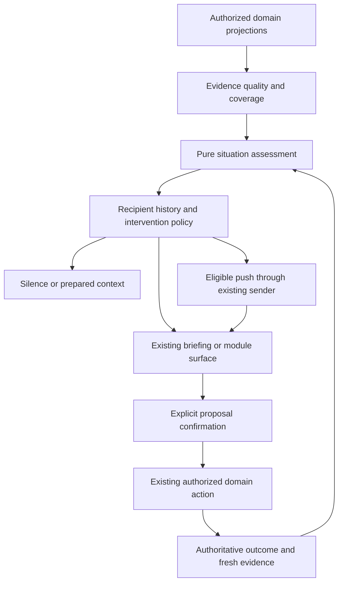

> Archived study. Current ownership and execution criteria live in the [PM index](<../../../_index.md>); unchecked boxes here are historical proposals.

# Proactive ERA — Architectural Leverage

**Extend the planned E-04 signal contract into a bounded assessment of a situation.** It should carry evidence quality, the decision at stake, a stable identity, the window in which help remains useful, and conditions that invalidate it. Reuse the planned E-05 recipient notification receipt for surfaced situations. Start with pure functions and existing stores.

This is the technical recommendation of the [Intelligence Model](<Proactive ERA — Intelligence Model.md>). Evidence cutoff `83e44be`, inspected 2026-09-06; `src`/`migrations` have no delta from prior ASTRA `3106164`. The [Master Plan](<../../Plans/ERA Top Layer — Master Plan (2026-09-02).md>) remains the execution contract. All interfaces and lifecycle behavior below are **proposed**, not implemented or deployed. [Experiments](<Proactive ERA — Experiments.md>) controls whether the extension deserves admission.

## 1. Why this is the smallest useful move

ERA already has domain calculations, an action registry, structured AI proposals, domain histories, notification identities and transport. What it lacks is a shared answer to: **what conclusion is justified for this person now, what could they still do, and what would make the conclusion change?**

The previous [Top Layer architecture](<../Top Layer/Top Layer — ASTRA Architecture.md>), §4–5, supplies completeness-bearing facts and a delivery state machine. Neither alone prevents a freshly stored default from becoming evidence, multiple goals from claiming the same money, or an unchanged concern from resurfacing every morning. The proposed assessment makes those distinctions explicit without copying domain state into another system.

| Existing seam | Reuse | Required qualification |
|---|---|---|
| `src/lib/ai/context.ts` | Location for shared context assembly; independent reads already parallelize | Current Budget context drops read errors and loses accounting fields; Schedule reads capped parent rows without full occurrence semantics. Do not promote current output directly into facts. |
| `src/features/recurring/commitments.ts` | Status, candidate-match reasons, billing period | Preserve candidate versus confirmed coverage; do not let one transaction silently cover two obligations. |
| Existing Schedule expansion + planned canonical day adapter | Occurrence truth | E-04 must consume the repaired owner adapter, including placements/pauses/exceptions. No third recurrence engine. |
| `src/features/era/capabilities/registry.ts` | Capability IDs, Zod slots, existing resolver ownership | Entries mix descriptors and execution. A background evaluator must not call client resolvers or React-bound money submission. |
| `src/lib/ai/eraAskProposal.ts:266–360` | Structured parsing, capability/reference validation | Validate evidence/relations as well as slot shape; a fallback model's prose is not a safe proactive claim. |
| `notifications` (`schema.sql:707–744`) | Recipient row, grouping, expiry, source links, `action_data`, snooze and push status | Add the reviewed claim/recovery semantics E-05 already needs. Existing columns are not proof of atomic deduplication or a current deployed policy. |
| `era_messages.intent_payload`, `era_actions` | Proposal context and concise action history | Carry accepted E-11 authoritative outcomes. Activity remains incomplete and best-effort. |

Sources: [context](<../../../../../src/lib/ai/context.ts>), [commitments](<../../../../../src/features/recurring/commitments.ts>), [registry](<../../../../../src/features/era/capabilities/registry.ts>), [proposal validation](<../../../../../src/lib/ai/eraAskProposal.ts>), [schema](<../../../../../migrations/schema.sql>), [dispatcher](<../../../../../src/features/era/intents/resolveIntent.ts>).

## 2. Contract: evidence before assessment

Do not require every table to acquire every field. Have domain adapters project only what the first detectors need. Mark unknown metadata explicitly. The following is a contract sketch, not a migration or executable implementation.

| Evidence field | Meaning and discipline |
|---|---|
| `ref` | Domain + entity ID + stable occurrence/version where relevant. Record identity is not a display title. |
| `subject`, `viewer`, `purpose` | Who the fact concerns, who may receive it, and what limited projection is permitted. A household link is not blanket authorization. |
| `value`, `unit`, `resourceRef`, `claimKind` | Preserve money currency/account, minutes/person, dates/timezone and accounting meaning: posted effect, obligation, candidate match, asserted goal progress, optional plan. |
| `basis` | At field level when material: domain-recorded outcome, explicit assertion, default, deterministic derivation, model interpretation, or legacy-unknown. |
| `observedAt`, `recordedAt`, `fetchedAt` | Separate physical/user observation from persistence and retrieval. A fresh fetch never resets observation age. Nullable is meaningful. |
| `coverage` | Available/partial/unavailable, requested range, actual covered range, truncation, source watermark and relevant omissions. Complete means complete **for this query contract**, not complete household life. |
| `revision`, `dependencies` | Source revision or canonical hash of decision-relevant fields, adapter version and references supporting a derivation. Do not hash prose or unrelated `updated_at` changes. |
| `validity` | When this evidence can support this purpose; source-specific invalidators and refresh deadline. No universal 24-hour fact TTL. |

A derived field inherits the weakest necessary evidence, not a model's confidence. Adding correlated defaults cannot raise confidence. Legacy `actual_*` logs cannot be retrospectively relabelled as measured or unedited; that distinction was not recorded ([cooking feedback](<../../../../../src/components/web/RecipeCookingMode.tsx>), lines 524–551). The least intrusive future correction is to omit untouched “actuals” or record their basis without adding a required capture step. That correction needs its own scoped implementation.

**Adapters must be read-only by effect.** [GET debts](<../../../../../src/app/api/debts/route.ts>), lines 21–34, archives old open rows; [GET Hub messages](<../../../../../src/app/api/hub/messages/route.ts>), lines 414–449, writes read receipts by default. A background context fetch could change obligations or make a user appear informed. Audit endpoints before reuse. Extract a side-effect-free domain reader or use an explicitly supported read-only mode; do not reproduce a server-admin back door or execute live probes in this study.

## 3. Contract: a situation assessment

| Field | Proposed meaning |
|---|---|
| `situationKey` | Stable kind + authorized subject/resource + anchor IDs + canonical occurrence/period. Independent of notification date and wording. |
| `recipientKey` | Person whose attention is at issue; one logical situation can have different permitted projections for two people. |
| `evidenceRevision` | Hash of the necessary decision fields plus detector version. It changes when the conclusion or options can change. |
| `claim` | Small typed conclusion: recorded conflict, uncovered commitment, conditional preparation option, known resolution, insufficient evidence. |
| `support` | References, reproducible predicate/calculation, assumptions, blocking unknowns and the alternatives actually checked. No free-floating probability. |
| `window` | Earliest useful presentation, latest useful action (possibly a range/unknown), expiry and next meaningful evaluation time. |
| `options` | Zero or a few available responses: existing module door, one question, or a validated candidate capability with preconditions. |
| `invalidators` | Completion, deletion, reschedule, changed price/currency/funding, revoked access, corrected observation or elapsed window. |
| `reconsideration` | Material evidence change, explicitly chosen snooze time, or a justified escalation boundary. Routine refetch is not novelty. |

The assessment has **no mutation authority**. It is safe to recompute. An unsupported relation can be held as a candidate for confirmation, but cannot become a factual interruption. Its support record should let a developer replay why ERA reached the conclusion without saving raw private chat in a new store. A detector-version change triggers reevaluation for correctness; it does not itself justify renewed interruption. That requires a material change in conclusion, options or a justified escalation boundary.

## 4. Resource claims are not interchangeable facts

This contract prevents two particularly tempting errors:

- **Money:** `current_saved` in Future Purchases is recorded progress; its allocation endpoint does not transfer or reserve cash. An outstanding debt in the inspected create flow is money owed **to** the user, not an automatically expected inflow or general household liability. A plausible recurring match is not a confirmed payment. Keep those claim kinds separate from account balance.
- **Time:** an event interval occupies a particular person's recorded schedule; an estimated task duration is a planning estimate; a date-only meal is not a fixed dinner time; `rest` is an explicit day preference, not zero capacity. Passive cooking time and hands-on effort are different resources.

Sources: [goal allocation](<../../../../../src/app/api/future-purchases/[id]/allocate/route.ts>), lines 57–104; [debts](<../../../../../src/app/api/debts/route.ts>), lines 115–117; [commitment types](<../../../../../src/features/recurring/commitments.ts>), lines 3–52; [day-plan types](<../../../../../src/features/day-plan/types.ts>), lines 1–25; [recipe steps](<../../../../../src/types/recipe.ts>), lines 18–25.

**Synthetic money witness:** checked USD account balance $500 **before pending claims**, distinct unpaid USD obligations $300 **not already reflected in that baseline**, two optional purchases of $150 against the same account. Each purchase fits the $200 remainder alone; together they exceed it by $100. A goal's `current_saved=$150` cannot resolve the conflict until its funding meaning is known. The production balance endpoint already subtracts drafts (`accounts/[id]/balance/route.ts:58–84`); using that output and subtracting those claims again would be wrong. No currency conversion, balance write or reservation is implied.

**Synthetic time witness:** within a recorded 18:00–19:00 window, two tasks estimated at 45 minutes each cannot both fit under those estimates for the same person. This is a conditional planning conflict, not proof of physical impossibility. For different people it may be feasible. Missing travel time prevents claiming the whole interval is available.

Check the candidate set needed for a real decision. Do not build a global optimizer, a new balance ledger or a universal resource-reservation system to demonstrate these two cases.

## 5. Evaluation and intervention are separate

Evaluate on existing planned scheduler ticks and relevant committed changes. Time is itself an input: no row needs to change for a preparation window to close. A first implementation can use bounded periodic snapshots; it does not need change-data capture. Capture mutations should invalidate relevant queries and allow a later reevaluation, without placing reasoning calls on the capture critical path.

Honor D1: the planned scheduler is `pg_cron`/`pg_net` invoking authenticated routes. Its existence and liveness require owner evidence. Do not create a cron per opportunity. Keep cadence-aware job health separate from whether a source loaded, an assessment was valid, or an intervention arrived.

The policy returns a response and machine-readable reason, not merely `shouldNotify`. An unchanged valid fact can remain silent for days. If optional AI enrichment fails, a deterministic core can survive. If a necessary suppression or access read fails, delivery must stop. See [Silence, Trust & Intervention](<Proactive ERA — Silence, Trust & Intervention.md>).

## 6. Persist less than the whole model

**First version:** assessments remain recomputable. Persist the bounded evidence snapshot and situation references **only when materializing an existing briefing/notification or a reviewable proposal**, using E-05's reviewed notification envelope (`action_data`) and E-11's existing message/action metadata. A daily briefing has a daily identity; each situation inside it retains its own identity across days. Do not use an item/alert key without occurrence identity.

A receipt records situation key, recipient, evidence revision, presentation time/channel, explicit snooze/dismissal/response if supplied, and linked domain outcome identity. Read relevant retained receipts across briefing dates before resurfacing. Index/retention choices belong to E-05's manual schema review; source column existence does not establish the required index, uniqueness or atomic update. Do not manufacture hidden notification rows solely to make an event store out of them.

Three integration details prevent a false reuse claim. First, feedback/exposure is **per situation**, not inferred from the containing briefing's read/dismiss flags; current notification actions target a whole `notification_id`. Bundled feedback needs an atomic merge or compare-and-set contract for each situation. Until reviewed, the proof can use one visible situation per real notification or feedback on its linked proposal. Second, daily briefing uniqueness does not protect recipient+situation claims across days/kinds or concurrent evaluators. E-05 must review that claim boundary; a serialized shadow prototype can explore behavior but cannot certify cross-process uniqueness. Third, the current in-app list excludes dismissed, expired and snoozed rows and defaults to 20 (`notifications/in-app/route.ts:106,125–129`). It cannot serve as suppression history. Use a bounded recipient-scoped internal history reader with retention covering the episode/snooze window; retain minimal receipt identity after content expiry when justified. None of these changes exists today.

Silently recomputed candidates need no durable suppression until somebody has seen or decided something. Prepared context can expire and be regenerated. Keep only bounded diagnostic samples in a future shadow experiment. If an experiment proves that **never-surfaced, long-lived preparation** must survive restart, or that cross-briefing feedback cannot be represented coherently, consider one narrowly scoped situation-state store then. It must hold lifecycle/receipts, not duplicate money, recurrence, private chat or household truth. This is a deferred design decision, not an asserted no-migration solution.

Maintain two independent progress tracks:

| Knowledge state | Meaning |
|---|---|
| Open / conditional / blocked | Evidence still warrants concern, or a pivotal fact is missing. |
| Resolved | Authorized domain evidence satisfies the resolution predicate. A dismissed card is insufficient. |
| Invalidated / expired | Source/access/window no longer supports the old assessment; retract or recompute. |

| Recipient-effect state | Meaning |
|---|---|
| Prepared / stored | Content exists; no exposure claim. |
| Claimed / transport accepted / unknown / failed | Delivery attempt ownership and recovery. |
| Returned / displayed / opened / explicitly acknowledged | Distinct observations; keep the strongest evidence actually available. |
| Proposal accepted / domain applied / reversed | Separate action lifecycle under E-11; link the real domain result. |

Exactly-once applies to **logical identities and protected domain effects**, not an external push magically becoming transactional. Crash after transport acceptance before receipt persistence leaves an unknown outcome. Retry with the same notification identity and expiry; never rerun a domain action because transport is uncertain.

## 7. AI as a bounded interpreter

Reuse the current provider wrapper and proposal validation. Proposed input: a small permitted evidence bundle, the decision under consideration, existing capability descriptors and explicit unknowns. Proposed output: candidate relation/step, evidence references, assumptions, one discriminating question or a finite plan. No arbitrary tool graph, generated SQL, autonomous action chain or model-written detector code.

The validator checks:

1. Every referenced entity exists in the permitted projection; the model cannot broaden audience or select an unprovided private ID.
2. A claimed observation has an appropriate basis and a typed domain predicate can reproduce any automatically asserted conclusion. Citation presence cannot prove arbitrary semantic entailment; a novel free-text dependency remains an assumption until explicitly accepted. Experiment success evaluates usefulness, not a general truth guarantee.
3. Dependency references are valid and acyclic where ordering is used; parallel/passive versus hands-on work is explicit before timing calculations.
4. Amounts, time windows and feasible alternatives are recalculated mechanically.
5. Proposed capabilities exist and pass their schemas; authoritative permission and source versions are rechecked at confirmation.

This could replace a long tail of title heuristics or one-off preparation rules, **if the experiment passes**. It should not replace occurrence expansion, currency logic, privacy policy or suppression. The current schedule-suggestion endpoint's date-set avoidance and hardcoded confidence are not a trustworthy optimizer to activate ([suggest-schedule](<../../../../../src/app/api/suggest-schedule/route.ts>), lines 124–167, 247–252 and 325–373).

D3 still forbids LLM briefing phrasing before E-07; E-07's true usage accounting and existing quotas precede a live automatic model consumer. Use deterministic composition first. Model versions/configuration and input evidence hashes belong in experiment receipts. No model upgrade or API migration is necessary to test the architectural idea with fixtures.

## 8. Proof and integration boundaries

| Proposed move | Existing ownership | Smallest proof | Scheduling disposition |
|---|---|---|---|
| Evidence + assessment contract | E-04/HUB-41; domain facts under BUD-66, SCH-4.3b, Kitchen coverage | Three pure cases: commitment review, conditional meal/time conflict, competing claims; fail unavailable and default-as-measured variants | Research refinement; no new task. Keep each production slice within existing packet limits. |
| Cross-day recipient receipt + retraction | E-05/HUB-42, E-06, E-19; Notifications | Same situation after restart stays quiet; changed source reopens; failed first push can recover without duplicate domain effect | Refines existing delivery work; C01/C03 remain gates. |
| Preparation-relation interpreter | ERA proposal seam + Kitchen/Schedule/Trips owners | Blind comparison against simple deterministic rules; zero invented authorized facts/actions, measurable extra useful relations | NEW experiment, unallocated. Live model use only after E-07 and admission. |

Initial read-only proofs do not require repairing every monetary mutation or activating Trips. Action proposals do require the applicable atomic/idempotent domain contract. A passive document-expiry fact does not depend on pantry automation; a cash-affordability claim does depend on financial truth. Prerequisites should follow the **claim made**, not block the whole study indiscriminately.

Before any production DB implementation, the owner supplies current schema/policies/functions and applies reviewed migration SQL manually. This study writes no SQL, calls no production endpoint, changes no code and certifies no deployment.

## 9. What not to build

No general household digital twin, graph database, new event bus, second notification center, second offline queue, autonomous multi-action executor, per-domain assistant or inferred productivity score. No source-data collection project justified solely by potential future AI value. No permanent suppression that silently outlives a changed obligation. No extra prose in the existing UI to explain internal evidence contracts.

The decisive simplification is to organize around a few **decisions with warrants and expiry**, not a catalog of detectors that each invents its own confidence, state and delivery rules. If three producers can share pure functions and existing receipts, stop there.
