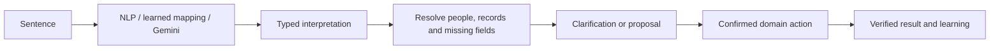

**Not currently.** I tested your exact sentence against ERA’s current routing:

> “I took 300$ from Drawer”

It produces a clarification on the Budget face and an unknown intent on the other faces. With no learned vocabulary, it also misses the automatic AI escalation path.

“Transfer $300 from Drawer to Wallet” does parse. But there is a more revealing gap: **transfers exist in the native parser and are absent from the 13-capability registry used by AI proposals and learned phrases.** Different interpretation paths therefore know different parts of your application. [Current registry](/C:/Users/aoune/WebApp/budget-app/src/features/era/capabilities/registry.ts:219)

I saved the full [study, evidence, and proposed delivery sequence](</C:/Users/aoune/WebApp/budget-app/ERA Notes/10 - Project Management/Research/ERA Capability Understanding and Learning.md>). The central recommendation is to develop ERA’s existing capability registry into the shared definition of what the application can do.

**Your example contains two separate understanding problems.**

First: recognizing that “took money from Drawer” probably describes moving cash between accounts.

Second: knowing that its destination is Wallet.

The sentence supplies the amount and source. **Wallet comes from your personal convention, not from the sentence.** ERA should learn that convention, while recognizing when it does not apply.

The first interaction could be:

> **You:** I took 300$ from Drawer  
> **ERA:** $300 · Drawer → ?  
> `Wallet` · `Choose`
>
> **You:** Wallet  
> **ERA:** $300 · Drawer → Wallet  
> `Confirm` · `Change`

An optional `Remember` control establishes the default. Next time, ERA goes straight to the completed transfer proposal.

That is the learning curve you want: **fewer questions over time, with the same correctness requirements.**

---

ERA needs three distinct kinds of knowledge:

| Knowledge                   | What ERA needs to know                                                                                      | How it gets it                                     |
| --------------------------- | ----------------------------------------------------------------------------------------------------------- | -------------------------------------------------- |
| **Application meaning**     | What a transfer, expense, debt settlement, meal assignment, or recurring-payment confirmation actually does | Developer-maintained capability contracts          |
| **Current household facts** | Which accounts exist, who owns them, which records are accessible, current state                            | Authoritative application reads                    |
| **Personal interpretation** | What you mean by “my wallet,” “refill,” or an omitted destination                                           | Explicit preferences and correction-based learning |

These must remain distinct. A remembered preference cannot establish a current balance, grant permission, or invent a missing feature.

Your Feature Map, Atlas, and architecture notes are useful for inventorying functionality. However, **the application’s meaning cannot be derived reliably from its routes or documentation alone.**

For example, “I paid rent” could mean:

- Record a new expense.
- Confirm an existing draft.
- Associate an existing transaction with a recurring payment.

The application must tell ERA how these operations differ and how to avoid recording the same payment twice.

**The capability contract is where “everything fits.”**

You already have the beginning of this in `ERA_CAPABILITIES`: IDs, schemas, executors, and descriptions. Extend that foundation so every exposed operation answers:

| Contract question                    | Transfer example                                        |
| ------------------------------------ | ------------------------------------------------------- |
| What does this mean?                 | Record money moving between accounts                    |
| When should it be selected?          | Moving cash, refilling Wallet                           |
| What similar actions differ?         | Spending, borrowing, repayment, balance correction      |
| What information is required?        | Amount, currency, source, destination                   |
| Whose records are involved?          | Requester and both account owners                       |
| What must be checked?                | Access, account identity, currency rules, current state |
| What changes?                        | Transfer record, both balance effects, required history |
| How is it confirmed and corrected?   | Resolved proposal, verified result, supported inverse   |
| What happens after retry or failure? | Recover the same operation, avoid duplicates            |
| Is ERA actually able to do it?       | Executable, read-only, navigation-only, or unavailable  |

This is more useful than a table saying:

> “took” → transfer endpoint

It gives every interpreter the same functional vocabulary.

NLP, learned mappings, and Gemini should all produce the same proposed operation:

The source module remains responsible for correctness. Budget owns money effects; Schedule owns occurrence semantics; Kitchen owns ingredient and inventory rules. ERA coordinates those operations.

Google’s documentation makes the same architectural distinction: the model selects a function and arguments, while the application executes it. Structured output validates shape but does not guarantee correct meaning. This can be built using your existing Gemini setup. [Function calling](https://ai.google.dev/gemini-api/docs/function-calling), [structured outputs](https://ai.google.dev/gemini-api/docs/structured-output)

**Learning must retain meaning, not merely wording.**

Your current learner replaces slot values that appear literally in the original phrase. Values derived through interpretation can disappear.

I reproduced this example locally:

- Original phrase: “let me see Friday”
- Interpreted argument: `dateISO: "2026-10-02"`
- Learned phrase: no date slot, because the ISO value does not occur in the sentence.
- The capability accepts a missing date, which means today.

This demonstrates a contract gap, not an observed production incident. It shows why “the action succeeded, save the phrase” is insufficient. [Current learner](/C:/Users/aoune/WebApp/budget-app/src/features/era/templates/learn.ts:65)

For Drawer, the learned meaning should resemble:

> For this person, when reporting cash taken from this Drawer account, with no destination or conflicting recipient/purpose, suggest this person’s Wallet.

It should preserve:

- The intended capability.
- Variable fields, such as amount.
- Resolved entity references.
- Accepted defaults and their conditions.
- Who taught it.
- Whether it was a one-time correction or a persistent preference.
- When the rule becomes invalid.

Consequently:

| Later sentence                          | Expected behavior                                               |
| --------------------------------------- | --------------------------------------------------------------- |
| “I took $200 from Drawer”               | Suggest the learned Wallet destination                          |
| “I took $200 from Drawer to Savings”    | Explicit Savings overrides the default                          |
| “My partner took $200 from Drawer”      | Resolve the partner context; do not reuse your Wallet blindly   |
| “I took $200 from Drawer for groceries” | Determine whether this reports cash movement or actual spending |
| “Forget that rule”                      | Stop applying the default                                       |

A correction to one action should not automatically establish a permanent rule. An explicit instruction can establish one immediately; repeated behavior can justify offering one.

You do not need model retraining for this first useful version. Scoped, inspectable preferences and structured mappings provide a practical learning mechanism.

**Conversation repair must become a supported operation.**

ERA should understand:

> “No, a transfer.”  
> “The other wallet.”  
> “Make it $200.”  
> “Only this time.”  
> “Cancel that.”

Before execution, these modify the same proposal. After execution, they invoke the source module’s supported correction or inverse.

Also, a confidently wrong native match must be correctable. Escalating only when the parser returns `unknown` cannot address cases where it confidently chooses the wrong feature.

Your current pending-question handling is narrow: when ERA asks for a reminder time, the whole next sentence is treated as its answer. A broader conversation state should distinguish **answer, correction, cancellation, and new request**. A new request can suspend the previous proposal instead of being swallowed by it. [Current turn handling](/C:/Users/aoune/WebApp/budget-app/src/features/era/useEraTurn.ts:134)

These are separate requirements from remembering chat history. Human–AI interaction research likewise distinguishes correction, recent context, learning over time, and controls over adaptation. [Microsoft’s guidelines](https://www.microsoft.com/en-us/research/wp-content/uploads/2019/01/Guidelines-for-Human-AI-Interaction-camera-ready.pdf)

**Household understanding requires several separate identities.**

For each action, ERA needs to distinguish:

- Who is speaking.
- Who owns the affected record.
- Who the action concerns.
- Who is assigned responsibility.
- Who can see it.
- Who is allowed to change it.

Those roles sometimes coincide and sometimes do not.

Both of you might say “my wallet,” with different correct accounts. A shared Drawer does not make every receiving account shared. Seeing a partner’s reminder does not inherently grant authority to modify it.

Personal defaults should therefore belong to the person by default. Household conventions need an explicit household scope. Current access must be checked when resolving data and again before execution; remembered access is insufficient.

**Junction features need explicit workflows.**

Consider:

> “Plan pasta Friday and add what we need.”

A supported workflow could:

1. Resolve the recipe and date.
2. Assign the meal.
3. Determine missing ingredients from available inventory evidence.
4. Add deduplicated shopping entries.

That sentence does not automatically authorize an expense or a reminder. Unknown inventory must not become “we have none.”

Each step needs a clear result and recovery behavior. If the meal is assigned but shopping fails, ERA should report that and retry only shopping. A general “Done” would hide the actual state.

Start with a few named workflows over existing domain operations. This gives ERA cross-module ability while keeping each module’s rules authoritative.

**I would work toward this in the following order.**

1. **Inventory the capability gaps and unify outcomes.** Compare precision-form functionality, native intents, and the AI registry. Distinguish completed, awaiting clarification, awaiting confirmation, queued, failed, uncertain, and partial outcomes. Existing **HUB-47/HUB-64** already cover important learning and target-safety gaps.

2. **Complete Drawer → Wallet as the first full slice.** Include recognition, account resolution, missing-destination clarification, confirmation, actual transfer result, correction, and a personal default. Verify the underlying money/retry/inverse behavior before broadening access.

3. **Generalize only what that slice proves necessary.** Reuse the same clarification and learning contract for spending, one-time reminders, reminder edits, and shopping additions.

4. **Prove household behavior, then one junction workflow.** Test both people with different defaults and identical account names. Test changed permissions and partial workflow failures.

5. **Make capability coverage part of feature delivery.** Every future feature declares its ERA capability or intentional exclusion. A feature should not silently exist in a form while remaining unknown to the assistant.

For evaluation, use real household phrases and test sequences—not just isolated sentences:

> First attempt → clarification → correction → accepted preference → unseen paraphrase → explicit override → forgotten preference.

Measure correct final state, recovery after correction, repeated questions, wrong-person mappings, duplicate actions, latency, and cost.

For the transfer pilot, an illustrative acceptance case is:

> Drawer $1,000 / Wallet $100  
> Confirm $300 transfer → Drawer $700 / Wallet $400  
> Retry → unchanged  
> Supported reversal → $1,000 / $100  
> Spending totals → unchanged

The engineering target is **an assistant that knows its supported operations, can resolve uncertainty with you, and retains the meaning of what you taught it**.

The study is complete; application code is unchanged. Local verification passed **144 tests**, and documentation checks passed. Live database behavior, model responses, and device interactions were not exercised.
