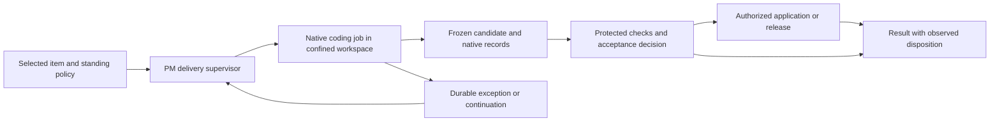

I found **16 subjects worth commissioning**, ranked by their potential to change ERA’s direction or eliminate substantial future work. I checked them against the completed ASTRA, Proactive ERA, Unknown Unknowns and Delivery V2 studies; the distinctions below are deliberate.

This was a read-only investigation of repository documentation, implementation, tests and history. Live database and device behaviour remain unverified.

### 1. Whose agreement creates a household commitment?

**Core question:** Which actions may either partner make independently, which represent requests to the other person, and which establish a joint commitment?

**Why it matters:** This determines what a shared assistant may legitimately automate—and could simplify permissions once the household’s actual agreement is explicit.

**Why Astra:** Authentication, shared visibility and social authority are different concepts. Resolving their relationship requires reasoning across money, responsibility, meals and private preferences.

**Repository signal:** Shared accounts grant partner write access; the item override asks the _acting person_ to approve acting on someone else’s behalf. Existing studies address access and attribution more fully than agreement. See [account access](C:/Users/aoune/WebApp/budget-app/src/lib/accountAccess.ts:97) and [partner override](C:/Users/aoune/WebApp/budget-app/src/features/items/useItemActions.ts:809).

**Potential payoff:** product transformation, reliability/trust, autonomy.

**Novelty:** `NEW`

### 2. Should ERA own an agent runtime at all?

**Core question:** Which delivery responsibilities warrant permanent custom ownership, and which could be delegated to replaceable coding environments while ERA retains intent, constraints, evidence and history?

**Why it matters:** The answer could eliminate much of the proposed V2’s construction and continuing maintenance—or establish precisely why owning it is worthwhile.

**Why Astra:** This requires separating guarantees unique to ERA from historical tooling choices and evaluating consequences across several generations of providers.

**Repository signal, corrected 2026-09-06:** The original V2 comparison considered repairing V1, refactoring V1 or building an owned V2 core. It already delegated engineering to a native conversation; the missing comparison was whether ERA should govern whole jobs and results while delegating more of execution. The accepted V2.1 refactor now makes that boundary explicit in [Architecture](<../ERA Notes/10 - Project Management/_Archive/Studies/Autonomous Delivery/PM Delivery — V2 Architecture.md>), [executor qualification](<../ERA Notes/10 - Project Management/_Archive/Studies/Autonomous Delivery/PM Delivery — Context & Agent Model.md>) and [Migration Strategy](<../ERA Notes/10 - Project Management/_Archive/Studies/Autonomous Delivery/PM Delivery — Migration Strategy.md>).

**Reassessment accepted and integrated:** the [independent recommendation and evidence](#point-2-reassessment) led to the ten-file V2.1 plan and its bounded [Execution Portfolio](<../ERA Notes/10 - Project Management/_Archive/Studies/Autonomous Delivery/PM Delivery — Execution Portfolio.md>). ERA supervises native jobs, authorization, resources, protected verification and truthful disposition. The plan is documented; no V2 implementation or V1 operational policy change occurred.

**Potential payoff:** simplification, owner-effort reduction, cost reduction, architectural leverage.

**Novelty:** `RETHINK`

### 3. Is ERA teaching the household to speak its implementation?

**Core question:** Which lexical routers, vocabulary gates and taught templates remain worthwhile as language models improve? Could language interpretation change substantially while domain execution remains constrained?

**Why it matters:** ERA might remove growing parsing and teaching complexity instead of continually expanding it.

**Why Astra:** The tradeoff spans generalization, offline operation, latency, inference expense, correction burden and wrong-action risk. Neither “keep deterministic parsing” nor “replace it with AI” settles it.

**Repository signal:** Brain routing manually mirrors other domains’ vocabulary, while capability tokenization uses ASCII letters. The speech path also fixes recognition to English. See [cross-domain vocabulary](C:/Users/aoune/WebApp/budget-app/src/features/era/intents/brain.ts:21) and [tokenization](C:/Users/aoune/WebApp/budget-app/src/features/era/capabilities/vocab.ts:114). Previous studies investigate template defects, rather than the architecture’s continuing economic justification.

**Potential payoff:** simplification, owner-effort reduction, future capability, cost reduction.

**Novelty:** `RETHINK`

### 4. What should Undo mean after somebody else has acted?

**Core question:** Should Undo restore an old state, reverse only your contribution, preserve subsequent decisions, or refuse once another person or automation has relied on the action?

**Why it matters:** Exactly-once execution and atomic writes cannot determine whose valid intention should survive.

**Why Astra:** The correct inverse depends on causality and domain meaning across shared money, schedules and physical activities. One universal rollback policy could encode the wrong answer.

**Repository signal:** Packing checkpoints reapply stored quantities to current rows, while statement reversion explicitly preserves newer human edits. These are competing approaches to reversal already present in ERA. See [packing restoration](C:/Users/aoune/WebApp/budget-app/src/app/api/trips/[id]/packing/checkpoint/revert/route.ts:39) and [newer-edit preservation test](C:/Users/aoune/WebApp/budget-app/src/lib/statement-revert.test.ts:162).

**Potential payoff:** reliability/trust, architectural leverage, autonomy.

**Novelty:** `DEEPER`

### 5. Could the household continue without ERA’s creator or deployment?

**Core question:** What must either partner retain to manage household life if the original deployment, provider account or creator’s technical involvement becomes unavailable?

**Why it matters:** Years of information can remain backed up yet unusable. This could change what ERA preserves, makes portable and requires someone to maintain.

**Why Astra:** Recovering an application and preserving intelligible household knowledge are different problems, complicated by private material and unfinished work.

**Repository signal:** An earlier sovereignty proposal lowers export priority if provider backups are verified. Yet valuable information also lives in private document objects, external calendar projections and local statement-review sessions. See [sovereignty assumption](<C:/Users/aoune/WebApp/budget-app/ERA Notes/01 - Architecture/FABLED 2/4 - FABLED 2 — Future Enhancements.md:46>) and [local review state](C:/Users/aoune/WebApp/budget-app/src/lib/statementImportSession.ts:108).

**Potential payoff:** reliability/trust, owner-effort reduction, simplification, future capability.

**Novelty:** `RETHINK`

### 6. What exactly does Confirm authorize?

**Core question:** How should ERA separate instructions from imported or remembered content, and establish that the action being authorized matches the words the person sees?

**Why it matters:** Valid IDs and schemas can accompany misleading descriptions. Increasing capability coverage increases the consequence of that gap.

**Why Astra:** This joins adversarial input, prompt construction, interface meaning and execution authority; adding another validation schema would not resolve the whole chain.

**Repository signal:** Household text enters the system prompt. Proposal validation preserves model-written text separately from validated capability arguments; the confirmation surface displays that text. See [proposal validation](C:/Users/aoune/WebApp/budget-app/src/lib/ai/eraAskProposal.ts:325) and [confirmation display](C:/Users/aoune/WebApp/budget-app/src/components/era/EraShell.tsx:525). Unknown Unknowns examines learning _after_ confirmation; this concerns the authorization itself.

**Potential payoff:** reliability/trust, future capability, unknown risk.

**Novelty:** `NEW`

### 7. Is conversation actually ERA’s cheapest interface?

**Core question:** Should ERA increase conversational capture, or minimize total recording, correction, review and reconciliation effort regardless of interface?

**Why it matters:** The answer could change the product’s primary interface and eliminate planned interaction work.

**Why Astra:** A useful comparison must account for displaced effort across imports, shorthand, forms and conversation. Usage counts cannot establish that counterfactual.

**Repository signal:** The Master Plan targets an increasing share of transactions captured through ERA. The Doctrine instead makes attention saved the governing objective, while existing interfaces support batch and structured capture. See [capture-share target](<C:/Users/aoune/WebApp/budget-app/ERA Notes/10 - Project Management/_Archive/Plans/ERA Top Layer — Master Plan (2026-09-02).md:373>) and [product doctrine](<C:/Users/aoune/WebApp/budget-app/ERA Notes/01 - Architecture/Design Doctrine.md:19>). Proactive studies challenge intervention metrics, but leave this reactive capture assumption largely intact.

**Potential payoff:** product transformation, simplification, owner-effort reduction.

**Novelty:** `RETHINK`

### 8. Could reusable household procedures replace families of future features?

**Core question:** Should recurring household processes become durable, reusable knowledge with participants, progress and exceptions—or remain separately implemented module behaviour?

**Why it matters:** Renewals, preparation, maintenance and other processes might become possible without bespoke features for every variation.

**Why Astra:** The difficult boundary is between useful procedural reuse, unreliable AI improvisation and an overbuilt workflow platform.

**Repository signal:** Recipe steps encode dependencies and parallelism; catalogue documents retain prerequisite information; dormant items have a separate condition engine. See [recipe procedures](C:/Users/aoune/WebApp/budget-app/src/types/recipe.ts:18), [document knowledge](C:/Users/aoune/WebApp/budget-app/src/types/catalogue.ts:541) and [prerequisite evaluation](C:/Users/aoune/WebApp/budget-app/src/lib/prerequisites/engine.ts:35). Previous proactive work explores generated preparation plans, leaving persistent procedural ownership unresolved.

**Potential payoff:** architectural leverage, simplification, future capability, product transformation.

**Novelty:** `DEEPER`

### 9. What makes a possession the same thing throughout its life?

**Core question:** How should ERA distinguish a product type, a purchased instance, stock, a garment and a packing entry—and preserve appropriate continuity through acquisition, use, repair and disposal?

**Why it matters:** This could replace repeated entry and disconnected histories with useful continuity across existing and future modules.

**Why Astra:** Shared identity can create powerful reuse, but collapsing distinct objects or quantities creates false knowledge. The boundary requires reasoning across physical and digital lifecycles.

**Repository signal:** Inventory is anchored to catalogue items, wardrobe has its own identity, and packing accepts optional inventory/catalogue references. See [inventory model](C:/Users/aoune/WebApp/budget-app/src/types/inventory.ts:34), [wardrobe model](C:/Users/aoune/WebApp/budget-app/src/features/outfits/types.ts:34) and [packing model](C:/Users/aoune/WebApp/budget-app/src/types/trips.ts:57). Existing ingredient-mapping work addresses only one part of this larger identity problem.

**Potential payoff:** architectural leverage, owner-effort reduction, future capability, simplification.

**Novelty:** `DEEPER`

### 10. Which commitments should ERA help end?

**Core question:** When should a recurring obligation be renewed, renegotiated or retired? How should ERA distinguish an enduring necessity from a preference whose relevance has expired?

**Why it matters:** ERA could reduce the household’s obligations instead of making an ever-growing set easier to administer.

**Why Astra:** Repeated deferral can mean overload, poor timing, lost interest or an essential task becoming difficult. Those interpretations imply very different assistance.

**Repository signal:** Flexible routines accumulate missed-period information, while Focus advice prioritizes clearing overdue work. See [missed periods](C:/Users/aoune/WebApp/budget-app/src/features/items/useFlexibleRoutines.ts:390) and [fallback advice](C:/Users/aoune/WebApp/budget-app/src/app/api/focus-insights/route.ts:309). Proactive O9 already suggests smaller commitments; the deeper question is their continuing legitimacy and lifespan.

**Potential payoff:** product transformation, owner-effort reduction, simplification.

**Novelty:** `DEEPER`

### 11. Whose clock owns a commitment?

**Core question:** Does a commitment follow its venue, a travelling person, the household’s home timezone or a fixed instant? What happens when the partners occupy different local days?

**Why it matters:** A canonical recurrence engine cannot establish agreement until the temporal meaning of its inputs is settled.

**Why Astra:** This requires choosing among legitimate time models and understanding their interactions across trips, routines, billing and future medication schedules.

**Repository signal:** The wall-clock adjustment helper uses the executing device’s timezone; a bounded probe produced different UTC results in Beirut and New York. Trip itinerary records carry date/time without venue timezone. See [adjustment helper](C:/Users/aoune/WebApp/budget-app/src/lib/utils/date.ts:138) and [itinerary model](C:/Users/aoune/WebApp/budget-app/src/types/trips.ts:35). This extends previous binding-time questions beyond ordinary DST repair.

**Potential payoff:** reliability/trust, architectural leverage, future capability.

**Novelty:** `DEEPER`

### 12. What should “forget this” or “that was wrong” mean?

**Core question:** What should correction or deletion do once a fact has become a memory, transcript, learned rule, report or provider input?

**Why it matters:** Removing the original record may leave reusable copies—and conflicting versions of household knowledge.

**Why Astra:** Historical accuracy, privacy, learning and recoverability pull in different directions. Neither retaining everything nor erasing every trace is universally correct.

**Repository signal:** Memory responses include their values in text and metadata, which conversation handling persists; the deletion route targets the originating memory row. See [memory response](C:/Users/aoune/WebApp/budget-app/src/features/era/intents/resolvers/brain.ts:43), [transcript persistence](C:/Users/aoune/WebApp/budget-app/src/features/era/useEraTurn.ts:249) and [deletion](C:/Users/aoune/WebApp/budget-app/src/app/api/memories/[id]/route.ts:17). Prior privacy work covers proposal retraction, rather than this complete knowledge lifecycle.

**Potential payoff:** reliability/trust, architectural leverage, future capability, unknown risk.

**Novelty:** `DEEPER`

### 13. Who exists in ERA without an account?

**Core question:** Should the person concerned, account holder, caregiver, responsible actor and notification recipient be separate identities? Where does that distinction already matter?

**Why it matters:** ERA could support household care and coordination without forcing every person into an account model—or repeatedly inventing exceptions.

**Why Astra:** This changes relationships and authority across domains while preserving the simplicity of a small household application.

**Repository signal:** Healthcare already separates the managing user from a nullable account-holder identity, supporting dependents. Meals and packing primarily identify participants through user IDs. See [health identities](C:/Users/aoune/WebApp/budget-app/src/features/healthcare/types.ts:8) and [meal assignment](C:/Users/aoune/WebApp/budget-app/src/types/recipe.ts:314). Prior studies notice dependents but do not resolve the wider person model.

**Potential payoff:** architectural leverage, future capability, product transformation.

**Novelty:** `DEEPER`

### 14. Which capabilities need independent failure boundaries?

**Core question:** Can experimental intelligence, ordinary reminders and future medication support safely share the same infrastructure and release assumptions? Where does reuse cease to be the right tradeoff?

**Why it matters:** A convenience application may acquire responsibilities that require different guarantees, operational burden or deliberately limited scope.

**Why Astra:** This requires reasoning about shared causes of failure and the cost of stronger guarantees, rather than simply adding retries or another notification channel.

**Repository signal:** The medication design explicitly reuses urgent Items, recurrence and Google synchronization. That synchronization projects the same underlying schedule structures used elsewhere. See [medication architecture](<C:/Users/aoune/WebApp/budget-app/ERA Notes/10 - Project Management/Healthcare/Healthcare — Master Book.md:82>) and [calendar projection](C:/Users/aoune/WebApp/budget-app/src/lib/gcal/sync.ts:97). Existing studies examine dose identity and alarm evidence; architectural separation remains unanswered.

**Potential payoff:** reliability/trust, architectural leverage, unknown risk.

**Novelty:** `DEEPER`

### 15. How can an AI-maintained system change its own safeguards?

**Core question:** What evidence should permit changes to the policies, evaluators and execution controls that authorize and certify future autonomous work?

**Why it matters:** Safeguards adequate for one run can lose their justification through an approved change to the safeguarding mechanism itself.

**Why Astra:** This is recursive trust across revisions and model generations, beyond isolating one implementer from its tests.

**Repository signal:** The existing repository contains grading logic, tests and mutable policy sources together; see [acceptance tests](C:/Users/aoune/WebApp/budget-app/tests/delivery/acceptance.test.ts:52). The revised [V2.1 trust boundary](<../ERA Notes/10 - Project Management/_Archive/Studies/Autonomous Delivery/PM Delivery — V2 Architecture.md>) now explicitly requires changes to safeguards to be authorized under the prior trusted rules. The broader question remains how that authority evolves over time without certifying itself.

**Potential payoff:** autonomy, reliability/trust, future capability, unknown risk.

**Novelty:** `DEEPER`

### 16. How should engineering lessons gain—and lose—authority?

**Core question:** What should an incident become: a narrow observation, an executable invariant, a scoped rule or no general lesson? When should that lesson expire?

**Why it matters:** ERA’s institutional memory can preserve mistaken generalizations as effectively as useful discoveries, increasing both repeated errors and mandatory reading.

**Why Astra:** Distinguishing durable knowledge from overfitting requires interpreting contradictory history and connecting engineering practice with the product’s own learning failures.

**Repository signal:** The PM book documents an impossible universal Undo rule and claims migration pairing is mechanically enforced; the inspected migration hook prints reminders and exits successfully. See [rule audit](<C:/Users/aoune/WebApp/budget-app/ERA Notes/10 - Project Management/PM Tooling/PM Tooling — Master Book.md:82>) and [actual hook](C:/Users/aoune/WebApp/budget-app/.claude/hooks/check-migration.sh:13). This concerns justified generalization, beyond documentation freshness.

**Potential payoff:** reliability/trust, simplification, owner-effort reduction.

**Novelty:** `DEEPER`

# Top 10 Astra Opportunities

1. Whose agreement creates a household commitment?
2. Should ERA own an agent runtime at all?
3. Is ERA teaching the household to speak its implementation?
4. What should Undo mean after somebody else has acted?
5. Could the household continue without ERA’s creator or deployment?
6. What exactly does Confirm authorize?
7. Is conversation actually ERA’s cheapest interface?
8. Could reusable household procedures replace families of future features?
9. What makes a possession the same thing throughout its life?
10. Which commitments should ERA help end?

# If Astra disappeared tomorrow

1. **Household agreement and authority:** Weaker sessions can implement permissions while missing whether those permissions express the household’s intended decision rights.
2. **Ownership of the agent runtime:** This requires challenging the premise of an extensive, internally coherent V2 design and identifying which guarantees actually justify owning it.
3. **The language architecture:** Choosing what to retain or remove requires balancing generalization, deterministic execution, offline usefulness and lifetime maintenance without defaulting to an ideological answer.
4. **Undo after subsequent actions:** The difficult work is defining correct behaviour when several valid intentions interact, before any mechanism can enforce it.
5. **Household continuity without its operator:** This demands reconstructing the household’s essential knowledge across application, storage, device and human boundaries that individual module reviews naturally miss.

---

## Point 2 — Independent reassessment, 2026-09-06

> **Historical reasoning, now integrated.** The owner accepted this reassessment and commissioned the V2.1 documentation refactor. The canonical target and construction sequence are now [V2 Architecture](<../ERA Notes/10 - Project Management/_Archive/Studies/Autonomous Delivery/PM Delivery — V2 Architecture.md>) and [Execution Portfolio](<../ERA Notes/10 - Project Management/_Archive/Studies/Autonomous Delivery/PM Delivery — Execution Portfolio.md>), with the other eight V2 documents aligned. References below to the original proposal describe the inspected `abca3e3` baseline, not a second active plan. This record preserves the evidence and reasoning; it does not implement V2 or amend live operating policy.

**Recommendation: make the PM Delivery Center a delivery supervisor backed by native coding environments.** Its job is to maintain the connection between the selected item, authorized work, actual changes, evidence and final disposition. Delegate the engineering conversation, tool loop and ordinary continuation to an existing runtime. Use an independent verification boundary and an established application/release path. Build custom machinery only where a demonstrated requirement remains unsatisfied.

This is a smaller system than the complete original V2 proposal, but more than a launch button. The recommendation concerns responsibility boundaries, not a promised line count. A transactional job store, authenticated commands and protected verification can require serious engineering even in a small product.

**Scope and evidence.** This reassessment examined V1 implementation and local session metadata, all ten Autonomous Delivery proposal documents, the earlier Delivery and Command Center ASTRA findings, archived postmortems, repository history, installed CLI interfaces, and current official provider documentation. Repository baseline: `abca3e3`, inspected 2026-09-06. No agent jobs, paid probes, production DB operations, deployment or device tests ran. Provider features below are documented capabilities, with local CLI availability checked where stated; they are not a conformance test or a comparative delivery benchmark. Historical sessions are preserved.

**First principles: what has to be true?**

The intended experience requires six relationships to survive the whole job:

1. The system works on the item actually selected, at the intended revision.
2. It understands the requested outcome well enough to act, or resolves the uncertainty within its authority.
3. Its effects, resource consumption and escalation stay within the owner's grant.
4. Evidence supports the particular outcome claimed, on the particular result returned.
5. Interruptions leave a recoverable job without silently duplicating consequential actions.
6. Completion means the requested disposition actually occurred; a patch, an applied change and a verified deployment are different facts.

None of these inherently requires an ERA-owned model/tool loop. All require someone to own delivery semantics. That owner can be a small ERA supervisor, an adequately configured external delivery platform, or a combination. Existing software should supply the mechanics whenever it meets the contract.

The economic objective is useful, verified product delivery with low **total owner effort**: setup, clarification, monitoring, approvals, recovery, review, release and maintaining the delivery system. Token spend and elapsed time are additional constraints. A cheap agent session with frequent rescue can be a poor result; a large platform that saves supervision but needs constant maintenance can also lose.

**What the delivery history establishes.**

| Observation | Evidence | Architectural implication |
|---|---|---|
| The local corpus contains 16 session states: 14 CANCELLED, one SHIPPED and one ACCEPTED. SHIPPED was DLV-28, a harness smoke; ACCEPTED was HUB-1 product work. | Census of `.delivery/sessions/*/state.json`; corroborated in [earlier ASTRA](<../ERA Notes/10 - Project Management/_Archive/Studies/ASTRA/Delivery/Delivery — ASTRA Book.md:28>). | Repeated autonomous product delivery is not established. This heterogeneous corpus cannot support a delivery success percentage. |
| HUB-1 recorded twelve owner decisions, including five blocked-to-retry decisions, plus a budget raise. | [Decision directory](<../.delivery/sessions/s-20260822-093143-t7tm/decisions>); budget event in [events](<../.delivery/sessions/s-20260822-093143-t7tm/events.ndjson:240>). | There is concrete evidence of supervision, although owner-active minutes were not measured. |
| Its product validation passed before five wrapper parsing crashes. | [Validation](<../.delivery/sessions/s-20260822-093143-t7tm/artifacts/validation.json:2>); [validation event](<../.delivery/sessions/s-20260822-093143-t7tm/events.ndjson:410>); subsequent crash events at lines 497, 544, 588, 638 and 697. | Some recovery work was created by delivery orchestration after useful engineering had succeeded. Those parsing defects were repaired in August; this is historical causal evidence, not a claim that they still reproduce. |
| HUB-1 is ACCEPTED in current state but retains an older BLOCKED finish manifest and 0/6 finish acceptance. | [State](<../.delivery/sessions/s-20260822-093143-t7tm/state.json:4>), [finish manifest](<../.delivery/sessions/s-20260822-093143-t7tm/artifacts/finish/manifest.json:4>), [finish acceptance](<../.delivery/sessions/s-20260822-093143-t7tm/artifacts/finish/acceptance.json:5>). | Persistent artifacts are valuable, but one authoritative result and its freshness are necessary. More files do not create more truth. |
| Current acceptance can treat a filename as proof; INSTANT can promote every criterion from one edit verification; a targeted test can select no tests. | [Acceptance](../scripts/delivery/acceptance.mjs:165), [INSTANT](../scripts/delivery/instant.mjs:324), [targeted command](../scripts/delivery/run-session.mjs:2307). | The missing guarantee is criterion-specific verification. Another planning phase or stronger coding model does not repair it. |
| A correct small edit was previously rejected because verification included the owner's unrelated dirty-tree changes; artifacts enabled reconstruction and a fix. | [Master Book pain inventory](<../ERA Notes/10 - Project Management/Delivery/Delivery — Master Book.md:92>). | Preserve forensic records and candidate identity. Avoid using the owner's shared workspace as the agent's scratch area. This attribution defect was repaired, so it is not a current universal failure. |

The older claim that Delivery never attempted product work is obsolete. Conversely, HUB-1 reaching ACCEPTED does not establish trustworthy unattended completion or verified release. Historical dollar totals also cannot settle economics: cumulative readings, failed-attempt omissions, duplicate turn identities and unverified billing basis are documented in the [earlier ASTRA analysis](<../ERA Notes/10 - Project Management/_Archive/Studies/ASTRA/Delivery/Delivery — ASTRA Book.md:49>). The history supports a narrower conclusion: preserving decisions and evidence helps; adding orchestration has repeatedly imposed its own supervision cost.

**The correction to my earlier finding.**

The original V2 was not a proposal to rebuild Codex or Claude Code from raw model calls. It retained one native engineering conversation, replaceable workers and selective review, and gave FAST and DEEP DIVE the same kernel. These facts came from the Architecture, Context & Agent Model and DEEP DIVE documents at the inspected `abca3e3` baseline. My earlier question correctly identified an omitted alternative, but risked overstating the opposition between V2 and delegation. Their V2.1 successors retain those useful choices.

The actual choice is how much of the lifecycle ERA must reconstruct above that native conversation. The original comparison evaluated three degrees of ERA-owned core. It did not establish why a supervisor around complete native jobs would be insufficient. The reassessment changes that ownership boundary rather than merely renaming V2.

**What modern environments already provide.**

| Option | Useful existing capability | Consequence for ERA |
|---|---|---|
| Codex exec / SDK | Headless jobs, structured output, event streams, sandbox configuration and resumable threads. The SDK is explicitly intended for automation. | A PM item can launch a native engineering job without ERA implementing the model/tool loop. [Non-interactive mode](https://learn.chatgpt.com/docs/non-interactive-mode), [SDK](https://learn.chatgpt.com/docs/codex-sdk). |
| Codex native long-running work | Goal continuation, steering and pause/resume under existing permissions. | A custom phase machine is not required merely to keep working toward an objective. Native completion still does not certify ERA's item. [Long-running work](https://learn.chatgpt.com/docs/long-running-work). |
| Claude Code / Agent SDK | Coding tools, subagents, hooks, structured responses, permission controls and session continuation. Sessions and forks do not themselves isolate filesystem changes. | Reuse the native loop and configure an actual execution boundary. Session memory is useful but distinct from candidate isolation. [Sessions](https://code.claude.com/docs/en/agent-sdk/sessions), [hooks](https://code.claude.com/docs/en/agent-sdk/hooks). |
| Claude Managed Agents | A managed harness with cloud or self-hosted environments, persistent events/filesystem, asynchronous execution and interruption. It is currently beta. | Durable execution is also available externally; it is not sufficient justification for building a custom runtime. Environment fit and account behavior remain untested here. [Overview](https://platform.claude.com/docs/en/managed-agents/overview). |
| Managed outcome evaluation | A supplied outcome rubric can drive separate-context grading and further agent work. | Even generic reviewer/repair orchestration can be delegated. Model grading remains a fallible judgment, not an external behavior receipt. [Define outcomes](https://platform.claude.com/docs/en/managed-agents/define-outcomes). |
| GitHub coding-agent workflow | Issue delegation, restricted branch work, logs, pull requests and review protections. | A serious alternative if the owner accepts its workflow and authority model. Existing human-review/merge restrictions and ERA's no-Git-write policy prevent assuming it is a drop-in unattended destination. [GitHub protections](https://docs.github.com/en/copilot/concepts/agents/cloud-agent/risks-and-mitigations). |

The installed `codex-cli 0.145.0` and Claude Code `2.1.261` expose headless/JSON and resume interfaces. That confirms available integration surfaces, not end-to-end reliability. No provider is declared the best coder by this study.

For a first native-Windows job adapter, **Codex exec/SDK is the leading candidate to qualify**, because it has a documented Windows containment mechanism. Claude's Bash sandbox supports macOS/Linux/WSL2, not native Windows; using it here requires an appropriate additional execution environment. This is an OS-fit recommendation, not a measured model-quality ranking. [Codex Windows sandbox](https://learn.chatgpt.com/docs/windows/windows-sandbox), [Claude sandboxing](https://code.claude.com/docs/en/sandboxing).

Documented sandbox availability does not establish the complete boundary required here. Write restrictions may still permit host reads, inherited credentials or connected tools. Qualification must exercise the actual filesystem, environment, network, connector and descendant-process profile using synthetic fixtures. If it does not meet the contract, add an appropriate isolated environment or reduce the promised autonomy; do not treat a sandbox label as proof.

Do not begin by embedding an entire conversation client. Codex app-server offers richer bidirectional controls, but its direct remote command/WebSocket integration carries an experimental-support warning. The documented stable SDK route and direct remote protocol have different maturity claims. Persisted task-level questions followed by native resume cover most PM decisions without a live tool-approval proxy. Qualify app-server only if a demonstrated interaction needs it. [App-server](https://learn.chatgpt.com/docs/app-server), [SDK](https://learn.chatgpt.com/docs/codex-sdk).

**The alternatives, judged independently.**

| Architecture | Strongest case | Main limitation | Judgment |
|---|---|---|---|
| Native coding environment plus saved instructions and checks | Least additional software; capable sessions can already deliver substantial work. | Owner may still launch, track exceptions and connect results to PM manually. | Mandatory baseline. Could win if these tasks consume little owner time. |
| External issue-to-PR or managed delivery platform | Delegates more hosting, persistence and operational maintenance. | Workflow, policy, verification, environment and account fit are not established for ERA. | Serious contender, particularly if away-from-laptop execution is essential. |
| Small PM supervisor over native jobs | Automates intake, authority, exceptions and result tracking while reusing engineering machinery. | Still needs trustworthy job state, confinement and acceptance integration. | Best present recommendation for ERA's existing PM corpus and desired experience. |
| Full original V2 core | Fine control across local effects, providers, mobile commands and recovery. | Larger surface to build and qualify before demonstrating incremental owner benefit. | Retain its guarantees; narrow its implementation scope. |
| Custom raw-model coding runtime | Complete tool/context/loop control. | Reimplements rapidly evolving capabilities with no demonstrated ERA-specific payoff. | Reject on current evidence. |

This is an architectural recommendation, not a measured total-cost victory. The evidence does not justify a guaranteed savings percentage. If an external workflow can satisfy the same result contract with less total effort, the PM Center should become a small projection of it, potentially with no local executor.

**The boundary that removes the most complexity.**

Give the coding environment a disposable candidate workspace and **no authority to publish its output**. Let it do ordinary engineering inside that boundary. ERA accepts or rejects the complete returned candidate and evidence, and separately governs any application/release.

The diagram's direct verification-to-result path is a candidate or partial result, not automatically item completion. The job and verifier are separate authorities even if both run on the same host.

This permits a useful distinction between **scratch scope** and **publication scope**. Within an explicitly granted scratch area, an exploratory extra edit can be discarded or rejected in the final diff. It need not become a host mutation with an individual recovery journal. If a policy actually prohibits even temporary modification of a path, enforce that restriction inside the sandbox too; publication checks cannot retroactively authorize a forbidden write.

A directory copy or Git worktree alone is insufficient. The worker and its descendants must lack access to the host workspace, production credentials, authoritative policy/result storage and unapproved external services. Package scripts and tests are executable code and inherit that restriction. Use a supplied OS/platform boundary and test the small contract being promised. Do not invent a universal shell-string denylist. An unrestricted native agent plus a patch exporter would not provide this architecture.

**Exactly what ERA should own.**

| Responsibility | Ownership recommendation |
|---|---|
| Selected item and launch meaning | Stable ID plus immutable intent/source revision. Snapshot the selected item rather than relying on its current row position. |
| Policy and owner authority | Outcome, exclusions, allowed effects, resource allowance, escalation and requested disposition. Store consequential decisions against exact revisions. |
| Project context | Existing Feature Map, domain rules and source references; a compact launch bundle and portable continuation. Avoid a second competing knowledge base. |
| Dispatch and liveness | Durable job ID before launch, native session/job pointer, status reconciliation, deadlines, cancellation and bounded continuation. |
| Resource policy | Aggregate known usage and outstanding reservations across jobs/retries; delegate enforceable inner limits to the provider. |
| Acceptance | Decide which observations establish each requested claim, bind them to candidate/environment identity, expose missing or stale evidence. |
| Promotion | Separate authority for applying/publishing exact verified output. Reuse an established mechanism where policy allows it. |
| Owner experience | Existing PM work list, concise exceptions and results, useful notifications, coherent desktop/phone state. |
| Portability | Export intent, decisions, candidate, evidence, unresolved work and native-record pointers. Provider replacement need not preserve every internal event shape. |

ERA gains no demonstrated value from owning a second file-search/edit engine, native tool dispatch, routine plan/test/fix iterations, context-window management, cache logic, a universal subagent scheduler, periodic model summaries, or exhaustive per-request context reconstruction. It can retain native logs without making every internal event an authoritative ERA transaction.

The minimal persistent model is a work/contract reference, authorized job and reservation, native execution reference, decisions, candidate, evidence/result, and publication/PM-update receipts. A small local transactional store with immutable artifacts is reasonable. It does not require converting the whole backlog into a new runtime database first. Markdown can remain intent authority; launch snapshots fix the meaning of active work; a later intent edit supersedes that snapshot rather than silently rewriting it. PM completion is a projection of a valid result, with conflicts made explicit.

**Coarse jobs still need real failure handling.**

Before starting a job, persist its ID, contract revision, native limits and reserved allowance. Capture the provider's job/session identity as soon as available. On a lost launch response, reconcile that dispatch; do not assume it failed and create another paid job. Where launch reconciliation is unavailable, hold the unknown reservation and wait rather than claim exactly-once execution. Before every resume, successor, reviewer or check dispatch, revalidate the unrevoked grant, applicable contract revision, permitted effects and remaining allowance; a previous launch approval does not authorize unlimited continuation.

When a worker crashes, its private workspace can be inspected or quarantined. Resume the native job when safe; otherwise continue in a successor candidate after checking current inputs. The old worker must not be able to publish, and replacement work must not share mutable scratch state with it. A cancellation request immediately withdraws future publication authority; show execution stopped only after the native process/service confirms the relevant stopping condition. In-flight provider work can still cost money.

For normal edits, ERA need not replay or reconstruct each inner tool operation. It needs to know the candidate it received and whether any effects outside that disposable workspace were possible. Consequential external effects remain separate, explicitly authorized operations with their own reconciliation. Keeping them out of ordinary coding jobs is what makes the smaller architecture sound.

**Cost guarantees cannot be invented by a wrapper.**

Separate actual reconciled billing, provider-reported/list cost, estimates and subscription consumption. Claude SDK cost readings are locally calculated and have session/streaming/reset semantics; they are not an invoice. [Claude cost tracking](https://code.claude.com/docs/en/agent-sdk/cost-tracking).

Managed Agents supplies server-enforced session budgets shared across its threads, but checks the threshold between requests: an in-flight request per thread can finish beyond the threshold. Deployment budgets apply separately to each session. That is useful enforcement, but it is not an exact aggregate item ceiling. [Managed session budgets](https://platform.claude.com/docs/en/managed-agents/budgets).

ERA therefore owns the item's total allowance across native jobs, repair jobs, reviewers, paid tools and unresolved attempts. A job reservation is sound only if the native backend enforces a total job bound encompassing its inner requests, retries, subagents, compaction and paid tools, with a justified in-flight margin. Bounding one request alone does not bound a job that can issue arbitrarily many requests. If that total bound is unavailable, the adapter cannot qualify for a strict monetary promise at job granularity. Use an explicitly authorized softer threshold, a different backend with suitable controls, finer dispatch control at an enforceable billable boundary, or pause. Token/turn/time limits are additional controls, not secretly equivalent dollar caps. A custom runtime faces the same underlying billing limitation.

Prefer one native session's verified totals over reconstructing token prices from every transcript row. Preserve raw readings and their scope. Never release an unknown reservation merely because a process died, and never reset the work allowance merely because a provider session changed. The supervisor should not need to understand native compaction to enforce a supported job allowance.

**Verification is the most valuable custom boundary.**

A trustworthy result requires both a trustworthy observation and an adequate question. Software can prove that a named test ran against candidate C; it cannot determine from an exit code whether that test captures the owner's intended behavior.

Start with concrete evidence requirements for real task classes. For a quick-amount change, verify the displayed amount and intended action value, not just the presence of replacement text. For offline replay, exercise duplicate/reload/response-loss behavior. For a physical-device requirement, preserve the required device observation. Do not add unrelated proof obligations simply to make a small change look rigorous. These requirements remain in [V2.1 Evidence & Autonomy](<../ERA Notes/10 - Project Management/_Archive/Studies/Autonomous Delivery/PM Delivery — Evidence & Autonomy.md>).

The trusted checker selects and runs checks independently of the writer, records actual execution and freezes the candidate it certified. Tests, scripts, lockfiles and policy changes must not let the candidate redefine its own acceptance standard. Existing protected regression checks, an independently reviewed evidence plan or a separate observer can address this, proportionate to consequence. Changes to the supervisor, verifier or grant rules themselves require independent authorization under the previously trusted version; they cannot certify their own new authority. A reviewer is useful for semantic challenge; another model's approval is not stronger than missing behavioral evidence.

Initially invalidate evidence conservatively when relevant candidate or environment inputs change and rerun the necessary checks. A sophisticated dependency-based proof cache is optional optimization. Zero tests, malformed verdicts, absent artifacts and waivers never become verified success. Verification remains bounded evidence, not a proof that software contains no defects.

The only committed workflow found under `.github/workflows` is [docs mirror checking](../.github/workflows/check-docs-sync.yml:1). This does not prove anything about externally configured CI. It does mean the repo itself does not establish that protected product verification already exists. Budget, recurrence, household, offline and mobile behavior need reusable evidence under whichever executor wins. Building that evidence has value even if the Delivery Center later shrinks or disappears.

**FAST and DEEP DIVE need different policies, not different execution architectures.**

| Aspect | FAST | DEEP DIVE |
|---|---|---|
| Starting knowledge | Clear intent, known pattern, bounded impact | Uncertain cause, product meaning or architecture |
| Engineering | Focused native conversation and a small repair allowance | Longer native engagement, discriminating probes, selective parallel investigation |
| Durable record | Contract, decisions, candidate, evidence and next action | Same records plus important hypotheses, rejected approaches and source-bound findings |
| Independent review | When consequence or proof ambiguity warrants it | Often useful for architecture/causality; still not universally mandatory |
| Owner intervention | Scope, authority, resource or missing-observation exception | Same, plus genuinely unresolved product choices |

Reasoning effort, consequence and authorization are separate dimensions. A one-line money change can require stronger proof than a long read-only investigation. DEEP does not confer broader write access; FAST does not justify weaker validation. Escalating effort within the standing grant can preserve the same job history and native conversation. Exceeding authority requires a concrete decision.

Native conversation continuity should be the default. At meaningful checkpoints retain only what a replacement needs: goal, binding decisions, current candidate, source-backed findings, rejected approaches that would otherwise be repeated, open evidence and next safe action. Link raw artifacts. Do not turn the seven-part V2 dossier into a mandatory database workflow for every search or hypothesis. Native memory can be imperfect; portable continuation need only bound reconstruction, not promise zero repeated reasoning.

The owner should normally choose **Deliver**, with the applicable policy visible. FAST/DEEP can be optional effort preferences. Asking the owner to select models, phases and agent teams on each item recreates work the system should remove.

**What remains, disappears or waits from V1/V2.**

| Mechanism | Disposition |
|---|---|
| PM corpus, domain rules, useful scanner/UI, raw history, owner decisions and regression/fault fixtures | Keep. These have value independent of the executor. |
| Immutable contract, grants, candidate identity, eligible evidence, honest partial/unknown states | Keep as the delivery contract. |
| Three fixed V1 gate stages and separate model-written spec/plan/review/UAT ceremony | Recommend replacing with standing authorization and consequential decisions in the successor. Existing V1 gates remain operationally binding until changed explicitly. |
| Four lane infrastructures and activity names treated as independent agents | Remove from the target. Use one executor with effort/evidence policies. |
| Fine-grained universal effect broker | Narrow to native jobs, trusted checks, exceptional external operations, promotion and PM projection. |
| Custom context rotation, processed-tokens-as-occupancy, exhaustive delivered-input bookkeeping | Delegate inner management; keep only the launch/resume bundle ERA actually supplies and useful native telemetry. |
| General observer framework and evidence dependency engine | Begin with specific real checks and conservative invalidation. Generalize only after repeated need. |
| Multi-provider parity, automatic provider switching, calibration from damaged history | Defer. Qualify one backend; preserve portable boundaries. |
| Full PM identity/lifecycle migration before execution | Defer. Stable selection and launch snapshots are necessary; replacing all backlog authority is not. |
| Custom host-workspace integration journal and multi-writer exclusion subsystem | Avoid as an initial investment. Prefer established application/review mechanisms or an explicit owner handoff. |
| New desktop app, elaborate mobile grant/key infrastructure | Defer until the delivery path proves value; retain useful current surfaces. If mobile grants are implemented, authentication, revision binding and receipt reconciliation remain essential. |

**Where substantial custom ownership could be justified.**

The strongest case is an unmet consequential requirement: cross-provider aggregate authority that cannot be expressed natively; external actions requiring recoverable compensation; automatically applying changes into a concurrently edited workspace; or a mandatory mobile control surface whose available integrations cannot preserve decisions and receipts. These can warrant more control-plane machinery. They do not automatically warrant replacing the coding loop.

A full runtime becomes rational only if a specific required control cannot be composed from native execution and external boundaries, and its benefit exceeds both build and continuing qualification cost. More agents, longer tasks, general concern about AI reliability and a desire for portability do not establish that case. If a hard guarantee depends on unavailable provider telemetry or a real external observation, custom code cannot manufacture it.

**The last mile must be explicit.**

The current Delivery policy prohibits Git writes/worktrees and keeps shipping owner-controlled; production DB writes remain forbidden to agents. [Current policy](<../ERA Notes/10 - Project Management/Delivery/Delivery — Master Book.md:30>). This study changes none of those rules.

Under that policy, the first useful architecture can deliver an independently checked candidate and a precise owner application/release action. It must say **Ready to apply** or **Awaiting release** when appropriate. A job may be complete while the selected product item remains open. If Item X means fixing deployed behavior, only an identified deployment and the required observation can complete it; a successful patch does not silently weaken that promise.

For the long-term target, I recommend **reconsidering the blanket no-Git-write/worktree restriction for isolated delivery**, while retaining protected branches, owner-controlled release policy and the production-data prohibition. Standard branch/PR/CI workflows can remove the need to build a bespoke multi-file host integrator. This is a recommendation to evaluate and explicitly amend a policy later, not permission to perform Git writes now. If that restriction remains, accept the owner handoff or separately justify the application subsystem's cost. Ownership of a custom runtime does not remove this tradeoff.

The deployment host is similarly a product decision. A laptop executor requires that laptop to be available. If “select from my phone at any time” is essential, prefer a qualified managed runner or existing always-on execution environment before building distributed scheduling. A phone can show **Queued — runner offline** truthfully, but that is a weaker availability experience. Managed hosting eligibility and setup were not tested in this study.

**Is V2 too heavy, too light, or wrong?**

It is **mostly right about the guarantees, too broad about presumed ownership, and ordered too heavily toward infrastructure before comparative product evidence**. Its contract/evidence separation and native-conversation choice are strong. Its full attempt/effect/dossier/integration surface is not yet justified as ERA's default investment.

The original proposal was also too light in demonstrated operational evidence: neither ten coherent documents nor an extensive unit suite establishes that the system reduces owner effort on real delivery. The right next investment is a narrow outcome path and reusable product checks. Calling it “V2” is optional; treating the complete original portfolio as the required construction plan is not recommended. The accepted V2.1 portfolio replaces it with bounded stages and explicit outcome comparisons.

**A small, falsifiable implementation sequence.**

1. **Define the result contract and baseline.** Select representative real product work. Run ordinary native delivery with the same instructions, limits and required evidence. Record total owner effort, including setup/review/release, rather than comparing a governed system with an unconstrained demo.
2. **Add one PM-to-job-to-result slice.** One selected item, one qualified native executor, one confined workspace, one protected verification path, one durable result and a safe retry/cancel boundary. Reuse the current PM surface. Avoid requiring all V1 repairs, a new dashboard, full backlog migration or several providers first.
3. **Exercise failure and continuity, then expand only where it wins.** Use several comparable FAST product tasks and at least one DEEP engagement with forced interruption and fresh-session continuation. Deliberately test lost launch/stop acknowledgments, stale candidates, zero tests and failed attempts. These are operational samples, not statistical proof. Add mobile/hosting or broader observers only when their owner benefit is shown.

Measure owner-active minutes, avoidable decisions, repeated explanation, manual recovery, verified outcome, review/apply effort, escaped defects, usable cost provenance, latency and maintenance effort. Include failed runs. Do not infer savings from model time alone or calibrate from the mixed V1 corpus.

If the supervisor saves little over a native workflow, stop expanding it; keep the PM board, contract templates and result links. If an external issue/managed workflow matches the same contract with less effort, delegate more and remove the redundant controller. If repeated real failures reveal a missing hard boundary, implement that boundary specifically. This recommendation is testable and allows the PM Center itself to lose the comparison.

**The owner experience: Select Item X → trustworthy result.**

1. **Select and Deliver.** The current item resolves to a stable revision. Existing policy supplies cost, permitted effects, escalation and required disposition. A clear task starts without a specification ceremony. An ambiguous task can start authorized investigation and ask only the missing consequential question.
2. **The system works.** A native engineer investigates, edits and repairs inside confinement. PM retains the job, decisions and progress without asking the owner to supervise tools or manage context. Reasonable escalation within the grant is automatic.
3. **Only a real exception interrupts.** The owner receives a concrete decision with the relevant evidence and consequences. Missing external observations are named; exhausted budget does not become an infinite retry loop. A reconnecting phone retrieves the same decision/receipt rather than launching duplicate work.
4. **The system verifies.** Protected checks establish the required claims on the actual candidate. Unclear evidence remains unclear. If a repair is within the grant, the job continues; otherwise useful work and the exact next action survive.
5. **The result reaches its authorized destination.** A qualified preauthorized application/release path can proceed automatically where policy allows. Otherwise the owner receives the prepared candidate and the one remaining action. Acceptance, application and observed release are recorded distinctly even if one owner action authorizes several.
6. **The owner gets a concise outcome.** What changed, what was verified, the actual disposition, any remaining obligation and the cost basis. Raw details are available without requiring transcript reconstruction. Future continuation reuses the item, decisions, candidate and evidence.

My independent recommendation is to preserve the PM Delivery Center's role as the place where work becomes an accountable commitment and an evidenced result. Keep V1's useful memory and V2's strongest guarantees. Remove the default obligation to own the engineering runtime, every inner effect, and every intermediate ceremony. The product earns continued investment by reducing the owner's total work on real items, regardless of which coding environment performs them.
