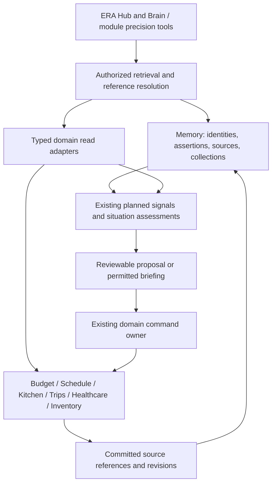
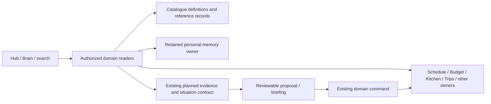

# Catalogue — ASTRA Deep Dive and Final Build Plan

> **Read first:** [§10 — Final build plan](#10-final-build-plan--2026-09-07) is the implementation specification. [§9](#9-red-team-review--revised-decision) and [§9.10](#910-owner-clarification--global-reference--definition-library) supply the accepted direction. The original brief and superseded Object Memory proposals below are preserved as historical analysis.

## Objective

Challenge and potentially reinvent ERA's existing Catalogue feature.

The current Catalogue is primarily a UI/database for life-related collections such as:

- Budget & Wishlist
- Tasks
- Recipes
- Healthcare
- Trips & Travel
- Fitness
- Learning & Skills
- Contacts
- Documents
- Movies & Shows
- Home Inventory

Do not assume this architecture, taxonomy, data model, or UI is correct.

The goal is to determine whether Catalogue should:

1. remain a collection/database feature,
2. be substantially redesigned,
3. be decomposed into existing ERA modules,
4. evolve into ERA's canonical Object Memory / structured personal knowledge layer,
5. or be replaced by a stronger architecture.

## Important existing constraint

Tasks is not currently an isolated Catalogue database. It is integrated with Calendar/Schedule, including recurring events.

Do not break or unnecessarily duplicate this relationship.

If the current Tasks architecture prevents a stronger design, you may propose a Tasks V2 with an explicit controlled migration from Tasks V1.

The same V2 + migration approach may be proposed elsewhere when it produces a materially cleaner architecture.

## Principles

- Do not optimize for preserving the current implementation.
- Do not create a generic Notion/Airtable clone.
- Avoid redundant copies of information already owned by Budget, Schedule, Kitchen, Brain, etc.
- ERA should have clear ownership of canonical data.
- Prefer structured knowledge that ERA can actually reason over and act upon.
- Challenge whether every current Catalogue module belongs here.
- Preserve useful existing integrations unless there is a strong reason to replace them.
- Migration safety matters.

---

# Architectural assessment — 2026-09-07

**Current recommendation after red-team and owner clarification: formally define Catalogue as ERA's Global Reference / Definition Library. Catalogue owns reusable definitions and reference records where it is the established owner; operational modules own activation, execution and actual state. Keep existing IDs/storage, explicit consumption contracts and authorized retrieval. Catalogue and Brain remain distinct concepts. Do not introduce a canonical Object Memory platform or require Tasks V2.** The [decision in §9](#9-red-team-review--revised-decision), refined by [the ownership contract in §9.10](#910-owner-clarification--global-reference--definition-library), supersedes the initial recommendation, ownership moves, target architecture and migration priorities in §§3–8. Source findings remain useful, subject to §9's distinction between potential overlap and demonstrated duplication.

**Initial recommendation, now superseded:** retire Catalogue as a container of miniature ERA modules. Build one ERA Memory capability around canonical referents, attributed knowledge, and links to authoritative module records. Use Brain as its conversational and browsing surface. Keep collections as optional saved views.

This is a selective decomposition plus a new shared knowledge contract. Renaming `catalogue_items` to `objects`, adding embeddings, or putting every table behind a universal object editor would preserve the underlying problems.

Persistent structured knowledge should mean: **ERA can identify what a statement concerns, distinguish what is recorded from what is inferred, show where it came from, determine who may use it and whether it still applies, and correct or forget it without corrupting operational history.**

The original brief above is preserved. Sections 1–8 contain the original analysis; §9 revises its direction and §10 supplies the subsequently commissioned implementation plan. None authorizes executing migrations, deployment, data cleanup or operational automation in this documentation-only session. Existing Top Layer dependencies remain explicit in the packet roadmap.

**Evidence boundary.** Inspected working tree at `bc7ccc3`, 2026-09-07. `git diff --name-only 3106164 HEAD -- src migrations` returned no differences. Read the Catalogue UI, hooks, API handlers and type contract; related Schedule, Brain, Budget, Kitchen, inventory, document and health paths; schema definitions; architecture records; campaign Master Books and recent ASTRA/proactive studies. Existing Graphify output was used for navigation, then relationships were checked in current source. It is an older index, not current runtime evidence. No new graph extraction was run; extraction cost was zero, and total session token usage was not measured.

The committed DB catalog was generated **2026-08-04T10:06:44.439516+00:00**. It is historical evidence about policies, functions and cascades, not proof of today's deployment. No production records, storage objects, APIs or SQL were accessed. UI findings come from render and interaction source, not a browser session. No application code or schema was changed and no runtime tests were executed. Source references E1–E30 appear at the end.

## 1. Current-state findings

### 1.1 Catalogue is several systems sharing a row shape

The source defines eleven named module types plus `custom`: Budget & Wishlist, Recipes, Tasks, Healthcare, Trips & Travel, Fitness, Learning & Skills, Contacts, Documents, Movies & Shows, and Home Inventory. Navigation is module → category → item, with special handling for Tasks and Inventory. Most other types select a different configuration in one generic item form. (E1–E3)

Its persistence is `catalogue_modules` → `catalogue_categories` → `catalogue_items` → `catalogue_sub_items`. Category nesting is capped at depth five. Items mix name/notes/tags with generic status, priority, progress, due date and frequency; unversioned `metadata_json`; task scheduling fields; private/shared flags; and calendar backlinks. The single record can be a contact, a passport, a product wish, a recipe or a reusable chore. (E1, E4)

That is organizational flexibility, but there is no equivalent semantic contract. A contact does not have the same lifecycle as a workout, a product's price is not a savings balance, and an expired document is not a completed task. A folder determines how the row is interpreted.

| Area | What the inspected implementation actually does | Architectural implication |
|---|---|---|
| Generic collections | Configured forms save type-specific fields into arbitrary JSON. The type is on the containing module. | Moving or reclassifying a record is entangled with its meaning; TS interfaces do not validate persisted metadata. |
| Tasks | Templates instantiate real `items`, recurrence rules, subtasks and alerts; Schedule's Assign flow reads Catalogue. | This is part of Schedule's definition layer, despite the standalone label. |
| Home Inventory | Catalogue item identity and metadata back separate stock and restock-history rows. | Removing Catalogue tables would remove a real operational dependency. |
| Recipes | Catalogue stores recipe-shaped metadata, while `/recipe` owns a richer independent recipe model. | Two editing authorities for the same kind of content; no established bridge between them was found. |
| Contacts / Learning / Fitness / Movies | Primarily configurations of the generic Catalogue editor. No separate Contacts or Learning application/API owner was found in the searched source. | These names should not be mistaken for mature standalone modules. |
| Documents | Document metadata and one replaceable image path live on a Catalogue item. | Document type, issued document, procedure and file are conflated. |
| Trip documents | `trip_documents` has its own title/type/expiry and file in a separate bucket. | The same passport can be described and uploaded again per trip. |
| Brain | Household-scoped label/value memories, plus a separate conversational focus mechanism and learned phrase templates. | Several different meanings of “memory” coexist without a common reference contract. |

### 1.2 Tasks → Schedule is a real, useful dependency

The path is concrete:

```text
Catalogue task definition
  → AddToCalendarDialog
  → createEvent / createReminder / createTask
  → items + recurrence/details/subtasks/alerts
  → Catalogue is_active_on_calendar + linked_item_id

Schedule Assign
  → Catalogue flexible definitions and per-period target
  → existing flexible routine: item_flexible_schedules placement
  → otherwise: a dated item referencing source_catalogue_item_id
```

The second path matters: flexible work is not represented only by one linked recurring item. The mobile and desktop flows also create individual scheduled items, and count instances and placements against the template's period target. A migration that follows only `linked_item_id` loses that relationship. (E5–E7)

Promotion runs in the other direction: an existing Schedule item creates a Catalogue template and may retain a reverse link. Its history insert and reverse-link update are separate from template creation. Add-to-calendar similarly creates the operational item before updating the template. Partial failure can leave the item created with an inconsistent backlink. This is source-backed failure exposure, not a measured production incident. (E5, E8)

Schedule already owns due/start/end times, responsibility, completion, recurring rules, exceptions, occurrence actions, flexible placements and pauses. Google Calendar is an outbound projection. The two inspected expansion helpers cover different semantics: `dayOccurrences.ts` injects flexible placements and legacy postponed actions; `schedule/expandOccurrences.ts` handles exceptions/pauses/materialization but does not itself provide the full flexible-placement contract. Neither should be adopted wholesale merely because its comment says “canonical.” (E9–E10)

### 1.3 Brain is not currently Catalogue retrieval

`faceRegistry.ts` describes Brain as Catalogue and inventory, and points to `/catalogue`. Its dashboard and memory resolvers actually use `/api/memories` and `household_memories`. Recall searches the **label** with `ilike`, orders by `updated_at`, and takes the first result. A resolver comment calls it the closest match; the route does not rank semantic or lexical relevance beyond that filter. (E11)

Memory creation validates short label/value/tags input and requires a household. There is no PATCH handler in the inspected memory item route. The duplicate-save reply admits that overwriting is not implemented. Deletion is restricted to the creator. The dashboard's “All memories” comes from a 20-row request, and its summary uses a separate capped request. These are small CRUD surfaces, not a grounded knowledge service. (E11–E12)

`household_memories` is referenced by source but absent from the searched migration SQL and schema snapshot, and absent from the historical catalog's table list. Its deployed existence and constraints remain unverified. The API's 409 handling is not evidence that the intended uniqueness constraint exists.

There are also two legitimate forms of memory that should remain distinct:

- **Conversational focus:** up to ten recently referenced reminders, with a 30-minute TTL and title/pronoun resolution. This identifies what “it” means in a conversation. It does not establish persistent identity. (E13)
- **Learned phrases:** patterns mapped to existing capabilities after successful execution. These teach ERA how the owner speaks. They do not establish facts about people or objects. (E14)

Ask AI currently assembles domain context only for Budget and Schedule. Brain and Chef receive no corresponding domain context from that handler. Adding Object Memory without connecting this boundary would create another store ERA cannot use. (E15)

### 1.4 Existing links are valuable but incomplete

Explicit relationships already include:

- `items.source_catalogue_item_id`, the inverse `catalogue_items.linked_item_id`, and calendar history.
- `inventory_stock.item_id` and `inventory_restock_history.item_id` → Catalogue.
- `hub_messages.source_item_id` → Catalogue for inventory-origin shopping.
- Optional Catalogue references on health conditions and vaccines.
- Optional `inventory_item_id` and `catalogue_item_id` on trip packing API inputs; no packing UI population of those fields was found.

These relationships must survive decomposition. They are not proof of a general graph: they have different owners, validation and cardinalities. Trip packing's identifiers are not accompanied by corresponding foreign keys in the inspected table definition. (E4, E16–E18)

The documented product comparison feature lives on **shopping messages** through `shopping_item_links`, not as a canonical product/offer model in Catalogue. It already records fetched price/currency, stock status, last-fetch time and errors. Preserve that evidence, but distinguish an offer from a product and a shopping intent. (E19)

### 1.5 Kitchen and Budget demonstrate why copying rows is insufficient

Recipes own ingredient/step JSON, versions, cooking feedback and active versions. Ingredients have string quantities/units, not validated stock identities. Cooking-log creation records experience/statistics; it does not deduct stock. The Feature Map's suggestion that ingredients can reference Catalogue should not be treated as a working normalized mapping. (E20)

Inventory is primarily a consumables model: units, consumption-rate estimates, minimum stock, quantity and restock history. Its GET selects the current user's inventory module and rows. That response does not establish complete household stock, and a runout estimate is not a physical observation. A serial-numbered appliance needs a different facet from “three packs of paper towels.” (E16)

Budget already owns `future_purchases` with target/date/saved progress and allocation history, while Catalogue Budget exposes target price and generic progress. The Future Purchases allocation handler updates progress; it neither transfers nor reserves account money. Goal completion there can mean the savings target was reached, not that the product was bought. (E21)

Budget also has merchant-pattern/category matching, transaction reconciliation and commitment coverage. These solve different identity problems. A merchant category suggestion does not identify a purchased object; matching a bank transaction does not establish two contacts are the same person. Preserve these distinctions. (E22)

### 1.6 Source defects relevant to any reinvention

These need explicit treatment even if the larger architecture is deferred:

| Finding | Evidence | Consequence |
|---|---|---|
| Document signing checks a user-ID path prefix and active partnership, then uses an admin storage client. It never fetches the Catalogue row or tests its `is_public`, deletion or current file association. | E23 | The route can authorize signing a known partner-owned path independently of record visibility. This is a source authorization defect; actual object exposure was not probed. |
| Update “Undo” only invalidates queries. Delete “Undo” POSTs a new item with a subset of fields after the server soft-deleted the old one. | E24 | Undo does not preserve identity; calendar/stock references remain with the old row. New IDs and omitted task/image/sharing fields can create migration ambiguity. |
| The generic editor rebuilds metadata from configured controls; PATCH replaces the entire JSON value. | E3, E24 | Unrecognized attributes can disappear during an unrelated edit. No field revision or conflict detection exists. |
| Task disable updates recurrence, Catalogue state and history separately; some errors are logged while the handler proceeds. “Pause” cuts `end_until`. | E8 | UI state and schedule effects can disagree; this is not the same contract as a bounded `recurrence_pauses` interval. |
| GET modules may initialize default modules through an RPC. | E25 | Do not reuse this endpoint as a supposedly read-only background knowledge reader. |
| The historical Catalogue policy set mixes `household_members` and active `household_links`; sub-items have owner-only SELECT while parents have household sharing policies. | E26, historical only | Privacy and descendant visibility need a fresh catalog review. No present-day leak or invisibility diagnosis is inferred from this old snapshot. |

## 2. Architectural problems

**The deepest problem is confused ontology: a definition, an object, an operational action, a measurement and a collection membership are treated as variants of one row.** This creates seven structural faults.

1. **Identity depends on a screen.** A doctor in Contacts, a doctor in Healthcare, a phone number in Brain and a provider string on a vaccine have no canonical connection. A product wish, a stocked product and an offer can diverge similarly. Names are labels, not keys.
2. **Several modules can appear to own the same field.** Recipe instructions, trip dates, savings progress and appointment dates appear inside Catalogue while dedicated modules own richer versions. There is no defined winner when they disagree.
3. **Reuse and execution are entangled.** A task definition should be reusable independently of its executions. One “active on calendar” flag and one backlink cannot represent multiple series, periods, archived instances and independent participants.
4. **JSON flexibility has no preservation contract.** There is no schema version, extension namespace, explicit null/unknown semantics, granular provenance or safe concurrent patching. Adding embeddings would index inconsistent records faster.
5. **Recorded does not mean true now.** `updated_at` does not tell when a phone number was confirmed, whether a document number came from OCR, or whether a saved duration was measured. Recipe feedback even initializes “actual” time from estimates; repeated saved defaults must not train an apparently confident duration model. (E20, E27)
6. **Privacy is not one household boolean.** Author, subject, manager, operational assignee and audience are different roles. Existing health, document, trip, budget and memory paths have different policies. Collapsing them into household-visible objects would expand access.
7. **There is no end-to-end correction contract.** A corrected fact must invalidate search, AI context, dependent suggestions and future reminders where appropriate. An archived collection, a deleted binary, a dismissed suggestion and a retracted claim are different actions.

The feature's current “Standalone” classification is therefore wrong as an ownership guide. Catalogue is already partly shared infrastructure and partly a junction. Its replacement should make those responsibilities explicit rather than granting arbitrary standalone-to-standalone imports.

## 3. What should stay, move, merge or disappear

### 3.1 Compare the actual alternatives

| Alternative | What it buys | What remains wrong | Verdict |
|---|---|---|---|
| Keep a user-maintained collection database | Lowest initial change; supports miscellaneous lists | Duplicate ownership, manual classification and weak AI grounding remain | Retain only as a small fallback for genuinely miscellaneous saved material |
| Decompose everything into existing modules | Clearer operational ownership; less duplication | No natural home for cross-cutting people, possessions, document identity and personal knowledge | Necessary first step, insufficient target |
| Make Catalogue the universal object database | Uniform editor and broad graph queries | Becomes a second authority for money, schedule and health; forces every domain into generic status/JSON | Reject |
| Pure search/index over existing data | Fast discovery without moving authoritative records | Cannot own a corrected phone number, persistent preference, identity merge or document version | Useful first slice, not complete persistent memory |
| Shared identity and attributed knowledge, with module-owned records | Cross-module continuity and grounded retrieval without duplicating operational state | Requires disciplined boundaries, correction and authorization | **Recommended, introduced incrementally** |

The strongest concept is **ERA Memory**, not “Catalogue V2.” It includes a small object identity layer, knowledge that has no better operational owner, and read projections of authoritative modules. It is not a household digital twin and does not require complete life capture.

### 3.2 Ownership decisions by current area

| Current area | Stay / move / merge / disappear | Target owner and boundary |
|---|---|---|
| Catalogue Tasks | Move definitions into Schedule; retain reuse and activation | Schedule owns task/routine definitions, execution, recurrence, placements and completion. Memory links definitions to subjects and instructions. |
| Chores / Fitness routines | Merge their time behavior into the same Schedule definition contract | Cleaning or workout instructions can be referenced resources. A completed workout is an activity record, not a “completed person/object.” |
| Catalogue Recipes | Move complete recipes to Kitchen; retain incomplete captures as saved resources until reviewed | Kitchen owns recipe content, versions, servings and cooking history. Memory adds discoverability and personal references, not another recipe editor. |
| Catalogue Budget & Wishlist | Separate product/service candidates from purchase/savings plans | Memory owns referent identity and saved research. Budget/Future Purchases owns target, funding meaning and planning status. Shopping owns acquisition intent. |
| Catalogue Healthcare | Split people/organizations/resources from medical facts | Contacts facets describe providers; Healthcare owns private profiles, visits, conditions, allergies, vaccines and future medication adherence. Appointment execution belongs to Schedule. |
| Contacts | Keep the useful records; give people and organizations canonical identities | A person can be a doctor, relative and payee without three people. Do not promote private clinical context into a public contact card. |
| Documents | Replace the conflated model with document definitions, issued instances and artifact versions | A Documents capability within Memory owns document identity/files; Trips and Healthcare reference permitted documents. It need not launch as another top-level app. |
| Catalogue Trips | Split destination/place knowledge from actual travel plans | Places remain reusable referents. Trips owns dates, itinerary, packing, bookings, account linkage and lifecycle. Existing trip templates remain Trips-owned. |
| Home Inventory | Separate product identity, owned assets and consumable stock | Memory holds referents and descriptive facets; Inventory owns quantities, units, movements, location/lot state if introduced. Wardrobe continues to own garments. |
| Learning & Skills | Preserve resources and explicit learning goals; remove fake generic completion semantics | Resource identity and explicit self-assessments live in Memory. Practice routines use Schedule. Add a Learning progress owner only when real sessions/milestones justify it. |
| Movies & Shows | Keep as light saved resources and person-specific watch intent/history | No new standalone media engine. “Want to watch” is not a global property of the work; a household member can differ. |
| Brain label/value memories | Fold into the same persistent Memory service | Preserve original text and household audience. Structured conversion is optional and attributable. Brain remains a surface, not a competing database. |
| Categories, custom modules | Migrate useful organization to collections/tags/saved filters | Membership references existing records; deleting a collection never deletes its members. No new module engine, formula builder or workflow designer. |
| Generic progress/status/frequency on every object | Disappear as universal fields | Preserve legacy values during migration, then map only where the target domain defines their meaning. |

**Other boundaries:** account identity is not a bank organization; a payment commitment is not its supplier; a booking is not its hotel; a medication product is not a prescription or dose; a garment is not its product model; a certificate is evidence, not proof of a skill level; a transaction is not a purchase line. Memory must connect these, not equate them.

Recurring payment due dates stay Budget-owned even when displayed in Calendar or linked to reminders. Confirming a reminder cannot implicitly settle a payment. A financial due-date change should update its authorized Schedule projection through an explicit relationship, not leave two independently editable due dates. Preserve the separate payment and item recurrence systems during this work; shared date utilities do not imply shared settlement semantics.

## 4. Recommended target architecture

### 4.1 Three layers, one authority for each field



The arrows into Memory do not mean copying every domain field into a new fact table. A Budget balance remains calculated by Budget. An accepted current balance is not manually editable in Brain. Memory may store a sourced note about an account and resolve its identity; it reads the balance when the question needs it.

**Layer A — operational records.** Existing domain tables and commands remain authoritative. They own their invariants and return typed, authorized read projections with freshness and coverage.

**Layer B — persistent knowledge.** Memory owns cross-module referents, explicit personal assertions/preferences, contextual relationships, source material and organization when no operational domain already owns them. Domain-owned objects such as recipes can be registered as referents without moving their content.

**Layer C — interpretation and intervention.** Search, AI context and proactive assessments consume A and B. Interpretations have supporting evidence; proposed actions still go through the existing capability and review model. An inferred relationship never grants mutation authority.

In repository terms, shared identity/reference contracts and server services belong under shared libraries/services/types. Junction adapters can connect modules. They must not make every standalone import `features/catalogue` or client React hooks. No microservice split is needed.

### 4.2 What deserves first-class identity

There are **two legitimate meanings of first-class**, and separating them avoids a universal-object trap.

- **A first-class referent** persists independently of one operation, can be mentioned again, has a useful identity boundary, and benefits from reuse or continuity. It can have an entity ID.
- **A first-class operational record** matters because its owner enforces a transition: transaction, task execution, dose log, stock movement, meal plan. It must be referenceable, but does not need another Memory row mirroring it.

Register a new entity kind only when at least one concrete retrieval or cross-module relationship needs it, and its lifecycle and owner are understood. Do not mint an entity for every noun in chat.

| Referent | Identity boundary | Separate concepts that must not merge |
|---|---|---|
| Person | The individual, including dependents without logins | Auth user, household membership, role, health profile, creator |
| Organization | An organization/provider/supplier | Branch/location, contact person, account |
| Place | A stable location or venue at the needed granularity | Trip itinerary visit, booking, current presence |
| Product or service definition | A specified model/variant/service | Seller offer, transaction, owned instance, stock position |
| Owned asset | A particular possession whose history matters | Product model; replacing a broken appliance creates a new asset |
| Document instance | A particular issued document for a subject | Document type, renewed issue, scan, general application procedure |
| Saved resource | A book, course, article, video, exercise instruction or other reusable content | User's progress, attendance, completion or competence |
| Existing domain root | Recipe, trip, account or Schedule definition that needs cross-reference | Its history/versions/executions remain with the domain |

A task called “call the plumber” is an operational action. The plumber is a person/provider. “Boiler service checklist” is a reusable definition/resource. They can be linked without putting all three into a task-shaped Catalogue row.

### 4.3 Canonical identity and references

Use a stable opaque identity for supported referents. Names, Arabic equivalents, transliterations, phone numbers, URLs and external IDs are identifiers or aliases with provenance; they are never the primary key. Canonical means **one agreed referent within an authorized scope**, not one global person database.

Every reference crossing a module boundary should distinguish:

```text
EntityRef: entity ID + expected kind
RecordRef: owning domain + record ID + optional revision
OccurrenceRef: Schedule identity + immutable original occurrence key
ArtifactRef: document/resource ID + immutable version + page/span when available
```

These are contract sketches, not executable types. `RecordRef` uses a closed registry of supported domains and server resolvers; never accept arbitrary table names from clients or a model. Hot domain relationships keep real foreign keys. A polymorphic string is not referential integrity.

For an existing recipe or account, a typed registration/binding maps its existing primary key to an entity identity when needed. Enforce one binding per owner record. That mapping is not a second editable copy of the recipe name or balance. Register during a controlled migration or an explicit write, never as a side effect of a read. If asynchronous registration is used, missing registration means unresolved knowledge, not failure of the original domain operation.

Creation needs request identity as well as entity identity: repeating one accepted capture must return its existing result. Entity resolution cannot compensate for non-idempotent commands.

**Ownership is field-specific.** Contacts owns a person's canonical contact methods; Healthcare owns clinical records; Budget owns money; Documents owns issued-document metadata. A conversational correction to a domain-owned field creates the appropriate domain edit/proposal. Memory must not retain a contradictory “override truth” alongside it. Independent reports can coexist as disputed evidence until resolved.

### 4.4 Entity resolution, deduplication and unmerge

Resolution should be conservative and scoped before any matching:

1. Honor an existing authorized ID or an explicitly selected referent.
2. Match a trusted typed identifier within its namespace and scope. A barcode can identify a product variant, not a particular unit in the cupboard. A document number needs issuer/type/subject context. A shared phone can belong to a household or clinic.
3. Use normalized names, aliases, context and optional semantic similarity to produce candidates.
4. If candidates conflict, ask at the point of use or leave unresolved. Reading can present alternatives; a write must resolve its target explicitly.

Record why a match was made and which evidence supported it. Keep “not the same” decisions so ERA does not repeatedly propose the same rejected merge. Preserve Arabic/English/Arabizi labels without assuming translation establishes equivalence. Current focus-title tokenization is Latin-only and is unsuitable as the persistent entity resolver. (E13)

**Merge is a controlled knowledge operation.** Preserve both prior IDs through redirects and an audit of moved memberships, aliases and assertions. Check kind compatibility, permissions, conflicting identifiers and field authority. Re-point eligible knowledge references; do not merge ledger transactions, task occurrences or dose records because their subjects merged. A merge cannot widen visibility.

Unmerge restores the recorded provenance partition. New assertions added after a merge may have ambiguous attribution; hold them for review instead of guessing. Private identities belonging to different users are not silently globally deduplicated. A shared association can be created only with an authorized sharing decision.

### 4.5 Structured attributes without a generic database builder

Use typed domain tables for fields with integrity, frequent filtering or operational effects: times, money/currency, subject IDs, stock units, file references, identifiers. Use small versioned JSON facets for genuinely extensible descriptive fields. Validate on the server with runtime schemas, preserve unknown keys on edits, and use a revision check to prevent one device replacing another's work.

Each admitted facet declares field types, units, cardinality, allowed entity kinds, sensitivity, authority and schema version. Extensions are namespaced. A custom field cannot acquire scheduling or payment side effects merely because it is named `due_date` or `amount`.

Do not put every structured value into an entity–attribute–value table. Use the assertion model only where alternatives, provenance, temporal scope or user correction actually require it. A domain field remains a field; its read projection may attach evidence metadata without creating a second durable value.

PostgreSQL supports indexed `jsonb` alongside relational data, but its documentation recommends predictable JSON structure and notes that updates lock the containing row. That supports bounded facets, not a household-sized JSON document. This does not establish the deployed PostgreSQL version. [PostgreSQL JSON documentation](https://www.postgresql.org/docs/current/datatype-json.html)

### 4.6 Assertions, relationships and evidence

A knowledge assertion needs enough structure to answer “who said what about which thing, when, and on what basis?” A relationship is the same contract with an entity/reference as its value. Do not maintain one edge table and another unrelated fact table that disagree.

| Attribute | Meaning |
|---|---|
| Subject + predicate + typed value/reference | What is claimed; allowed value type and relationship direction |
| Context | Household/person, purpose, location or procedure context where material |
| Status | Suggested, accepted, disputed, superseded or retracted |
| Basis | Explicit user assertion, domain-recorded result, imported source, extraction, deterministic derivation, inference, or legacy-unknown |
| Source references | Original record/artifact revision and exact field/page/span; multiple supports allowed |
| Author / extractor | Who asserted it or which extraction process produced it; model/version where applicable |
| Time | Observed/valid time, recorded time and verification time, with unknowns allowed |
| Revision / dependencies | What a correction invalidates; the exact source revisions used in a derivation |
| Audience / allowed purpose | Authorization to retrieve or use this claim, independent of the subject's general visibility |

This borrows the useful separation of entity, activity, attribution and derivation from provenance modeling without adopting a full RDF ontology. [W3C PROV Data Model](https://www.w3.org/TR/prov-dm/)

Relationships need predicates that help an actual question: `issued_to`, `issued_by`, `version_of`, `replaces`, `located_at`, `services`, `about`, `used_for_trip`, `instance_of`, `requires`. A generic “related” link is acceptable for human organization but too weak to justify automation.

Relations such as employment or ownership are contextual and time-bounded. A person's former employer remains historical information; it must not win a current contact query. Structural ownership links needed for integrity remain typed foreign keys rather than optional user assertions.

### 4.7 Lifecycle, confidence and freshness

Keep three independent axes:

- **Object lifecycle:** an asset is owned/sold/retired; a document is current/expired/replaced; a person record may be archived. Domain owners define these states.
- **Knowledge status:** an expiry date can be suggested, accepted or disputed while the document itself remains the same object.
- **Operational state:** a renewal task is scheduled/completed, a purchase is pending/recorded, a stock movement has happened. Knowledge status cannot stand in for these transitions.

Do not use one universal confidence percentage. Extraction confidence concerns reading the source. Resolution confidence concerns the correct subject. Source reliability concerns the statement. Freshness concerns continued applicability. A perfectly read old phone number may be stale; an accepted self-report is not independently verified; five copies of one receipt are not five independent sources.

Use “Verified” only for an explicit verification act with its actor, scope and time. A direct user statement can be accepted as a user assertion without a second review tap. AI extraction starts suggested unless a deliberately narrow, evaluated rule admits it. Model self-confidence alone never promotes it.

Freshness is predicate- and purpose-specific. Expiry dates remain recorded facts until corrected or superseded; whether a document is usable is computed for a particular date and purpose. Product offers need recent observation. A last-known stock count needs its observation age. A preference may remain valid until changed. Do not turn each stale attribute into a recurring reminder or make a fresh fetch reset observation time.

History should retain valid-time versus recorded-time when useful: “the number changed in June; ERA learned that in August.” Domain version histories stay in their modules. Preserve evidence snapshots needed to explain accepted actions; do not event-source the entire app as part of this change.

### 4.8 Correction and forgetting are core operations

Expose correction on the answer or object card: change a value, choose the right person, split a conflated record, reject an inference, or identify a fact as no longer current. Save corrections through the field's owner with a source revision; stale edits require resolution rather than last-write-wins.

Correction supersedes a claim and invalidates dependent retrieval indexes, answer caches, queued suggestions and unexecuted proposals. It does not silently rewrite a completed payment or past appointment. If an accepted fact already produced a reminder, the existing effect link lets ERA propose the appropriate update/cancellation through Schedule; it does not create a second reminder.

“Forget” must distinguish four outcomes with short actions in context:

| Action | Effect |
|---|---|
| Archive | Hide from default browsing, preserve historical references |
| Retract | Stop treating a statement as valid; keep restricted audit where appropriate |
| Forget for assistance | Exclude selected evidence from retrieval, inference and extraction reuse; source operational records remain with their owner |
| Delete source/object | Owner-controlled deletion with dependent artifact/index cleanup and explicit treatment of references |

Forgetting propagates to full-text and vector indexes, derived claims, summaries, server/client caches, relevant retained conversation excerpts, and pending interventions. Remove obsolete focus references and inspect learned phrases' retained literal/source text for the forgotten content; language learning must not become a hidden copy of personal facts. Existing transcripts or telemetry that repeat a forgotten value cannot remain an unnoticed retrieval source. Retention exceptions must be explicit and excluded from assistance, not quietly presented as complete erasure.

Keep only minimal suppression metadata needed to prevent immediate re-extraction, scoped to the retained source/version. Do not store the forgotten secret in its tombstone. If the source itself is deleted, remove its content and derivations under the deletion policy; don't preserve a full “immutable” assertion history that defeats forgetting. Backup/provider retention and already downloaded files are separate limits and must not be claimed as erased without evidence.

### 4.9 Automatic extraction: capture evidence, then promote knowledge

Use existing ERA activity to reduce entry work, but do not scrape the entire household into a permanent profile.

| Input | Safe initial output | What must not be inferred automatically |
|---|---|---|
| Successful explicit “remember…” command | Accepted attributed assertion, subject resolved or left as a note | New sharing scope or operational permission |
| Uploaded passport/manual/receipt | Artifact version plus candidate fields with page/span references | Visa eligibility, ownership of every item, a new financial effect |
| Posted transaction | Reference to the authoritative transaction; possible merchant/product candidates | Item quantities, possession or goal completion from merchant text alone |
| Schedule completion | Reference to that occurrence's recorded action | Skill mastery, physical location or a persistent behavior preference |
| Cooking feedback | Explicit taste/preference and source version | That default time fields were measured or that ingredients were consumed |
| Chat conversation | Selected candidate assertion with original context and author | That an assistant's earlier answer is independent corroboration |

The pipeline is: eligible committed source → source revision/artifact → bounded extraction → authorized entity candidates → typed assertion proposals → confirmation or narrow deterministic acceptance → retrieval projection. Reprocessing the same source revision uses a stable extraction identity. A new model version may propose different candidates; it must not duplicate accepted assertions or resurrect a rejected one automatically.

Keep artifact content and extraction commands separate. Document text and webpages are untrusted evidence, including any instructions embedded in them. They do not select tools, expand audiences or override the user's request. Sanitize and constrain uploads and fetched URLs at their actual ingestion boundary.

Avoid a second generic event bus. Initially process explicit saves/uploads and supported domain completion points; use bounded resumable background work only where required. Durable background extraction needs a reviewed job state, retry identity, source-revision check and deletion tombstone handling. Existing best-effort Activity logging is not a reliable change feed. If extraction fails, the original domain save still stands and knowledge remains incomplete.

Suggestions should usually appear beside the affected object or next relevant action. A separate backlog of hundreds of trivial AI facts would simply recreate Catalogue's maintenance burden. Auto-extraction is worthwhile only if correction/review costs remain below the entry work it replaces.

### 4.10 Retrieval, grounding and proactive intelligence

The same authorized retrieval service should support Brain, Ask AI, relevant module pickers and the planned E-04 situation signals. It accepts viewer, purpose, entity candidates, requested time/range and a size budget. It returns current values and references together with ambiguity, coverage, freshness and unresolved conflicts.

Recommended retrieval order:

1. Resolve explicit references and conversational focus; search authorized aliases and exact identifiers.
2. Fetch relevant owner projections and accepted knowledge. Use lexical/full-text search for names and fields; add semantic search for natural-language notes/documents when its benefit is demonstrated.
3. Traverse a small number of typed relationships relevant to the question, with depth/result limits and cycle handling.
4. Assemble a compact evidence bundle with source references, revisions, known gaps and appropriate redaction.
5. Generate an answer supported by that bundle; resolve cited references against the permitted result set. Unsupported claims fall back to uncertainty, a targeted question or source navigation.

SQL/domain calculations answer exact questions about amounts, counts and occurrences. Embeddings help retrieve candidate material; they do not establish identity or calculate balances. Conflicting accepted sources should be presented as a conflict, not averaged. No results under partial coverage means “not found in the available records,” not proof of absence.

Before an action is confirmed/executed, revalidate its target, authorization and decision-relevant source revisions. A previously proposed renewal reminder may be obsolete after a corrected expiry date. A stale answer is not authority to mutate.

**Proactive use:** Memory supplies durable facts and evidence; the existing planned situation assessment decides whether an intervention is useful now; existing notification/proposal infrastructure governs delivery. Reuse the proactive study's stable situation identity, dependency invalidation and per-recipient suppression. Do not add a Memory scheduler, alert engine, separate briefing store or autonomous action executor. (E28)

For example, an accepted passport expiry and a linked trip can support “recorded expiry precedes the return date.” They cannot establish entry requirements without a current, applicable source. A watched item changing price is not permission to purchase it. A document's `requires` edge suggests preparation work, not an automatically executable task graph.

### 4.11 Privacy, ownership and search disclosure

Separate `subject`, `created_by`, `managed_by`, `responsible_user`, and access grants. A child/dependent can be a subject without an account. A doctor is not the owner of the household's note about them. A household link is a membership relationship, not permission to reveal every object or claim.

Start with explicit private/household scopes and domain policies. Add per-claim or per-facet audience only where a real need exists; do not launch a general permission editor. A shared person identity can have private health or financial relationships. Sharing the shell must not reveal those relations through counts, titles, autocomplete, graph neighbors or AI phrasing.

Derived knowledge can be no more broadly visible than its necessary evidence. Authorized purpose-specific projections, such as Healthcare's household allergen feed, are deliberate domain exceptions; they are not a license to copy the underlying private profile. Current Budget display masking is also not an AI authorization contract: its service preserves amounts with an `is_masked` flag for UI blur. Build a permitted context projection rather than feeding that raw response to a model. (E29)

Access is checked before retrieval/ranking and again when resolving artifacts and actions. Search/vector results must carry the current access scope and source revision, and revoked/deleted material must fail resolution even while index cleanup is pending. A deep link or signed URL request must authorize the actual record/version, not just a path prefix. Avoid indexing document numbers and secrets in global autocomplete or semantic search by default.

Household unlinking stops future shared access; personal ownership survives. An identity merge cannot transfer access. Cached/offline data and previously issued/downloaded documents require an explicit limitation: revocation cannot reliably retrieve a copy already delivered to an offline device. Minimize sensitive offline caches and purge them on the next authenticated synchronization. The product should not promise immediate remote erasure it cannot perform.

### 4.12 A graph model is useful; a graph database is not justified

The useful graphs are **referent relationships** and **evidence dependencies**. They explain which provider services an asset, which document supports a trip requirement, and which suggestions become invalid after correction.

Implement the first version in PostgreSQL: typed identity/binding rows, small alias tables, assertions with typed referenced values, source/version references, and collection memberships. Add indexed adjacency reads for admitted predicates. Existing domains retain foreign keys and transactional writes. Domain projections and search indexes are rebuildable derived state, not second authorities.

Bounded recursive traversal is available in PostgreSQL; ordinary joins should cover most initial questions. Recursive SQL supports graph-shaped traversal without deploying another database. [PostgreSQL WITH/recursive-query documentation](https://www.postgresql.org/docs/current/queries-with.html)

Do not automatically persist every inferred edge. Do not require GraphQL, RDF, Neo4j, a universal ontology, embeddings on every row or a graph visualization in the household UI. Consider a graph database only after measured relational queries fail an actual latency/complexity requirement. Household size alone supplies no such case.

A minimal schema should be driven by the first use case: identities/aliases, owned assertions, artifact/source versions and typed bindings. Merge history, extraction jobs and additional facets are admitted with the operation that needs them. This proposal is not permission to build a dozen empty infrastructure tables first.

## 5. Resulting user experience

### 5.1 Brain becomes the place to remember, find and correct

The primary interface remains ERA Hub. “Save this,” “where is it?”, “which one?”, “what do I need?” and “that number changed” are more useful entry points than “choose a Catalogue module.” ERA resolves the object and opens a compact card or the appropriate precision tool.

Brain should expose a single searchable library of saved knowledge and accessible linked records. Useful browsing views include People, Things, Documents and Resources, with optional collections such as “New apartment” or “Lebanon paperwork.” Those are views over identities, not independent databases. A recipe can appear in a collection and Kitchen without becoming two recipes.

An object card shows a name, the few facts needed now, and actions such as Open, Edit, Link, Schedule or Share. Source and history are available through a small affordance. Suggested fields can show a short “Suggested” state with Accept/Edit. Do not put schema explanations, confidence percentages or architectural rationale in production UI.

The exact navigation labels are secondary to the ownership decision. Keep `/catalogue` as a compatibility entry during migration. Do not remove a door before its useful action is available elsewhere. After the replacement is proven, Catalogue can disappear from primary navigation while old links continue resolving.

### 5.2 Five concrete journeys

| User journey | Target behavior | Owner of the actual effect |
|---|---|---|
| “Remember Rami is the plumber; this is his number.” | Create/select a Person/Provider; store the attributed contact detail. Later “call the plumber tomorrow” resolves Rami and proposes the linked task. | Contacts/Memory owns contact facts; Schedule owns the task. |
| Upload a renewed passport | Preserve the old document and scan as historical; propose subject/number/expiry for the new issue. Link the new document to a trip when selected. | Documents owns issued instances and artifacts; Trips owns the usage link. |
| “Clean the AC filter every month.” | Create/reuse a Schedule definition linked to the AC asset and its manual; activation creates the real schedule through its owner. Completion remains visible in Calendar. | Schedule owns rule, occurrence and completion; Memory owns asset/manual references. |
| Save a washing-machine offer | Create/reuse a product variant and a sourced seller offer; optionally connect it to a Budget purchase plan. Recording its purchase can later link an asset/receipt after explicit confirmation. | Budget owns transaction/goal, Inventory or asset facet owns possession, Memory resolves the product. |
| “What can I cook with what we have?” | Kitchen returns recipes; Inventory supplies permitted last-known stock; ingredient mappings identify compatible stock only where resolved. ERA qualifies uncertainty and uses existing allergy projections. | Kitchen and Inventory own operational data; the answer does not deduct stock. |

An ambiguous capture is not a failed capture. Save a resource or note with the original text and unresolved subject; ask only when ambiguity would change an action. “Piano” can remain a saved interest until the user specifies a course, goal or practice routine.

### 5.3 Tasks V2: improve the boundary, preserve Calendar

**Recommend Tasks V2 as a Schedule-owned definition and activation model, not a replacement calendar engine.** The useful idea in Catalogue Tasks is reuse. Preserve it while removing its dependence on a generic collection row.

Proposed conceptual model:

```text
Task/Routine definition + definition revision
  ├─ reusable instructions/subtasks, estimates, context, default cadence
  └─ activation(s)
       └─ existing Schedule item/series
            ├─ recurrence rule, exceptions and pauses
            ├─ original occurrence → completion/skip/move history
            └─ flexible period + occurrence_index → chosen placement
```

One definition can have several activations. A one-off task needs no reusable definition at all. Definition edits apply to future instantiations by default; updating an active series is an explicit Schedule action with the existing scope semantics. The running series owns its actual rule; the definition's cadence is merely an instantiation default. Never silently copy edits in both directions.

For “three times this week,” the stable identity is the routine/activation plus period plus occurrence index. Moving one placement preserves that identity. For fixed recurrence, distinguish original occurrence identity from displayed/rescheduled time. Two slots on one day are still two slots. A changed title cannot change which occurrence was completed.

The existing `task`/`reminder`/`event` storage distinction can remain during this work. The Schedule Master Book already records an inferred-type UI decision and a separate task-type retirement question. Catalogue reinvention should not smuggle in an enum migration or force users to choose a type again. (E30)

Keep “save as reusable” and “schedule” accessible from Schedule and Hub. Move reusable definitions into Schedule's existing planning/assignment surfaces; avoid creating another competing Tasks page. Chore definitions, flexible routines and workout/practice scheduling use this same boundary. A document procedure can suggest a task definition, but does not become a recurring series until deliberately activated.

### 5.4 Documents V2 is justified; several other V2s are not

Documents needs a genuine model change:

- **Document definition:** “Proof of residency,” aliases, issuing organization and a contextual, sourced application procedure. Required documents, usual cost and whether a copy is accepted depend on office/purpose/date; they are not universal facts.
- **Issued document:** this person's passport/certificate/policy, issue and expiry dates, issuer, restricted number, lifecycle, replacement relationship.
- **Artifact version:** a particular scan/PDF/photo, checksum, storage reference, upload/extraction status and page anchors. A better scan does not renew a passport; renewing a passport creates a new issued instance.

Trips links to the chosen issued document/version and can retain a historically selected version where relevant. It should not silently substitute a newer document into an already booked or submitted record. Receipt binaries can reuse the artifact service while financial ownership stays in Budget. Clinical documents retain Healthcare access restrictions.

Home Inventory also needs separate descriptive identity and operational stock, but a full Inventory V2 is premature. First preserve existing consumable behavior behind its owner, clarify stock identity/units and fix atomic effects. Add lots, locations, asset instances or consumption history only for a demonstrated household need. Keep clothing in Wardrobe rather than introducing a second clothes inventory.

Recipes, Budget and Trips do not need wholesale V2 replacements to participate. Register identities and add explicit links. Their existing correctness gaps remain their campaigns' work; Memory is not a reason to rewrite them.

## 6. Migration implications

### 6.1 Treat current records as evidence, not clean canonical objects

No current production population was inspected. Counts, actual duplicates, how many Catalogue recipes exist, whether document rows describe types or issued instances, and whether Brain storage is installed are unknown. A schema-only migration cannot settle those questions.

Before implementation, the owner supplies a fresh catalog snapshot and a scoped inventory/export through an authorized process. The census must cover IDs, kinds, references, shared/private scope, deleted/archived state, artifact paths and structurally invalid metadata, with sensitive values restricted to the people who need them. It should not dump private household data into general engineering logs.

Do not treat every column default as an explicit answer. A legacy `copy_submission_allowed=false` may reflect an untouched checkbox. Catalogue recipe ingredients may be free text even though a TS metadata interface suggests arrays. `usual_cost` can contain multiple currencies in prose. Preserve the original value and mark its basis unknown; normalization can be a proposal.

### 6.2 Phased transition with one writer at each step

| Phase | Change | Gate before progressing |
|---|---|---|
| 0 — contain risk and establish contracts | Catalogue stays available; stop expanding overlapping mini-modules. Address document authorization, identity-preserving Undo, metadata preservation and activation consistency as separately scoped fixes. Define ownership/reference/knowledge-status contracts. | Source review plus isolated functional witnesses; fresh owner catalog for DB-dependent claims |
| 1 — shared references and retrieval | Add typed reference resolution, read-only domain adapters, source/coverage metadata and a small Memory slice. Brain can retrieve explicit memory and linked documents without replicating module content. | Correct sources and scope on representative questions; errors distinguish unavailable from empty |
| 2 — document and contact pilot | Introduce issued-document/artifact separation, selected person/provider identities, correction and bounded entity linking. | Same person/document usable across two surfaces; corrected values no longer surface as current; no unauthorized retrieval |
| 3 — Tasks definitions move under Schedule | First consolidate activation behind one owner while retaining storage compatibility; then migrate definition storage without replacing operational item IDs. | Fixed and flexible parity, history preservation and failure/retry witnesses below |
| 4 — decompose remaining collections | Move reviewed recipes/goals/trips to owners; retain saved resources and collections. Separate Inventory description from stock without recreating stock rows. | Count/ID/reference reconciliation and explicit handling of unmapped rows |
| 5 — retire old writes and navigation | Legacy endpoints become read adapters/redirects where needed; sunset old forms after client compatibility is established. | Supported clients use one writer; reconciliation passes; rollback/export retained before any destructive retirement |

This is a dependency sequence, not a promise to deliver six large packets. A document/contact pilot may be enough to prove or disprove the concept before broader admission. The existing Top Layer sequencing still controls implementation capacity.

For migrated rows, maintain an idempotent mapping keyed by legacy table and ID, with migration version, target reference and source revision/checksum. Prefer stable existing UUIDs where safe; otherwise preserve a permanent resolver mapping. Never backfill by display name.

Avoid simultaneous independent writers to old and new models. Use a compatibility facade that delegates to the current owner. Additive dual reads and comparison are useful; unsynchronized dual writes create the next duplication problem. If a shadow projection is built asynchronously, keep it explicitly derived and rebuildable. It does not become the authoritative writer until reconciled.

PWA/offline clients may continue sending old payloads. Cutover must account for cached application versions, pending queue entries, old links, source IDs and retries. Translate supported legacy requests at the boundary using stable request identities and schema versions; unsupported mutations retain their input and report incompatibility. Do not start a second offline queue. Current queue durability/idempotence is itself flagged in the Hub campaign, so future queued Memory writes require that contract to be proven first. (E28, E30)

### 6.3 Tasks V1 → V2 migration details

1. **Inventory every definition and every inverse reference.** Read `items.source_catalogue_item_id`, flexible placements, exceptions, actions, pauses, subtasks, prerequisite payloads and calendar history. `linked_item_id` and `is_active_on_calendar` are consistency hints, not migration authority.
2. **Preserve operational IDs.** Initial V2 must not recreate Schedule items, recurrence rows, occurrence actions or Google event IDs. Introduce a definition binding and a legacy resolver; move storage only once all readers/writers use the owner boundary.
3. **Version the imported definition without inventing history.** Record an initial migration snapshot with original fields and provenance. Existing instances predate it; do not claim which template revision produced them when that was not recorded.
   Preserve `catalogue_sub_items` and `subtasks_text` separately where both exist; they are not automatically equivalent to executed `item_subtasks` or per-occurrence completion records.
4. **Preserve both flexible representations initially.** Linked active routines and template-derived one-off items can both represent real work. Map their relationships, but do not auto-collapse them into a new series or count both twice. Conflicting period/slot attribution remains an explicit reconciliation item.
5. **Use Schedule's ongoing occurrence-contract work.** Unify exception/pause/placement handling before changing the meaning of executions. A new definitions table does not fix the current expansion divergence.
6. **Switch activation atomically.** An accepted activation commits the item and all required children plus definition association/effect identity, or none. Repeated request identity returns the same activation. Necessary external Calendar sync is a recoverable projection, not part of a falsely claimed distributed transaction.
7. **Retire legacy flags last.** Derive active execution state from authoritative associations and lifecycle. Keep old fields only for the supported compatibility period; don't keep two writable authorities forever.

Required synthetic witnesses include: add twice/retry after interruption; template edit while a series is active; two concurrent activations; two flexible slots on one day; moved and skipped occurrences; all/future/single editing scope; day boundary and DST transition; archived/deleted/paused series; partner-assigned work; offline replay; and trip-created pauses. Payment recurrence must remain unaffected. Initial migration should leave both the past occurrence ledger and future schedule projection identical for a chosen comparison window.

### 6.4 Mapping rules for other data

| Legacy data | Migration rule |
|---|---|
| Catalogue contact and Brain phone note | Candidate identity link; never merge solely because names or phone numbers overlap. Preserve authors/audiences and unresolved disagreements. |
| Catalogue document and trip upload | Content hash can detect repeated binary content within permitted scope; it cannot alone identify the issued document or establish consent to share it. Confirm subject/version association. |
| Catalogue recipe | Preserve raw ingredient/instruction text; create a Kitchen recipe only with validated compatible shape. Link to an existing recipe only on reviewed evidence. |
| Catalogue wish and Future Purchase | Connect a product to an existing plan where established. Never add both progress values or invent a cash reservation. |
| Catalogue trip idea | A destination is a Place/resource. Dates may indicate a plan, but converting it must not activate a trip or create an account. |
| Inventory item | Preserve stock/restock IDs and quantities. Introduce product/asset mapping without executing restock or consumption. |
| Learning/Fitness/Movies | Preserve goals, notes and historical assertions. Do not synthesize practice sessions, workout completions or viewing events from a generic status flag. |
| Custom metadata | Preserve an accessible legacy facet or raw archive until mapped; unknown keys are not permission to discard data. |
| Deleted/archived rows and Undo-created copies | Keep deletion semantics. Review possible copies with provenance; never resurrect rows through entity registration or automated deduplication. |

### 6.5 Recovery and destructive retirement

Run migrations only through owner-reviewed SQL runbooks, with inspect/backup/migrate/verify/recovery stages. This study contains no executable migration. Before dropping anything, reconcile row counts, mappings, foreign keys, access scopes, binaries, reference resolution and historical projections. The historical snapshot shows Catalogue deletion can cascade into stock/history; dropping a module is not merely removing a UI category. (E26)

Rollback before cutover restores the previous writer and discards only rebuildable projections. After new writes are accepted, restoring an old backup would lose valid work. Recovery then requires an inverse mapping/delta export or a forward repair; define that before enabling new writes. Reversible identity migration is not the same as reversing operational actions.

## 7. Major risks and contradictions

| Risk or contradiction | Resolution |
|---|---|
| “Canonical Object Memory” becomes the new giant Catalogue | Limit it to referents, attributed knowledge and authorized projections. No generic money/schedule CRUD, no universal operational status. |
| A one-household app gets an enterprise ontology | Admit types and predicates only for concrete questions; stop after the smallest successful pilot. Collections remain simple. |
| Doctrine says one engine; source has divergent occurrence implementations | Preserve behavior through a tested Schedule contract. Do not add a Memory recurrence engine or declare an existing helper complete without parity evidence. |
| Doctrine forbids read-path writes; Catalogue GET initializes modules | Keep background retrieval separate from initialization. Audit adapters by effect, not HTTP verb. |
| Catalogue says standalone but controls stock and scheduling | Reclassify ownership in the eventual Feature Map/Atlas updates; move shared contracts to shared services and junction adapters. |
| Brain is advertised as Catalogue, but stores separate household notes | Fold persistent memory into one service, preserve focus and learned language as separate mechanisms. |
| Top Layer D17 anticipates folding `features/memories/`; anti-plan restricts new modules/redesign/studies | This commissioned review is authorized analysis. Recommended folding means one Memory owner, not deleting notes or adding a second brain. Any roadmap/navigation change remains a future explicit adoption. |
| Current plan prioritizes proactive delivery, while this design could consume months | Do not make the first briefing depend on the full ontology. Read-only domain facts and a narrow document/contact slice can precede broader migration. |
| Privacy semantics differ across Budget, Healthcare, Trips and Catalogue | Define per-domain permitted projections and recheck source access; UI blur and household membership are insufficient for AI access. |
| “Verified” becomes an attractive but misleading badge | Record basis and scope of verification. Acceptance, OCR confidence, source age and operational truth stay separate. |
| History preservation defeats forgetting | Retain only necessary restricted operational audit; erase or exclude derivations and content according to the chosen operation. Immutable storage is not a blanket exception. |
| Automatic extraction creates a review tax | Surface high-value, consequential suggestions in context; measure edits/rejections and disable low-yield extraction paths. |
| Shared graph search leaks private relationships | Filter at source/claim/edge level, constrain counts/snippets and test adversarial queries. Never trust an LLM to redact after receiving forbidden content. |
| Entity deduplication is mistaken for effect idempotence | Keep merge identity, request identity, transaction identity and occurrence identity separate. |
| Migration is taken as an opportunity to “fix” historical data | Preserve unknowns and original values; ambiguous historical repair is separate owner-reviewed work. |
| Existing source contracts are treated as deployed guarantees | Fresh catalog and isolated/owner witnesses precede DB claims; no silent assumption that migrations or crons ran. |

The strongest objection to this recommendation is that **a simple library plus better module links may deliver most of the value**. That is a valid outcome. If a small shared reference service and document/person linking solve the household's actual questions, stop there. The full assertion/extraction machinery must earn its complexity through correction-sensitive use cases.

The strongest objection to pure decomposition is that it leaves recurring identity problems everywhere: each module would independently name the same provider, physical asset or document. That is why the shared layer should own identity and knowledge contracts, while staying out of operational state.

## 8. Prioritized recommendations

### P0 — protect the existing trust boundary

These are recommended follow-up work, not fixes performed by this study.

1. **Authorize Catalogue document signing against the actual visible record and current artifact.** Include private/shared, deleted and replaced-file cases; use fresh owner evidence for storage/DB assumptions. Do not wait for Documents V2 to address this.
2. **Make Catalogue Undo preserve identity and perform a real inverse.** Restore the same soft-deleted item; preserve task links, image, metadata, sharing and stock association. A refetch is not Undo.
3. **Contain destructive metadata and activation updates.** Preserve unknown attributes; validate typed changes; move activation/disable behind one transactional owner with stable request identity and truthful partial-failure behavior.

### P1 — adopt the architectural treaty, then prove one useful slice

4. **Adopt the ownership table before designing new screens.** Catalogue stops being a parallel Recipe/Budget/Trips/Healthcare implementation. Brain becomes the surface for one persistent Memory service. This adoption should resolve Top Layer D17 and the Catalogue classification explicitly.
5. **Prove shared references with People + Documents + Trips.** This exposes canonical identity, privacy, versioning, correction and cross-module reuse without changing money or recurrence. Add retrieval to Ask AI only through the permitted evidence contract.
6. **Deliver Tasks V2's definition/activation boundary under Schedule.** Coordinate with the existing occurrence-contract work; preserve Schedule item IDs and all current integrations. Storage migration follows the boundary, not the reverse.

### P2 — retire duplication and add extraction selectively

7. **Fold Brain notes and reviewed Catalogue content into owners.** Preserve original text, provenance and visibility; migrate collections to memberships over canonical references. Keep unresolved material useful and searchable.
8. **Separate products, assets and stock.** Reuse merchant/offer identifiers where justified, but keep savings, purchases, quantities and physical observations with their owners. Ingredient-to-stock mapping comes before stock deduction.
9. **Introduce one extraction path at a time.** Document field suggestions first if the pilot justifies them; later selected source events. Require idempotent extraction, visible sources, correction, suppression and forgetting before broad indexing.
10. **Feed the existing proactive situation system.** Begin with a precise, reversible use case such as expiry-before-trip-return, not a general autonomous knowledge agent.

### Decision experiments and stopping conditions

Use synthetic or explicitly authorized fixtures before household rollout. Proposed gates below are design acceptance targets, not observed results.

| Experiment | What would justify continuing | What would stop or narrow the design |
|---|---|---|
| Twelve representative household questions: provider lookup, document version, asset/manual, linked task, recipe and purchase research | Each answer resolves the intended referent or explicitly disambiguates; every factual answer has an inspectable source; measured lookup effort improves over current paths | Cross-module links add no benefit over simple search; keep a library/reference service only |
| Same-person versus same-name cases, shared clinic phone, product variants, passport renewal | Zero silent wrong merges in the acceptance corpus; accepted merge and unmerge preserve scope and history | Reliance on fuzzy titles for effectful actions; disable automatic merges |
| Correct a phone number/expiry, replace a document, delete a source, reject extraction | Old value disappears from current answers and pending proposals; appropriate historical evidence remains restricted; reprocessing does not resurrect it | Any corrected/deleted value keeps resurfacing; hold automatic extraction and proactive consumption |
| Owner/partner/dependent/private health/solo trip/unlinked household matrix | Zero unauthorized fact, title, identifier, neighbor, count, snippet or file disclosure; explicit unavailable states | Authorization only in UI or after model invocation; hold unified retrieval |
| Fixed + flexible Tasks migration corpus | Identical past history and future occurrence projection before/after; repeated activation produces one result; two same-day slots remain distinct | Any dropped/duplicate occurrence, changed responsibility or unintended Google event recreation; rollback the definition cutover |
| Narrow document extraction pilot | Review/correction time is lower than manual entry; field provenance remains inspectable; no invented subjects or operational effects | Review queue grows faster than useful knowledge; reduce eligible fields/sources |
| One proactive expiry situation across repeat evaluations | Correct recipient, one continuing situation, revision-aware retraction, no duplicate reminder/action | Repeated nuisance or stale evidence triggers; keep it query-only |

Do not set success to “number of objects,” “number of graph edges,” or “facts automatically extracted.” Measure reduced repeat entry, successful retrieval, correction propagation, wrong-merge rate, unauthorized disclosure, and useful actions completed through their proper owners.

**The decision is to preserve knowledge continuity, not Catalogue's taxonomy.** Keep its useful records and task reuse. Remove its role as the place where every unfinished module acquires another generic database. The replacement earns its place only when the household can remember once, retrieve with evidence, correct once, and trust that every module still owns what it does.

## 9. Red-team review — revised decision

**The red-team changes the conclusion.** The earlier study established real integrity defects, incomplete retrieval and several ambiguous boundaries. It did **not** establish that a new persistent identity-and-assertion layer is necessary to fix them. It promoted a plausible future capability into the recommended destination before demonstrating repeated household demand.

The winning approach is **Catalogue as a lightweight Global Reference / Definition Library + operational domain owners + explicit consumption contracts + authorized retrieval**. This is a viable long-term architecture, not merely phase one of an inevitable Object Memory migration. The owner's clarification corrects this review's earlier reduction of Catalogue to a home for miscellaneous saved material: reusable masters and references are its primary purpose. Optional loose captures can coexist without defining the architecture. Section 9.10 specifies the distinction and the exceptions; the red-team's rejection of a universal identity/assertion platform remains.

This review uses the same source baseline and adds targeted counterchecks of Future Purchases validation, shopping comparison semantics, Brain routing, trip uploads, task writers and the existing proactive contract. Repository documentation supplies household intent; source supplies implemented behavior. Neither supplies current usage analytics, duplicate-record counts, time saved, or willingness to maintain relationships. Those quantities were not observed. The recommendation is therefore based on demonstrated dependencies, existing workflows and lower change risk—not a claimed usage study.

### 9.1 What the first recommendation got wrong

| Earlier inference | Red-team correction | Consequence |
|---|---|---|
| Repeated names imply fragmented canonical identity | A wishlist candidate, a shopping alternative, a booking snapshot and a current contact may intentionally be different records | Link only when they actually refer to the same thing for a useful purpose |
| Pure retrieval cannot own a corrected phone number | Retrieval does not need to own it: an existing contact record can | Fix the owning editor and retrieve its current value; a central assertion store is optional |
| A missing cross-module bridge justifies shared entities | An explicit foreign key or source reference can often supply the entire bridge | Prove a specific relationship before introducing a shared registry |
| Schedule ownership requires moving Catalogue task definitions | Catalogue can own the reusable definition while Schedule owns activation and execution | Make that consumption boundary explicit in place; withdraw mandatory Tasks V2 |
| Trip files duplicate a reusable document identity | A file kept with a trip can usefully record the version attached to that trip | Preserve snapshots; distinguish optional current-source reuse from historical evidence |
| Contacts, Learning and Fitness should decompose into their owners | The inspected source does not contain mature standalone owners for those Catalogue forms | Decomposition would create new modules and maintenance, not remove existing duplication |
| One persistent Memory service resolves Brain overlap | It can instead create a third system requiring notes, Catalogue and modules to converge | Resolve note ownership and retrieval within the existing Brain/Top Layer work |
| Provenance requires a persistent assertion model | A source record, permitted projection, relevant timestamp and a bounded proposal receipt often suffice | Reuse the planned E-04 evidence contract; persist extra knowledge only when a specific workflow needs it |

The original design explicitly preserved domain authority; it was not a proposal to turn transactions into arbitrary graph nodes. Even its strongest, selective form still adds entity registration, scope rules, alias resolution, merge/unmerge, claim precedence, correction propagation and index invalidation. Those costs survive the word “incremental.”

### 9.2 Compare all four options

These are qualitative architectural judgments, not measured scores or delivery estimates.

| Criterion | 1. Keep and improve Catalogue | 2. Hybrid Catalogue + shared entities | 3. Full Object Memory | 4. Domain-owned records + explicit bridges and retrieval |
|---|---|---|---|---|
| Meaning | Existing collections/forms, repaired integrity and search | Keep collections; add canonical people/documents/products or other selected entities | Persistent identity, attributed claims, relationships, extraction, correction and knowledge lifecycle across ERA | Keep existing owners/IDs; add a small number of concrete links and read adapters |
| Existing household workflows | Preserves them | Preserves them if registration stays optional | Requires broad mapping and semantic decisions | Preserves them and improves selected transitions |
| Near-term benefit | Reliable saving, editing, lookup and reuse | One correction can reach multiple consumers of the same shared entity | Rich continuity and conflict-aware reasoning if populated correctly | Better lookup, correct context, safer activation and less repeat entry where demonstrated |
| Main limitation | Cross-module discovery and reuse stay uneven | Still needs a canonical-owner decision and migration for each shared type | Benefit depends on data coverage, trustworthy extraction and correction effort | No universal identity resolution; some repetition and ambiguity remain |
| Maintenance burden | Lowest initially; generic form can keep growing | Moderate, with scope/identity lifecycle obligations | Highest: another persistent subsystem plus every domain integration | Low to moderate if links and adapters remain bounded |
| Operational dependency risk | Existing coupling remains | New shared entity dependency for participating domains | Broad new failure and authorization surface even without moving domain state | Domain execution remains independent of retrieval |
| Tasks/Schedule migration required | No | No | Not logically required, despite the earlier proposed Tasks V2 | No |
| Evidence supporting investment now | Strong source evidence for basic repairs | Candidate use cases; repeated identity pain not established | No inspected use case requires the full system | Existing template, shopping, inventory and AI seams support this direction |
| Verdict | Good baseline; acceptable stopping point | Conditional next step for one proven shared type | Do not select now | **Winner** |

Option 4 differs from option 2 in one important respect: **it adds no new universal canonical entity authority**. Catalogue is already an authority for its own reference records and definitions; formalizing that role is justified. A trip can reference an existing Catalogue document ID; a task already references a Catalogue definition; a search hit can carry its domain ID. A shared result shape or reference resolver is not a shared entity database. If option 2 means retaining these existing masters and typed consumers, it is the same architecture as the clarified option 4, not a competing design.

### 9.3 Test the design against actual ERA jobs

The examples below combine documented workflows and source capabilities. They are not claims that the household currently has the illustrative records or performs each action frequently.

| Job | Repository evidence and strongest counterexample | Smallest adequate design |
|---|---|---|
| Save something to consider buying someday | Catalogue's Budget form accepts a name, optional target price, seller and URL. Future Purchases POST requires a positive target, urgency and target date. They are different stages of commitment. (E3, E31) | Keep a loose wishlist. Offer explicit creation of a Budget goal when the user supplies its required facts. Do not treat generic progress as funded money. |
| Compare UPS options | The product-comparison doc explicitly groups a Pro Link, PCE and WB UPS under one shopping message; offers are stored by `message_id`. This is comparison between alternatives, not three identities to merge. (E19) | Keep the shopping intention as the grouping. Product identity is unnecessary for this workflow. |
| Reuse a cleaning routine and assign it this week | Catalogue definitions already produce Schedule items; flexible assignment counts source-linked items and placements. (E5–E10) | Preserve this real relationship. Repair activation consistency and occurrence reads in their current owners. |
| Find a document or remember how to obtain it | Catalogue already has document names, Arabic equivalents, costs, prerequisites and issuing/storage details. Much of this is a personal procedure notebook. (E3, E23) | Improve permitted search, including useful aliases/fields. Keep free-form procedure notes; do not require a document-type taxonomy before saving. |
| Carry a passport file on a trip | Trip documents already have their own upload, expiry and trip access boundary. Catalogue has a different image path and metadata. (E23) | Independent trip uploads remain valid. If repeat uploading is a demonstrated pain, offer a permitted saved-document link or an explicitly chosen snapshot. Neither requires a universal object registry. |
| Update a doctor's phone number | Contacts and Healthcare forms can carry provider details; health records also have subject-specific semantics. No observed duplicate population was established. (E3, E18, E29) | A contact record can own the current phone. Add a provider link only when a consuming workflow needs it; retain historical visit/provider text where appropriate. A clinic's shared number is not evidence that two doctors are one person. |
| Find a saved recipe and cook it | Kitchen already owns recipes, versions and cooking logs; Catalogue can hold a recipe-shaped clipping. Ingredient quantities are strings and lack stock links. (E20, E27) | Keep incomplete captures useful. Explicitly import into Kitchen when needed, then link to the Kitchen record for live editing. Product entities alone do not solve quantity conversion or actual stock consumption. |
| Remember a short household fact | Brain already saves label/value notes, but cannot update them through an item PATCH; recall chooses the first recency-ordered label match. (E11–E12) | Resolve the existing note store's fate under D17; support honest correction and retrieval in the surviving path. Missing CRUD and relevance handling do not prove a missing ontology. |
| Answer “what do I need to do today?” | Schedule has existing IDs and occurrence state; ERA's agenda omits flexible placements and Ask AI receives reduced Schedule context. (E9–E10, E15) | Complete the authorized occurrence adapter. An Object Memory projection would reproduce the omission unless the source contract is repaired. |
| Warn about a document expiring around travel | Trip documents already expose `expires_on`; Trips owns the travel interval. (E23, E29) | A bounded detector can compare permitted dates. Cross-trip reuse may later justify a document link. Do not imply country-specific entry validity from a generic expiry comparison. |
| Explain spending or upcoming obligations | Budget owns balances, commitments and goal semantics. Goal “saved” progress is not reserved cash. (E21–E22, E29–E30) | Repair and query Budget's evidence. Merchant identity cannot repair balance races, double posting, or ambiguous funding meaning. |

**Sufficiency is mixed.** Current modules already provide enough identity and storage for these jobs; some readers, mutations and bridges are incomplete or unsafe. “Keep existing storage” does not mean “everything works.” It means that the observed failures generally have smaller, domain-specific remedies.

### 9.4 The strongest objections to Object Memory

**Necessity.** Persistent structured knowledge is necessary in the ordinary sense: saved documents, contacts, task definitions, recipes and explicit notes must survive. A separate product or database capability named Object Memory is not necessary to achieve that. There is no inspected household question whose answer uniquely requires a central assertion store or arbitrary graph traversal. This does not prove no future question will; it defeats making that system a prerequisite now.

**Excessive abstraction.** A single phone correction under the initial proposal potentially involves an entity, facet/assertion, source, validity policy, audience, revision, aliases and derived-index invalidation. The domain-led version changes the existing contact and invalidates its readers. The extra machinery earns its cost only when competing sources, repeated shared use or temporal disagreement actually matter. Applying it to a watchlist title or free-form learning note would raise maintenance without a demonstrated household return.

**Module maintenance.** The previous “module-owned state” rule protects authority but does not eliminate coupling. Every participating writer must decide when to register an entity, how to handle registry failure, which version retrieval sees, how offline creation resolves IDs, and what happens on deletion or household unlinking. Inventory already has a Catalogue FK and multi-write operations; adding another mandatory identity hop makes that boundary harder before repairing it. (E16–E17, E24) In option 4, a Budget transaction, stock change or scheduled item must still succeed when cross-module search is unavailable.

**Relationships without value.** `source_catalogue_item_id`, stock-to-item and shopping-message-to-offer relationships do work. They select instances, preserve provenance or group choices. A generic “related to” edge does none of those by itself. Every new edge needs an observable job, direction, cardinality, audience and deletion behavior. Prefer an existing ID and a domain-owned FK for a stable relationship. A limited typed reference is appropriate at an actual heterogeneous boundary; a global `relations` table is not the default.

**Brain overlap.** The initial Memory service risks becoming another place to save the same sentence. Separate three jobs: conversational focus identifies what “that reminder” means; learned phrases map language to actions; deliberately saved notes preserve user statements. Brain may expose all three, but they have different lifetimes. It should also retrieve Catalogue and operational records without copying them into its notes. “One answer surface” does not require “one persistence model.” (E11–E15)

**Generic personal knowledge graph.** A map of people, places, interests and possessions looks comprehensive but does not establish an actionable decision. Missing stock observations, appointment completion, recipe units or account semantics remain missing after adding edges. Broad extraction can create a new queue of uncertain suggestions for two people to curate. This conflicts with the Doctrine's capture-cost and execution priorities. (E20, E27–E30) Reject general noun extraction, arbitrary relation editing and a household graph browser as the default experience.

**Graph-database complexity is not the only complexity.** The earlier PostgreSQL choice remains sensible; introducing a graph database is unnecessary. But storing a universal graph in relational tables still creates ontology, merge, temporal and permission complexity. “We can do it in PostgreSQL” is a feasibility argument, not a reason to do it.

**The strongest case against the winning option.** Point-to-point links can proliferate, three readers can repeat person matching, and search can keep returning inconsistent copies. The answer is not to deny that risk. Repeated evidence of those failures is the promotion gate for a narrow shared owner. Until then, accepting a little explicit duplication can be cheaper and safer than maintaining a general solution to hypothetical duplication.

### 9.5 Revised ownership and persistent-knowledge contract

Retain existing UUIDs as canonical **within their owner**. A reference consists of a known domain/type plus its ID; an occurrence needs its original occurrence identity as well. A title is never sufficient for an effectful action. Do not mint a second UUID merely so an existing recipe or task can appear in search.

| Area | Revised decision |
|---|---|
| Catalogue collections | **Stay as organization around a Global Reference / Definition Library.** Reusable masters and references are primary; loose wishes/notes can remain ancillary. No generic workflow/formula platform. |
| Catalogue task rows | **Stay as Catalogue-owned reusable definitions, not just legacy storage.** Schedule owns activation and execution; Catalogue owns authored content/defaults under Schedule-compatible validation. Existing IDs, source links and calendar consumers remain. |
| Inventory | **Stay on existing backing records for now.** Inventory owns stock operations and validation even though mounted inside Catalogue. Separate product/asset/lot models only for an actual inventory requirement. |
| Recipes | Kitchen owns executable recipes, versions and cooking history. Catalogue may retain a clipping; once explicitly promoted, a linked card opens the Kitchen editor. Do not maintain synchronized editable copies. |
| Budget | Budget owns financial planning and money. Catalogue owns loose research/wishes. An explicit promotion changes workflow; a shared name does not imply interchangeable records. |
| Trips | Trips owns plans, bookings and trip-specific evidence. Catalogue may hold travel ideas and reusable notes. No mandatory Place entity. |
| Healthcare / Contacts | Healthcare owns sensitive health records; Catalogue contacts can remain simple. Optional provider references must not widen access. A person record is not a patient profile or a clinical assertion. |
| Documents | Keep current homes while fixing signing and file preservation. Reuse a saved document only through an explicit, authorized link or snapshot operation. Withdraw wholesale Documents V2 as a prerequisite. |
| Brain | **Separate concept:** conversational/personal memory and retrieval, able to use Catalogue masters without owning them. One deliberately saved-note implementation under D17; no duplicate editable master facts or new Object Memory authority. |
| Learning / Fitness / Movies | Keep lightweight records. Schedule owns dated practice and recurrence. No new standalone modules just to satisfy an ownership diagram. |

For Brain, the inspected repository cannot establish whether `household_memories` is deployed and populated. D17 already requires a fold/keep decision. This review recommends **no new persistent Memory service and no second note implementation**; it does not declare a table migration safe without knowing what exists. Preserve any saved notes and their original audience when the existing decision is executed. A standalone context reader can read the retained note owner without keeping a separate Brain database API alive solely for its name. (E11–E12, E26, E28)

The minimum shared read contract should reuse the planned E-04 work: an authorized source reference, the limited value needed for the question, relevant source age/revision, basis where known, coverage/unknowns and a route back to its owner. These are **query results**, not mandatory columns on every table or a parallel persistent fact store. Authorization precedes model context; confirmation rechecks the target record. A missing source must remain unavailable rather than becoming zero or false. Existing HTTP GET handlers must be audited for side effects before reuse. (E25, E28)



For extensible fields, keep validated per-kind JSON where it is adequate; preserve unknown keys, define patch semantics and handle concurrent edits. Add a schema version when a field's meaning changes, not a generic user-authored schema engine. Generic progress can remain a personal tracker if labelled by its actual meaning; it must not feed Budget funding or medical/proficiency conclusions without a domain contract.

Lifecycle and history stay with the owner. Restore the same Catalogue ID on Undo. Retain the needed document version when a workflow promises historical evidence. A recorded user statement has attribution, not automatic objective verification. Introduce field-level source/confirmation metadata for the first consequential extracted field that needs it, rather than applying assertion history to every title and tag.

Correction changes the authoritative record and invalidates relevant reads/proposals. Forgetting must include retained search content and AI derivatives actually introduced by the feature; deleting a library reference need not delete an operational record. Prefer a first retrieval slice without another persistent index. If an index later earns its place, make it rebuildable and define access revocation and deletion propagation before adding private content. No identity merge should silently combine scopes. Initial resolution should use selected record IDs and explicit disambiguation, with no automatic fuzzy merges.

### 9.6 Tasks/Schedule: withdraw the migration recommendation

**Tasks V2 is not justified as part of Catalogue reinvention.** The current integration is useful and the risk is high relative to the demonstrated benefit of moving its definitions. The Schedule book identifies Month as most visited and Week as most important; it explicitly protects those surfaces. That is documented owner intent, not fresh analytics. (E10, E30)

The dangerous scope is larger than replacing one FK: definitions create fixed recurring items, flexible series placements and template-derived one-offs; consumers use both forward and inverse relationships; recurrence actions preserve original occurrence identity; pauses, exceptions, completion, subtasks, alerts, responsibility, history and Google projections all depend on existing behavior. Some create writers are client hooks, so moving only an API does not establish one owner. (E4–E10)

The useful cleanup is smaller:

1. Keep Catalogue-owned definitions and all operational item IDs. Schedule owns activation/disable commands; promotion back into Catalogue is an explicit cross-owner operation. Retain the existing tables and validate definition fields against Schedule's supported contract.
2. Route all relevant writers through the same checked behavior. Give retries a stable request identity and handle coupled DB effects consistently. External calendar/notification effects need explicit retry outcomes; they cannot be made atomic merely by wrapping DB updates.
3. Stop treating one `linked_item_id` and `is_active_on_calendar` as the complete truth about all scheduled instances. Reuse inverse source links and actual placements for the defined UI question; do not reconcile by mutating on reads.
4. Complete the existing Schedule occurrence-contract work with fixed/flexible, pause, exception, moved-occurrence and same-day multiple-slot coverage. This is a correctness project with its own owner, not an Object Memory prerequisite.

These changes themselves require scoped implementation and regression checks; “no migration” is not a claim of zero risk. A later Tasks V2 becomes warranted only if a concrete requirement—such as versioned definitions with independently managed concurrent activations—cannot be expressed safely in the current model. Even then, test an additive, local relationship/version change before replacing the whole task substrate.

If replacement eventually wins, require one writer at cutover, mapping of every forward/inverse source reference, parity of past actions and future occurrences, preserved item IDs, explicit offline retry compatibility and recoverable post-cutover writes. A simple backup rollback is insufficient after new work has been created. Do not combine that migration with recurrence unification, a calendar redesign, or Object Memory introduction. Payment recurrence remains a separate Budget engine.

### 9.7 User experience, extraction and proactive value

The household has a reusable library available through Catalogue and module pickers. A routine can be saved once and scheduled repeatedly; a reference can be linked wherever permitted. Search or Brain returns relevant records with a short source label and an action that opens the owning editor. Ambiguous matches are shown as choices. There is no object-versus-memory choice in everyday capture and no graph maintenance screen.

Examples of useful transitions are `Schedule` on a reusable routine, `Plan purchase` on a loose wish, or `Use saved` when a trip needs an existing document. These are proposed interactions, not shipped features. Only add the transition that proves useful; do not add every relationship affordance at once. Linked cards show the owner's current state. A deliberate historical snapshot retains its own meaning and should not silently update when the source changes.

Automatic extraction should be an optional extension of a specific capture flow. For example, an uploaded document may produce editable expiry/issuer suggestions beside the source. Acceptance records that the user accepted the extraction; it does not certify the document's authenticity. Rejected suggestions must not reappear unchanged on replay. No background sweep of all household activity, broad inference about people, or separate daily knowledge-review queue is justified by the inspected evidence.

Proactive intelligence does not wait for this. The existing planned E-04 contract already reads Schedule, commitments and spending through source references. The proactive architecture explicitly says not to put every evidence field on every table and to keep assessments recomputable, persisting bounded evidence when materializing a notification or proposal. (E28) Add a Catalogue/document reader only when a selected detector needs it. Better source coverage and truthful uncertainty offer more immediate value than a larger graph of uncertain facts.

### 9.8 What would disprove this revised recommendation?

The simplest architecture must also earn its place. Use these proposed decision tests; no outcomes are claimed here.

| Test | Evidence favoring the current recommendation | Evidence that would justify escalation |
|---|---|---|
| Representative searches across documents, contacts, routines, wishes and recipes | Existing record IDs plus authorized search answer the questions with less effort and no extra curation | The same identity ambiguity repeatedly blocks useful answers despite explicit links and improved search |
| Correct a repeatedly reused fact | One owner and direct links update current consumers; snapshots remain historically correct | Multiple independently maintained consumers repeatedly disagree and need one shared mutable identity |
| Add a second consumer of a reusable document/contact | A domain reference plus scoped lookup remains small and understandable | Repeated adapters duplicate identity resolution, alias rules and lifecycle handling; a narrow shared owner demonstrably removes that code |
| Source-aware answer or proposal | Source age, unknowns and a bounded evidence receipt suffice | Multiple conflicting assertions must coexist over time and users actually need source precedence/history beyond domain versioning |
| Extraction trial | Correction/review effort is lower than manual capture for the chosen field | Low yield, repeated rejections or a growing queue means stop extraction—not build a larger ontology |
| Scheduling regression corpus | Existing IDs/storage support reliable activation and complete occurrence reads | A required behavior cannot be represented safely even with an additive local model change |

Before introducing a new cross-domain identity owner or merge subsystem, demonstrate a real recurring correction/reuse problem, more than one independent consumer of the same mutable referent, an explicit authority and privacy boundary, and a smaller maintenance burden than direct references. These are proposed gates, not claimed measurements or a requirement to gather a large dataset. They do not require two different modules before a Catalogue task definition is legitimate: repeated instantiation by Schedule alone is sufficient reuse.

If those gates pass for documents, promote **documents**, not every noun in ERA. If later conflicting knowledge genuinely requires assertions, add that capability around the proven owner. The full Object Memory option should compete again at that point; it is not preapproved by this review.

### 9.9 Revised priorities and explicit withdrawals

| Priority | Recommended follow-up | Why it wins now |
|---|---|---|
| P0 | Fix record-aware document signing; identity-preserving Undo; safe metadata updates | Direct source-backed trust defects, independent of any replacement architecture (E23–E25) |
| P0 | Repair Schedule activation consistency and the already-planned occurrence contract within its campaign | Protects an existing, important workflow; no new ontology needed (E5–E10) |
| P1 | Improve Catalogue lookup and the surviving Brain note correction/recall path under D17; reuse authorized domain evidence for AI | Addresses actual missing behavior with existing owners (E2, E11–E15, E28) |
| P1 | Establish explicit ownership for linked cards and promotions; pilot one repeat-entry bridge only when the household's use supports it | Prevents shadow editing without a mass content migration |
| P2 | Add one source-aware extraction or document-reuse workflow if its observed benefit exceeds review and maintenance cost | Tests knowledge value directly rather than funding infrastructure in anticipation |
| Conditional | Introduce a narrow shared entity owner or Tasks/Documents replacement only after §9.8 gates pass | Keeps larger investments responsive to demonstrated limitations |

**Withdrawn as recommended prerequisites:** the universal Memory service; entity/alias/assertion/relationship tables across ERA; a People + Documents + Trips foundation pilot involving all three; mandatory Tasks V2; wholesale Documents V2; product/asset/stock decomposition solely for canonical identity; broad automatic extraction; migration of every collection into saved views over canonical objects.

**Retained:** clear authority for operational fields; safe IDs and explicit references; privacy before retrieval; source-aware answers; scoped correction and forgetting; preserved task recurrence dependencies; optional lightweight collections; no graph database; AI proposals through existing domain commands.

The practical definition of persistent structured knowledge in ERA is now narrower: **reusable definitions, reference records and deliberately saved knowledge with clear owners, which ERA can retrieve with the right permissions and enough evidence for the question being asked.** Canonical Object Memory is a possible future response to demonstrated shared-identity problems. It is not the winning architecture on the evidence available today.

### 9.10 Owner clarification — Global Reference / Definition Library

**Decision: yes, formally define Catalogue this way.** This is a meaningful correction to §9's framing, not a return to the original Object Memory proposal. The owner describes an ERA-wide library whose records are consumed, instantiated or linked by operational modules. The task documentation calls it a reusable-template “UI Database”; the actual activation code copies definition fields into Schedule records and retains `source_catalogue_item_id`. Inventory separately creates a Catalogue item and stock row. These are direct implementation precedents for the clarified role. (E1, E5–E7, E16, E32)

Using the owner's Global Value Sets analogy, the useful idea is define once and consume consistently. ERA also needs richer structured definitions, reference links and controlled instantiation. This is a conceptual analogy, not a dependency on Salesforce behavior or an instruction to reproduce its platform.

**“Global” means available across ERA's modules under permission checks.** It does not mean public, automatically household-shared, universally unique across people, or that every master in every domain must move into `catalogue_items`. **“Lightweight” means limited infrastructure and a clear contract, not miscellaneous or semantically weak.**

#### A. Which current types fit?

Classify the record and its fields, not just the current module label. A reusable definition specifies something that may be performed or instantiated repeatedly. A reference record identifies or describes something consumers look up or link to; it need not be instantiated. A contact or an issued passport can be a reusable reference without being a template.

| Current type | Legitimate library content | Content that is not master/reference state |
|---|---|---|
| **Tasks** | **Strong fit.** Routine/task instructions, checklist definition, preferred duration/time/location, suggested cadence and target frequency | Anchored recurrence, actual due/start/end times, assignee, placements, occurrence completion, pauses and execution history belong to Schedule |
| **Contacts** | **Strong fit.** Reusable person/organization contact details and relevant descriptive roles | Appointments, payments and clinical records belong to their operational owners; avoid a second editable provider record merely because the person is a doctor |
| **Documents** | **Strong but mixed.** Document/procedure definitions, requirements and issuing information; an identified issued document/file can separately be a reusable private reference | A renewal application, submission/acceptance or trip-specific attachment use is operational. Type-level usual cost and an individual's document number/expiry must not share an ambiguous meaning |
| **Home Inventory** | **Strong but mixed.** Household item/SKU description, barcode, unit meaning and reference information, already backed by Catalogue | Quantity on hand, movements and restock history belong to Inventory. Minimum stock/auto-reorder policy belongs to Inventory even when physically stored with Catalogue metadata. No automatic product/asset/lot split |
| **Fitness** | Exercise descriptions and reusable workout prescriptions; sets/reps/weight can be intended defaults | Actual performed sets, load, duration, measurements and progress are activity data; Schedule owns timed practice. No standalone workout logger is assumed shipped |
| **Healthcare** | Providers, services/tests and reusable preparation instructions | Patient allergies, conditions, vaccines, results and treatment state belong to Healthcare; actual appointment times belong to Schedule. The current mixed doctor/test/next-appointment form needs a clear boundary |
| **Recipes** | **Conceptually an excellent definition type; a second Catalogue master is not justified.** Reuse Kitchen's authoritative recipe/version record through a library view or reference | Meal assignments, cooking sessions and consumption remain operational. Do not move the richer recipe model into generic Catalogue JSON or maintain two recipe editors |
| **Trips & Travel** | Destination references, travel checklists and reusable itinerary ideas/templates | A specific journey's dates, bookings, budget and lifecycle belong to Trips. Existing Trips-owned templates keep their owner; Catalogue can expose them without copying |
| **Budget & Wishlist** | Product/service references and reusable purchase research | A wish is personal intent, not a product master; a funded goal, allocation, payment or transaction is Budget state. Loose wishes can remain ancillary collection annotations without becoming financial truth |
| **Learning & Skills** | Resources, course/topic descriptions and reusable practice plans | “My current level,” target and progress concern a learner. Keep lightweight personal annotations until a real learning workflow justifies an owner; do not promote self-assessment into a shared property of the topic |
| **Movies & Shows** | Media title metadata and reusable links | Want-to-watch, watched date and personal rating belong to the viewer's list/history, not the work's universal state. They may remain lightweight library annotations; no media module required |
| **Custom** | User-defined reference lists and repeatable definitions with meaningful reusable fields | An arbitrary workflow or ledger does not become reference data by being custom. Preserve miscellaneous notes, but do not export their generic status/progress as authoritative domain state |

This does **not** require immediate physical separation of every mixed row. Existing data can stay while its interpretation and consuming behavior are made explicit. Library organization and personal annotations are legitimate conveniences; they must not be mistaken for master attributes by AI or other modules. The most direct contradictions are the existing generic completion/progress fields and operational fields in Healthcare/Trips forms—not evidence against a reference library itself. (E1, E3, E16, E20, E23)

#### B. Tasks should remain Catalogue definitions consumed by Schedule

**Yes, by architectural intent—not merely because migration is risky.** Catalogue owns the reusable “clean the kitchen” definition. Schedule owns “perform it on these dates, with this person, these alerts and this completion history.” Schedule's domain rules validate supported recurrence/default fields; Catalogue does not acquire an occurrence expansion engine.

One definition can produce many one-offs or recurring activations. A recurring activation produces occurrences; flexible occurrences receive placements. These identities must remain distinct. Neither completing an instance nor ending a series completes or retires the definition. Definitions can be useful before any activation, and users can create Schedule items without a definition. There is no requirement that every operational record have a master.

The current source largely supports creation from defaults, but it is **not already a complete snapshot contract**. Flexible Assign reads `flexible_occurrences` and the period live from the definition, including when counting template-derived instances; the Catalogue PATCH also backfills `is_chore` on existing items. (E6–E7, E32) Therefore “editing a definition never affects existing instances” would be a false current-state claim.

Recommended semantics: the unscheduled library pool may use the latest suggested frequency; that is a planning suggestion. Schedule owns any actual period commitment and its effective target. If an independently accepted per-period target is introduced, it needs an explicit Schedule-owned value or retained source revision. Do not infer old targets from today's template. Preserve existing behavior until a scoped change makes this distinction reviewable; do not smuggle a target-history migration into this study.

#### C. Precise definition-to-consumer ownership contract

| Concern | Contract |
|---|---|
| **Authority** | Catalogue owns its reusable record's authored content, defaults, organization and availability. The consumer owns operational validation, instantiated values, state transitions and actual history. A domain-owned master such as a Kitchen recipe keeps that owner even if exposed through Catalogue |
| **Identity** | Retain the master ID; each operational instance has its own existing domain ID and an explicit source link. Use the actual owner ID for domain-backed masters; no second “global object” ID merely for library inclusion |
| **Consumption mode** | Declare one of three modes per integration: **instantiate** from defaults; **live-reference** descriptive information; or **pin a version/snapshot** for historical evidence. No generic two-way synchronization |
| **Instantiation** | The consuming command reads a permitted definition, validates it and combines defaults with explicit overrides. Persist the values needed to execute independently; retain a source revision/snapshot where future comparison requires it. A reference alone cannot replay the defaults that existed at creation |
| **Definition edits** | Apply to future instantiations by default. Existing activations retain their effective values and overrides. Updating selected existing activations is an explicit consumer command with a preview/effective scope; it must preserve completed history. Current live-target/backfill exceptions above require explicit resolution before promising this behavior |
| **Live references** | A permitted current phone number or descriptive name may refresh. A reference edit must not implicitly reschedule work, change a payment, reinterpret stock units or rewrite a submitted document. Those changes cross into domain state |
| **Instance edits and promotion** | An instance override never writes back automatically. “Save as definition” or “Update definition” is an explicit authorized operation. A definition made from an instance omits actual dates, completion state and other execution-only values unless deliberately translated into defaults |
| **Lifecycle** | Retiring/archiving a definition prevents new selection but does not cancel existing work. Pausing an activation does not archive its definition. Hard deletion must preserve or explicitly resolve dependent history; restore keeps the same ID. Current FK cascades and delete paths need a separate implementation review before claiming this guarantee |
| **Derived displays** | “In use,” next occurrence and completion counts shown on a Catalogue card come from the consuming owner for a defined scope. They are not another editable execution ledger. A single backlink/active flag cannot represent all uses |
| **Privacy** | Check access to the reference and permission to create/edit the target. A private definition must not leak through a shared instance's copied fields or linked preview. Sharing a permitted snapshot is a deliberate action, not inherited authorization. Revocation must stop unauthorized live lookup; retained snapshots have their own explicit audience |
| **Reliability** | Retrying activation must not create duplicate instances. Execution can continue from its captured values when library/search retrieval is unavailable. Offline/stale source revisions require an explicit accept-or-refresh policy on replay, not silent changes to what the user scheduled |

This is a behavioral contract, not a proposed universal relationship engine or migration script. Existing typed references and domain commands are the first implementation tools. Shared validation/services belong in shared code; operational feature folders need not import Catalogue React hooks. Library UI may host domain-specific forms without taking ownership of every field they display.

For example, changing a routine's preferred duration from 20 to 30 minutes should affect a newly scheduled task; an already scheduled 25-minute override stays 25. Correcting a linked contact's current phone can update a live lookup; it should not alter what a historical submission recorded. The integration's declared consumption mode explains both behaviors.

#### D. Catalogue and Brain stay separate concepts

**Catalogue answers “what reusable definition/reference is this?” Brain supports “what did I say, what do I mean, what should ERA recall or use now?”** Brain can search Catalogue, offer a template and invoke the appropriate confirmed operation without owning its master fields. A Brain face may remain an entry point to Catalogue; sharing navigation is not sharing authority.

The current code already distinguishes label/value memories, short-lived reminder focus and learned language patterns, while the face description loosely calls Catalogue long-term memory. Those mechanisms should not be merged because they share the word “memory.” (E11–E14, E32) A taught phrase template is not a task definition. A personal preference is not an execution record. A recalled contact number should resolve to the authoritative contact when linked, not become another independently maintained phone field in Brain.

Keep one deliberate personal-note implementation under the existing D17 decision. This clarification neither requires a separate new Brain database nor forces notes into Catalogue. An explicit promotion may turn a note into a reusable reference; retain provenance and avoid two independently editable versions of the resulting master fact. No current deployment or safe note migration is inferred from repository code.

#### E. Final architectural effect

The winner remains the same restrained implementation direction, with a stronger and corrected product contract: **Global Reference / Definition Library + operational owners + explicit instantiate/reference/snapshot semantics + authorized Brain/ERA retrieval.** Catalogue has a first-class reusable role; it is neither a miscellaneous folder nor a universal Object Memory platform.

No broad replacement is warranted. Formalize the Catalogue–Schedule definition boundary, then repair the identified integrity/update-policy gaps in place. Existing Recipe masters and other mature domain-owned reference models are exceptions to centralized storage, not exceptions to reuse. A module need not move its master tables to participate in an ERA-wide library. The next implementation decision should be a concrete consumer contract, not an ontology or blanket migration.

## Evidence register

Line references are from the inspected `bc7ccc3` source. Multiple file references within an entry identify the route/UI/schema boundary behind a finding. Broad absence statements are limited to the searched repository paths; deployment remains unverified.

| Ref | Source inspected | What it establishes |
|---|---|---|
| E1 | [Catalogue types](../src/types/catalogue.ts), lines 9–43, 137–311, 430–570 | Module taxonomy, item shape, metadata types, visibility and task fields |
| E2 | [WebCatalogue](../src/components/web/WebCatalogue.tsx), lines 100–179, 255–294, 592–611; [page](../src/app/catalogue/page.tsx) | Navigation, search, dialog routing and Inventory mount |
| E3 | [CatalogueItemDialog](../src/components/web/CatalogueItemDialog.tsx), lines 114–543, 918–931, 996–1080 | Generic module-specific fields, document semantics and metadata reconstruction |
| E4 | [schema.sql](../migrations/schema.sql), lines 521–691, 796–904, 1030–1087, 1304–1315 | Catalogue/Schedule/stock tables and explicit constraints; not current RLS proof |
| E5 | [AddToCalendarDialog](../src/components/web/AddToCalendarDialog.tsx), lines 309–450 | Template → operational item/children, then separate backlink update |
| E6 | [MobileFlexibleAssignmentPage](../src/components/planner/MobileFlexibleAssignmentPage.tsx), lines 263–308, 389–508 | Period quotas, placement branch and template-derived dated items |
| E7 | [AddFlexibleFromCatalogueDialog](../src/components/web/AddFlexibleFromCatalogueDialog.tsx), lines 204–235, 424–467; [CatalogueSidePanel](../src/components/web/CatalogueSidePanel.tsx), around line 445 | Desktop counterparts and inverse-reference counting |
| E8 | [promote route](<../src/app/api/items/[id]/promote/route.ts>), lines 93–175; [disable route](<../src/app/api/catalogue/[id]/disable/route.ts>), lines 58–153 | Non-atomic promotion/disable, history and recurrence mutation |
| E9 | [dayOccurrences](../src/lib/utils/dayOccurrences.ts), lines 38–142; [expandOccurrences](../src/lib/schedule/expandOccurrences.ts), lines 61–160 | Different occurrence semantics, flexible injection and exception/pause handling |
| E10 | [useItems](../src/features/items/useItems.ts), around lines 78, 376, 594, 774; [Schedule Master Book](<../ERA Notes/10 - Project Management/Schedule/Schedule — Master Book.md>) | Bundle reader, source references and current recurrence/Google risks |
| E11 | [Brain resolver](../src/features/era/intents/resolvers/brain.ts), lines 18–90; [memory API](../src/app/api/memories/route.ts), lines 8–99; [face registry](../src/features/era/faceRegistry.ts), lines 31–38 | Actual memory save/recall and advertised Catalogue relationship |
| E12 | [memory item API](<../src/app/api/memories/[id]/route.ts>); [memory hooks](../src/features/memories/hooks.ts); [BrainDashboard](../src/components/era/dashboards/BrainDashboard.tsx); [Brain summary](../src/features/era/widgets/useBrainSummary.ts) | Delete-only item route, query limits and separate query consumers |
| E13 | [focusMemory](../src/features/era/focusMemory.ts), lines 25–174 | Reminder-only conversational identity, TTL, tokenization and match behavior |
| E14 | [learned phrases](../src/features/era/templates/learn.ts), lines 1–98; [capabilities](../src/features/era/capabilities/registry.ts), lines 1–100 | Language learning versus domain actions; existing action owner registry |
| E15 | [Ask AI](../src/app/api/era/ask/route.ts), lines 154–168; [AI context](../src/lib/ai/context.ts), lines 398–497 | Brain/Chef domain-context gap; reduced Schedule projection |
| E16 | [inventory API](../src/app/api/inventory/items/route.ts), lines 20–125, 172–242; [inventory types](../src/types/inventory.ts); [barcode API](<../src/app/api/inventory/barcode/[barcode]/route.ts>) | Catalogue-backed stock, user-scoped read, descriptive metadata and barcode lookup |
| E17 | [inventory to shopping](../src/app/api/inventory/add-to-shopping/route.ts), lines 38–95; [schema.sql](../migrations/schema.sql), lines 1030–1061, 1581–1601 | Existing Catalogue relationships and packing reference limits |
| E18 | [health conditions API](../src/app/api/healthcare/conditions/route.ts), lines 8–36; [trip packing API](<../src/app/api/trips/[id]/packing/route.ts>), lines 14–15, 79–80; [health schema](../migrations/schema.sql), lines 1654–1718 | Optional cross-domain references and health subject/manager distinction |
| E19 | [item-links API](../src/app/api/hub/item-links/route.ts); [product comparison documentation](<../ERA Notes/02 - Standalone Modules/Catalogue/Multi Link Product Comparison.md>); [schema.sql](../migrations/schema.sql), lines 764–784 | Message-owned offer extraction/storage rather than canonical Catalogue product ownership |
| E20 | [recipes API](../src/app/api/recipes/route.ts), lines 31–55, 110–164; [recipe types](../src/types/recipe.ts), lines 9–25; [cooking-log API](<../src/app/api/recipes/[id]/cooking-log/route.ts>), lines 79–131; [schema.sql](../migrations/schema.sql), lines 1089–1146, 1174–1218 | Separate recipe owner, unnormalized ingredients, versions, meal plans and cooking effects |
| E21 | [Future Purchases allocation](<../src/app/api/future-purchases/[id]/allocate/route.ts>), lines 57–107; [schema.sql](../migrations/schema.sql), lines 299–318 | Saved progress without account reservation/transfer |
| E22 | [merchantMatch](../src/lib/merchantMatch.ts); [mark-covered](<../src/app/api/recurring-payments/[id]/mark-covered/route.ts>), lines 66–103; [transactions API](../src/app/api/transactions/route.ts), lines 25–30, 57–59 | Category resolution, coverage-date persistence and transaction service ownership |
| E23 | [Catalogue URL signer](../src/app/api/catalogue/document-image/signed-url/route.ts), lines 17–47; [image upload](<../src/app/api/catalogue/items/[id]/document-image/route.ts>), lines 23–83; [trip documents API](<../src/app/api/trips/[id]/documents/route.ts>) | Record-independent path signing; replaceable image versus separate trip artifact rows |
| E24 | [Catalogue hooks](../src/features/catalogue/hooks.ts), lines 583–697; [Catalogue item API](<../src/app/api/catalogue/items/[id]/route.ts>), lines 58–166, 203–252 | Refetch-only update Undo, recreating delete Undo, whole-metadata replacement and owner-scoped writes |
| E25 | [Catalogue modules API](../src/app/api/catalogue/modules/route.ts), lines 20–55; [Catalogue list/create API](../src/app/api/catalogue/items/route.ts), lines 31–104, 119–168, 209–265 | GET initialization, RLS-dependent list scope, substring search and unvalidated generic metadata |
| E26 | [db-state.json](../migrations/db-state.json), parsed `db_state.generated_at`, `policies`, `foreign_keys`, `tables` | Historical policy/FK state dated Aug 4, including stock/history cascades and mixed household predicates |
| E27 | [RecipeCookingMode](../src/components/web/RecipeCookingMode.tsx), lines 524–551; [Kitchen Master Book](<../ERA Notes/10 - Project Management/Kitchen/Kitchen — Master Book.md>) | Defaults entering nominal actual history; current Kitchen integrity warnings |
| E28 | [Proactive architectural leverage](<../ERA Notes/10 - Project Management/_Archive/Studies/Proactive ERA/Proactive ERA — Architectural Leverage.md>); [signal/knowledge study](<../ERA Notes/10 - Project Management/_Archive/Studies/Proactive ERA/Proactive ERA — Signal & Knowledge Graph.md>); [Top Layer plan](<../ERA Notes/10 - Project Management/Plans/ERA Top Layer.md>), decision register and anti-plan | Existing proposed evidence/situation/receipt contracts and execution constraints |
| E29 | [transaction service](../src/services/transaction.service.ts), lines 247–293; [Healthcare Master Book](<../ERA Notes/10 - Project Management/Healthcare/Healthcare — Master Book.md>), Privacy model / Standing decisions; [Trips overview](<../ERA Notes/03 - Junction Modules/Trips/Overview.md>) | Domain-specific masking, health sharing, trip ownership and operational boundaries |
| E30 | [Design Doctrine](<../ERA Notes/01 - Architecture/Design Doctrine.md>); [Common Patterns](<../ERA Notes/01 - Architecture/Common Patterns.md>); [Feature Map](<../ERA Notes/01 - Architecture/Feature Map/_index.md>); campaign Master Books for [Schedule](<../ERA Notes/10 - Project Management/Schedule/Schedule — Master Book.md>), [Budget](<../ERA Notes/10 - Project Management/Budget/Budget — Master Book.md>), [Hub & ERA](<../ERA Notes/10 - Project Management/Hub & ERA/Hub & ERA — Master Book.md>), [Trips](<../ERA Notes/10 - Project Management/Trips/Trips — Master Book.md>) | Architecture intent, invariants, migration/foundation risks and contradictions qualified in the report |
| E31 | [Future Purchases create API](../src/app/api/future-purchases/route.ts), lines 61–101; [Catalogue form](../src/components/web/CatalogueItemDialog.tsx), lines 174–210, 996–1052 | Positive target amount, urgency and date required for a Budget goal versus looser Catalogue capture; red-team counterexample to automatic consolidation |
| E32 | [Task library intent](<../ERA Notes/02 - Standalone Modules/Catalogue/Catalogue Tasks Calendar.md>), lines 13–40; [Catalogue item update](<../src/app/api/catalogue/items/[id]/route.ts>), lines 115–189; [mobile Assign](../src/components/planner/MobileFlexibleAssignmentPage.tsx), lines 285–308; [desktop Assign](../src/components/web/AddFlexibleFromCatalogueDialog.tsx), lines 204–238 | Reusable-definition intent; current live period/target reads and `is_chore` propagation qualify any proposed snapshot-by-default guarantee; rechecked for the owner's Global Reference clarification |

**Review checks, including red-team:** source-to-claim review; explicit historical/live distinction; separation of proposed architecture from current implementation; preservation of the original brief and superseded proposal; local file links checked; whitespace check; `pnpm docs:check` passed. The report's opening decision and campaign pointers now identify §9 as current. No `src/` or migration changes were made. Typecheck, application lint, browser/mobile verification, migration application and runtime tests are not applicable to this documentation-only change and were not run.

## 10. Final build plan — 2026-09-07

**Status: implementation specification only; no code, migrations or deployment performed.** This section translates the accepted §9 decision and subsequent §9.10 clarification into the build contract. It supersedes the Object Memory architecture and replacement migrations in §§3–8. Section 9 remains the rationale. No serious repository contradiction requires reopening that decision.

**Catalogue is ERA's reusable definition and reference library.** Catalogue owns authored reusable records where no established domain owner already owns that master. Consumers instantiate, reference or snapshot them. Operational modules own execution, state and history. Brain/ERA finds and uses these authorities.

Evidence was rechecked at `bc7ccc3` on 2026-09-07: the working-tree study, feature maps, module documentation, relevant campaign state/decisions, schema and source paths in §10.11. The source/migration working-tree diff is empty. Existing Graphify output supplied navigation only. The DB snapshot remains dated **2026-08-04T10:06:44.439516+00:00**; current policies, grants, functions, storage permissions, record populations, deployed clients and scheduler operation are unverified. These are migration/rollout gates, not reasons to defer this specification. No production access or runtime tests occurred.

### 10.1 Final purpose and boundary

“Global” means reusable across ERA under permission checks, not public or automatically shared. Repeated use by Schedule alone is sufficient reuse.

Catalogue owns its existing record IDs, authored content/instructions, descriptive reference details, tags/categories, library availability, and reusable defaults. It may also retain lightweight personal annotations without inventing new operational modules. It does not own execution dates/assignees/occurrences, completion ledgers, balances/funding, clinical facts, stock quantities, bookings, meal assignments, executable recipe versions or cooking history. Displaying a domain fact on a library card does not make it editable there.

| Current area | Library content | Operational boundary / existing mixed content |
|---|---|---|
| Tasks | Reusable task/routine instructions, checklist, suggested duration/time/location/cadence | Schedule owns activation, actual rule, placements, alerts, completion and history; definitions stay here |
| Contacts | Person/organization contact reference | Visits, appointments, payments and patient records stay with their owners; no universal People registry |
| Documents | Procedure/requirements reference, or an identified issued document/file | Distinguish these with a small per-record discriminator for new records. Leave ambiguous legacy rows unclassified. Trip attachment/submission use belongs to Trips |
| Home Inventory | Item description, barcode, unit meaning on existing Catalogue rows | Inventory owns stock, restock/history, runout and stock policy, including policy currently stored in Catalogue JSON |
| Recipes | Unfinished clipping; library view of Kitchen-owned masters | Kitchen owns executable ingredients/steps, versions, meals and cooking. Promotion produces one Kitchen editor |
| Budget & Wishlist | Loose wish and purchase research; no required financial target/date at capture | Budget owns committed goals, target/date, saved progress, allocations and financial effects |
| Healthcare | Provider/service/test reference and reusable preparation instructions | Healthcare owns patient-specific conditions/results/treatment; Schedule owns appointments. Existing mixed fields remain legacy notes until explicitly promoted |
| Trips & Travel | Destination research, packing ideas, reusable itinerary notes | Trips owns journeys, bookings, packing state and existing trip templates. Library inclusion does not copy those templates |
| Fitness | Exercise/workout prescriptions and resources | Schedule owns timed practice. Performed measurements remain personal annotations until a real logging requirement earns an owner |
| Learning & Skills | Resources/topics and reusable practice plans | Level, target and progress describe the learner; preserve as personal annotations, not shared topic attributes |
| Movies & Shows | Media title metadata and links | Watch intent, rating and watched date remain personal library annotations; no new media module |
| Custom | Reference lists, reusable definitions and retained miscellaneous notes | No generic ledger, workflow, formula or schema-builder platform |

Catalogue remains a **Standalone owner**. Cross-owner commands/read composition are **junction behavior** implemented through shared server services/types and existing junction entry points. Do not make standalone feature folders import each other's React hooks. Inventory mounting inside Catalogue is navigation, not an ownership transfer. This qualifies the earlier study's blanket reclassification claim. [B1, B9]

### 10.2 Ownership contract

| Concern | Required behavior |
|---|---|
| Identity | Keep every existing owner ID. Definitions and instances have different IDs. Domain-backed masters use the actual domain ID; browsing creates no wrapper record |
| Instantiate | Consumer reads an authorized definition/revision, validates defaults and explicit overrides, and persists everything needed to execute independently. The source link is provenance |
| Live reference | Refresh permitted current descriptive facts such as a contact phone. Never implicitly alter execution, money, units or submitted evidence |
| Snapshot | Consumer retains explicitly selected content/revision with its own chosen audience and retention. Source edits do not replace it |
| Definition edit | Revision-checked Catalogue edit affects future instantiations. Remove current `is_chore` propagation in its scoped packet |
| Instance edit | Consumer changes effective values. No automatic write-back. `Save template` / `Update template` are explicit operations with selected defaults |
| Promotion | Creates/links a reusable or domain master; does not activate, fund, cook or complete anything. Saving a template from Schedule preserves that item's ID/state |
| Source of truth | Catalogue writes authored defaults; Schedule writes effective execution values; Kitchen writes executable recipe content. Compatibility endpoints delegate to the same owning command |
| Authorization | Check source read rights, destination write rights and intended audience. Reading a private definition is not permission to publish its snapshot; widening requires a source-owner-authorized sharing choice |
| Sharing | Preserve owner-only Catalogue authoring initially. Partner reads require an active link and permitted shared record/container context. Shared containers never grant access to private descendants. Do not import Schedule co-edit semantics silently |
| Archive | Hide source from default browse/search/new activation, retain authorized historical lookup. Existing work continues. Restore reuses the ID |
| Delete | Soft-delete by default; stop new selection/live lookup. Existing operational snapshots continue with unavailable source. Undo restores the same row |
| Permanent deletion | Dependency-aware owner command only. Keep tombstones while stock/history or retained links depend on them. Parent deletion, bin emptying and cron purge obey the same guard |
| Consumer deletion | Never deletes/archives its source. Restore keeps the consumer ID; usage counts refresh |
| Linked changes | Live facts refresh; instantiated values and historical snapshots stay fixed. Either side keeps its own valid data when the other becomes unavailable |
| Derived usage | Count accessible target records in a defined scope. `In Schedule · 2` counts activations, not occurrences or hidden household uses |
| Uncertain result | Resolve/retry the same command UUID after timeout; do not manufacture a new operation or claim success before commit |

Example: changing preferred duration from 20 to 30 minutes changes the next activation; an existing 25-minute override stays 25. A phone correction updates current lookup; a trip's copied document remains the selected evidence.

Library availability uses `archived_at` / `deleted_at`. Legacy generic status/completion/progress/due fields remain stored but cease being Schedule/Budget/Healthcare evidence. Do not reset them or synthesize operational history. Retain useful values under personal/legacy details. [B1–B3, B8–B10]

### 10.3 Tasks ↔ Schedule contract

#### Identity and recurrence

| Concept | Representation |
|---|---|
| Definition | Existing `catalogue_items.id` |
| Activation | Existing `items.id`; many one-offs/series may share a definition. No separate activation table |
| Source association | Existing `items.source_catalogue_item_id`; preserve `is_template_instance` for compatibility |
| Fixed occurrence | Item ID + immutable original occurrence instant; displayed/rescheduled time is separate |
| Flexible slot | Item ID + `period_start_date` + `occurrence_index`; moving/unplacing does not change that tuple |
| Template-derived one-off | Its existing item ID; never collapse old one-offs into a synthetic series |
| Completion/subtask/alert | Operational item + the same original occurrence/slot identity; day-only matching is insufficient |

Keep rule IDs, exceptions, pauses, actions, subtasks, alerts, prerequisites, responsibility and Google event IDs. Use existing UTC / `start_anchor` utilities; no DTSTART inside stored RRULE and no new expansion engine. Suggested cadence becomes an anchored rule only in Schedule. The separate payment recurrence engine and `task`-type retirement are outside this plan.

Complete `src/lib/schedule/expandOccurrences.ts` with fixed/flexible inputs and legacy moved-action compatibility before delegating `dayOccurrences.ts` and existing surfaces to it. Range semantics are `[start, end)`; `00:00` remains midnight. Match exceptions/actions by original identity, not `isSameDay`. Materialize overrides without losing the original key. A moved occurrence and the next natural occurrence remain distinct even on the same day. Flexible work comes from placements, never RRULE expansion. Distinguish completed/skipped/cancelled/moved states instead of labelling every handled occurrence completed.

Pauses suppress pending work, not recorded completions. For a moved pending occurrence, apply pause suppression to both its original occurrence date and effective execution date; it must not bypass a pause because a separate loop materializes it. Respect stopped-series boundaries for generated and moved pending work. Test Trips-created pauses without changing Trips lifecycle commands.

#### Flexible targets

Two meanings must be explicit:

- **Library suggestion:** unscheduled pool uses the latest suggested frequency/period. Template-derived one-offs count as planned uses, not proof of a historically accepted quota. Editing the suggestion may change remaining suggestions, never those items/completions.
- **Activated commitment:** Schedule owns a captured target count on its recurrence rule, with an effective-from date. New activations capture it. Legacy rules remain null until an explicit rollout baseline/acceptance records the current target for future periods; never claim that recovers past targets. Historical counts remain readable, but target-dependent success before that date is unknown.
- Once captured, template edits cannot alter the series target. Initial delivery does not expose target/period editing from Catalogue. Later Schedule future-target editing must preserve effective-dated values before offering historical comparisons; no period-commitment table is needed until that feature ships.
- Multiple series from one template appear separately by assignee/period. Assign must select the activation; it cannot pick the first value from a template-to-routine map.

C08 must baseline every still-active linked series before enabling cadence/target edits for that definition. An unresolved series keeps its legacy read behavior and the dependent default edit remains unavailable with its input preserved; do not silently freeze a guessed historical target. The baseline is an explicit future-effective Schedule write, recorded in the migration/rollout receipt. Once complete, active execution no longer reads the definition for its quota. Unscheduled pool suggestions remain live by design.

#### Commands

**Activate:** proposed `POST /api/items/from-catalogue`, owned by Schedule. Input: stable `request_id`, `catalogue_item_id`, `expected_source_revision`, mode, assignee/audience, anchor or date/time, and supported overrides. Server reads defaults and validates them. One authorized DB transaction commits item, required details/rule/subtasks/alerts/prerequisites, provenance, compatibility history and receipt—or none. Reuse/extend E-09c's atomic item writer if landed; no competing creator.

All Catalogue-derived callers must converge: Calendar dialog, mobile/desktop Assign, template picker forms, create hooks and offline replay. Existing browser SDK writes count as writers; changing only an API does not finish this packet. Ordinary standalone Schedule creation remains valid without a source definition.

Checklist instructions instantiate fresh operational subtasks without completion timestamps. Events receive supported checklist data or reject unsupported content before commit; never silently discard it. Alerts follow the explicit Schedule choice/default policy consistently across entry points. No alert exists merely because a reference is saved. Prerequisites keep Schedule's validated dormant/pending semantics; this work does not enable inert evaluators.

**Promote:** keep `POST /api/items/[id]/promote`, using a validated atomic service. Read the actual authorized item. Strip execution dates, completion/actual durations, placement IDs and alert firing state; deliberately translate chosen cadence/time into defaults. Commit definition + optional source association + truthful history together. `keep_linked=false` creates no operational association. Already-linked items open that definition or explicitly `Save copy`; never silently re-point historical provenance. Retries return the first created definition even when unlinked.

**Pause/stop/resume:** commands target one explicit Schedule activation. `Pause` creates its own `recurrence_pauses` interval; `Resume` affects only that pause, never a Trips pause. `Stop` bounds future generation at a selected effective boundary. It must not delete future-dated actions, exceptions or completions. Flexible placements retain IDs/history and are suppressed beyond the boundary; one-offs use Schedule cancellation. Resume preserves the item ID; a deliberate new activation may create a new item. Legacy Catalogue disable delegates only when the target is unambiguous; multiple uses require selection/409.

**Idempotency:** actor + command kind + request UUID uniquely identifies an operation. Same key/same canonical input returns its committed result; same key/different input returns 409. Different keys allow intentional multiple activations. Receipt and effect commit together. Undo targets that receipt and checks post-write revisions/affected fields; it cannot erase a later completion, partner edit or unrelated pause. Conflict opens the owner instead of claiming success. Google sync follows DB commit as a recoverable projection; failure never creates another item. Reuse existing sync/reconcile bookkeeping and verify its external scheduler separately.

`linked_item_id` / `is_active_on_calendar` become compatibility hints maintained by the owning command. New UI derives usage from inverse source links/lifecycle/placements; reads never repair flags. Remove independent flag writes and `is_chore` fan-out only with the caller transition. [B4–B8]

#### Required occurrence repair

The existing slot tuple is adequate; the completion transport is not. Add a nullable typed `occurrence_key` on existing occurrence actions, per-occurrence subtask records/completions and occurrence-targeted alerts/suppressions. Fixed keys encode original instant; flexible keys encode original period/index. Parent IDs supply item/subtask identity. Keep timestamp columns, placement IDs and every historical row ID. Enforce parent + key uniqueness (+ action type where appropriate); retain legacy timestamp uniqueness only for null-key rows after verifying the current constraints.

Add nullable `item_flexible_schedules.unplaced_at` for the new unplace command: retain the row and its last chosen time, hide it from pending placements, and reuse the same row/tuple on re-place. Never renumber remaining slots to fill a gap. Completed slots cannot be unplaced without the explicit completion inverse. Legacy rows default to placed; no historical placement is recreated during migration.

Backfill only when a rule/exception/placement establishes a unique identity. A legacy completion on a day with two plausible slots remains an unresolved historical action; never mark both done or choose the first. Preserve old period-level subtask completions/skips as legacy period records. Read both dialects during rollout and require explicit reconciliation before mutations whose target remains ambiguous. New complete/skip/move/Undo operations resolve the same identity at API, view, subtask and alert layers. Completed slots require explicit uncomplete before skip/move; invalid transitions return 409. This is an additive Schedule repair, **not Tasks V2**. [B7]

### 10.4 Catalogue ↔ Brain / ERA retrieval

Build a small **read composition boundary**, not a persistence platform. Start with Catalogue and the surviving saved-note path; add domain projections for actual questions. Reuse planned E-04a evidence and E-08a context work, without assuming they are deployed.

A result contains owner/type + existing ID, permitted title/snippet, matched field, owner route, revision/updated time, observation time where actually known, and coverage (`complete`, `partial`, `unavailable`). Occurrences add original key and effective time; pinned recipes/documents add selected version identity. These are response fields, not mandatory columns or new object rows. Server-generated routes come from a closed owner list; model references must resolve against authorized returned candidates.

1. Authenticate; resolve viewer/household; apply the owner's access rules **before ranking, counts, snippets and model context**. Shared containers never reveal private descendants. Do not query everything with admin access and ask the model to redact.
2. Search authorized names, descriptions, notes, tags and selected per-kind fields: document Arabic name, contact role/company, resource URL. Exclude document numbers and clinical content from generic suggestions/context. Specifically authorized exact lookup is separate. Parameterize/escape inputs, bound length/results and paginate.
3. Rank deterministically: selected ID; exact normalized title/identifier; exact saved alias/role; title prefix/token match; approved metadata/notes match. Domain/question context distinguishes definitions from operational items. Pins and recency only break ties. Preserve Arabic/English/Arabizi labels without fuzzy identity merging.
4. Show close matches as choices with source labels. Reads may show multiple results; effects require a selected ID and, where relevant, activation/occurrence. Conversational focus is a reauthorized candidate hint. “Newest label match” is not “best match.”
5. Read owner projections. Balances, funding and occurrence counts come from owner calculations. Capped/failed reads expose coverage; not-found is not proof of absence. Ask AI receives only relevant permitted candidates.
6. Source chips open the owning editor. Corrections use that owner's revision-checked command; they never save an overriding Brain fact. Missing/deleted sources stay unavailable rather than being reconstructed from an old transcript as current truth.
7. Invalidate source details/lists/pickers, affected linked previews, search/context and unexecuted proposals. Recheck permissions and decision-relevant revisions at action confirmation.

Domain projections are purpose-specific. Budget's current transaction response can retain an amount behind `is_masked`; that UI flag is not permission to send it to AI. Its read adapter must omit unauthorized private detail/amounts before context assembly, using only domain-approved aggregates where permitted. Healthcare generic search initially covers references, not private clinical rows; a later clinical query must use Healthcare's subject/manager/profile-sharing rules. Inventory's current owner-only read reports that coverage and cannot claim household completeness. [B9–B11]

**D17 deployment branch:** keep one deliberately saved-note implementation. If `household_memories` is confirmed deployed, repair its current API, preserving IDs/authors/original audience. If M-00 executes a fold, preserve those IDs through one facade to the selected existing note owner and reconcile count/content/audience before retiring the old writer. If absent, do not install the table merely for Brain; resolve D17 before enabling note saves. Neither branch blocks Catalogue search. This bounded deployment decision does not reopen Catalogue architecture. A note promoted to a reference retains provenance/link; later corrections go to the master, not two editable phone fields.

Initially search is nonpersistent and lexical. Key ephemeral caches by viewer/scope/query; clear on logout/unlink and invalidate on edit/archive/delete. Do not persist sensitive snippets or binaries in global query caches. Pending proposals retain refs/revisions, not durable override facts. Existing transcript text is historical, never fallback current reference truth after correction. A request to erase a saved note must include the snippets/answer caches and relevant retained excerpts introduced by that feature. Already delivered/offline copies and issued signed URLs cannot be recalled instantly; bound new URL lifetime and purge caches on the next online authorization check. No new embeddings service, vector store or persistent index. [B8, B11–B12]

### 10.5 Explicit bridges

Each bridge specifies direction, cardinality and consumption mode. Reverse usage counts apply target-owner permissions; hidden consumers do not contribute disclosed titles/counts.

| Consumer | Useful relationship / mode | Changes and deletion | Priority |
|---|---|---|---|
| Schedule | Many items → one Catalogue definition; instantiate through existing source FK | Future-only defaults; archived source does not stop work; retain provenance tombstone | Required existing bridge |
| Budget | Many goals → one loose wish/reference; explicit `Plan purchase` | Require target/date/urgency; start at zero saved. Research stays Catalogue-owned; financial fields open Budget. No allocation/transaction/balance effect | P1 |
| Kitchen | Clipping → one selected Kitchen recipe; multiple clippings may refer to it | Import/link explicitly; retain original clipping as frozen source material; executable edits open Kitchen. Missing recipe never reactivates a shadow editor | P1 after ingredient guard |
| Trips packing | Existing packing row → selected Catalogue inventory/document reference | Trips owns quantities/packed state/assignee; live descriptive lookup does not reserve/deduct stock | P2, planner-only |
| Trips documents | Trip document → selected Catalogue revision; **snapshot first** | Copy permitted bytes into existing trip bucket, retain source ID/revision. Later source edits/deletion do not replace trip evidence. Never attach a signed URL as persistence | P2 after file integrity |
| Healthcare | Existing condition/vaccine FK → relevant Catalogue provider/service/reference | Validate type/access; current provider contact may refresh. Visit text/date and clinical facts remain Healthcare-owned/private. Never publish patient backlinks | P2 after privacy witnesses |
| Inventory | Existing stock/history → Catalogue item | Preserve IDs/quantities/units. Description may refresh; unit-meaning changes and stock policy go through Inventory validation. Generic Catalogue PATCH cannot change them | Required boundary guard |
| Shopping | Existing Hub source reference and message-owned comparison offers | Shopping owns intent/offers. A checked shopping message does not prove purchase/funding/restock | Preserve; automation deferred |
| Fitness / Learning | Reuse a routine/resource in Schedule | Defaults/instructions may copy; completion stays Schedule. No inferred proficiency/performed load | Same Schedule contract |
| Proactive ERA | Authorized reference + domain projection → existing signal/proposal | Recompute on changes; confirmed effects use domain commands. Date comparison does not establish travel eligibility | Optional after existing signal gates |

New executable recipes are authored in Kitchen even when reached from Catalogue. Browse/search can expose Kitchen recipes and Trips templates directly; no wrapper record is required. Only actual clippings needing promotion get a source link. Do not name-match a wish to a goal, infer document holder from uploader, equate contact with patient, or infer stock identity from an ingredient name. [B9–B10]

### 10.6 Required defects versus enhancements

These are source-backed defects/exposures, not witnessed production incidents.

| Priority | Defect | Required outcome |
|---|---|---|
| P0 | Document signing lacks record authorization | Resolve visible nondeleted document/current association before signing; block arbitrary file-pointer edits |
| P0 | Replacement removes/overwrites old bytes too early | Immutable new upload path, conditional pointer swap, retained old bytes for Undo; cleanup only eligible unreferenced objects |
| P0 | Update Undo refetches; delete Undo creates replacement ID | Real conditional inverse; same row, children and links restored |
| P0 | Metadata replacement/forced hidden defaults | Validated patch semantics, unknown-key preservation and concurrency check |
| P0 | Parent/item/bin/cron deletion can destroy linked backing data | Shared dependency guard plus protective FK behavior after fresh census |
| P0 | Activation/promotion/disable partly commit | Atomic owner command + stable retry identity; required child/history errors abort |
| P0 | Slot completion/day readers lose identity; recurrence readers disagree | Original identity across actions/subtasks/alerts; correct fixed/flexible/exception/pause/midnight/DST behavior |
| P1 required | Live target and `is_chore` propagation violate future-only edit promise | Captured Schedule target with honest legacy baseline; remove implicit fan-out; derive usage |
| P1 required | Brain lacks Catalogue context/relevance/correction and paged completeness | Authorized retrieval, source refs, real note correction and bounded Ask AI context |
| P1 required | Generic progress/completion appears to be operational truth | Reference-focused forms, owner actions/editors and labelled legacy annotations |

Remove GET initialization from background/read paths: explicit idempotent bootstrap writes initialize modules. Validate existing Schedule/Healthcare/packing reference inputs before wider linking.

Optional work is separately queued: saved-document reuse, extra typed pickers, future-target propagation, one bounded extraction/detector, semantic search if measurements justify it. Existing restock/shopping atomicity, recipe producer/history defects, Budget correctness, Trips lifecycle reversal and Google projection fidelity remain their campaign obligations. Do not claim Catalogue fixes them or enable automation depending on them. [B2–B12]

### 10.7 Data, schema, API and migration

#### Minimal physical changes

Keep existing Catalogue/modules/categories/sub-items and domain tables. No definition relocation, primary-key remap, mass category conversion or metadata normalization sweep.

| Addition/change | Purpose and packet |
|---|---|
| `catalogue_items.revision bigint NOT NULL DEFAULT 1`, monotonic on authored/lifecycle/file changes | C02 compare-and-set; include image, Inventory and promotion writers. Derived compatibility-flag writes do not advance the source revision or invalidate another activation using identical defaults. Revision differs from metadata-format version |
| Reserved, validated metadata fields only where needed | Document-kind discriminator; operational item source `{contract_version, source_revision}` in existing JSON. No facets table |
| Narrow `schedule_catalogue_commands` receipt table (proposed name) | C05 actor/kind/request UUID, input hash, source/target IDs, outcome and bounded inverse fields; unique actor/kind/request. Commit with effect; retain result identity through Undo. If E-09c provides an equivalent receipt, extend it instead of building both |
| Nullable Schedule rule target count/effective-from date | C08 future commitment; count 1–31, null for unknown legacy target |
| Nullable occurrence keys, partial uniqueness on existing Schedule children | C04b slot identity; retain timestamp columns and all row IDs; verify live indexes before changing them |
| Nullable `item_flexible_schedules.unplaced_at` | C04b unplace/re-place without deleting or renumbering a slot; existing rows remain placed |
| Protective FKs, missing inverse-link indexes, checked read/mutation RPCs | C03/C04b/C05; no speculative index recreation or hot child EXISTS policies |
| Nullable `future_purchases.source_catalogue_item_id`, source revision and owner-local request identity | C12 only; no balance/transaction/funding schema changes |
| Nullable `catalogue_items.promoted_recipe_id` FK and promotion source revision | C13 explicit clipping → Kitchen editor; no mirrored executable content |
| Existing Healthcare/packing reference columns | C15/C16 reuse them; add missing FK protection only after verifying existing data/meaning |
| Nullable `trip_documents.source_catalogue_item_id` / source revision | C14 origin provenance; trip copy remains under its existing storage path |

Recipe linkage deliberately lives on the clipping that must route to one editor. Kitchen masters need no clipping. Bridge creates C12/C13/C14 reuse an existing owner receipt when available; otherwise place unique actor/request identity + canonical input hash on the created result and retain a tombstone through the retry window. Linking an existing recipe locks/revision-checks the clipping so replay returns its established link. No universal entity/relationship/command framework.

Default new source FKs preserve a referenced Catalogue tombstone rather than cascading. The recipe promotion pointer must likewise not disappear in a way that re-enables the old executable editor: retain a destination tombstone, or explicitly unlink while preserving a noneditable promotion marker. C13 extends the destination's purge guard accordingly. A true permanent erase resolves those retained references explicitly; it is not part of the automatic migration.

#### API surface to implement

These are proposed contracts around current owners, not callable additions from this session.

| Surface | Contract |
|---|---|
| Existing Catalogue item PATCH | `expected_revision`, changed scalar fields, `metadata_set`, `metadata_unset`; returns authoritative row/revision and bounded inverse data. Archive/restore is a validated lifecycle operation, not generic status mutation |
| Existing Recycle Bin restore | Catalogue-specific owner/lifecycle/precondition branch; same ID, zero-row result is failure; repeat already-completed restore returns its established outcome |
| New `POST /api/items/from-catalogue` | Modes `one_off`, `fixed_series`, `flexible_series`; source ID/revision, request UUID, destination/overrides. Returns item ID, source revision, receipt ID, replay status and Google projection status |
| New `POST /api/items/[id]/flexible-schedules` | Place/move/unplace one period/index tuple with request UUID and expected existing placement state; all flows use the same checked Schedule service. Moving does not allocate a new slot |
| Existing item promote route | Selected allowed defaults, request UUID, destination module/category, explicit `keep_linked`; returns definition ID and receipt. No reset of original item/history |
| Existing pauses/actions routes | Request UUID + affected activation/occurrence and expected state. Pause interval/resume-by-pause-ID; add a validated stop-series operation to the existing action owner. No definition-wide guessed target |
| New `GET /api/catalogue/search` | Bounded query, allowed kinds, cursor, archive filter; scope derived server-side. Results include source refs, relevance basis and coverage |
| Usage read in Catalogue list/detail bundle | Authorized inverse source relationships, batched for visible cards; do not issue an N+1 request per card. No read-side reconciliation |
| C12/C13/C14 bridge commands | Consumer-specific create/link input with selected source revision, destination audience and request UUID; atomic DB outcome or recoverable file-copy operation, using that owner's validation |

New metadata-format markers are introduced only for changed interpretations, such as `document_kind: procedure | issued_document | reference`; existing ambiguous rows remain without the marker. Do not infer an issued document solely from a number or expiry field. Runtime Zod schemas validate the touched kind/default fields; unknown extensions remain round-trippable.

Cache invalidation follows actual consumers: Catalogue content/lifecycle → `catalogueKeys` details/lists/categories/modules/sub-items and new viewer-scoped search/usage; Schedule effects → `itemsKeys`, `flexibleRoutinesKeys`, `pauseKeys`, Catalogue usage and relevant ERA summaries; note edits → `memoriesKeys` plus `eraKeys.widgets.brain()` and pending context; Inventory descriptive edits → `inventoryKeys` and Catalogue reads. Bridge packets add their destination query-key factory. Revoke/log-out clears viewer caches. No blanket invalidation of unrelated operational data on every library keystroke.

**Metadata PATCH:** require expected revision, explicit scalar changes, `metadata_set` and `metadata_unset`. Omitted means unchanged; null is allowed only by field schema; unset removes. Nested objects/arrays replace at their declared top-level key—no guessed deep merge or list concatenation. Reject set/unset overlap, unsafe/reserved keys, owner/source/file pointer manipulation and Inventory policy/unit mutation by generic callers. Validate changed known fields while preserving untouched unknown or invalid legacy values. Category belongs to the permitted module; changing collection cannot silently reinterpret kind. Conversion is explicit.

Compare-and-set and revision increment occur in the DB operation, never SELECT then unguarded UPDATE. Conflict returns 409/current authorized revision; missing required precondition returns 428. New clients retain editor input. Legacy full JSON is temporarily treated as non-destructive key updates, then precondition-free content writes are rejected after device migration. Shallow merge does not solve concurrent changes to the same key. Undo inverses only changed fields and checks the post-write preconditions; no overwrite of subsequent edits.

Schedule inverses also lock and compare the affected item/child values against the command's post-state; a parent `updated_at` alone is insufficient when a child changed independently. Command receipts are authorized by their actor and target, are not exposed as general search content, and retain only the bounded fields necessary for retry/inverse. After the inverse window, discard sensitive preimages while retaining request/result IDs needed to reject duplicate replay.

**Documents:** retain old path signing as a compatibility facade, resolving path → actual document → current authorized association; new clients pass record ID. Missing/forbidden respond indistinguishably. Target new signed URL TTL: 60 seconds; no-store. Old one-hour URLs retain their expiry. Upload to a request-derived unique path without overwrite; validate MIME/size and conditionally swap pointer. Failed swap removes only the new orphan. Response loss resolves via the same request/path. Removal clears pointer before GC and retains bytes for the recovery window. Old binaries are held for 30 days initially, with dependency/Undo checks before cleanup. C14 copies bytes to Trips, so Catalogue cleanup cannot erase its evidence. No bucket-wide purge or secret/path logging.

File Undo uses a server-issued bounded inverse token/receipt binding actor, item, prior path, expected post-revision and expiry. The caller cannot choose an arbitrary prior path. Restoring the pointer rechecks current ownership and preconditions; only then may the ordinary record-aware signer serve it. This is one upload's inverse, not an artifact/version registry.

**Authorization at the DB boundary:** new tables include policies/grants in the same migration. RPCs use authenticated identity, fixed search path, source/destination permission checks and scoped outputs. Hot children use checked SECURITY DEFINER contracts or denormalized direct ownership. No arbitrary table-name dispatch. Caller census includes direct browser/PostgREST writes; constraints/grants must prevent bypassing atomic activation after cutover without breaking unrelated Schedule writes.

#### Rollout and old clients

Migration mappings are deliberately conservative:

| Existing data | Treatment |
|---|---|
| Non-null `items.source_catalogue_item_id` | Preserve as source association regardless of stale Catalogue active flag; do not replace the operational item |
| Only `linked_item_id`, missing inverse source | Retain as legacy hint; owner-reviewed history/association evidence must establish any repair. Conflicting pointers never overwrite an existing source FK |
| Fixed/flexible history and template-derived one-offs | Preserve every ID; only unambiguous occurrence-key backfill. Do not collapse one-offs, renumber slots or infer old targets |
| Mixed/invalid/unknown metadata | Preserve raw values and existing audience; validate touched fields. No inferred completion, clinical result, funding or document-kind migration |
| Stock/history and Healthcare/packing references | Keep existing IDs and semantics; quarantine unresolved identifier/type mismatches before validating new constraints |
| Archived/deleted rows and old Undo-created copies | Preserve lifecycle; no resurrection or automatic duplicate merge. Resolve suspected copies only with owner-reviewed provenance |
| Existing document paths and possible orphan binaries | Keep current associated objects; inventory separately before cleanup. No filename-based reassignment or bulk deletion |
| Catalogue recipes/wishes with no explicit destination | Remain clippings/wishes. No automatic import, goal creation, funding or linking by name |

1. Owner supplies fresh DB catalog/grants/storage evidence and scoped counts/IDs/reference checks. Census writers, all forward/inverse links, historical actions, pending queues and served builds. No agent production SQL/API inspection.
2. Ship signing containment immediately; introduce remaining additive services behind flags. Each DB packet first writes `migrations/YYYY-MM-DD_<description>.sql`, then updates `schema.sql`; runbook includes inspect/backup/apply/verify/recovery. Owner applies manually. Never claim APPLIED without supplied evidence.
3. Dock durable IDB acknowledgement, retained terminal failures and replay identity to E-09a/c/d. Catalogue-derived scheduling uses the existing `item` queue feature and original command/source revision. Definition edits, uploads and promotions are online-only initially, retaining editor input on failure. Timeout is not confirmed offline.
4. Replay first resolves an authorized committed receipt. If found, return that result's current committed/undone/deleted outcome without applying it again or demanding the old source revision. For an uncommitted command, recheck actor, source authorization/lifecycle/revision and destination audience. Changed source → retained unresolved proposal; refresh or explicitly accept captured values, never silently use today's defaults. Do not replay under another logged-in user.
5. Upgrade replay to attach the existing persisted operation ID. Old partial creates without request identity require reconciliation before retry; never title/time deduplication or blind resubmission. Keep unresolved payloads. Never replace an existing real item ID with a temp ID.
6. Deploy readers first; upgrade both devices and drain/quarantine old queues before enforcing revision/slot keys and switching writers. Older direct SDK writers cannot be made atomic by an API they never call. Guard that route at the DB boundary after caller migration. Keep old read URLs/IDs. An unupgraded stale write fails closed; **its old client cannot be promised local input recovery**, since the current engine discards terminal 4xx payloads. This is a rollout gate.
7. Reconcile IDs/counts/children/permissions/binaries/occurrence projections. Require parity for unaffected facts and explicitly approve differences correcting known defects. Then retire legacy flag writes and ambiguous date-only action requests. No column/table drops in this roadmap.

Recovery disables new entry points while retaining additive data and safe owner commands. Never restore insecure signing, destructive purge or independent legacy writers. Save exact prior FK/index/function definitions. After new writes, restoring an old backup would lose valid work: retain/export/reconcile the post-cutover delta or forward-repair. Command receipts preserve committed IDs. Ambiguous links/slots remain in a scoped reconciliation list, without auto-merge/relink/reactivation. [B2–B8, B10, B12]

### 10.8 UX target

Keep `/catalogue` as a first-class library, familiar collections/categories, pins and favorites. Mobile: compact search/title, collection selector, then rows/cards with a name, one useful detail and relevant action. No ontology or workflow dashboard.

| Journey | Screen behavior |
|---|---|
| Browse | All/collection/category filters; pins/favorites; archive behind filter. Inventory retains its own embedded surface. Domain-backed recipes show `Kitchen` |
| Create | `New task` saves instructions/defaults only. Optional cadence/duration/checklist/location are under detail. `Schedule` is separate |
| Activate | Existing Schedule sheet prefilled; choose date/period/assignee, confirm. Existing uses do not hide `Schedule`; offer `Open` too |
| Linked state | `In Schedule · 2`, `Budget`, `Kitchen` or `Used in trip`, only for accessible uses. Multiple uses open a short selector |
| Edit | Definitions/reference fields in Catalogue; activation in Schedule; executable recipe in Kitchen. `Update template` previews defaults, never implies mass updates |
| ERA search | “Find filter-cleaning routine” returns definition + Schedule action; “due today” returns operational occurrences; ambiguous passport query returns choices |
| Correct | Source chip → owner editor or confirmed owner command. Next search uses new revision; historical snapshots retain meaning |
| Archive/delete | Archive hides new selection. Delete moves to bin with real Undo. Existing activations remain. Pause/Stop target the activation |
| Legacy | Old personal fields stay in expandable details. Offer `Plan purchase`, `Import`, `Open` only where useful; no forced migration before reading |

Illustrative task card:

```text
Filter cleaning                         ☆
20 min · Monthly
In Schedule · 2
[Open]                         [Schedule]
```

Use theme variables, opaque floating panels, person-absolute colors, single-tap detail/double-tap favorite, short action verbs and minimal copy. Verify approximately 390 px plus desktop. Preserve Schedule Month/Week/Today layouts; no ERA shell redesign. [B1, B13]

### 10.9 Implementation packets

`Cxx` are local plan identifiers, not new PM campaign prefixes. Dispatch one bounded packet at a time; dock the overlapping work to existing campaign tickets instead of creating duplicate initiatives. Every packet's tests are requirements for its future implementation, not tests run during this study.

All source packets include relevant typecheck/lint/scoped tests, source-to-claim review, owner/partner coverage, documentation/PM updates, and Atlas updates for changed routes/navigation. DB work includes a paired migration/snapshot and owner-run verification. UI packets include 390 px and desktop checks. This common requirement supplements, rather than replaces, the specific tests below.

#### C00 — P0 · Establish rollout evidence

- **Objective:** make migrations and compatibility decisions safe to execute.
- **Exact scope:** owner-supplied fresh catalog/grants/storage evidence, IDs/counts/links/metadata-shape census, device-build and pending-queue inventory; synthetic fixtures. No content normalization or production agent access.
- **Files/areas:** `migrations/db-state.sql`, `db-state.json`, Catalogue/Schedule/Inventory/Healthcare/Trips tables named in §10.7; campaign deployment evidence.
- **Dependencies:** none; dock to existing E-00 verification.
- **Migration:** none yet; record exact current functions/indexes/FKs for later runbooks.
- **Acceptance:** every affected table/write path identified; missing/ambiguous evidence explicitly listed; no live-state claim inferred from schema prose.
- **Risks:** incomplete inverse links, private data in exports, stale device queues.
- **Tests:** reconcile census counts with supplied exports, validate snapshot, verify synthetic private/shared/deleted fixtures contain every relationship class. Signing containment can proceed without waiting for unrelated census items.

#### C01a — P0 · Record-aware document authorization

- **Objective:** close the current signing boundary.
- **Exact scope:** shared source-read predicate; record-ID signing; legacy path route resolves an actual permitted record/current file; reject deleted/replaced/arbitrary paths; guard document pointer writes.
- **Files/areas:** `src/app/api/catalogue/document-image/signed-url/route.ts`, `catalogue/items/[id]/document-image/route.ts`, item create/update routes; proposed shared Catalogue access helper under `src/lib/`.
- **Dependencies:** current source review; C00 supplies deployment policy checks before release certification.
- **Migration:** none for application guard; policy repair only if current evidence proves necessary.
- **Acceptance:** no signed URL without record authorization; URL scope matches actual record; owner-only restore signing is explicit.
- **Risks:** legacy paths, duplicate active household links, cached URLs.
- **Tests:** owner, shared partner, private partner, unrelated/unlinked user, deleted record, changed path, forged path and forbidden existence disclosure; verify old valid path compatibility.

#### C01b — P0 · Preserve document files through replacement/Undo

- **Objective:** eliminate destructive replacement ordering.
- **Exact scope:** immutable upload path, MIME/size check, conditional pointer swap, truthful failure, retained previous binary and bounded cleanup; no file-version platform.
- **Files/areas:** document-image route, `CatalogueItemDialog.tsx`, Catalogue hooks; existing storage bucket.
- **Dependencies:** C01a, C02; C03 lifecycle guard before cleanup.
- **Migration:** no binary move for existing records; pointer/revision contract only.
- **Acceptance:** upload or DB failure leaves old usable file; same request retry cannot overwrite another version; Undo restores old pointer under precondition.
- **Risks:** orphan uploads, concurrent replacement, response loss, expired URL caches.
- **Tests:** inject failure before upload/after upload/before swap/after commit; same-extension replacement; two concurrent uploads; Undo after later edit; cleanup never removes current or retained referenced bytes.

#### C02 — P0 · Safe Catalogue updates

- **Objective:** preserve metadata and detect lost updates.
- **Exact scope:** §10.7 PATCH contract, server Zod validation, revision CAS, untouched-key preservation, field-owner restrictions, category/module validation; editor sends only changed values and explicit clears.
- **Files/areas:** `src/types/catalogue.ts`, Catalogue item/sub-item routes, `CatalogueItemDialog.tsx`, `CatalogueTaskItemDialog.tsx`, `src/features/catalogue/hooks.ts`; Inventory/image/promotion writers for revision participation.
- **Dependencies:** C00 for migration; compatible-client transport before strict enforcement.
- **Migration:** revision field/enforcement; sub-items use guarded current-row preconditions without requiring a universal revision service.
- **Acceptance:** unknown/nested metadata survives unrelated edit; false/zero/null/unset are distinct; stale writes cannot replace current content; hidden defaults are not reset.
- **Risks:** old clients, reserved JSON collisions, alternate writers, unrelated legacy-invalid fields.
- **Tests:** unknown keys, nested replacement, clearing last field, boolean false/zero, malformed/oversized data, two-device conflict and reapply, cross-module category, protected Inventory/file-pointer writes, conditional inverse.

#### C03 — P0 · Identity-preserving Undo and deletion lifecycle

- **Objective:** preserve references and prevent destructive cascades.
- **Exact scope:** true update inverse; Catalogue delete Undo uses existing Recycle Bin restore owner path; explicit archive/restore; dependency guard for permanent item/module/category deletes, bin empty and cron purge. Restore checks owner/lifecycle/revision and actual affected row.
- **Files/areas:** Catalogue hooks/routes (including module/category deletes), `src/lib/recycleBin/{registry,scope}.ts`, `src/app/api/recycle-bin/{restore,empty}/route.ts`, `src/app/api/cron/purge-recycle-bin/route.ts`.
- **Dependencies:** C00, C02; file inverse depends C01b.
- **Migration:** revise only proven destructive operational/history FKs; protective constraints and explicit parent lifecycle behavior. Keep IDs; no cleanup/backfill by name.
- **Acceptance:** delete/restore leaves item/sub-item/stock/history/source IDs unchanged; referenced tombstones survive purge; archive does not cancel Schedule work; no false Undo success.
- **Risks:** generic registry scope wider than Catalogue edit rights, parent cascade, automatic 30-day purge, later edits during Undo.
- **Tests:** full linked fixture round-trip, owner/partner restore rights, repeat restore, deleted/archived parent, attempted hard delete through each entry path, concurrent Undo conflict and actual missing-row result.

#### C04a — P0 · Repair the day/range adapter

- **Objective:** correct deterministic reader defects before broader caller migration.
- **Exact scope:** exclusive end boundary, midnight, exception/pause/materialized override inputs and legacy moves; extend the existing canonical helper and delegate the day wrapper after fixture parity. Preserve unkeyed historical read support.
- **Files/areas:** `src/lib/utils/{dayOccurrences,date}.ts`, `src/lib/schedule/{expandOccurrences,materializeOccurrence}.ts`, their existing tests.
- **Dependencies:** current Schedule ASTRA-SCH-1 / SCH-4.2 / SCH-4.3b; C00 only if bundle inputs need a DB change.
- **Migration:** none unless missing bundle inputs require a paired RPC update.
- **Acceptance:** skipped/paused items do not appear as pending; moves retain original identity; midnight appears exactly once. This packet alone does not certify slot completion or every view.
- **Risks:** inclusive range callers, DST, old postponed-action dialect.
- **Tests:** midnight/next midnight, DST both directions, month-end/leap dates, move onto next occurrence, overrides, pause overlap and moved-out-of-pause cases; explicit expected outputs rather than import-string tests.

#### C04b — P0 · Carry occurrence identity through effects

- **Objective:** isolate flexible slots and preserve moved-occurrence history.
- **Exact scope:** §10.3 nullable-key migration, dual reads, exact-key complete/skip/move/Undo, subtask completion, alert suppression/cron lookup; preserve legacy unresolved actions. Placement upsert/unschedule targets stable tuple and retains unrelated slots.
- **Files/areas:** `useFlexibleRoutines.ts`, `useItemActions.ts`, subtask paths in `useItems.ts`, `src/types/items.ts`, item actions/complete routes, cron item-reminders, existing Schedule bundle and child tables.
- **Dependencies:** C00, C04a, durable/retained offline transport; dock SCH-4.3b. Use shared Schedule transactional command boundary, not another queue.
- **Migration:** occurrence keys/checks/partial unique indexes and nullable placement `unplaced_at`; only unambiguous backfill, preserve all IDs. New keys are feature-gated until readers support them.
- **Cutover detail:** the checked command handles the partial-index insert/update contract; do not leave old timestamp-only `onConflict` upserts pointing at a removed global constraint. Migrate/gate direct SDK writers before replacing that constraint.
- **Acceptance:** two slots on one day, even at the same time, have separate completion/subtasks/alerts; moving one preserves identity; ambiguous old rows never complete both.
- **Risks:** legacy uniqueness collisions, date-only clients, missing cron identity, original-vs-display time confusion.
- **Tests:** two-slot action/inverse matrix, same-time slots, retries, subtask independence, suppression of one alert only, placement move/unplace/re-place, conflicting actions, unique legacy mapping and ambiguous legacy refusal; isolated DB constraint tests.

#### C04c — P0 · Converge existing consumers

- **Objective:** make Schedule and ERA agree on actual occurrences.
- **Exact scope:** switch Month, Week, DayPlanner, Today, tablet/activity/day expansion and ERA agenda to the complete shared reader; remove superseded inline expansion only after each caller's parity. Keep their layout.
- **Files/areas:** existing `WebCalendar.tsx`, `WebWeekView.tsx`, `WebDayPlanner.tsx`, `WebTodayView.tsx`, `WebTabletMissionControl.tsx`, `ItemsListView.tsx`, day-expansion components, `intents/resolvers/schedule.ts`, `src/lib/ai/context.ts`.
- **Dependencies:** C04a/b; dock ASTRA-SCH-3 and E-04a/E-08a Schedule inputs.
- **Migration:** bundle updates only if required, no item rewrites.
- **Acceptance:** identical fixture keys/times/status in every applicable surface; ERA includes real placements, and overdue uses due/completion state instead of alert triggers.
- **Risks:** visibility filters, archived history, per-view completion display, incomplete projections.
- **Tests:** per-view behavior tests on a shared corpus, owner/assignee filters, multiple slots, hidden/visible completed history, partial read failures, 390 px Calendar/Week/Planner smoke. Google parity remains a separate campaign gate.

#### C05 — P0 · Atomic activation and reliable replay

- **Objective:** one accepted Schedule activation yields one complete item.
- **Exact scope:** atomic owner command/receipt, validated source+destination, new route, all Catalogue-derived create callers and legacy payload facade; post-commit Google outcome; conditional activation Undo.
- **Files/areas:** proposed `src/app/api/items/from-catalogue/route.ts` and shared Schedule command service, `api/items/route.ts`, `useItems.ts`, Calendar/Assign/template picker/form callers, `offlineQueue.ts` / `offlineSyncEngine.ts` via E-09.
- **Dependencies:** C00/C02, E-09a/c/d, source eligibility checks; C04b before enabling slot operations. Existing nonrecurring item writer is extended.
- **Migration:** checked activation RPC, narrow receipt if none exists, writer bypass protection and source-link index if missing.
- **Acceptance:** all required children/source/history commit together; duplicate request returns original item; deliberate separate request can create another activation; unknown outcome remains recoverable.
- **Risks:** direct SDK bypass, partial old creates, private source copied to shared target, generated IDs changing on replay.
- **Tests:** failure after every DB stage, duplicate/concurrent/reordered replay, payload-key conflict, archived/stale source, household unlink, queued actor change, preserved input after 409, intentional two activations, Google failure without duplicate item.

#### C06 — P0 · Atomic promotion to reusable definition

- **Objective:** save a template without altering existing execution.
- **Exact scope:** refactor existing promote route to checked owner command; preserve unlinked/linked modes and original item ID; explicit selected defaults; truthful receipt/history and conditional Undo.
- **Files/areas:** `api/items/[id]/promote/route.ts`, `PromoteToCatalogueDialog.tsx`, Catalogue task validation, shared command service/history.
- **Dependencies:** C02/C03/C05.
- **Migration:** extend existing command/history validation, no definition relocation.
- **Acceptance:** source item/children/actions unchanged; no actual/completed fields copied as defaults; repeated unlinked promotion returns same definition; existing provenance never silently replaced.
- **Risks:** client-controlled defaults, duplicate definitions, misleading history, Undo after another use.
- **Tests:** all three item types, fixed/custom/flexible source, linked/unlinked retry, child/history failure rollback, target permissions, already-linked source, no execution-state copy, Undo after definition reused.

#### C07 — P0 · Safe activation pause/stop/resume

- **Objective:** deactivate operational work without erasing history.
- **Exact scope:** reuse `api/items/[id]/pauses/route.ts` through checked command semantics; add stopped-series command as needed; replace legacy disable internals with a selected-activation facade; truthful inverse and alert handling.
- **Files/areas:** Catalogue disable route/dialog, Schedule pauses/actions/rules, shared command service, occurrence/alert readers.
- **Dependencies:** C03/C04b/C04c/C05.
- **Migration:** command/constraint extensions only; retain existing pauses/rules/actions tables.
- **Acceptance:** pause is an interval; resume only reverses its own effect; stop retains future-dated completed history and all placement IDs; source remains reusable.
- **Risks:** overlapping Trips pauses, inclusive stop boundary, stale client selecting one backlink, cron still firing.
- **Tests:** pause/resume/Undo, two overlapping pause owners, fixed/flexible/one-off stop, future completion retained, same request replay, multi-activation ambiguity, cron suppression, no alert blanket reactivation.

#### C08 — P1 · Future-only defaults and accurate usage

- **Objective:** enforce the reusable-definition promise.
- **Exact scope:** capture Schedule flexible target/effective date, baseline legacy future targets explicitly, remove `is_chore` propagation, inverse-source usage read, multi-activation Assign selector, flags as derived compatibility only.
- **Files/areas:** Catalogue item PATCH, `useFlexibleRoutines.ts`, mobile/desktop Assign, `CatalogueSidePanel.tsx`, `WebCatalogue.tsx`, shared Schedule/Catalogue reads.
- **Dependencies:** C02/C04b/C05; C07 before exposing lifecycle actions.
- **Migration:** nullable rule target/effective date; no fabricated past targets or conversion of one-offs.
- **Acceptance:** editing template duration/cadence/chore/target leaves existing effective values unchanged; legacy past target stays unknown; usage excludes inaccessible instances.
- **Risks:** undercounting one-offs, duplicate counts from placements, target changes resetting old periods.
- **Tests:** 20→30 definition/25-minute instance example, target 3→5 with old/new activations, historical unknown, two series/assignees, source archive, no writes from usage GET.

#### C09 — P1 · Reference-focused Catalogue browsing/forms

- **Objective:** make the purpose visible without adding explanation-heavy UI.
- **Exact scope:** §10.8 within existing navigation; remove operational controls from reusable forms; preserve legacy annotations; document-kind choice for new records; domain-owned chips/edit actions; explicit bootstrap write replaces GET initialization.
- **Files/areas:** `WebCatalogue.tsx`, Catalogue item/task/detail/module dialogs, `src/types/catalogue.ts`, Catalogue modules API, Atlas/Feature Map/Overview.
- **Dependencies:** C01–C03; task usage UI waits C08; promoted editor controls enable with C12/C13.
- **Migration:** validated document discriminator in existing JSON only; no automatic legacy classification or taxonomy replacement.
- **Acceptance:** title-only loose capture still works; task Save never schedules; no generic completion/funding controls on references; old values remain readable.
- **Risks:** lost fields, hidden-only desktop actions, accidental field reset, duplicate wrapper recipes.
- **Tests:** save/edit each existing module type with unknown fields; legacy status preserved; empty/error/archived states; first-use bootstrap retries; mobile + desktop browse/create/archive/deep links.

#### C10 — P1 · Authorized Catalogue search

- **Objective:** find reusable records with useful relevance and trustworthy sources.
- **Exact scope:** read-only source adapter/search endpoint, authorized per-kind projection, lexical ranking, pagination and source opening; no note migration or persistent index.
- **Files/areas:** proposed `src/app/api/catalogue/search/route.ts` and bounded shared Catalogue read service; Catalogue list/detail access paths, `WebCatalogue.tsx`, `catalogue/queryKeys.ts`.
- **Dependencies:** C01a/C02/C03; avoid module GET initialization even before C09 lands.
- **Migration:** checked read RPC/indexes only if required by measured query shape; no search tables.
- **Acceptance:** exact title beats newer incidental note; Arabic name/role/tags find expected records; no private/deleted count/snippet; partial result is explicit; record links open correct owner.
- **Risks:** wildcard injection, relevance over truncated candidates, stale scope caches.
- **Tests:** representative document/contact/routine/wish/resource corpus, exact/prefix/notes ordering, Arabic/Arabizi, duplicate names, pagination ties, search punctuation, private/shared/unlinked matrix, source deletion/revision while open.

#### C11a — P1 · Correct the surviving saved-note path

- **Objective:** edit and retrieve saved notes honestly under D17.
- **Exact scope:** execute the deployment branch in §10.4; complete correction by ID with revision/preconditions, real inverse, paging/total semantics and disambiguated recall; remove the promise of an unavailable overwrite command.
- **Files/areas:** `src/app/api/memories/route.ts`, `[id]/route.ts`, `src/features/memories/`, Brain resolver/dashboard/summary; M-00/D17 decision record.
- **Dependencies:** C00 note existence/audience evidence; C02 patch/Undo semantics reused conceptually, no universal metadata service.
- **Migration:** only the retained note owner's missing revision/lifecycle contract or approved ID-preserving fold. No new store if absent.
- **Acceptance:** one writer/store, existing notes preserved; same-name ambiguity requires choice; correction changes same ID; no misleading “All” over a capped list.
- **Risks:** deploying over an absent table, creator-vs-household rights, destructive folding, duplicate current facts.
- **Tests:** duplicate labels, creator/partner correction rules, paging, same-ID Undo, concurrent edit, missing backend graceful state and fold count/content/audience reconciliation if that branch executes.

#### C11b — P1 · ERA retrieval and correction integration

- **Objective:** Brain/ERA finds Catalogue and domain records without becoming their owner.
- **Exact scope:** source-aware read capability, bounded Ask AI context, returned candidate validation, ambiguity choices, owner-editor corrections and revision recheck on confirmation. No unrequested ERA shell redesign.
- **Files/areas:** `era/intents/resolvers/brain.ts`, intent/resolve/formatters, capability registry/types, `api/era/ask/route.ts`, `lib/ai/{context,eraAskProposal}.ts`, Brain dashboard/query consumers.
- **Dependencies:** C10; C11a only for note source. Schedule answers require C04c; dock E-04a/E-08a and existing successful-outcome/capability gates.
- **Migration:** none; no entity or memory projection tables.
- **Acceptance:** Catalogue master opens/edits Catalogue; recipe opens Kitchen; notes keep note owner; factual answers cite returned permitted refs; stale source cannot authorize an action.
- **Risks:** title-only references, model-invented IDs, prior transcript overriding corrected source, failure reported as empty.
- **Tests:** source chip navigation, two matches, forged model ID, revoke/delete/correct between answer and confirm, complete/partial/unavailable contexts, cached old value suppression, unsupported action refusal, no mutation/learning on read failure.

#### C12 — P1 · Wish → Budget goal

- **Objective:** turn loose research into an explicit financial plan.
- **Exact scope:** `Plan purchase` opens Budget-required fields, creates or explicitly links a selected goal with provenance; research edits stay Catalogue, goal edits Budget. Atomic origin link and idempotent create.
- **Files/areas:** Catalogue detail, `WebFuturePurchases.tsx`, future-purchase hooks/types/API; proposed Budget-owned from-Catalogue command.
- **Dependencies:** C02/C03/C10 and owner-local reliable command transport; Budget money rules.
- **Migration:** nullable source FK/revision and request identity if not already provided; existing goals unchanged.
- **Acceptance:** title-only wish remains valid; promotion requires positive target/date/urgency; saved progress starts zero; no accounts, balances, allocations or transactions change.
- **Risks:** copying generic progress as savings, implicit name matching, duplicate retry.
- **Tests:** target validation, selected-existing goal authorization, retry/conflict, source archive/delete, exact before/after financial snapshot (balances/transactions/allocations unchanged), owner-only goal linkage hidden from other viewers.

#### C13 — P1 · Recipe clipping → Kitchen master

- **Objective:** reuse saved recipe material with one executable editor.
- **Exact scope:** explicit import or link to selected recipe; validate ingredients/steps; retain raw clipping/source URL; set promotion pointer/revision atomically; expose Kitchen masters directly in the relevant library view.
- **Files/areas:** Catalogue dialog/detail, `RecipeDialog.tsx`, recipe APIs/hooks/types, Catalogue promotion fields; shared junction service.
- **Dependencies:** C02/C03/C10; ASTRA-KIT-3 ingredient producer protection and allergen consumer contract.
- **Migration:** nullable promoted-recipe FK/source revision; owner-local request identity for new recipe creation; no recipe/version ID changes.
- **Acceptance:** repeated import produces one recipe; linked card opens Kitchen; raw source remains inspectable but executable clipping fields no longer independently editable. No cooking, meal or stock effect.
- **Risks:** malformed legacy ingredient strings, automatic household sharing by existing recipe POST, duplicate recipes and reactivated shadow editor after deletion.
- **Tests:** free-text/structured clipping preview, explicitly chosen target audience, malformed ingredients, link-existing, response-loss retry, Kitchen edit/source archive, Kitchen delete/restore, allergen matcher shape and unchanged meal/cooking/stock counts.

#### C14 — P2 · Saved document → trip snapshot

- **Objective:** reuse a permitted saved file without losing trip evidence.
- **Exact scope:** `Use saved` on Trip Docs; explicitly choose record/revision/audience, copy bytes to existing trip storage, save origin provenance and idempotent result; no automatic expiry reminders or trip activation.
- **Files/areas:** `trips/documents/{DocumentsView,AddDocumentSheet}.tsx`, trip document routes/types/hooks, Catalogue signer/read adapter.
- **Dependencies:** C01a/b/C02/C03/C10; Trips planner/document permissions, not Live-mode cascade admission.
- **Migration:** nullable source ID/revision and request identity; existing uploads unchanged.
- **Acceptance:** replacing/removing Catalogue file leaves chosen trip copy usable; shared trip snapshot requires explicit authorized audience; source unavailable does not erase trip copy.
- **Risks:** private-to-household disclosure, two-system storage/DB failure, duplicate copied uploads.
- **Tests:** source/target permission matrix, concurrent source replacement, snapshot content hash, interrupted upload/insert and cleanup, retry, source archive/delete, no trip status/account/side-effect changes.

#### C15 — P2 · Healthcare reference picker

- **Objective:** reuse contact/service information without duplicating clinical state.
- **Exact scope:** type/access validation of existing condition/vaccine Catalogue references; explicit picker and permitted current contact preview; preserve historical provider text and private health facts.
- **Files/areas:** condition/vaccine routes, `HealthcareClient.tsx`, healthcare hooks/types/query keys, shared Catalogue lookup.
- **Dependencies:** C01a/C02/C03/C10; fresh HLTH-7 privacy witnesses. No medication implementation.
- **Migration:** reuse existing FK columns; alter only evidence-proven constraints if needed.
- **Acceptance:** contact phone edit updates permitted lookup; visit/result/history unchanged; contact card/search never reveals private patient use.
- **Risks:** subject mistaken for owner, shared contact widening profile visibility, incompatible legacy reference kinds.
- **Tests:** owner/partner/dependent/private/shared matrix, wrong-kind ID, revoked reference, contact correction with unchanged clinical row, no reverse hidden-use count, legacy mismatched link preserved/readable without false provider rendering.

#### C16 — P2 · Packing reference selection

- **Objective:** reuse saved item/document names during packing.
- **Exact scope:** populate existing reference fields through a scoped picker; choose authoritative identifier meaning before enabling inventory selection; preserve trip-owned quantity/packed state.
- **Files/areas:** `TripPackingList.tsx`, packing API/types/hooks, Catalogue/Inventory read projections.
- **Dependencies:** C00/C03/C10; Trips planner permissions. No cascade work.
- **Migration:** add missing FK only after proving whether each legacy `inventory_item_id` denotes Catalogue item or stock ID; unresolved values remain flagged, never guessed/rekeyed.
- **Acceptance:** selecting reference creates one packing row with origin; source edits cannot change packed quantity; deleting either side preserves the other's data.
- **Risks:** stock-row vs Catalogue-row ID confusion, orphan references, duplicate click/retry.
- **Tests:** existing-ID preservation, wrong-scope/wrong-kind ID, source deletion, packing Undo, repeated command, zero inventory/stock-history effects.

#### C17 — P1 · Inventory ownership guard

- **Objective:** make the existing shared storage obey one field owner.
- **Exact scope:** route descriptive edits through safe Catalogue patch; stock policy/unit-changing edits through Inventory validation; prevent generic Catalogue delete/policy changes from invalidating stock history. Keep stock UI where it is.
- **Files/areas:** Inventory item dialog/hooks/item/stock routes, Catalogue field allowlist and lifecycle guard, `src/types/inventory.ts`.
- **Dependencies:** C00/C02/C03. Atomic restock remains ASTRA-KIT-1; this packet does not enable new automation.
- **Migration:** usually none beyond C02/C03; retain physical JSON policy placement and all stock/history IDs.
- **Acceptance:** description correction preserves quantity/history; incompatible unit change refused until an explicit conversion exists; no new SKU/asset/lot table.
- **Risks:** indirect generic writer, unit relabelling reinterpreting historical quantities, current user-only reader presented as whole household.
- **Tests:** descriptive edit before/after stock snapshot, protected policy/key patch, unit change refusal, barcode lookup identity, partner visibility coverage marked honestly, linked source deletion guard.

#### C18 — P2 · Explicit future updates from a definition

- **Objective:** update selected active work deliberately when defaults change.
- **Exact scope:** preview affected fields/activations and explicit effective scope; preserve overrides and completed history; future flexible target changes require effective-dated target history. Initial delivery can stop before this packet.
- **Files/areas:** Catalogue detail, existing Schedule scope dialogs/rule commands, source revision provenance; no new Tasks page.
- **Dependencies:** C04–C08 fully verified.
- **Migration:** add owner-local effective-dated target values only when this feature is enabled; no Task V2 or universal version store.
- **Acceptance:** selected future pending work changes; past/completed work and unselected overrides remain unchanged; no silent cross-owner synchronization.
- **Risks:** series splitting/anchor drift, orphan exceptions, overwriting manual adjustments.
- **Tests:** this/future scope, mid-period target transition, 29th/31st rules, override preservation, completed history, retries/Undo after concurrent edits and item-ID preservation.

#### C19 — Optional/defer · One extraction or proactive reuse pilot

- **Objective:** reduce repeated entry or surface one demonstrably useful reference fact.
- **Exact scope:** choose one: document field suggestions beside source, or recorded expiry vs a selected trip interval through existing signal machinery. Do not ship both as a new knowledge program.
- **Files/areas:** existing document editor/ingestion or E-04 signal adapter and proposal consumer, as selected.
- **Dependencies:** C01–C03/C10/C11b; chosen source field/audience proven. Detector also waits existing proactive delivery gates.
- **Migration:** none by default; only a bounded source-revision acceptance/suppression record if the chosen workflow requires it.
- **Acceptance:** visible source, accepted correction survives replay, rejected suggestion does not recur unchanged; no automatic scheduling or legal eligibility claim.
- **Risks:** review burden, stale evidence, prompt injection in files, inferred facts presented as measured/verified.
- **Tests:** source revision changes/deletion, rejection replay, wrong-source model output, unauthorized content, repeat detector evaluation with one proposal, correction retracts stale proposal. Stop if review effort exceeds saved entry work.

### 10.10 Priority, sequencing and explicit non-build list

| Priority | Packets | Release intent |
|---|---|---|
| **P0 correctness/security** | C00, C01a/b, C02, C03, C04a/b/c, C05, C06, C07 | Protect existing data and Schedule behavior |
| **P1 architectural/product value** | C08, C09, C10, C11a/b, C12, C13, C17 | Deliver reliable reusable definitions, correct owners, retrieval and two useful promotions |
| **P2 enhancement** | C14, C15, C16, C18 | Selected additional consumers and explicit propagation |
| **Optional/defer** | C19; semantic search/persistent indexes | Admit only on observed household benefit |

Practical sequence:

1. C01a security containment immediately; C00 evidence and C04a deterministic Schedule repairs can proceed independently.
2. C02 → C01b/C03; existing E-09 transport/writer prerequisites → C05. C04b → C04c establishes identity and read parity. C06 and C07 reuse the checked commands.
3. C08/C17 make the ownership boundary true; C09 exposes it. C10 can ship as read-only lookup before all scheduling work finishes, with Schedule actions held to their gates.
4. C11b adds Catalogue retrieval without waiting for D17; enable note source only after C11a. C12/C13 are independent useful promotions after their stated guards.
5. Select P2 consumers individually. C18 and C19 are not conditions for a successful Catalogue release.

Existing ownership/docking: C04a/c → ASTRA-SCH-1/3 and SCH-4.2/4.3b; C04b extends that Schedule foundation; C05 transport → E-09a/c/d / HUB-46; C10/C11b → E-04a/E-08a / HUB-41/45; C11a → M-00/D17 / HUB-40; C13 producer protection → ASTRA-KIT-3; Inventory restock remains KIT-1. Catalogue correctness and bridge packets are recorded here under their owning campaigns when admitted. Do not close a parent ticket because one prerequisite packet passes, and do not reprioritize unrelated Top Layer work from this document alone.

**Release completion:** P0 repairs plus C08/C09/C10/C11b/C17 form the dependable reusable-library core. C11a resolves notes independently under its evidence branch; C12/C13 finish the specified P1 promotion experience. Full plan completion does not require optional/P2 work. Production acceptance is separate from code completion: fresh schema/policy evidence, two supported devices, migration reconciliation and the stated behavioral witnesses must pass. No live completion is claimed here.

Do **not** build these previous ASTRA proposals:

- A universal Object Memory service, central entity identities, aliases/assertions/relationships tables, merge/unmerge engine or arbitrary graph traversal UI.
- Mandatory Tasks V2, moving task definitions out of Catalogue, recreating Schedule items, or bundling type retirement/Calendar redesign into Catalogue work.
- Wholesale Documents V2, universal artifact/version infrastructure, or a People + Documents + Trips foundation project.
- Product/asset/lot decomposition solely to obtain canonical identities; automatic ingredient-to-stock mapping or deduction from names.
- A second editable Brain truth store, duplicate recipe editor, synchronized copies of goals/appointments/clinical facts, or one global owner for every domain master.
- Mass migration of collections to object-backed saved views; forced classification, automatic deduplication or name-based backfill.
- Broad extraction over household activity, a daily knowledge-curation queue, embeddings on every record, a graph database, generic event bus or Catalogue scheduler.
- Automatic funding, trip activation, prescription/dose creation, rescheduling or completion as a side effect of saving/linking a reference.
- Removal of Catalogue from primary navigation merely because Brain can retrieve it.

Only a concrete future requirement that cannot be safely represented by these existing owners plus a small additive change reopens a larger replacement decision. None was established by this reread.

### 10.11 Evidence register for this build plan

References below were re-read or searched in this session. Line numbers describe the unchanged source baseline, not a deployed runtime. Proposed file/column names in packet scopes are explicitly proposals and are not asserted to exist.

| Ref | Current repository evidence | Contract implication |
|---|---|---|
| B1 | [Catalogue types](../src/types/catalogue.ts), lines 137–311 and 447–570; [Catalogue form](../src/components/web/CatalogueItemDialog.tsx), lines 480–545 and 996–1051; [WebCatalogue](../src/components/web/WebCatalogue.tsx), search at 153, Inventory mount at 595, generic progress at 1007 | Rich references/defaults coexist with operational-looking fields and special Inventory UI; preserve content but clarify field meaning |
| B2 | [Signer](../src/app/api/catalogue/document-image/signed-url/route.ts), lines 17–47; [document upload/remove](<../src/app/api/catalogue/items/[id]/document-image/route.ts>), lines 23–83 and 101–118 | Record-independent signing and unsafe binary replacement/removal ordering |
| B3 | [Catalogue hooks](../src/features/catalogue/hooks.ts), lines 583–697; [item PATCH/DELETE](<../src/app/api/catalogue/items/[id]/route.ts>), lines 58–189 and 203–252 | Fake update inverse, recreating delete inverse, JSON replacement, independent flag writes and `is_chore` fan-out |
| B4 | [Calendar activation dialog](../src/components/web/AddToCalendarDialog.tsx), lines 309–450; [item create hooks](../src/features/items/useItems.ts), writes around 360–514, 578–694 and 758–896; [offline create route](../src/app/api/items/route.ts), lines 82–177 | Multiple client/server writers and partial child failures; source association alone does not provide atomic activation |
| B5 | [Promotion](<../src/app/api/items/[id]/promote/route.ts>), lines 93–175; [disable](<../src/app/api/catalogue/[id]/disable/route.ts>), lines 58–153; [existing pauses route](<../src/app/api/items/[id]/pauses/route.ts>) | Promotion/history/link split; pause truncates rule; delete_future deletes actions. Reuse actual pause substrate |
| B6 | [Mobile Assign](../src/components/planner/MobileFlexibleAssignmentPage.tsx), lines 274–313 and 395–508; [flexible routines](../src/features/items/useFlexibleRoutines.ts), lines 275–425 and 594–800 | Current live target reads, single-template map, date-grouped completion, tuple-based placement and separate direct action writes |
| B7 | [dayOccurrences](../src/lib/utils/dayOccurrences.ts), lines 39–141; [canonical helper](../src/lib/schedule/expandOccurrences.ts), lines 63–148; [action route](<../src/app/api/items/[id]/actions/route.ts>), lines 328–372; [alert cron](../src/app/api/cron/item-reminders/route.ts), lines 250–282; [schema](../migrations/schema.sql), lines 678–691, 785–794 and 1304–1315 | Midnight/day dedup, missing unified semantics, timestamp action transport and day-wide alert suppression; additive slot identity is necessary |
| B8 | [Schema](../migrations/schema.sql), Catalogue at 796–904, Inventory/history at 1030–1079, pauses at 1469; [historical DB state](../migrations/db-state.json); [bin registry](../src/lib/recycleBin/registry.ts); [restore](../src/app/api/recycle-bin/restore/route.ts), lines 37–65; [empty](../src/app/api/recycle-bin/empty/route.ts), lines 48–69; [purge](../src/app/api/cron/purge-recycle-bin/route.ts), lines 18–49 | Existing IDs and restore substrate; historical stock/history CASCADE FKs and timestamp uniqueness require fresh verification. Bin/cron are alternate deletion paths |
| B9 | [Inventory create](../src/app/api/inventory/items/route.ts), lines 172–242; [packing route](<../src/app/api/trips/[id]/packing/route.ts>), lines 12–15 and 70–80; [health condition route](../src/app/api/healthcare/conditions/route.ts), input and insert; [Trips Overview](<../ERA Notes/03 - Junction Modules/Trips/Overview.md>), Planner/Live split; [Healthcare Master Book](<../ERA Notes/10 - Project Management/Healthcare/Healthcare — Master Book.md>), Privacy model | Existing concrete references and field owners; planner-only bridges need not activate Trips; clinical access remains distinct |
| B10 | [Goal create](../src/app/api/future-purchases/route.ts), lines 61–120; [allocation](<../src/app/api/future-purchases/[id]/allocate/route.ts>), lines 57–107; [transaction projection](../src/services/transaction.service.ts), lines 247–293; [recipe create](../src/app/api/recipes/route.ts), lines 110–164; [recipe types](../src/types/recipe.ts), lines 9–16; [trip document upload](<../src/app/api/trips/[id]/documents/route.ts>), lines 44–125 | Wish ≠ funded goal; UI-masked amounts are not AI authorization; recipe ingredients require validation; recipe default household sharing must not widen a private clipping; trip-owned unique file paths already exist |
| B11 | [Brain resolver](../src/features/era/intents/resolvers/brain.ts), lines 18–80; [memory list/create](../src/app/api/memories/route.ts), lines 27–90; [memory item](<../src/app/api/memories/[id]/route.ts>); [Ask AI](../src/app/api/era/ask/route.ts), lines 154–168; [Schedule context](../src/lib/ai/context.ts), lines 398–497; [agenda resolver](../src/features/era/intents/resolvers/schedule.ts), lines 50–90 | Label/recency recall, missing PATCH, no Brain context, reduced Schedule context and omitted placements |
| B12 | [Offline queue](../src/lib/offlineQueue.ts), feature union at 14 and enqueue path; [replay engine](../src/lib/offlineSyncEngine.ts), lines 190–279; [Top Layer ASTRA packets](<../ERA Notes/10 - Project Management/_Archive/Studies/Top Layer/Top Layer — ASTRA Packets.md>); [Top Layer plan](<../ERA Notes/10 - Project Management/Plans/ERA Top Layer.md>), D17/E-04/E-08/E-09 | Current retry identity/retention gaps and existing owning packets; future queue safety cannot be assumed |
| B13 | [Design Doctrine](<../ERA Notes/01 - Architecture/Design Doctrine.md>); [Common Patterns](<../ERA Notes/01 - Architecture/Common Patterns.md>); [Schedule Master Book](<../ERA Notes/10 - Project Management/Schedule/Schedule — Master Book.md>), current pains/locked decisions; [Catalogue intent](<../ERA Notes/02 - Standalone Modules/Catalogue/Catalogue Tasks Calendar.md>); [Feature Map](<../ERA Notes/01 - Architecture/Feature Map/_index.md>) | Reuse intent, mobile/minimal-copy/Undo constraints, protected calendar surfaces and occurrence campaign ownership |

**Documentation validation for this session:** all 24 packets contain objective, exact scope, affected files/areas, dependencies, migration implications, acceptance criteria, risks and required tests. New local links resolve; evidence labels are defined; source/target and historical/live distinctions were reviewed. `pnpm docs:check` and whitespace checks passed. The source/migration diff remains empty. Application tests, typecheck, browser/mobile verification, SQL application, storage operations and live two-account tests are not applicable to this documentation-only session and were not run; they remain packet acceptance requirements.
