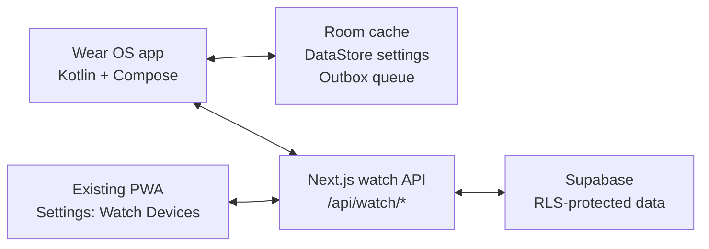

# Wear OS Native App Implementation Brief

Use this document as the implementation brief for Codex. The goal is to replace the current browser/PWA watch workflow with a real Wear OS app for Galaxy Watch / Wear OS devices.

## Product Goal

Create a native Wear OS app that opens instantly from the watch launcher, shows the existing ERA watch experience in native UI, and leaves room for future native-only capabilities such as offline mode, location-aware behavior, tiles, and richer sensor/device integrations.

The current PWA watch route is useful as the product reference:

- `src/app/watch/page.tsx`
- `src/app/watch/layout.tsx`
- `src/components/watch/WatchEraFace.tsx`
- `src/components/watch/SimpleWatchView.tsx`
- `src/components/watch/WatchView.tsx`
- `ERA Notes/04 - UI & Design/Watch/Watch UI.md`

## Decision

Build a small native Wear OS client in Kotlin + Jetpack Compose for Wear OS. Do not implement this as a WebView, TWA, or browser wrapper.

Reasons:

- Wear OS does not reliably support `android.webkit` APIs. Android docs explicitly note that `CookieManager` and other `android.webkit` APIs are not available for Wear OS network apps, and WebView package detection can return `null` on Wear OS devices.
- Trusted Web Activity depends on a compatible browser, mainly Chrome on Android, and it does not give the host app direct access to web state such as cookies/localStorage.
- The main user pain is launch friction. A native app can be launched directly from the watch app launcher, recent apps, tile, complication, or hardware button shortcut without opening a browser first.
- Future offline/location/watch-specific behavior will be cleaner if the watch app owns its data cache and action outbox natively.

This is not a full rewrite of the whole PWA. It is a native wrist client backed by a small watch-specific API surface in the existing Next.js app.

## Non-Goals

- Do not embed `/watch` in a WebView.
- Do not use TWA/Bubblewrap for the Wear OS app.
- Do not rebuild the full web app on the watch.
- Do not make this a watch face unless explicitly requested later.
- Do not ask the user to type a normal username/password on the watch.
- Do not add cross-feature imports inside existing standalone web feature modules.

## Recommended Architecture



The watch app should call a compact set of server endpoints instead of reusing many web routes. This gives faster watch startup, fewer network round trips, and a stable API contract for offline sync.

## Repository Shape

Add the Android project as a sibling inside this repo:

```text
wear/
  settings.gradle.kts
  build.gradle.kts
  gradle.properties
  app/
    build.gradle.kts
    src/main/
      AndroidManifest.xml
      java/com/era/watch/
        MainActivity.kt
        auth/
        data/
        network/
        ui/
        sync/
        tile/
```

Keep the web app as-is. The native app is developed and built from `wear/` with Android Studio / Gradle.

Add Gradle/Android ignores if missing:

```text
wear/.gradle/
wear/**/build/
wear/local.properties
```

## Android Stack

Use:

- Kotlin
- Jetpack Compose for Wear OS
- `androidx.wear.compose:compose-material3`
- AndroidX Navigation Compose
- Kotlin coroutines / Flow
- OkHttp or Ktor client
- Kotlin serialization
- Room for cached summaries and offline actions
- DataStore for small settings
- WorkManager for deferred sync
- Wear Tiles API for a later quick-glance tile

Target API:

- `targetSdk` must be at least 34 for Play submission.
- Test on Wear OS 3+.
- Test small round 192dp and larger round 227dp layouts.

## Native MVP Scope

The first version should be intentionally small and fast.

### Screens

1. Launch/loading
   - Black background.
   - App icon splash.
   - Immediately show cached summary if available.

2. Pairing
   - If not authenticated, show a short pairing code and "Open ERA on phone".
   - The user completes pairing from the existing PWA settings page.
   - No username/password form on the watch.

3. Home
   - ERA module carousel similar to `WatchEraFace`.
   - Modules: Budget, Schedule, Chat, Recipe.
   - Budget should be fully functional first. Other modules can show useful read-only summaries or "coming next" states.

4. Budget
   - Current default account balance.
   - Pending draft count/amount.
   - Today spending.
   - Tap/press action for voice expense draft.
   - Manual fallback text/numeric input for amount/description if speech is unavailable.

5. Schedule
   - Next 3 due items/events/reminders.
   - Read-only in MVP.

6. Offline
   - If offline, show last cached data with a clear stale timestamp.
   - Queue new draft actions locally and sync when network returns.

7. Settings
   - Sync now.
   - Sign out / unlink watch.
   - App version/build info.

### Interactions

- Tap main ERA mark: start/stop voice capture for the current module.
- Swipe left/right: switch modules.
- Swipe down/back: dismiss or navigate back per Wear OS expectations.
- Use 48dp minimum touch targets.
- Avoid dense text. Use glanceable summaries.

## Backend/API Work

Create a watch-specific API layer in the existing Next.js app:

```text
src/app/api/watch/pair/start/route.ts
src/app/api/watch/pair/approve/route.ts
src/app/api/watch/pair/status/route.ts
src/app/api/watch/auth/refresh/route.ts
src/app/api/watch/session/route.ts
src/app/api/watch/summary/route.ts
src/app/api/watch/drafts/route.ts
```

### Authentication Approach

Use a one-time pairing flow.

1. Watch calls `POST /api/watch/pair/start`.
2. Server creates a short-lived pairing request and returns:
   - `pairingId`
   - human-readable `code`
   - `expiresAt`
3. Watch displays the code and polls `GET /api/watch/pair/status?pairingId=...`.
4. User opens the existing PWA on phone/desktop and enters the code in a new "Watch Devices" settings panel.
5. Authenticated web route approves the pairing and creates a revocable watch session.
6. Watch receives:
   - short-lived access token
   - opaque refresh token
   - user/display metadata
7. Watch stores tokens securely and refreshes via `/api/watch/auth/refresh`.

Prefer a Supabase/RLS-respecting implementation:

- Add a server helper such as `src/lib/supabase/bearer.ts` that creates a Supabase client using the watch access token in the `Authorization` header.
- Avoid `supabaseAdmin()` in normal watch API routes unless there is no RLS-safe option and the route has explicit user ownership checks. The project rules strongly prefer RLS-respecting clients outside cron routes.
- Keep pairing/session token tables narrowly scoped and protected by RLS.
- Hash refresh tokens in the database. Never store raw refresh tokens server-side.

If custom access tokens are needed, make them short-lived and revocable by session id. Do not create permanent bearer tokens.

### Suggested Tables

Create a migration for:

```sql
watch_pairing_requests
- id uuid primary key
- code_hash text not null
- request_secret_hash text not null
- device_name text
- status text check (status in ('pending', 'approved', 'expired', 'cancelled'))
- approved_user_id uuid references auth.users(id)
- created_at timestamptz not null default now()
- expires_at timestamptz not null
- approved_at timestamptz

watch_sessions
- id uuid primary key
- user_id uuid references auth.users(id) not null
- device_name text
- refresh_token_hash text not null
- last_seen_at timestamptz
- revoked_at timestamptz
- created_at timestamptz not null default now()
```

Add indexes:

- `watch_pairing_requests(expires_at)`
- `watch_pairing_requests(status)`
- `watch_sessions(user_id)`
- `watch_sessions(refresh_token_hash)`

### Watch Summary Endpoint

`GET /api/watch/summary`

Return one compact payload:

```json
{
  "serverTime": "2026-05-23T09:00:00.000Z",
  "user": {
    "id": "uuid",
    "displayName": "Aoune"
  },
  "budget": {
    "defaultAccountId": "uuid",
    "defaultAccountName": "Main",
    "balance": 1234.56,
    "pendingDraftCount": 2,
    "pendingDraftAmount": 45.00,
    "todaySpending": 31.25,
    "currency": "USD"
  },
  "schedule": {
    "items": [
      {
        "id": "uuid",
        "title": "Pay bill",
        "type": "reminder",
        "dueAt": "2026-05-23T18:00:00.000Z",
        "priority": "medium"
      }
    ]
  }
}
```

Implementation notes:

- Use existing household linking rules where summaries should include partner data.
- Use the current user's default account for draft creation.
- Keep the payload small.
- Return `Cache-Control: no-store`.
- Use UTC ISO strings for server dates.
- Respect the existing project date utilities when computing local-day ranges.

### Draft Creation Endpoint

`POST /api/watch/drafts`

Body:

```json
{
  "clientActionId": "uuid generated by watch",
  "accountId": "uuid",
  "amount": 12.5,
  "categoryId": "uuid or null",
  "subcategoryId": "uuid or null",
  "description": "coffee 12.5",
  "voiceTranscript": "coffee twelve fifty",
  "date": "2026-05-23"
}
```

Behavior:

- Validate with `zod`.
- Require authenticated watch session.
- Ensure the account belongs to the authenticated user.
- Insert into existing drafts flow/table used by the web watch UI.
- Make `clientActionId` idempotent so offline retries do not create duplicate drafts.
- Return the created draft id and updated budget summary.

## Offline Mode

Implement offline mode from the start, even if the first version is simple.

Local database:

```text
CachedSummary
- id: singleton
- json
- fetchedAt

OutboxAction
- id
- type: CREATE_DRAFT
- payloadJson
- createdAt
- attemptCount
- lastError
- syncedAt
```

Behavior:

- On app launch, show `CachedSummary` immediately.
- Fetch fresh `/api/watch/summary` in the background.
- If draft creation fails due to network, save an `OutboxAction`.
- WorkManager retries pending outbox actions when connectivity returns.
- UI should show "Queued" for offline-created drafts.
- After sync, refresh the summary.

## Future-Native Extension Points

Keep the native architecture ready for:

- Wear Tile showing balance, pending drafts, and next schedule item.
- Location permission and geofenced reminders.
- Native notifications from the watch app.
- Complication support if a watch-face integration is later desired.
- Voice command routing beyond Budget.
- Phone companion/data-layer auth transfer if an Android companion app is added later.

Do not build these in MVP unless they are needed to make the first app useful.

## Wear OS Quality Requirements

Codex should check these while implementing:

- Black background for app surfaces.
- 48dp minimum touch targets.
- Text must fit on round displays and respect user font scaling.
- Swipe-to-dismiss/back behavior should work on almost all screens.
- Preserve state when the app leaves foreground and resumes within a few minutes.
- App launcher icon/name must be correct.
- Do not require username/password entry on the watch.
- Include a proper splash icon on black background.
- If adding a Tile, include a tile preview.

## Phased Implementation Plan

### Phase 0: Confirm Existing Watch Data Flow

- Read the current watch components listed above.
- Identify exactly which APIs they currently call.
- Identify the existing draft creation path and table/route.
- Identify default account logic and balance route behavior.

### Phase 1: Watch API Contract

- Add migrations for pairing/session/idempotency if needed.
- Add `src/lib/watchAuth.ts` or equivalent helper.
- Add `/api/watch/summary`.
- Add `/api/watch/drafts`.
- Add pairing/refresh/session routes.
- Add tests or route-level validation where practical.
- Run `pnpm typecheck`.

### Phase 2: Android Scaffold

- Create `wear/` Gradle project.
- Add Compose for Wear OS app module.
- Add app icon/splash/manifest.
- Implement navigation shell, theme, and basic screens.
- Hardcode mocked data first to verify layout on round watch emulator.

### Phase 3: Pairing and Live Data

- Implement pairing screen and polling.
- Store tokens securely.
- Implement API client.
- Replace mocked data with `/api/watch/summary`.
- Implement sign out/unlink.

### Phase 4: Budget Actions and Offline Queue

- Implement voice/text draft creation.
- Add local Room cache and outbox.
- Add WorkManager sync.
- Make draft creation idempotent through `clientActionId`.
- Verify draft appears in the existing web app.

### Phase 5: Tile and Polish

- Add a Wear Tile for quick balance/next-item glance.
- Tap tile opens the native app.
- Add tile preview.
- Test small and large round displays.
- Verify cold launch shows cached UI quickly.

## Acceptance Criteria

- The app installs and launches on a Wear OS emulator and Galaxy Watch target.
- Launching the native app does not open a browser.
- First launch shows pairing flow; paired launch shows cached UI quickly.
- Budget summary loads from the existing production/dev backend.
- Voice or manual draft creation from the watch creates a draft visible in the existing PWA.
- Offline draft creation queues locally and syncs later without duplicates.
- The app can unlink/sign out.
- `pnpm typecheck` passes for web/backend changes.
- Android Gradle build passes for the Wear app.

## Verification Commands

From repo root:

```bash
pnpm typecheck
```

From `wear/`:

```bash
./gradlew :app:assembleDebug
./gradlew :app:testDebugUnitTest
```

On Windows PowerShell, use:

```powershell
.\gradlew.bat :app:assembleDebug
.\gradlew.bat :app:testDebugUnitTest
```

## Source References

- Android WebView docs: https://developer.android.com/guide/webapps/webview.html
- Android WebView management note about Wear OS support: https://developer.android.com/guide/webapps/managing-webview
- Wear OS network access docs: https://developer.android.com/training/wearables/data-layer/network-access
- Trusted Web Activity overview: https://developer.android.com/develop/ui/views/layout/webapps/trusted-web-activities
- Compose for Wear OS: https://developer.android.com/courses/pathways/wear-compose
- Wear Compose Material 3: https://developer.android.com/jetpack/androidx/releases/wear-compose-m3
- Wear OS app quality: https://developer.android.com/docs/quality-guidelines/wear-app-quality
- Wear OS authentication: https://developer.android.com/training/wearables/apps/auth-wear
- Wear OS Tiles: https://developer.android.com/training/wearables/tiles
